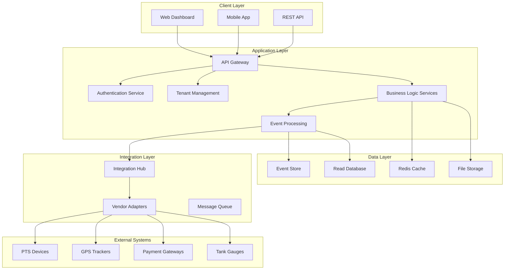

# Multi-Tenant Fuel Management Platform - Design Document

## Overview

The Multi-Tenant Fuel Management Platform transforms the existing single-tenant FMS into a comprehensive, scalable platform serving diverse customer archetypes in the fuel management industry. The design leverages a modular, event-driven architecture that supports incremental adoption from audit-only overlays to full operational control.

The platform serves four primary customer archetypes:
- **Internal Fleet Operations**: Complete fuel management for corporate fleets
- **Petrol Station Retail**: Point-of-sale integration with payment processing
- **Hybrid Operations**: Combined fleet and retail functionality
- **Audit-Only Overlay**: Read-only integration with existing systems

## Architecture

### High-Level Architecture



### Multi-Tenancy Strategy

The platform implements a **hybrid multi-tenancy model** combining:

1. **Shared Database with Row-Level Security (RLS)**
   - Single database instance with tenant isolation via TenantId
   - PostgreSQL RLS policies enforce data boundaries
   - Optimized for cost and maintenance efficiency

2. **Tenant-Specific Configuration**
   - Feature flags control module availability per tenant
   - Configurable business rules and thresholds
   - Customizable UI themes and branding

3. **Isolated Processing Contexts**
   - Tenant context propagated through all service calls
   - Separate message queues per tenant for high-volume data
   - Isolated background processing workflows

## Components and Interfaces

### 1. Tenant Management Service

**Responsibilities:**
- Tenant provisioning and configuration
- Feature flag management
- Billing and usage tracking
- Tenant-specific customizations

**Key Interfaces:**
```csharp
public interface ITenantService
{
    Task<Tenant> ProvisionTenantAsync(TenantProvisionRequest request);
    Task<TenantConfiguration> GetTenantConfigAsync(string tenantId);
    Task UpdateFeatureFlagsAsync(string tenantId, FeatureFlags flags);
    Task<bool> ValidateTenantAccessAsync(string tenantId, string feature);
}

public class TenantConfiguration
{
    public string TenantId { get; set; }
    public FeatureFlags EnabledFeatures { get; set; }
    public Dictionary<string, object> BusinessRules { get; set; }
    public BillingPlan BillingPlan { get; set; }
    public CustomizationSettings Customizations { get; set; }
}
```

### 2. Canonical Event Processing Engine

**Responsibilities:**
- Transform vendor-specific data into canonical events
- Maintain immutable event ledger
- Support event replay and reprocessing
- Ensure audit compliance

**Event Schema:**
```csharp
public class CanonicalEvent
{
    public Guid EventId { get; set; }
    public string TenantId { get; set; }
    public string ProviderKey { get; set; }
    public EventSourceType SourceType { get; set; }
    public DateTime OccurredUtc { get; set; }
    public DateTime IngestedUtc { get; set; }
    public string CorrelationId { get; set; }
    public string EventType { get; set; }
    public JObject EventData { get; set; }
    public JObject RawPayload { get; set; }
    public string SchemaVersion { get; set; }
}

public interface IEventProcessor
{
    Task<CanonicalEvent> ProcessRawEventAsync(RawEvent rawEvent, string tenantId);
    Task<IEnumerable<CanonicalEvent>> ReplayEventsAsync(string tenantId, DateTimeOffset from, DateTimeOffset to);
    Task StoreEventAsync(CanonicalEvent canonicalEvent);
}
```

### 3. Integration Hub and Adapter Framework

**Responsibilities:**
- Manage vendor-specific adapters
- Handle connection health monitoring
- Support hot-swappable adapter configurations
- Provide unified device management interface

**Adapter Interface:**
```csharp
public interface IDeviceAdapter
{
    string AdapterName { get; }
    DeviceCapabilities Capabilities { get; }
    Task<bool> ValidateConfigurationAsync(AdapterConfiguration config);
    Task<ConnectionStatus> GetHealthStatusAsync();
    Task StartAsync(AdapterConfiguration config);
    Task StopAsync();
    Task<CommandResult> SendCommandAsync(DeviceCommand command);
    event EventHandler<RawEvent> DataReceived;
}

public class AdapterConfiguration
{
    public string AdapterId { get; set; }
    public string TenantId { get; set; }
    public Dictionary<string, string> ConnectionSettings { get; set; }
    public List<DeviceMapping> DeviceMappings { get; set; }
    public PollingConfiguration PollingConfig { get; set; }
}
```

### 4. Fuel Operations Management

**Responsibilities:**
- Tank inventory tracking and reconciliation
- Delivery receipt processing
- Dispensing session management
- Loss detection and alerting

**Core Services:**
```csharp
public interface IFuelOperationsService
{
    Task ProcessDeliveryAsync(string tenantId, DeliveryReceipt delivery);
    Task ProcessTankReadingAsync(string tenantId, TankReading reading);
    Task ProcessDispenseSessionAsync(string tenantId, DispenseSession session);
    Task<ReconciliationResult> RunReconciliationAsync(string tenantId, int tankId, DateTime date);
    Task<IEnumerable<VarianceAlert>> DetectVariancesAsync(string tenantId, DateTime date);
}

public class ReconciliationResult
{
    public int TankId { get; set; }
    public DateTime ReconciliationDate { get; set; }
    public decimal OpeningStock { get; set; }
    public decimal Deliveries { get; set; }
    public decimal Dispensed { get; set; }
    public decimal ExpectedClosing { get; set; }
    public decimal ActualClosing { get; set; }
    public decimal Variance { get; set; }
    public VarianceStatus Status { get; set; }
    public List<string> Alerts { get; set; }
}
```

### 5. Vehicle and Asset Tracking

**Responsibilities:**
- GPS data processing and correlation
- Vehicle fuel consumption analysis
- Asset utilization metrics
- Theft detection algorithms

**Key Components:**
```csharp
public interface IVehicleTrackingService
{
    Task ProcessGpsDataAsync(string tenantId, GpsReading reading);
    Task CorrelateRefuelingAsync(string tenantId, RefuelingEvent refueling);
    Task<ConsumptionAnalysis> AnalyzeConsumptionAsync(string tenantId, string vehicleId, DateRange period);
    Task<IEnumerable<TheftAlert>> DetectAnomaliesAsync(string tenantId, DateTime date);
}

public class ConsumptionAnalysis
{
    public string VehicleId { get; set; }
    public decimal FuelDispensed { get; set; }
    public decimal ExpectedConsumption { get; set; }
    public decimal VariancePercentage { get; set; }
    public decimal CostPerKilometer { get; set; }
    public decimal CostPerHour { get; set; }
    public UtilizationMetrics Utilization { get; set; }
}
```

### 6. Payment and Retail Integration

**Responsibilities:**
- Multi-channel payment processing
- Credit account management
- Shift reconciliation
- POS integration

**Payment Processing:**
```csharp
public interface IPaymentService
{
    Task<PaymentResult> ProcessMpesaPaymentAsync(string tenantId, MpesaPaymentRequest request);
    Task<PaymentResult> ProcessCreditPaymentAsync(string tenantId, CreditPaymentRequest request);
    Task<PaymentResult> ProcessCashPaymentAsync(string tenantId, CashPaymentRequest request);
    Task<ShiftReconciliation> ReconcileShiftAsync(string tenantId, string shiftId);
}

public class ShiftReconciliation
{
    public string ShiftId { get; set; }
    public decimal TotalDispensed { get; set; }
    public decimal TotalPayments { get; set; }
    public decimal CreditIssued { get; set; }
    public decimal ExpectedCash { get; set; }
    public decimal ActualCash { get; set; }
    public decimal Variance { get; set; }
    public List<PaymentBreakdown> PaymentBreakdown { get; set; }
}
```

## Data Models

### Core Domain Models

**Tenant Entity:**
```csharp
public class Tenant
{
    public string Id { get; set; }
    public string Name { get; set; }
    public string ContactEmail { get; set; }
    public TenantStatus Status { get; set; }
    public DateTime CreatedAt { get; set; }
    public FeatureFlags EnabledFeatures { get; set; }
    public BillingPlan BillingPlan { get; set; }
    public Dictionary<string, object> Configuration { get; set; }
}
```

**Enhanced Site Entity:**
```csharp
public class Site
{
    public int Id { get; set; }
    public string TenantId { get; set; } // Multi-tenancy key
    public string Name { get; set; }
    public SiteType Type { get; set; } // Fleet, Retail, Hybrid
    public string SiteAdministratorId { get; set; }
    public GeoLocation Location { get; set; }
    public SiteConfiguration Configuration { get; set; }

    // Navigation properties remain similar but tenant-scoped
    public virtual Tenant Tenant { get; set; }
    public virtual ICollection<Tank> Tanks { get; set; }
    public virtual ICollection<Vehicle> Vehicles { get; set; }
    public virtual ICollection<Device> Devices { get; set; }
}
```

**Event Store Schema:**
```csharp
public class EventStoreEntry
{
    public long Id { get; set; }
    public Guid EventId { get; set; }
    public string TenantId { get; set; }
    public string StreamId { get; set; }
    public int Version { get; set; }
    public string EventType { get; set; }
    public JObject EventData { get; set; }
    public JObject Metadata { get; set; }
    public DateTime Timestamp { get; set; }
    public string CheckSum { get; set; }
}
```

### Database Schema Considerations

**Row-Level Security Implementation:**
```sql
-- Enable RLS on all tenant-scoped tables
ALTER TABLE sites ENABLE ROW LEVEL SECURITY;
ALTER TABLE tanks ENABLE ROW LEVEL SECURITY;
ALTER TABLE vehicles ENABLE ROW LEVEL SECURITY;

-- Create RLS policies
CREATE POLICY tenant_isolation_policy ON sites
    FOR ALL TO application_role
    USING (tenant_id = current_setting('app.current_tenant_id'));

-- Tenant context setting function
CREATE OR REPLACE FUNCTION set_tenant_context(tenant_id text)
RETURNS void AS $$
BEGIN
    PERFORM set_config('app.current_tenant_id', tenant_id, true);
END;
$$ LANGUAGE plpgsql;
```

## Error Handling

### Multi-Tenant Error Isolation

**Error Handling Strategy:**
1. **Tenant-Scoped Errors**: Failures in one tenant don't affect others
2. **Graceful Degradation**: Non-critical features fail independently
3. **Circuit Breaker Pattern**: Prevent cascade failures
4. **Dead Letter Queues**: Handle failed message processing

**Implementation:**
```csharp
public class TenantScopedErrorHandler : IErrorHandler
{
    public async Task HandleErrorAsync(Exception exception, string tenantId, string context)
    {
        // Log error with tenant context
        await _logger.LogErrorAsync(exception, tenantId, context);

        // Check if error affects tenant health
        if (IsCriticalError(exception))
        {
            await _tenantHealthService.MarkUnhealthyAsync(tenantId, context);
        }

        // Send tenant-specific notifications
        await _notificationService.NotifyTenantAdminsAsync(tenantId, exception);

        // Update tenant metrics
        await _metricsService.RecordErrorAsync(tenantId, exception.GetType().Name);
    }
}
```

### Adapter Error Handling

**Resilience Patterns:**
- **Retry with Exponential Backoff**: Handle transient failures
- **Circuit Breaker**: Prevent overwhelming failing systems
- **Bulkhead Isolation**: Isolate adapter failures
- **Fallback Mechanisms**: Use cached data when adapters fail

## Testing Strategy

### Multi-Tenant Testing Approach

**1. Tenant Isolation Testing**
- Verify data boundaries between tenants
- Test feature flag enforcement
- Validate billing and usage tracking

**2. Integration Testing**
- Test adapter configurations across tenant types
- Verify event processing with multiple tenants
- Test concurrent tenant operations

**3. Performance Testing**
- Load testing with multiple active tenants
- Scalability testing for high-frequency data streams
- Resource utilization monitoring

**4. Security Testing**
- Penetration testing for tenant isolation
- Authentication and authorization testing
- Data encryption and compliance validation

**Test Implementation:**
```csharp
[TestClass]
public class MultiTenantIsolationTests
{
    [TestMethod]
    public async Task Should_Isolate_Tenant_Data()
    {
        // Arrange
        var tenant1 = await CreateTenantAsync("tenant1");
        var tenant2 = await CreateTenantAsync("tenant2");

        // Act
        await CreateSiteAsync(tenant1.Id, "Site A");
        await CreateSiteAsync(tenant2.Id, "Site B");

        // Assert
        var tenant1Sites = await GetSitesAsync(tenant1.Id);
        var tenant2Sites = await GetSitesAsync(tenant2.Id);

        Assert.AreEqual(1, tenant1Sites.Count);
        Assert.AreEqual(1, tenant2Sites.Count);
        Assert.AreNotEqual(tenant1Sites[0].Id, tenant2Sites[0].Id);
    }
}
```

### Deployment Strategy

**1. Blue-Green Deployment**
- Zero-downtime deployments
- Quick rollback capability
- Tenant-specific feature toggles

**2. Database Migration Strategy**
- Backward-compatible schema changes
- Tenant-aware migration scripts
- Rollback procedures for each tenant

**3. Configuration Management**
- Environment-specific tenant configurations
- Feature flag management across environments
- Secrets management per tenant

**Migration Script Example:**
```sql
-- Tenant-aware migration script
DO $$
DECLARE
    tenant_record RECORD;
BEGIN
    FOR tenant_record IN SELECT id FROM tenants WHERE status = 'ACTIVE'
    LOOP
        -- Set tenant context
        PERFORM set_tenant_context(tenant_record.id);

        -- Perform tenant-specific migration
        -- Migration logic here

        RAISE NOTICE 'Migration completed for tenant: %', tenant_record.id;
    END LOOP;
END $$;
```

This design provides a robust foundation for transforming the existing FMS into a scalable, multi-tenant platform while maintaining the flexibility to serve diverse customer needs through modular deployment options.