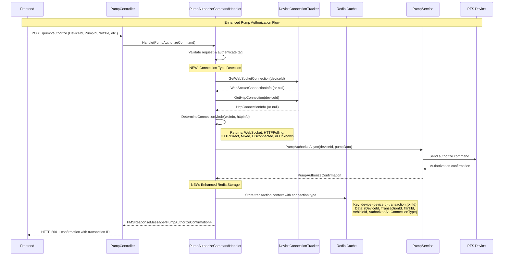
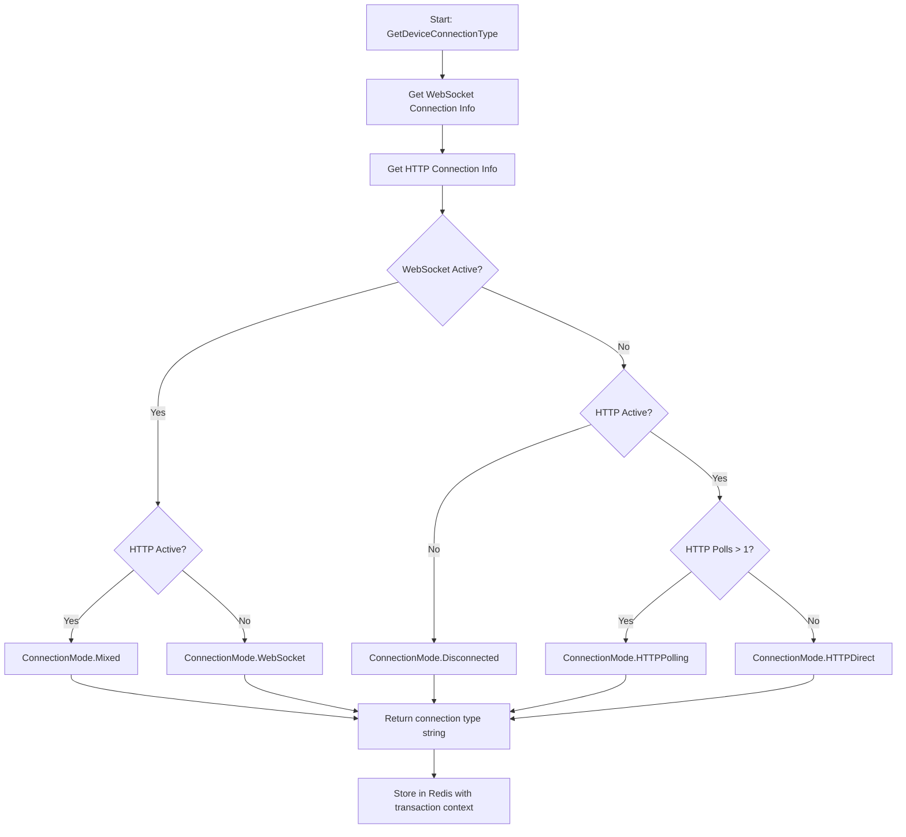
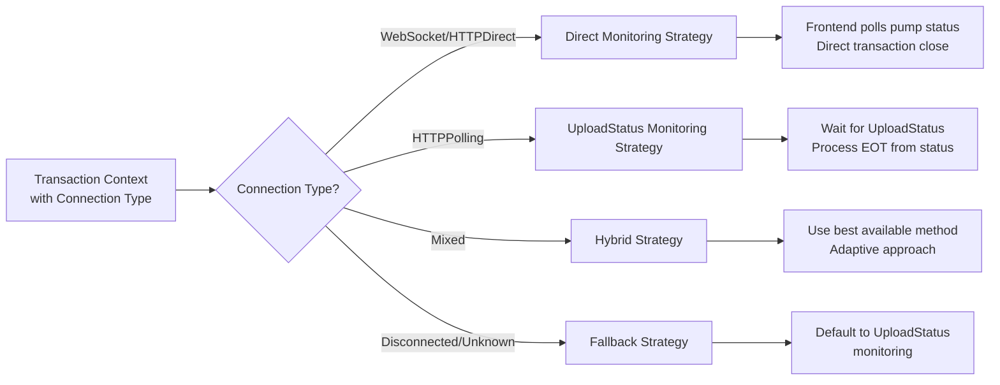

# Enhanced Fueling Workflow with Connection Type Detection

## Part 1: Pump Authorization with Connection Type Storage



## Connection Type Detection Logic



## Redis Storage Structure

```json
{
  "Key": "device:PTS001:transaction:12345",
  "Value": {
    "DeviceId": "PTS001",
    "TransactionId": 12345,
    "TankId": 1,
    "VehicleId": 42,
    "AuthorizedAt": "2024-01-15T10:30:00Z",
    "ConnectionType": "WebSocket"
  },
  "Expiry": "24 hours"
}
```

## Connection Type Impact on Future Processing



## Benefits of This Enhancement

1. **Intelligent Routing**: System knows how to communicate with each device
2. **Adaptive Monitoring**: Chooses optimal monitoring strategy per device
3. **Reliable Completion**: Ensures transactions complete regardless of connection type
4. **Debugging Support**: Connection type helps troubleshoot issues
5. **Future Extensibility**: Foundation for more sophisticated strategies

## Next Implementation Steps

- **Part 2**: Enhance monitoring based on stored connection type
- **Part 3**: Implement connection-aware transaction completion
- **Part 4**: Update frontend to use connection-specific strategies