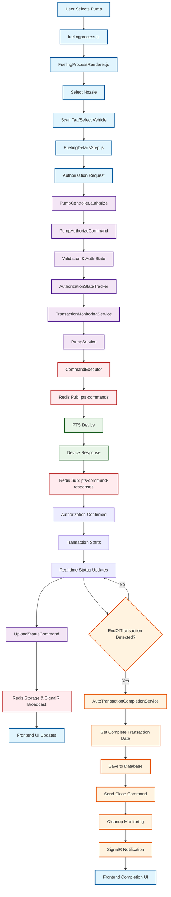
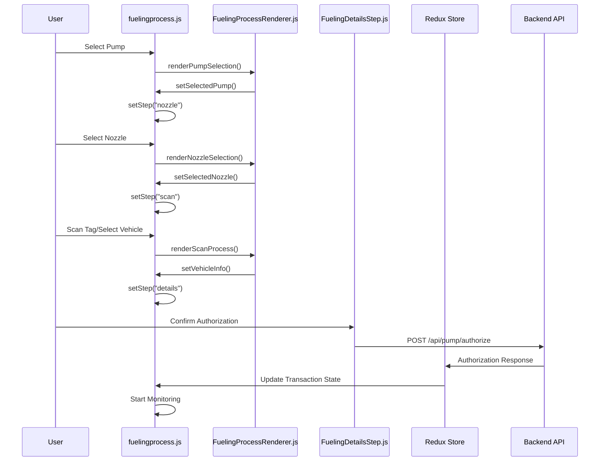
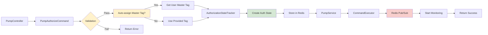
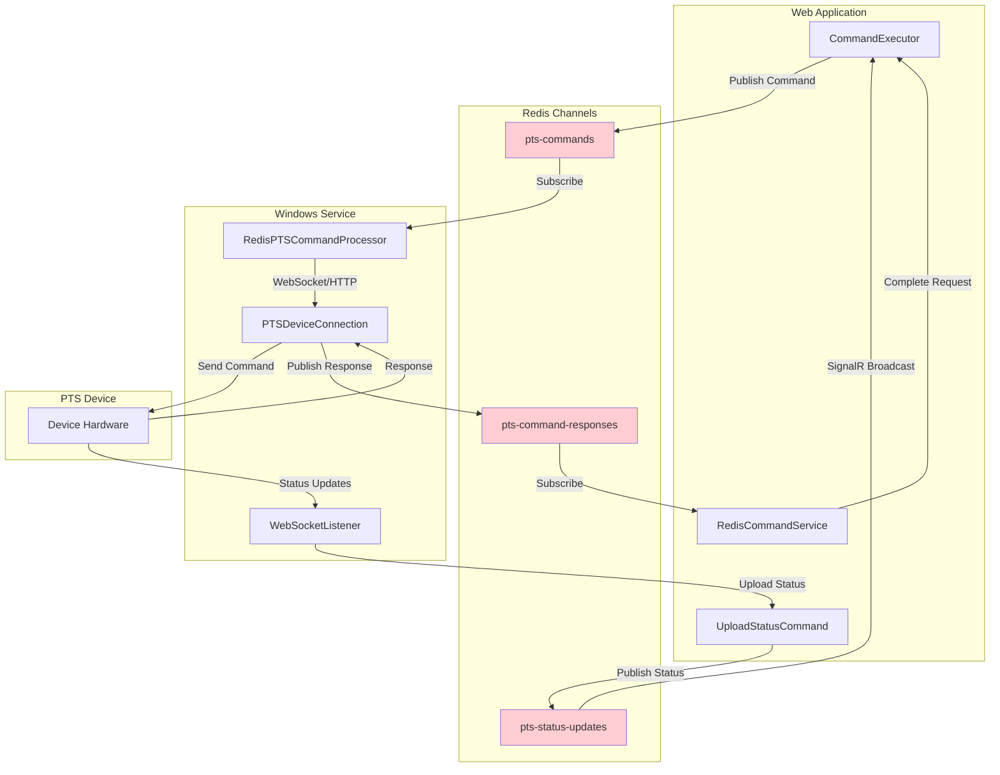
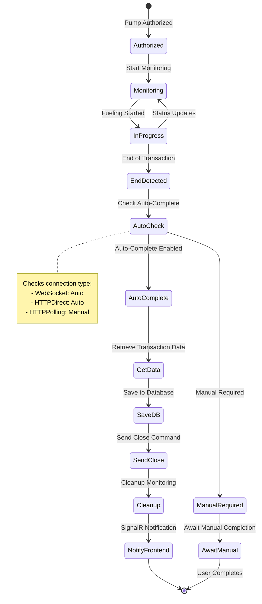
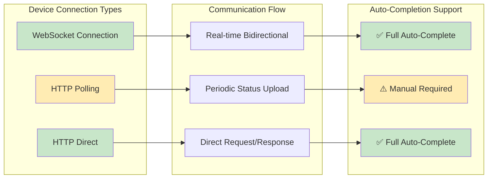
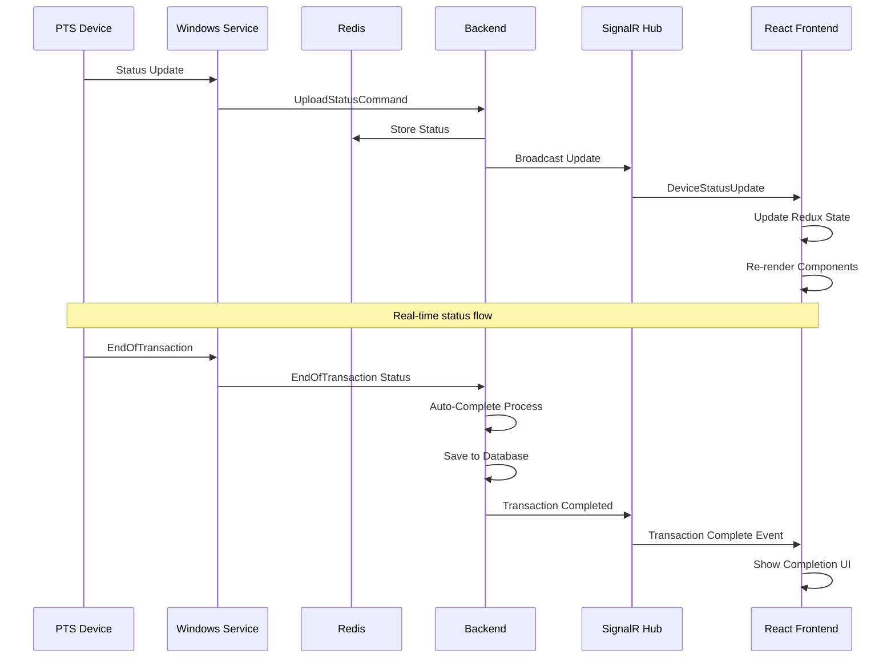
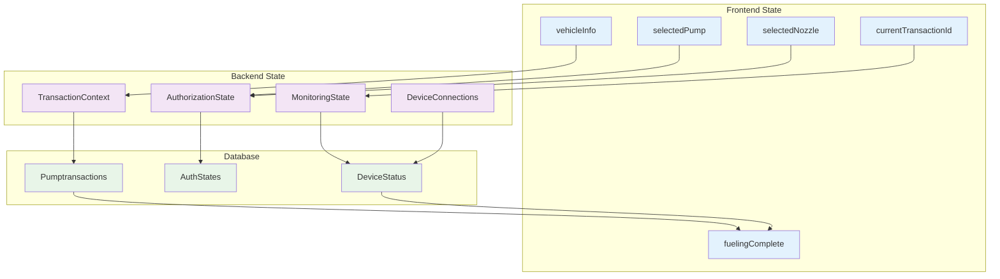
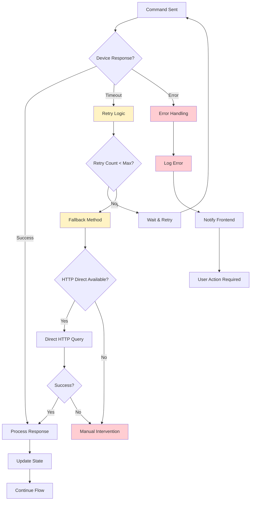

# Fueling Transaction Flow - Mermaid Diagrams

This document contains comprehensive Mermaid diagrams visualizing the complete fueling transaction flow in the FMS system.

## 1. Complete End-to-End Flow Diagram



## 2. Frontend Component Flow



## 3. Backend Authorization Flow



## 4. Redis Communication Architecture



## 5. Transaction Monitoring and Auto-Completion



## 6. Device Connection Types and Flow



## 7. Frontend Real-time Updates



## 8. Data Flow and State Management



## 9. Error Handling and Fallback Mechanisms



## 10. Complete Transaction Lifecycle

```mermaid
gantt
    title Transaction Lifecycle Timeline
    dateFormat X
    axisFormat %S

    section Frontend
    Pump Selection    :done, pump, 0, 5
    Authorization     :done, auth, 5, 10
    Monitoring Start  :done, monitor, 10, 15
    UI Updates        :active, ui, 15, 45
    Completion UI     :milestone, complete, 45

    section Backend
    Validation        :done, valid, 8, 12
    Auth State        :done, state, 12, 15
    Command Send      :done, cmd, 15, 20
    Status Processing :active, status, 20, 40
    Auto-Complete     :crit, auto, 40, 45

    section Device
    Receive Command   :done, rcv, 18, 22
    Start Fueling     :done, fuel, 22, 35
    End Transaction   :milestone, end, 35
    Send Final Status :done, final, 35, 40

    section Database
    Store Auth        :done, dbauth, 14, 16
    Monitor Context   :done, dbmon, 16, 40
    Save Transaction  :crit, dbtrans, 42, 45
```

## Summary

These Mermaid diagrams provide a comprehensive visual representation of:

1. **Complete end-to-end flow** from user interaction to transaction completion
2. **Frontend component interactions** and state management
3. **Backend authorization and validation** processes
4. **Redis pub/sub communication** architecture
5. **Automatic transaction completion** logic
6. **Device connection types** and their capabilities
7. **Real-time updates** via SignalR
8. **Data flow and state management** across the system
9. **Error handling and fallback** mechanisms
10. **Complete transaction lifecycle** timeline

The diagrams illustrate how the system achieves **zero-touch transaction completion** while maintaining full visibility and control for operators through real-time monitoring and comprehensive state management.