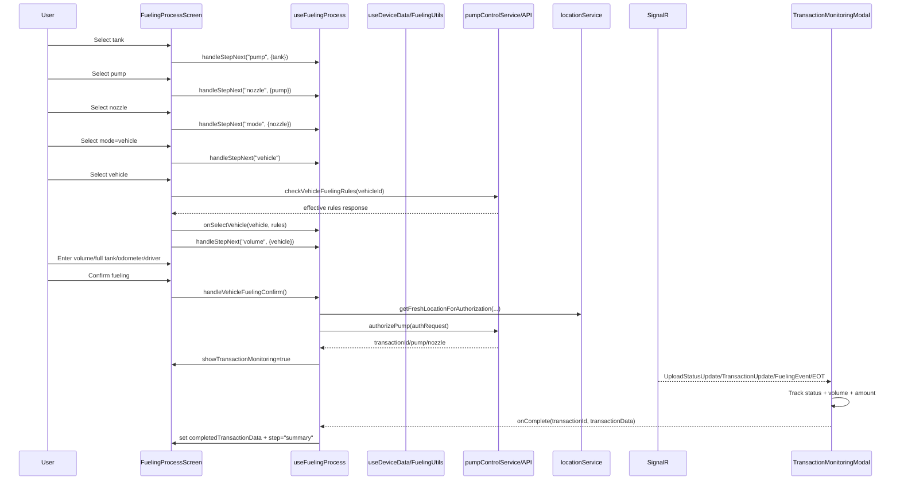
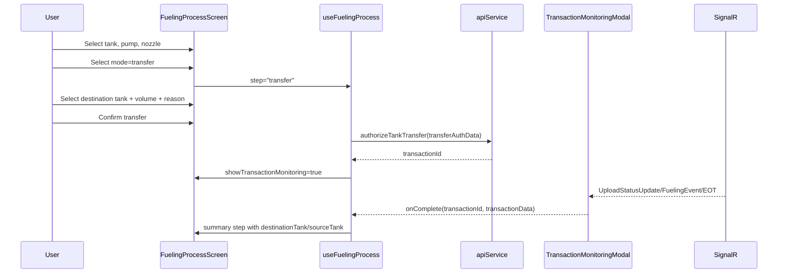

<!--
File: ATG_Fueling_Process_Documentation.md
Purpose: Detailed technical documentation of the mobile ATG fueling process, sequence flow, and moving objects/properties.
Dependencies: fms.mobile/src/components/fueling/*, fms.mobile/src/screens/FuelingProcessScreen.js, fms.mobile/src/hooks/useFuelingProcess.js, fms.mobile/src/hooks/useDeviceData.js, fms.mobile/src/services/*, fms.mobile/src/redux/slices/fuelingSlice.js, fms.mobile/src/utils/FuelingUtils.js
Last Modified: 2026-02-06

Key Sections:
- End-to-end workflow and step transitions
- Vehicle fueling and tank transfer sequence flows
- Object contracts and property-level mappings
- SignalR/event-driven transaction monitoring flow
- Data transformations and integration notes
-->

# ATG Fueling Process Documentation (Mobile)

## 1. Scope and Source

This document describes the real implementation of the fueling flow driven by:

- `fms.mobile/src/screens/FuelingProcessScreen.js`
- `fms.mobile/src/hooks/useFuelingProcess.js`
- `fms.mobile/src/components/fueling/*`
- `fms.mobile/src/hooks/useDeviceData.js`
- `fms.mobile/src/utils/FuelingUtils.js`
- `fms.mobile/src/services/pumpControlService.js`
- `fms.mobile/src/services/signalRService.js`
- `fms.mobile/src/services/locationService.js`
- `fms.mobile/src/services/fuelingValidationSettings.js`
- `fms.mobile/src/redux/slices/fuelingSlice.js`

## 2. Runtime Architecture (High Level)

- `FuelingProcessScreen` renders the current step and passes hook state/handlers (`FuelingProcessScreen.js:29`, `FuelingProcessScreen.js:159`).
- `useFuelingProcess` owns workflow state, API calls, SignalR connection/subscription, authorization, monitoring, and summary handoff (`useFuelingProcess.js:52`).
- `useDeviceData` converts raw `UploadStatus` into pump/nozzle/tank/tag objects (`useDeviceData.js:20`, `useDeviceData.js:60`, `useDeviceData.js:117`, `useDeviceData.js:152`).
- `TransactionMonitoringModal` listens to SignalR events and finalizes completion payloads (`TransactionMonitoringModal.js:196`, `TransactionMonitoringModal.js:488`, `TransactionMonitoringModal.js:583`, `TransactionMonitoringModal.js:797`).

## 3. Step Workflow and Transitions

### 3.1 Screen Step Rendering

Steps rendered in `FuelingProcessScreen`:

- `tank` (`FuelingProcessScreen.js:200`)
- `pump` (`FuelingProcessScreen.js:220`)
- `nozzle` (`FuelingProcessScreen.js:233`)
- `mode` (`FuelingProcessScreen.js:246`)
- `transfer` (`FuelingProcessScreen.js:263`)
- `vehicle` (`FuelingProcessScreen.js:281`)
- `volume` (`FuelingProcessScreen.js:300`)
- `summary` (`FuelingProcessScreen.js:365`)

### 3.2 Hook Step State Machine

`handleStepNext` transitions (`useFuelingProcess.js:604`):

- `tank -> pump` with `{ tank }`
- `pump -> nozzle` with `{ pump }`
- `nozzle -> mode` with `{ nozzle }`
- `mode -> transfer` (sets `operationMode = "transfer"`)
- `mode -> vehicle` (sets `operationMode = "vehicle"`)
- `vehicle -> volume` with optional `{ vehicle, rules }`
- `scan` branch exists but is not the primary active path from current vehicle step wiring.

`handleStepBack` clears dependent selections/inputs when stepping backward (`useFuelingProcess.js:554`).

## 4. Sequence Flow

### 4.1 Vehicle Fueling Sequence

### 4.2 Tank Transfer Sequence

## 5. Moving Objects and Properties

## 5.1 Step-to-Step Objects

| From step | To step | Callback payload | Core properties used |
|---|---|---|---|
| TankSelection | PumpSelection | `tank` | `id`, `tankId`, `probeId`, `name`, `tankName`, `PhysicalStockValue`, `currentVolume`, `TankVolume`, `capacity`, `fuelGradeName`, `productName` |
| PumpSelection | NozzleSelection | `pump` | `id`, `name`, `status`, `nozzleUp`, `activeNozzle`, `currentVolume`, `currentAmount`, `currentTransaction` |
| NozzleSelection | ModeSelection | `nozzle` | `id`, `name`, `status`, `fuelType`, `price`, `fuelGrade` |
| ModeSelection | Vehicle/Transfer | `modeId` | `"vehicle"` or `"transfer"` |
| VehicleSelection | FuelingVolume | `vehicle`, `rules` | Vehicle identity + fueling rules constraints |

## 5.2 Source Tank Object (selection/display)

Observed fields consumed across components:

- Identity: `id`, `tankId`, `probeId`
- Naming: `name`, `tankName`
- Product: `fuelGradeName`, `productName`, `FuelGradeName`, `ProductName`
- Volume/capacity: `PhysicalStockValue`, `physicalStockValue`, `currentVolume`, `TankVolume`, `tankVolume`, `capacity`
- Other: `temperature`, `siteName`

Key references:

- `TankSelectionStep.js:60`
- `TransferDetailsStep.js:24`

## 5.3 Pump Object and Active Fueling Object

Pump shape after parsing `UploadStatus`:

- `id`, `name`
- `status`: `idle`, `nozzleUp`, `fueling`, `endOfTransaction`, `offline`
- `nozzleUp`, `activeNozzle`
- `currentVolume`, `currentAmount`, `currentTransaction`
- `lastTransaction`, `lastVolume`, `lastAmount`, `lastPrice`
- `volume`, `amount`, `transaction`

Active fueling card object (`useDeviceData` output):

- `pumpId`, `status`, `nozzle`, `volume`, `amount`, `transaction`

Key references:

- `FuelingUtils.js:7`
- `useDeviceData.js:60`

## 5.4 Nozzle Object

Generated by `FuelingUtils.getNozzlesForPump` and consumed in nozzle/volume steps:

- `id`, `name`
- `status` (`idle`, `busy`, `offline`, lifted inferred from `pump.nozzleUp`)
- `fuelType`, `price`
- `fuelGrade` object (`id`, `name`, `price`, `nozzle`, `fuelType`, `color`)

Key references:

- `FuelingUtils.js:168`
- `NozzleSelectionStep.js:23`

## 5.5 Vehicle Object

Common normalized fields used:

- `vehicleId`
- `hyoungNo`
- `vehicleName`
- `numberPlate`
- `tankCapacity` / `fuelTankCapacity`
- `tagId`
- `siteName`
- `driverName`
- `fuelType`

Sources:

- `VehicleSelectionStep` vehicle search/tag validation
- `ScanStep` (alternative tag-driven flow)

Key references:

- `VehicleSelectionStep.js:211`
- `VehicleSelectionStep.js:295`
- `ScanStep.js:169`

## 5.6 Fueling Rules Object

`VehicleSelectionStep.convertApiResponseToRules` emits:

- Hard limits: `tankCapacity`, `currentFuelLevel`, `hasGpsFuelSensor`, `hardLimit`
- Soft limits: `dailyLimit`, `monthlyLimit`, `perTransactionLimit`, `usedToday`, `usedThisMonth`, `dailyRemaining`, `monthlyRemaining`
- Max: `maxAllowedDose`, `limitingFactor`
- Status: `hasRules`, `isValid`, `isAllowed`, `message`, `blockedReason`
- Time window: `timeWindowStart`, `timeWindowEnd`
- Refill counts: `maxRefillsPerDay`, `refillsToday`, `refillsRemainingToday`
- Diagnostics: `appliedRuleSets`

Key references:

- `VehicleSelectionStep.js:68`
- `pumpControlService.js:511`

## 5.7 Authorization Request Objects

### Vehicle fueling authorization (`authRequest`)
Built in `useFuelingProcess.startFueling`:

- `deviceId`
- `pumpId`
- `nozzle`
- `type` (`Volume=0`, `Amount=1`, `Full/FullTank=2`)
- `dose` (for full tank, uses computed max allowed dose)
- `vehicleId`
- `tankId`
- `tag` (vehicle tag or user master tag)
- `odometer` (nullable number)
- `employeeId` (selected driver id)
- `mobileLocation` (formatted DTO or `null`)
- `autoCloseTransaction: true`

Key references:

- `useFuelingProcess.js:863`
- `useFuelingProcess.js:880`

### Tank transfer authorization (`transferAuthData`)
Built in `useFuelingProcess.handleTransferConfirm`:

- `deviceId`
- `pumpId`
- `nozzle`
- `sourceTankId`
- `destinationTankId`
- `volume`
- `reason`

Key references:

- `useFuelingProcess.js:662`
- `apiService.js:1022`

## 5.8 Location Object and API DTO

Internal location object (from `locationService`):

- `latitude`
- `longitude`
- `accuracy`
- `timestamp` (ISO)
- `isCached`

API DTO (`formatForApi`):

- `latitude`, `longitude`, `accuracy`, `timestamp`, `isCached`

Fresh-location fetch contract (`getFreshLocationForAuthorization`) returns:

- `location`
- `wasRefreshed`
- `error`
- `settings`: `{ maxAgeSeconds, maxAccuracyMeters, rejectCached, fromServer }`

Key references:

- `locationService.js:601`
- `locationService.js:649`
- `useFuelingProcess.js:790`

## 5.9 SignalR UploadStatus Object (Pump Arrays)

`UploadStatus` pump arrays consumed via `FuelingUtils` and monitor parser:

- `IdleStatus`: `Ids`, `NozzlesUp`, `LastTransactions`, `LastVolumes`, `LastAmounts`, `LastPrices`, `Tags`
- `FillingStatus`: `Ids`, `Nozzles`, `Volumes`, `Amounts`, `Transactions`, optionally `FuelGradeNames`
- `EndOfTransactionStatus`: `Ids`, `Volumes`, `Amounts`, `Transactions`, optionally `Tags`
- `OfflineStatus`: `Ids`

Both PascalCase and camelCase are handled.

Key references:

- `FuelingUtils.js:23`
- `FuelingUtils.js:54`
- `FuelingUtils.js:103`
- `TransactionMonitoringModal.js:196`

## 5.10 Fueling Context Object (from backend UploadStatus payload)

Stored per device and pump in redux via `updateFuelingContexts`:

- `state.fueling.fuelingContexts[deviceId][pumpId] = { ...context, lastUpdated }`

UI uses this in monitor header/details for mode/vehicle/tank/operator labeling (`selectFuelingContext`).

Key references:

- `signalRService.js:855`
- `fuelingSlice.js:274`
- `fuelingSlice.js:554`
- `TransactionMonitoringModal.js:134`

## 5.11 Transaction Completion Object (monitor -> summary)

`TransactionMonitoringModal` passes to `onComplete(transactionId, transactionData)`:

- `transactionId`
- `volume`
- `amount`
- `elapsedTime`
- `vehicleInfo`
- `pumpId`
- `nozzleId`
- `operationMode` (`displayMode`)
- `completedAt`
- optional `fuelGrade` (manual completion helper)

`useFuelingProcess.handleTransactionComplete` augments and stores:

- all above
- `tankInfo` (selected source tank)
- `destinationTank` (transfer mode)
- `driverInfo` (selected driver)

Then navigates to `summary` step.

Key references:

- `TransactionMonitoringModal.js:786`
- `TransactionMonitoringModal.js:939`
- `useFuelingProcess.js:1039`

## 6. Event-Driven Monitoring Logic

`TransactionMonitoringModal` event handling priority:

1. `UploadStatusUpdate` parsing (`parsePumpStatus`) drives pump-state transitions and final idle-completion checks.
2. `TransactionUpdate` updates `volume`, `amount`, and textual status.
3. `EndOfTransaction` updates final values and sets EOT status.
4. `FuelingEvent` handles start/completion with transaction and pump validation.
5. On `COMPLETED`, auto-close timer triggers callback to summary.

Important safeguards implemented:

- Transaction ID matching before completion (`TransactionMonitoringModal.js:595`).
- Pump ID matching for event relevance (`TransactionMonitoringModal.js:648`).
- Idle completion only accepted if prior state was fueling/EOT and transaction matches (`TransactionMonitoringModal.js:408`).

## 7. Validation Rules in UI Flow

- Vehicle rules check gate in vehicle selection (`VehicleSelectionStep.js:340`).
- Volume step requires nozzle-up and valid volume/full-tank choice (`FuelingVolumeStep.js:315`).
- Transfer step requires nozzle-up, destination, and positive volume (`TransferDetailsStep.js:188`).
- Location gate is controlled by device settings + bypass flags in hook (`useFuelingProcess.js:768`, `useFuelingProcess.js:791`).

## 8. Notable Integration Notes

- `ScanStep` exists with full tag-driven flow (`ScanStep.js:77`), but the current main path uses `VehicleSelectionStep` directly from `mode -> vehicle`.
- `TransactionSummaryStep` checks transfer mode using `operationMode === "transfer"` (`TransactionSummaryStep.js:72`), while monitor completion passes `displayMode` (`"Transfer"`/`"Vehicle"`). This case mismatch can affect transfer-specific rendering if not normalized before summary.
- In rules conversion, `convertApiResponseToRules` emits `maxAllowedDose` (`VehicleSelectionStep.js:121`), while `FuelingVolumeStep` primarily reads `fuelingRules.maxFuelAllowed` then falls back to `hardLimit` (`FuelingVolumeStep.js:212`).

## 9. API Endpoints Touched in This Flow

- `/v1/Pump/authorize` (`pumpControlService.authorizePump`)
- `/v1/Pump/authorize-transfer` (`pumpControlService.authorizeTankTransfer`)
- `/v1/FuelingRule/vehicle/{vehicleId}/effective-rules` (`pumpControlService.getVehicleEffectiveRules`)
- `/v1/FuelTag/details/{tagName}` (`pumpControlService.getTagDetails`)
- `/v1/Vehicle/quick-search` (`apiService.searchVehicles`)
- `/v1/Employee/quick-search` (`apiService.searchEmployees`)
- `/v1/Employee` (`apiService.createEmployee`)

## 10. Quick Reference: Core State Owned by `useFuelingProcess`

Primary state groups:

- Step/navigation: `step`, `tankLoadingComplete`
- Selections: `selectedTank`, `selectedPump`, `selectedNozzle`, `operationMode`, `destinationTank`, `selectedVehicle`
- Input values: `transferVolume`, `transferReason`, `fuelingVolume`, `isFullTank`, `odometer`, `notes`
- Validation: `fuelingRules`, `validationSettings`
- Location: `currentLocation`, `locationSettings`, `isLocationBypassEnabled`, `locationBypassReason`
- Authorization: `isAuthorizing`, `authorizingStatus`, `authError`, `pendingAuthData`
- Monitoring: `showTransactionMonitoring`, `currentTransactionId`, `isViewingExternalFueling`, `viewingPumpData`, `isTransactionMinimized`
- Summary: `completedTransactionData`

Key references:

- `useFuelingProcess.js:130`
- `useFuelingProcess.js:137`
- `useFuelingProcess.js:188`
- `useFuelingProcess.js:197`
- `useFuelingProcess.js:162`
- `useFuelingProcess.js:178`
- `useFuelingProcess.js:184`

