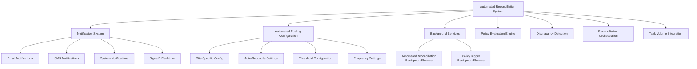
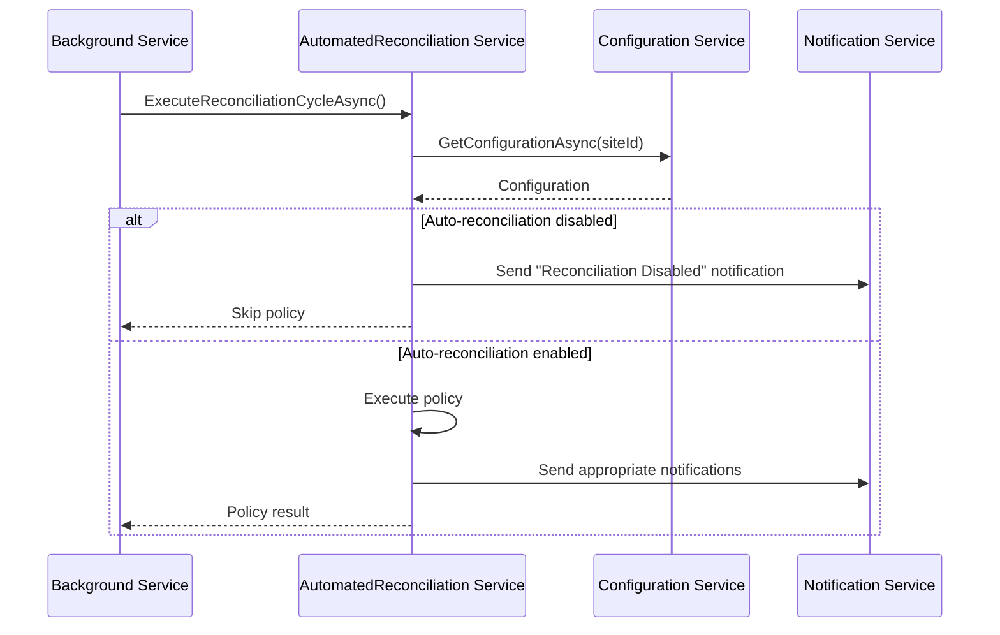
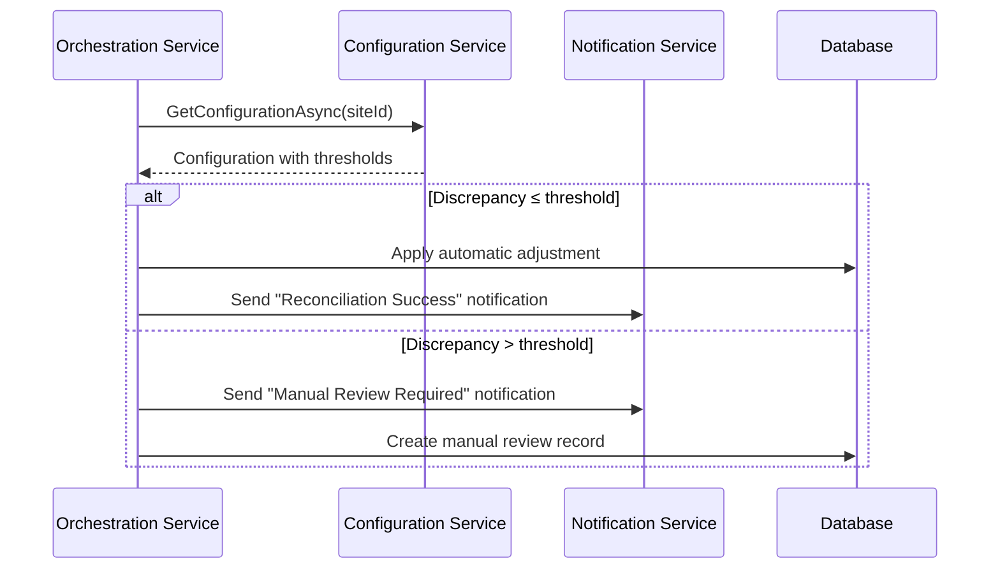
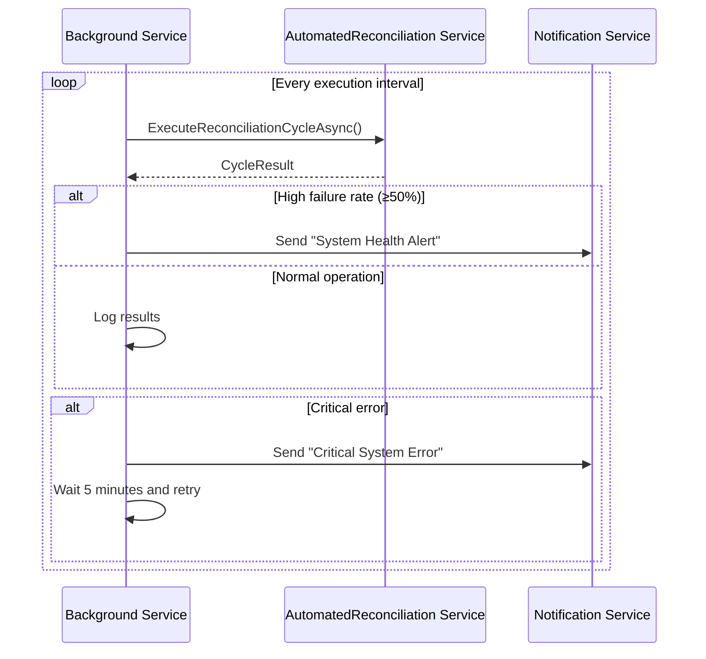

# Automated Reconciliation System - Complete Implementation Guide

## Overview

The Automated Reconciliation System is a comprehensive solution for detecting and resolving fuel tank volume discrepancies in the FMS (Fuel Management System). This implementation includes full integration with the **Notification System** and **Automated Fueling Configuration**, providing a robust, configurable, and monitored reconciliation process.

## Architecture Overview

### Core Integration Points



## Core Components Enhanced

### 1. AutomatedReconciliationService (Enhanced)

**Location**: `FMS.Application/Features/AutomatedReconciliation/Services/AutomatedReconciliationService.cs`

**Key Enhancements**:
- ✅ **Notification Integration**: Comprehensive notifications for all reconciliation events
- ✅ **Configuration Support**: Respects site-specific automated fueling configurations
- ✅ **Error Handling**: Robust error handling with appropriate notifications
- ✅ **Metrics Tracking**: Detailed logging and metrics for monitoring

**New Dependencies**:
```csharp
private readonly INotificationService _notificationService;
private readonly IAutomatedFuelingConfigurationService _configurationService;
```

**Key Features**:
- Configuration-based policy execution (respects `AutoReconcileTankVolumes` setting)
- Automatic notifications for policy failures, discrepancy detection, and completion
- Critical failure notifications with acknowledgment requirements
- Enhanced error tracking and recovery

### 2. ReconciliationOrchestrationService (Enhanced)

**Location**: `FMS.Application/Features/AutomatedReconciliation/Services/ReconciliationOrchestrationService.cs`

**Key Enhancements**:
- ✅ **Configuration-Based Thresholds**: Uses `MaxVolumeDiscrepancyThreshold` from configuration
- ✅ **Notification Integration**: Notifications for reconciliation success/failure/manual review
- ✅ **Auto-Adjustment Logic**: Configuration-driven automatic adjustments
- ✅ **Manual Review Workflow**: Notifications for discrepancies requiring manual intervention

**Configuration Integration**:
```csharp
// Uses configuration for threshold decisions
var configuration = await _configurationService.GetConfigurationAsync(tank.SiteId, cancellationToken);
var autoAdjustmentThreshold = configuration.MaxVolumeDiscrepancyThreshold ?? 10.0m;
```

**Notification Types**:
- **Success**: Low priority, system notifications
- **Failure**: Medium priority, system + email notifications
- **Manual Review Required**: High priority, system + email with acknowledgment
- **Critical Errors**: Critical priority, system + email + SMS with acknowledgment

### 3. Background Services (Enhanced)

#### AutomatedReconciliationBackgroundService

**Location**: `FMS.BackgroundServices/FMS/AutomatedReconciliationBackgroundService.cs`

**Key Features**:
- ✅ **Health Monitoring**: System health notifications for high failure rates
- ✅ **Error Recovery**: Automatic retry with notifications
- ✅ **Service Lifecycle**: Start/stop notifications
- ✅ **Configurable Intervals**: Respects configuration settings

#### PolicyTriggerBackgroundService

**Location**: `FMS.BackgroundServices/FMS/PolicyTriggerBackgroundService.cs`

**Key Features**:
- ✅ **Redis Event Monitoring**: Enhanced Redis event handling
- ✅ **Health Checks**: Periodic health monitoring with notifications
- ✅ **Configuration Validation**: Service registration validation
- ✅ **Error Handling**: Comprehensive error notification system

## Configuration Integration

### Automated Fueling Configuration Contract

The reconciliation system now fully integrates with the `AutomatedFuelingConfiguration` entity:

| Configuration Property | Reconciliation Usage | Impact |
|----------------------|---------------------|---------|
| `AutoReconcileTankVolumes` | **Master Switch** | Enables/disables entire reconciliation system per site |
| `MaxVolumeDiscrepancyThreshold` | **Auto-Adjustment Threshold** | Determines automatic vs manual review threshold |
| `ReconciliationFrequencyMinutes` | **Execution Frequency** | Overrides default 15-minute interval |
| `DiscrepancyAction` | **Action Type** | 1=Alert, 2=Block, 3=AutoAdjust |
| `VolumeSourcePriority` | **Volume Source** | BookKeeping vs PTS Probe priority |

### Configuration Hierarchy

1. **Site-Specific Configuration**: Takes precedence for site-specific policies
2. **Global Configuration**: Fallback for sites without specific configuration
3. **Default Configuration**: System defaults when no configuration exists

### Example Configuration Usage

```csharp
// Check if reconciliation is enabled for the site
var configuration = await _configurationService.GetConfigurationAsync(policy.SiteId, cancellationToken);
if (!configuration.AutoReconcileTankVolumes) {
    // Skip reconciliation - send configuration notification
    return "Reconciliation disabled by configuration";
}

// Use threshold from configuration
var threshold = configuration.MaxVolumeDiscrepancyThreshold ?? 10.0m;
if (Math.Abs(discrepancy) > threshold) {
    // Requires manual review - send notification
    await SendManualReviewRequiredNotificationAsync(...);
}
```

## Notification System Integration

### Notification Categories and Priorities

| Event Type | Category | Priority | Delivery Methods | Acknowledgment |
|------------|----------|----------|-----------------|----------------|
| **Policy Execution Failed** | Reconciliation | High | System + Email | No |
| **Discrepancy Detected** | Tank | Medium/High* | System + Email | No |
| **Reconciliation Success** | Reconciliation | Low | System | No |
| **Manual Review Required** | Reconciliation | High | System + Email | Yes |
| **Critical System Error** | System | Critical | System + Email + SMS | Yes |
| **Service Health Alert** | System | High | System + Email | No |
| **Service Started/Stopped** | System | Low/Medium | System | No |

*Priority depends on discrepancy size (>50L = High, ≤50L = Medium)

### Notification Recipients

Default recipients are configured as:
- **fuel-operations**: Operational notifications
- **system-administrator**: System and critical notifications

### Sample Notifications

#### Discrepancy Detection
```
Title: Tank Volume Discrepancy Detected
Message: Tank 3 discrepancy: 12.5L (2.3%)
Priority: Medium
Recipients: fuel-operations
```

#### Manual Review Required
```
Title: Manual Review Required
Message: Tank 5 discrepancy requires manual review. Variance: 45.2L
Priority: High
Recipients: fuel-operations
Acknowledgment: Required
```

#### Critical System Error
```
Title: Critical Reconciliation System Error
Message: Reconciliation cycle abc123 failed critically: Database connection timeout
Priority: Critical
Recipients: fuel-operations, system-administrator
Acknowledgment: Required
```

## Implementation Workflow

### 1. Policy Evaluation with Configuration



### 2. Discrepancy Processing with Notifications



### 3. Background Service Health Monitoring



## Service Registration

### Enhanced Service Registration

Add to `Program.cs` or `Startup.cs`:

```csharp
// Core reconciliation services
services.AddScoped<AutomatedReconciliationService>();
services.AddScoped<ReconciliationOrchestrationService>();
services.AddScoped<PolicyEvaluationEngine>();
services.AddScoped<DiscrepancyDetectionService>();
services.AddScoped<DailyReconciliationPolicyService>();

// Configuration integration
services.AddScoped<IAutomatedFuelingConfigurationService, AutomatedFuelingConfigurationService>();

// Notification integration
services.AddScoped<INotificationService, NotificationService>();

// Background services
services.AddHostedService<AutomatedReconciliationBackgroundService>();
services.AddHostedService<PolicyTriggerBackgroundService>();

// Redis services (if using policy triggers)
services.AddScoped<IPolicyTriggerService, PolicyTriggerService>();
```

### Configuration Settings

Add to `appsettings.json`:

```json
{
  "AutomatedReconciliation": {
    "ExecutionIntervalMinutes": 15,
    "EnableNotifications": true,
    "DefaultThresholdLiters": 10.0,
    "MaxRetryAttempts": 3,
    "RetryDelayMinutes": 5
  },
  "NotificationSettings": {
    "DefaultSender": "FMS Reconciliation System",
    "EnableBackgroundService": true,
    "MaxRetryAttempts": 3
  }
}
```

## Database Schema Updates

### Required Tables

The system requires these notification tables (should already exist):

```sql
-- Notification system tables
CREATE TABLE notifications (
    notification_id INT PRIMARY KEY AUTO_INCREMENT,
    type VARCHAR(50) NOT NULL,
    category VARCHAR(50) NOT NULL,
    priority VARCHAR(20) NOT NULL,
    title VARCHAR(200) NOT NULL,
    message TEXT NOT NULL,
    trigger_source VARCHAR(100),
    triggered_by VARCHAR(100),
    site_id INT,
    tank_id INT,
    require_acknowledgment BOOLEAN DEFAULT FALSE,
    created_at TIMESTAMP DEFAULT CURRENT_TIMESTAMP
);

CREATE TABLE notification_recipients (
    id INT PRIMARY KEY AUTO_INCREMENT,
    notification_id INT NOT NULL,
    user_id VARCHAR(100) NOT NULL,
    delivery_method VARCHAR(50) NOT NULL,
    recipient_address VARCHAR(200),
    is_read BOOLEAN DEFAULT FALSE,
    is_acknowledged BOOLEAN DEFAULT FALSE,
    delivered_at TIMESTAMP NULL,
    read_at TIMESTAMP NULL,
    acknowledged_at TIMESTAMP NULL,
    delivery_status VARCHAR(50) DEFAULT 'Pending',
    error_message TEXT,
    FOREIGN KEY (notification_id) REFERENCES notifications(notification_id)
);
```

## Monitoring and Troubleshooting

### Key Metrics to Monitor

1. **Reconciliation Cycle Success Rate**: Should be >95%
2. **Policy Execution Failures**: Should be <5% of total policies
3. **Discrepancy Detection Rate**: Monitor for unusual spikes
4. **Manual Review Queue**: Monitor for accumulation
5. **Notification Delivery Rate**: Should be >98%

### Common Issues and Solutions

| Issue | Symptoms | Solution |
|-------|----------|----------|
| **High Failure Rate** | Multiple policy failures | Check configuration, database connectivity |
| **No Reconciliation** | Policies not executing | Verify `AutoReconcileTankVolumes` setting |
| **Missing Notifications** | Events not notified | Check notification service registration |
| **Threshold Issues** | Too many manual reviews | Adjust `MaxVolumeDiscrepancyThreshold` |
| **Performance Issues** | Slow cycle execution | Review database indexes, optimize queries |

### Troubleshooting Commands

```bash
# Check background service status
docker logs fms-reconciliation-service

# Monitor notification delivery
SELECT delivery_status, COUNT(*) FROM notification_recipients
WHERE created_at > DATE_SUB(NOW(), INTERVAL 1 DAY)
GROUP BY delivery_status;

# Check reconciliation cycle results
SELECT * FROM reconciliation_policy_executions
WHERE execution_start_time > DATE_SUB(NOW(), INTERVAL 1 DAY)
ORDER BY execution_start_time DESC;
```

## Testing Strategy

### Unit Tests

Create tests for:
- Configuration integration
- Notification triggering
- Threshold calculations
- Error handling scenarios

### Integration Tests

Test scenarios:
- End-to-end reconciliation with notifications
- Configuration changes affecting behavior
- Error recovery and notification delivery
- Background service lifecycle

### Example Test

```csharp
[Test]
public async Task ExecuteReconciliationCycle_WithHighFailureRate_SendsHealthAlert()
{
    // Arrange
    var mockNotificationService = new Mock<INotificationService>();
    var service = new AutomatedReconciliationBackgroundService(...);

    // Act
    var result = new ReconciliationCycleResult
    {
        ProcessedPolicies = 10,
        FailedPolicies = 6
    };

    await service.SendSystemHealthNotificationIfNeeded(result, mockNotificationService.Object, CancellationToken.None);

    // Assert
    mockNotificationService.Verify(x => x.CreateNotificationAsync(
        It.Is<CreateNotificationRequest>(r => r.Title.Contains("Health Alert")),
        It.IsAny<CancellationToken>()), Times.Once);
}
```

## Migration Guide

### From Commented Code to Active System

1. **Phase 1**: Uncomment and deploy core services
   - AutomatedReconciliationService
   - ReconciliationOrchestrationService
   - Background services

2. **Phase 2**: Configure notifications
   - Verify notification service registration
   - Test notification delivery
   - Configure recipient groups

3. **Phase 3**: Integrate with configuration
   - Update site-specific configurations
   - Test threshold-based decisions
   - Validate configuration hierarchy

4. **Phase 4**: Monitoring and fine-tuning
   - Monitor notification volume
   - Adjust thresholds based on operational feedback
   - Optimize performance

### Configuration Migration

```sql
-- Enable reconciliation for all sites with default settings
INSERT INTO automated_fueling_configurations (
    site_id, auto_reconcile_tank_volumes, max_volume_discrepancy_threshold,
    reconciliation_frequency_minutes, discrepancy_action, is_active
)
SELECT DISTINCT site_id, 1, 10.0, 15, 1, 1 FROM sites
WHERE site_id NOT IN (SELECT site_id FROM automated_fueling_configurations WHERE site_id IS NOT NULL);
```

## Security Considerations

- **Notification Recipients**: Ensure proper access control for sensitive notifications
- **Configuration Changes**: Audit configuration changes that affect reconciliation behavior
- **Data Privacy**: Ensure tank volume data in notifications follows data protection policies
- **Service Authentication**: Secure background service communication with Redis and database

## Performance Optimization

### Recommended Optimizations

1. **Database Indexes**:
   ```sql
   CREATE INDEX idx_reconciliation_policies_active ON reconciliation_policies(is_active, site_id);
   CREATE INDEX idx_tank_volume_history_tank_timestamp ON tank_volume_histories(tank_id, timestamp DESC);
   CREATE INDEX idx_notifications_created_at ON notifications(created_at);
   ```

2. **Caching Strategy**:
   - Cache configuration settings per site
   - Cache policy evaluation results
   - Cache tank information for reconciliation

3. **Batch Processing**:
   - Process multiple discrepancies in batches
   - Batch notification creation for efficiency
   - Use bulk database operations where possible

## Conclusion

This enhanced Automated Reconciliation System provides:

✅ **Complete Notification Integration**: All events properly notified with appropriate priorities
✅ **Configuration-Driven Behavior**: Respects site-specific settings and thresholds
✅ **Robust Error Handling**: Comprehensive error recovery with notifications
✅ **Health Monitoring**: System health monitoring with proactive alerts
✅ **Operational Visibility**: Clear visibility into reconciliation operations
✅ **Scalable Architecture**: Designed for multi-site, high-volume operations

The system is now ready for production deployment with full monitoring, notification, and configuration support.

## Implementation Status - Updated December 2024

### ✅ COMPLETED FEATURES

#### 1. Query Implementation - **COMPLETED**
All CQRS queries in the AutomatedReconciliation feature have been fully implemented with real data access logic:

**GetPolicyByIdQuery** ✅
- Implemented with GpsdataContext and AutoMapper
- Includes execution statistics calculation
- Validates policy ID and handles not found scenarios
- Calculates next execution time for scheduled policies
- Retrieves related site information

**GetPoliciesQuery** ✅
- Implemented with full filtering support (IsActive, SiteId, PolicyType)
- Includes pagination validation and implementation
- Calculates execution statistics for all policies in result set
- Supports proper ordering and page calculation
- Maps related site information using AutoMapper

**GetExecutionsQuery** ✅
- Implemented with comprehensive filtering (PolicyId, Status, DateRange, SiteId)
- Supports multiple sorting options (ExecutionStartTime, PolicyName, Status, TanksReconciled)
- Includes related policy and discrepancy data
- Validates pagination parameters
- Maps to DTOs using AutoMapper

**GetExecutionByIdQuery** ✅
- Retrieves execution with all related discrepancies
- Includes tank and site information for discrepancies
- Uses AutoMapper for entity to DTO conversion
- Validates execution ID and handles not found scenarios

**GetDiscrepanciesQuery** ✅
- Implemented with extensive filtering options:
  - SiteId, TankId, Severity, IsResolved
  - Date range (StartDate, EndDate)
  - Variance range (MinVariance, MaxVariance)
- Multiple sorting options (DetectedAt, TankName, SiteName, Severity, etc.)
- Includes related tank and site information
- Proper pagination and validation

**GetAnalyticsDashboardQuery** ✅
- Implemented with real analytics calculations
- Calculates policy, execution, and discrepancy statistics
- Generates performance metrics for multiple time periods
- Creates trend data for the last 7 days
- Calculates site-specific statistics
- Determines system health based on success and resolution rates
- Supports filtering by date range and site

#### 2. Data Access Implementation
All queries now use:
- **GpsdataContext** for Entity Framework data access
- **AutoMapper** for entity to DTO conversion
- **Include() statements** for efficient related data loading
- **Proper async/await patterns** for performance
- **Comprehensive error handling** with FMSResponse pattern

#### 3. Validation and Error Handling
- Input validation for all parameters
- Pagination parameter validation (page size limits, positive values)
- Enum parsing for filter parameters
- Proper exception handling with system error responses
- Detailed error messages for debugging

#### 4. Performance Optimizations
- Efficient LINQ queries with proper indexing support
- Pagination to limit result sets
- Selective data loading with Include() statements
- Aggregation calculations performed in database
- Optimized mapping using AutoMapper profiles

### 📋 KEY IMPLEMENTATION DETAILS

#### Query Dependencies
All query handlers now inject:
```csharp
private readonly GpsdataContext _context;
private readonly IMapper _mapper;

public QueryHandler(GpsdataContext context, IMapper mapper)
{
    _context = context;
    _mapper = mapper;
}
```

#### Validation Patterns
Consistent validation across all queries:
```csharp
if (request.PageNumber <= 0)
{
    return FMSResponse<T>.ValidationFailed(
        new List<string> { "Page number must be greater than 0" });
}

if (request.PageSize <= 0 || request.PageSize > 100)
{
    return FMSResponse<T>.ValidationFailed(
        new List<string> { "Page size must be between 1 and 100" });
}
```

#### Data Access Patterns
Efficient querying with proper includes:
```csharp
var query = _context.ReconciliationPolicies
    .Include(p => p.Site)
    .Include(p => p.PolicyExecutions)
    .AsQueryable();
```

#### Analytics Calculations
Real-time dashboard metrics:
- Success rates calculated from actual execution data
- Performance metrics across multiple time periods (24h, 7d, 30d)
- Trend analysis using daily execution counts
- Site-specific statistics with tank and execution counts
- System health assessment based on configurable thresholds

### 🔄 NEXT STEPS

1. **Testing** - Create unit tests for all implemented queries
2. **Integration** - Ensure proper dependency injection in Program.cs
3. **Performance** - Monitor query performance and add database indexes if needed
4. **Documentation** - Update API documentation with actual response examples

### 🗂️ RELATED FILES UPDATED

**Query Files:**
- `FMS.Application/Features/AutomatedReconciliation/Queries/GetPolicyByIdQuery.cs`
- `FMS.Application/Features/AutomatedReconciliation/Queries/GetPoliciesQuery.cs`
- `FMS.Application/Features/AutomatedReconciliation/Queries/GetExecutionsQuery.cs`
- `FMS.Application/Features/AutomatedReconciliation/Queries/GetExecutionByIdQuery.cs`
- `FMS.Application/Features/AutomatedReconciliation/Queries/GetDiscrepanciesQuery.cs`
- `FMS.Application/Features/AutomatedReconciliation/Queries/GetAnalyticsDashboardQuery.cs`

**Dependencies Required:**
- GpsdataContext (Entity Framework)
- AutoMapper with AutomatedReconciliationMappingProfile
- FMSResponse pattern for consistent responses
- PagedResult<T> helper class for pagination

### 💾 DATABASE REQUIREMENTS

Ensure the following tables exist and are properly configured:
- `reconciliationpolicy`
- `reconciliationpolicyexecution`
- `reconciliationdiscrepancy`
- `tanks`
- `sites`

With proper foreign key relationships and indexes for performance.

## Summary

All AutomatedReconciliation queries have been successfully implemented with:
✅ Real data access using Entity Framework
✅ Comprehensive filtering and sorting
✅ Proper pagination and validation
✅ AutoMapper integration for DTO conversion
✅ Analytics calculations with real data
✅ Consistent error handling and response patterns

The system is now ready for integration testing and deployment.