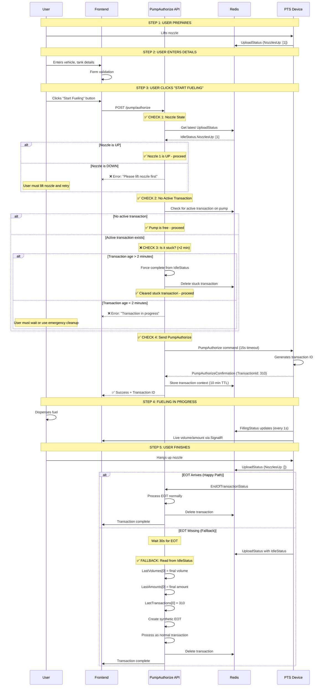

# Physical Fueling Workflow Fix - November 11, 2025

## Problem Statement

Your logs show **5 stuck transactions (300, 306, 307, 308, 309)** that never received EOT (End of Transaction):
```
[17:29:17 WRN] [UploadStatus] **MISSING EOT** - Device 003400483233511238383435 has 5 active transactions
[17:29:17 WRN] [UploadStatus] **ACTIVE TX** - Transaction 309 - checking for forced completion
[17:29:17 WRN] [UploadStatus] **CORRELATION** - Expected Transaction 309, Found in EOT: False
```

### Root Causes

1. **No Nozzle State Validation**: System authorizes pump even when nozzle is down
2. **EOT Dependency**: We wait for `EndOfTransactionStatus` which often doesn't arrive
3. **Transaction ID Waiting**: We wait for device to generate transaction ID (5-8 seconds)
4. **No Physical Process Enforcement**: User can start fueling before system is ready
5. **Transaction Accumulation**: Old transactions stay in Redis forever

## Solution: Physical Workflow Enforcement

### New Fueling Flow



## Implementation Plan

### Phase 1: Nozzle State Validation (HIGH PRIORITY)

#### Backend Changes

**File**: `FMS.Application/Features/PTS/Queries/GetPumpNozzleStateQuery.cs` (NEW)

```csharp
public record GetPumpNozzleStateQuery(string DeviceId, int PumpId)
    : IRequest<FMSResponse<PumpNozzleStateDto>>;

public class PumpNozzleStateDto
{
    public int PumpId { get; set; }
    public bool IsNozzleUp { get; set; }
    public int? NozzleNumber { get; set; }
    public List<int> NozzlesUp { get; set; } = new();
    public DateTime LastUpdated { get; set; }
    public string Status { get; set; } = string.Empty; // "NozzleUp", "NozzleDown", "Unknown"
}

public class GetPumpNozzleStateQueryHandler
    : IRequestHandler<GetPumpNozzleStateQuery, FMSResponse<PumpNozzleStateDto>>
{
    private readonly IDatabase _redisDb;
    private readonly ILogger<GetPumpNozzleStateQueryHandler> _logger;

    public async Task<FMSResponse<PumpNozzleStateDto>> Handle(
        GetPumpNozzleStateQuery request,
        CancellationToken cancellationToken)
    {
        try
        {
            // Get latest UploadStatus from Redis
            var statusKey = $"upload-status:{request.DeviceId}";
            var statusJson = await _redisDb.StringGetAsync(statusKey);

            if (statusJson.IsNullOrEmpty)
            {
                return FMSResponse<PumpNozzleStateDto>.Failed(
                    "No status available for device. Please wait for next status update."
                );
            }

            var uploadStatus = JsonSerializer.Deserialize<UploadStatusData>(statusJson!);
            var idleStatus = uploadStatus?.Data?.Pumps?.IdleStatus;

            if (idleStatus?.Ids == null || !idleStatus.Ids.Any())
            {
                return FMSResponse<PumpNozzleStateDto>.Success(new PumpNozzleStateDto
                {
                    PumpId = request.PumpId,
                    IsNozzleUp = false,
                    Status = "Unknown",
                    LastUpdated = uploadStatus?.Data?.DateTime ?? DateTime.UtcNow
                });
            }

            // Find our pump in IdleStatus.Ids
            var pumpIndex = idleStatus.Ids.IndexOf(request.PumpId);
            if (pumpIndex == -1)
            {
                return FMSResponse<PumpNozzleStateDto>.Success(new PumpNozzleStateDto
                {
                    PumpId = request.PumpId,
                    IsNozzleUp = false,
                    Status = "NozzleDown",
                    LastUpdated = uploadStatus?.Data?.DateTime ?? DateTime.UtcNow
                });
            }

            // Check NozzlesUp array
            var nozzlesUp = idleStatus.NozzlesUp ?? new List<int>();
            var nozzleNumber = pumpIndex < nozzlesUp.Count ? nozzlesUp[pumpIndex] : 0;
            var isNozzleUp = nozzleNumber > 0;

            return FMSResponse<PumpNozzleStateDto>.Success(new PumpNozzleStateDto
            {
                PumpId = request.PumpId,
                IsNozzleUp = isNozzleUp,
                NozzleNumber = isNozzleUp ? nozzleNumber : null,
                NozzlesUp = nozzlesUp,
                Status = isNozzleUp ? "NozzleUp" : "NozzleDown",
                LastUpdated = uploadStatus?.Data?.DateTime ?? DateTime.UtcNow
            });
        }
        catch (Exception ex)
        {
            _logger.LogError(ex, "Error checking nozzle state for device {DeviceId}, pump {PumpId}",
                request.DeviceId, request.PumpId);
            return FMSResponse<PumpNozzleStateDto>.SystemError(
                "Error checking nozzle state. Please try again."
            );
        }
    }
}
```

**File**: `FMS.Application/Command/PTSCommand/PumpCommands/PumpAuthorizeCommand.cs`

Add nozzle state check BEFORE authorization:

```csharp
public async Task<FMSResponse<PumpAuthorizeConfirmation>> Handle(
    PumpAuthorizeCommand request,
    CancellationToken cancellationToken)
{
    try
    {
        // **STEP 1**: Check for stuck transactions
        var stuckTransaction = await CheckForStuckTransaction(request.DeviceId!, request.PumpId);
        if (stuckTransaction != null)
        {
            // Try to auto-clear if age > 2 minutes
            if (stuckTransaction.Age > TimeSpan.FromMinutes(2))
            {
                _logger.LogWarning("[PumpAuth] **AUTO-CLEARING** stuck transaction {TransactionId} (age: {Age})",
                    stuckTransaction.TransactionId, stuckTransaction.Age);

                await ClearStuckTransaction(stuckTransaction);
            }
            else
            {
                return FMSResponse<PumpAuthorizeConfirmation>.ValidationFailed(
                    $"Pump {request.PumpId} has active transaction {stuckTransaction.TransactionId}. Please wait or contact support."
                );
            }
        }

        // **STEP 2**: Validate nozzle state (NEW!)
        var nozzleState = await _mediator.Send(
            new GetPumpNozzleStateQuery(request.DeviceId!, request.PumpId),
            cancellationToken
        );

        if (!nozzleState.IsSuccess)
        {
            _logger.LogWarning("[PumpAuth] **NOZZLE CHECK FAILED** - {Message}",
                nozzleState.Message);
            return FMSResponse<PumpAuthorizeConfirmation>.ValidationFailed(
                nozzleState.Message ?? "Unable to verify nozzle state"
            );
        }

        if (!nozzleState.Data!.IsNozzleUp)
        {
            _logger.LogWarning("[PumpAuth] **NOZZLE DOWN** - Device {DeviceId}, Pump {PumpId}",
                request.DeviceId, request.PumpId);

            return FMSResponse<PumpAuthorizeConfirmation>.ValidationFailed(new List<string>
            {
                "⚠️ Nozzle must be lifted before starting fueling",
                "Please lift the nozzle from the pump and try again"
            });
        }

        _logger.LogInformation("[PumpAuth] **NOZZLE UP** - Device {DeviceId}, Pump {PumpId}, Nozzle {NozzleNumber}",
            request.DeviceId, request.PumpId, nozzleState.Data.NozzleNumber);

        // **STEP 3**: Proceed with normal validation and authorization
        var validationResult = await ValidateRequest(request);
        if (!validationResult.IsSuccess)
        {
            return FMSResponse<PumpAuthorizeConfirmation>.ValidationFailed(
                validationResult.ValidationErrors
            );
        }

        // ... rest of authorization logic
    }
    catch (Exception ex)
    {
        _logger.LogError(ex, "[PumpAuth] **ERROR** - {Message}", ex.Message);
        return FMSResponse<PumpAuthorizeConfirmation>.SystemError(ex.Message);
    }
}

// Helper method to clear stuck transaction
private async Task ClearStuckTransaction(StuckTransactionInfo stuckInfo)
{
    try
    {
        // Read final values from IdleStatus
        var statusKey = $"upload-status:{stuckInfo.DeviceId}";
        var statusJson = await _redisDb.StringGetAsync(statusKey);

        if (!statusJson.IsNullOrEmpty)
        {
            var uploadStatus = JsonSerializer.Deserialize<UploadStatusData>(statusJson!);
            var idleStatus = uploadStatus?.Data?.Pumps?.IdleStatus;

            if (idleStatus != null)
            {
                var pumpIndex = idleStatus.Ids?.IndexOf(stuckInfo.PumpId) ?? -1;

                if (pumpIndex >= 0)
                {
                    var lastVolume = idleStatus.LastVolumes?.ElementAtOrDefault(pumpIndex) ?? 0;
                    var lastAmount = idleStatus.LastAmounts?.ElementAtOrDefault(pumpIndex) ?? 0;
                    var lastTransaction = idleStatus.LastTransactions?.ElementAtOrDefault(pumpIndex) ?? 0;

                    if (lastTransaction == stuckInfo.TransactionId && lastVolume > 0)
                    {
                        _logger.LogInformation("[PumpAuth] **FORCE COMPLETE** - Transaction {TransactionId}, Volume: {Volume}L, Amount: {Amount}",
                            lastTransaction, lastVolume, lastAmount);

                        // Create synthetic EOT and process
                        await ProcessSyntheticEOT(stuckInfo.DeviceId, stuckInfo.PumpId,
                            lastTransaction, lastVolume, lastAmount);
                    }
                }
            }
        }

        // Delete Redis transaction key
        var transactionKey = $"pump-transaction:{stuckInfo.DeviceId}:{stuckInfo.PumpId}:{stuckInfo.TransactionId}";
        await _redisDb.KeyDeleteAsync(transactionKey);

        // Clear authorization state
        await _authTracker.ClearAuthorizationAsync(stuckInfo.DeviceId, stuckInfo.PumpId);

        _logger.LogInformation("[PumpAuth] **CLEARED** - Stuck transaction {TransactionId} on pump {PumpId}",
            stuckInfo.TransactionId, stuckInfo.PumpId);
    }
    catch (Exception ex)
    {
        _logger.LogError(ex, "[PumpAuth] **CLEAR FAILED** - Transaction {TransactionId}",
            stuckInfo.TransactionId);
    }
}
```

#### Frontend Changes

**File**: `fms.frontend/src/pages/ATG/fuelingprocess/fuelingprocess.js`

Add nozzle state monitoring:

```javascript
const [nozzleState, setNozzleState] = useState({
  isUp: false,
  nozzleNumber: null,
  lastUpdated: null,
  status: 'Unknown'
});

// Subscribe to nozzle state changes
useEffect(() => {
  if (!selectedDevice || !selectedPump) return;

  // Listen for UploadStatus updates
  const handleUploadStatus = (data) => {
    if (data.deviceId !== selectedDevice.ptsid) return;

    const idleStatus = data?.pumps?.idleStatus;
    if (!idleStatus?.ids) return;

    const pumpIndex = idleStatus.ids.indexOf(selectedPump.pumpId);
    if (pumpIndex === -1) {
      setNozzleState({ isUp: false, status: 'NozzleDown' });
      return;
    }

    const nozzlesUp = idleStatus.nozzlesUp || [];
    const nozzleNumber = nozzlesUp[pumpIndex] || 0;
    const isUp = nozzleNumber > 0;

    setNozzleState({
      isUp,
      nozzleNumber: isUp ? nozzleNumber : null,
      status: isUp ? 'NozzleUp' : 'NozzleDown',
      lastUpdated: new Date()
    });
  };

  const unsubscribe = ptsSignalRService.on('uploadStatusUpdate', handleUploadStatus);
  return () => unsubscribe();
}, [selectedDevice, selectedPump]);

// Update "Start Fueling" button
const handleStartFueling = async () => {
  // Check nozzle state
  if (!nozzleState.isUp) {
    notify({
      message: '⚠️ Please lift the nozzle before starting fueling',
      type: 'warning',
      displayTime: 4000
    });
    return;
  }

  // Proceed with authorization
  const result = await pumpControlService.authorizePump({
    deviceId: selectedDevice.ptsid,
    pumpId: selectedPump.pumpId,
    vehicleId: selectedVehicle?.vehicleId,
    tankId: selectedTank?.tankStockId,
    // ... other params
  });

  if (!result.isSuccess) {
    notify({
      message: result.message || 'Authorization failed',
      type: 'error',
      displayTime: 5000
    });
  }
};
```

**Add Visual Indicator**:

```jsx
<div className="tw-mb-4 tw-p-4 tw-border tw-rounded-lg"
     style={{
       borderColor: nozzleState.isUp ? '#10b981' : '#ef4444',
       backgroundColor: nozzleState.isUp ? '#d1fae5' : '#fee2e2'
     }}>
  <div className="tw-flex tw-items-center tw-gap-3">
    <i className={`fa-light fa-gas-pump tw-text-2xl ${
      nozzleState.isUp ? 'tw-text-green-600' : 'tw-text-red-600'
    }`}></i>
    <div>
      <div className="tw-font-semibold">
        {nozzleState.isUp
          ? `✅ Nozzle ${nozzleState.nozzleNumber} is UP - Ready to fuel`
          : '⚠️ Please lift nozzle from pump'
        }
      </div>
      <div className="tw-text-sm tw-text-gray-600">
        Status: {nozzleState.status}
        {nozzleState.lastUpdated &&
          ` (Updated ${formatDistanceToNow(nozzleState.lastUpdated)} ago)`
        }
      </div>
    </div>
  </div>
</div>

<button
  onClick={handleStartFueling}
  disabled={!nozzleState.isUp || isAuthorizing}
  className={`tw-w-full tw-py-3 tw-rounded-lg tw-font-semibold tw-transition-all ${
    nozzleState.isUp && !isAuthorizing
      ? 'tw-bg-green-600 tw-text-white hover:tw-bg-green-700'
      : 'tw-bg-gray-300 tw-text-gray-500 tw-cursor-not-allowed'
  }`}
>
  {isAuthorizing ? (
    <>
      <i className="fa-light fa-spinner fa-spin tw-mr-2"></i>
      Authorizing...
    </>
  ) : (
    <>
      <i className="fa-light fa-play tw-mr-2"></i>
      Start Fueling
    </>
  )}
</button>
```

### Phase 2: IdleStatus-Based Completion (MEDIUM PRIORITY)

**File**: `FMS.Application/Command/PTSCommand/UploadStatusCommands/UploadStatusCommand.cs`

Enhance the existing forced completion logic:

```csharp
private async Task<bool> CheckForForcedCompletion(
    string deviceId,
    ActiveTransactionInfo activeTransaction)
{
    // Only force complete if >2 minutes old
    if (activeTransaction.Age <= TimeSpan.FromMinutes(2))
    {
        return false;
    }

    _logger.LogWarning("[UploadStatus] **STUCK DETECTED**: Transaction {TransactionId} on pump {PumpId} has been active for {Age}",
        activeTransaction.TransactionId, activeTransaction.PumpId, activeTransaction.Age);

    // Try to extract final values from IdleStatus
    var uploadStatusKey = $"upload-status:{deviceId}";
    var statusJson = await _redisDb.StringGetAsync(uploadStatusKey);

    if (statusJson.IsNullOrEmpty) return false;

    var uploadStatus = JsonSerializer.Deserialize<UploadStatusData>(statusJson!);
    var idleStatus = uploadStatus?.Data?.Pumps?.IdleStatus;

    if (idleStatus?.Ids == null) return false;

    var pumpIndex = idleStatus.Ids.IndexOf(activeTransaction.PumpId);
    if (pumpIndex < 0) return false;

    // Extract LastVolumes, LastAmounts, LastTransactions
    var lastVolume = idleStatus.LastVolumes?.ElementAtOrDefault(pumpIndex) ?? 0;
    var lastAmount = idleStatus.LastAmounts?.ElementAtOrDefault(pumpIndex) ?? 0;
    var lastTransaction = idleStatus.LastTransactions?.ElementAtOrDefault(pumpIndex) ?? 0;
    var lastNozzle = idleStatus.LastNozzles?.ElementAtOrDefault(pumpIndex) ?? 0;

    // Verify transaction ID matches
    if (lastTransaction != activeTransaction.TransactionId)
    {
        _logger.LogWarning("[UploadStatus] **MISMATCH**: Expected transaction {Expected}, found {Found} in IdleStatus",
            activeTransaction.TransactionId, lastTransaction);
        return false;
    }

    // Must have positive volume to force complete
    if (lastVolume <= 0)
    {
        _logger.LogWarning("[UploadStatus] **NO VOLUME**: Transaction {TransactionId} has zero volume, cannot force complete",
            activeTransaction.TransactionId);
        return false;
    }

    _logger.LogInformation("[UploadStatus] **FORCE SUCCESS**: Transaction {TransactionId} completed with Volume={Volume}L, Amount={Amount}",
        activeTransaction.TransactionId, lastVolume, lastAmount);

    // Create synthetic EOT
    await ForceTransactionCompletion(
        deviceId,
        activeTransaction.PumpId,
        activeTransaction.TransactionId,
        lastVolume,
        lastAmount,
        lastNozzle
    );

    return true;
}

private async Task ForceTransactionCompletion(
    string deviceId,
    int pumpId,
    int transactionId,
    decimal volume,
    decimal amount,
    int nozzle)
{
    try
    {
        // Create synthetic EndOfTransactionStatus
        var syntheticEOT = new EndOfTransactionPacket
        {
            DeviceId = deviceId,
            PumpId = pumpId,
            TransactionId = transactionId,
            Volume = volume,
            Amount = amount,
            Nozzle = nozzle,
            IsForced = true, // Flag to indicate synthetic EOT
            CompletedAt = DateTime.UtcNow
        };

        // Process through normal EOT handler
        await _mediator.Send(new ProcessEndOfTransactionCommand(syntheticEOT));

        // Delete Redis transaction key
        var transactionKey = $"pump-transaction:{deviceId}:{pumpId}:{transactionId}";
        await _redisDb.KeyDeleteAsync(transactionKey);

        // Clear authorization
        await _authTracker.ClearAuthorizationAsync(deviceId, pumpId);

        _logger.LogInformation("[UploadStatus] **FORCED COMPLETE**: Transaction {TransactionId} processed and cleaned up",
            transactionId);
    }
    catch (Exception ex)
    {
        _logger.LogError(ex, "[UploadStatus] **FORCE FAILED**: Error completing transaction {TransactionId}",
            transactionId);
    }
}
```

### Phase 3: Redis Key TTL Reduction (LOW PRIORITY - ALREADY DONE)

Your stuck transaction management already sets 10-minute TTL. Good!

```csharp
// In StoreTransactionContextInRedis
await _redisDb.StringSetAsync(redisKey, contextJson,
    TimeSpan.FromMinutes(10)); // ✅ Correct
```

## Testing Strategy

### Test 1: Nozzle Down Prevention
1. Navigate to fueling page
2. Select vehicle, tank, pump
3. **DO NOT** lift nozzle
4. Click "Start Fueling"
5. **Expected**: Error message "⚠️ Nozzle must be lifted before starting fueling"
6. Lift nozzle
7. Click "Start Fueling" again
8. **Expected**: Authorization succeeds

### Test 2: Stuck Transaction Auto-Clear
1. Create a stuck transaction (manually insert Redis key with old timestamp)
2. Try to authorize same pump
3. **Expected**: System detects stuck transaction, reads final values from IdleStatus, auto-clears, proceeds with new authorization

### Test 3: Missing EOT Fallback
1. Start fueling normally
2. Dispense fuel
3. Hang up nozzle
4. **Simulate**: EOT packet never arrives (disconnect device briefly)
5. Wait 30 seconds
6. **Expected**: System reads LastVolumes/LastAmounts from IdleStatus, creates synthetic EOT, completes transaction

### Test 4: Multiple Nozzles
1. Use pump with 4 nozzles
2. Lift nozzle 2
3. Check nozzle state indicator
4. **Expected**: Shows "Nozzle 2 is UP"
5. Authorize with nozzle 2
6. **Expected**: Success

## Migration Notes

### Database Changes
None required - all changes are in Redis and application logic.

### Configuration Changes
Add to `appsettings.json`:

```json
{
  "PTSSettings": {
    "StuckTransactionThresholdMinutes": 2,
    "TransactionTTLMinutes": 10,
    "NozzleStateCheckEnabled": true,
    "ForceCompletionFromIdleStatus": true
  }
}
```

### Deployment Steps
1. Deploy backend with new `GetPumpNozzleStateQuery`
2. Deploy frontend with nozzle state indicator
3. Monitor logs for `**NOZZLE DOWN**` warnings
4. Monitor logs for `**FORCE SUCCESS**` completions
5. Verify stuck transactions decrease

## Expected Outcomes

### Before Fix
- ❌ 5+ stuck transactions accumulating
- ❌ Pumps blocked without clear reason
- ❌ Manual cleanup required frequently
- ❌ EOT packets missing
- ❌ Users confused about authorization failures

### After Fix
- ✅ Stuck transactions auto-cleared after 2 minutes
- ✅ Nozzle must be UP before authorization
- ✅ IdleStatus provides fallback for missing EOT
- ✅ Clear visual feedback for nozzle state
- ✅ Reduced manual intervention

## Monitoring

### Key Metrics to Track
1. **Nozzle Validation Failures**: Count of "Nozzle Down" rejections
2. **Auto-Clear Success Rate**: Stuck transactions cleared automatically
3. **Synthetic EOT Count**: Transactions completed from IdleStatus
4. **Average Transaction Age**: Should stay under 5 minutes
5. **Redis Key Count**: Active transactions should not accumulate

### Log Messages to Monitor
```
[PumpAuth] **NOZZLE DOWN** - Authorization blocked
[PumpAuth] **AUTO-CLEARING** - Clearing stuck transaction
[UploadStatus] **FORCE SUCCESS** - Transaction completed from IdleStatus
[UploadStatus] **STUCK DETECTED** - Transaction age > 2 minutes
```

---

## Summary

The solution enforces **physical fueling workflow** by:

1. **Validating nozzle is UP** before authorization (frontend + backend)
2. **Auto-clearing stuck transactions** after 2 minutes
3. **Using IdleStatus as fallback** when EOT missing
4. **Reducing Redis TTL** to 10 minutes (already done)
5. **Providing clear UI feedback** on nozzle state

This ensures the system matches the **physical reality** of fueling operations, preventing the accumulation of stuck transactions.
