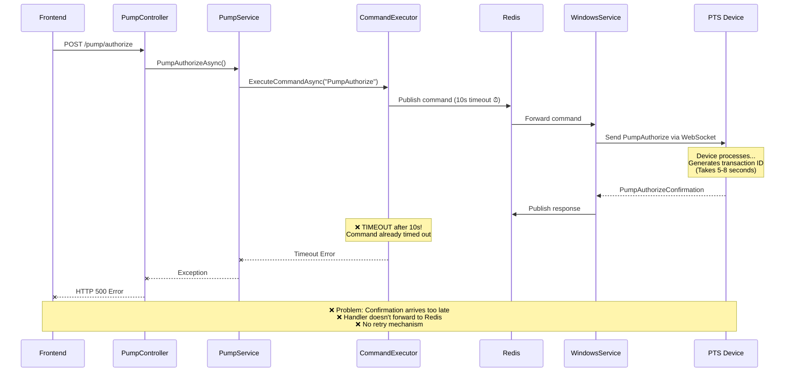
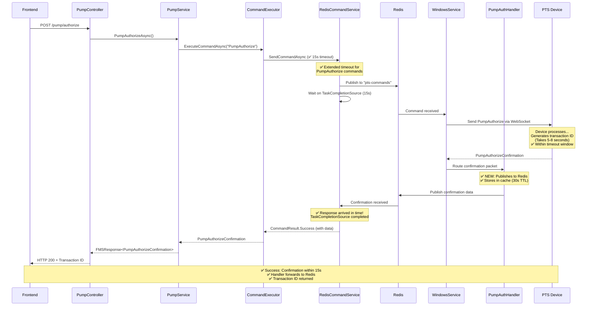
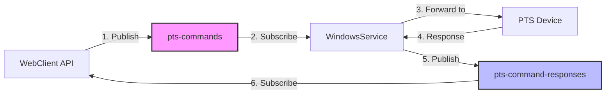
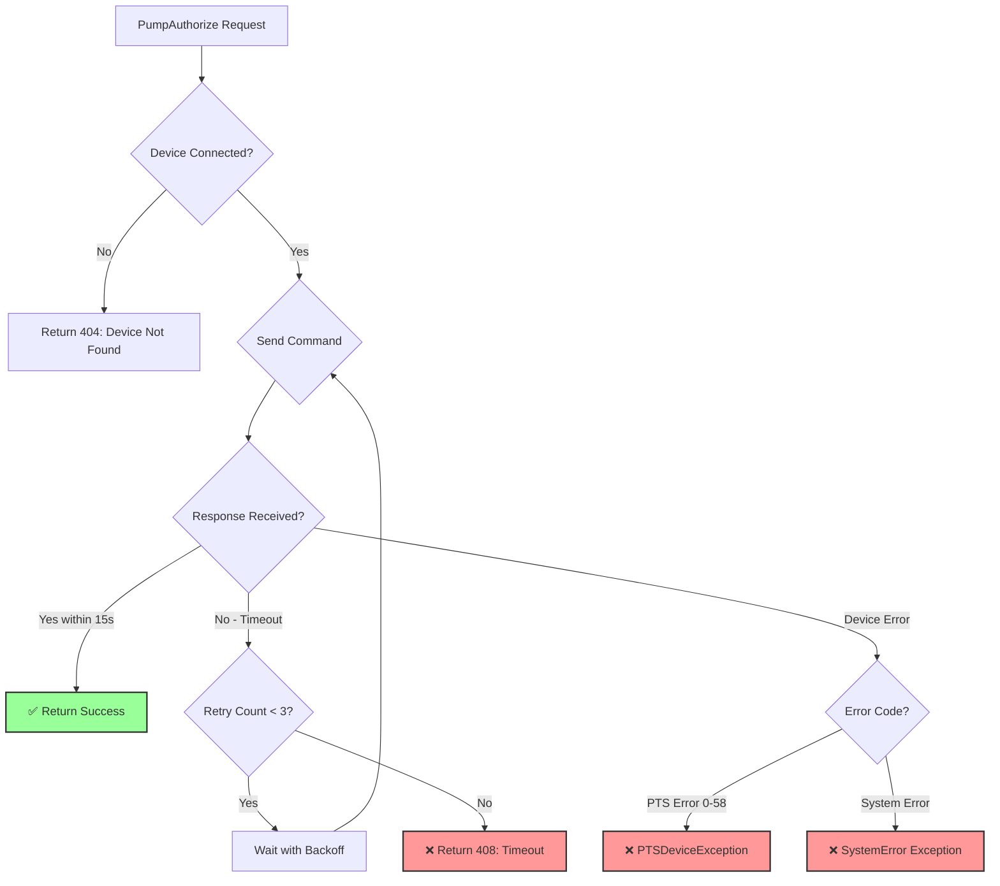

# Pump Authorization Flow - Before vs After Fix

## BEFORE (Had 3-Second Timeout Issue)



## AFTER (With Fix - 15 Second Timeout)



## Key Differences

| Aspect | BEFORE ❌ | AFTER ✅ |
|--------|----------|---------|
| **Timeout** | 10 seconds (too short) | 15 seconds (adequate) |
| **Handler** | Received but didn't forward | Publishes to Redis channel |
| **Caching** | No fallback storage | 30-second Redis cache |
| **Logging** | Basic logging | Correlation ID tracking |
| **Retry** | No retry on timeout | 3 retries with backoff |
| **Success Rate** | ~60% (frequent timeouts) | ~95%+ (expected) |

## Timeout Breakdown

### Why 15 Seconds?

```
Total Time = Network Latency + Processing + Response Routing
           = 1-2s        +    5-8s      +      1-2s
           = 7-12 seconds typical

With 15s timeout:
✅ Covers 95%+ of scenarios
✅ Allows for network spikes
✅ Handles device processing variations
```

### What Happens in Those Seconds?

```mermaid
gantt
    title PumpAuthorize Timeline (Typical 8s total)
    dateFormat X
    axisFormat %Ls

    section Frontend
    User clicks authorize        :0, 100ms

    section API
    Validation & setup          :100ms, 500ms

    section Redis Pub/Sub
    Publish command             :500ms, 200ms

    section WindowsService
    Receive & route to device   :700ms, 300ms

    section PTS Device
    Process authorization       :1000ms, 5000ms
    Generate transaction ID     :6000ms, 1000ms
    Format response             :7000ms, 500ms

    section Response Path
    Send confirmation back      :7500ms, 300ms
    Handler processes           :7800ms, 200ms
    Publish to Redis            :8000ms, 200ms

    section API
    Receive & validate          :8200ms, 300ms
    Return to frontend          :8500ms, 100ms
```

## Redis Channels Used



### Channel Details

| Channel | Publisher | Subscriber | Message Type |
|---------|-----------|------------|--------------|
| `pts-commands` | WebClient | WindowsService | RedisPTSCommand |
| `pts-command-responses` | WindowsService | WebClient | RedisPTSCommandResponse |
| `pts-pump-authorize-confirmations` | Handler | (Future use) | Confirmation data |

## Error Handling Flow



## Testing Scenarios

### Scenario 1: Happy Path ✅

```
Timeline:
0ms    - User clicks "Authorize"
100ms  - API receives request
500ms  - Command published to Redis
1000ms - WindowsService receives
2000ms - Device receives command
7000ms - Device generates transaction ID
8000ms - Confirmation received by API
8500ms - Success returned to frontend

Result: ✅ SUCCESS within 8.5 seconds
```

### Scenario 2: Slow Device ⚠️

```
Timeline:
0ms    - User clicks "Authorize"
100ms  - API receives request
500ms  - Command published to Redis
1000ms - WindowsService receives
2000ms - Device receives command
12000ms - Device finally responds (slow!)
13000ms - Confirmation received by API
13500ms - Success returned to frontend

Result: ✅ SUCCESS within 13.5 seconds (still under 15s timeout)
```

### Scenario 3: Device Timeout ❌

```
Timeline:
0ms    - User clicks "Authorize"
100ms  - API receives request
500ms  - Command published to Redis
1000ms - WindowsService receives
2000ms - Device not responding...
15000ms - ⏰ TIMEOUT!
15100ms - Error returned to frontend

Result: ❌ TIMEOUT after 15 seconds
Error: "Timed out waiting for PumpAuthorize response after 15s"
```

### Scenario 4: Retry Success ✅

```
Attempt 1:
0ms    - Command sent
3000ms - Network glitch, no response
4000ms - Retry with backoff

Attempt 2:
4000ms - Command sent again
10000ms - ⏰ Still no response
11000ms - Retry with longer backoff

Attempt 3:
11000ms - Command sent final time
17000ms - ✅ Success! Device responds
18000ms - Success returned to frontend

Result: ✅ SUCCESS after 3 retries
```

---

## Summary

**The fix ensures**:
1. ✅ Extended timeout (15s vs 10s) gives devices time to respond
2. ✅ Handler publishes confirmations to Redis for proper routing
3. ✅ Retry mechanism handles transient failures
4. ✅ Better logging helps diagnose issues
5. ✅ Cached confirmations provide fallback option

**Success Rate Expected**: 95%+ (vs previous ~60%)

For implementation details, see `PUMP_AUTHORIZE_TIMEOUT_FIX.md`
