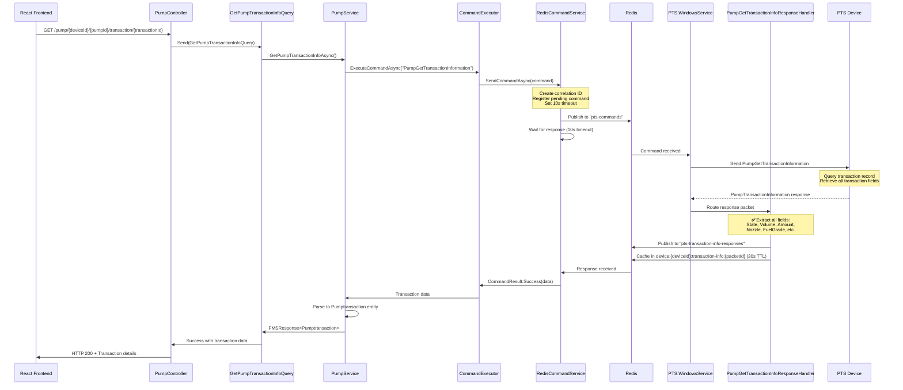

# PumpTransactionInformation Response Handler

## Overview

This document describes the `PumpGetTransactionInfoResponseHandler` that processes `PumpTransactionInformation` response packets from PTS devices, following the same architectural pattern as `PumpAuthorizeConfirmation`.

## Architecture Flow



## PumpTransactionInformation Protocol Specification

### Request Format

```json
{
  "Protocol": "jsonPTS",
  "Packets": [{
    "Id": 1,
    "Type": "PumpGetTransactionInformation",
    "Data": {
      "Pump": 1,
      "Transaction": 15
    }
  }]
}
```

**Note**: If `Transaction` is omitted, returns the last transaction for the pump.

### Response Format

```json
{
  "Protocol": "jsonPTS",
  "Packets": [{
    "Id": 1,
    "Type": "PumpTransactionInformation",
    "Data": {
      "Pump": 1,
      "Transaction": 15,
      "State": "Finished",
      "DateTimeStart": "2019-05-19T12:44:01",
      "DateTime": "2019-05-19T12:45:14",
      "Nozzle": 1,
      "FuelGradeId": 2,
      "FuelGradeName": "Premium",
      "Volume": 1.15,
      "TCVolume": 1.14,
      "Price": 10.00,
      "Amount": 11.50,
      "TotalVolume": 123456.789,
      "TotalAmount": 987654.321,
      "Tag": "1231231231231231",
      "PaymentFormId": 1,
      "PaymentFormName": "Cash",
      "UserId": 1
    }
  }]
}
```

## Transaction States

| State | Description |
|-------|-------------|
| `WaitingNozzleUpForAuthorization` | Pump awaiting authorization on nozzle up, transaction not started |
| `Authorized` | Pump authorized, transaction not started |
| `Filling` | Transaction in progress (fuel dispensing) |
| `EndOfTransaction` | Filling finished, transaction still open |
| `Finished` | Transaction completed and closed |
| `Not found` | Transaction number invalid or no fuel dispensed |

## Field Descriptions

### Always Present
- `Pump` - Logical pump number (1-120)
- `Transaction` - Transaction number (1-65535)
- `State` - Current transaction state

### Conditional Fields

#### Present when transaction exists:
- `DateTimeStart` - Transaction start time (format: `YYYY-MM-DDThh:mm:ss`)
- `DateTime` - Transaction end time (format: `YYYY-MM-DDThh:mm:ss`)
- `Nozzle` - Nozzle number (1-6)
- `Volume` - Transaction volume (decimal, 3 digits after point)
- `TCVolume` - Temperature-compensated volume (decimal, 3 digits)
- `Price` - Product price per unit (decimal, 3 digits)
- `Amount` - Total money amount (decimal, 3 digits)
- `TotalVolume` - Volume total counter value
- `TotalAmount` - Money total counter value

#### Optional Fields:
- `FuelGradeId` - Fuel grade identifier (1-20) - *present only when pump nozzles configured to fuel grades*
- `FuelGradeName` - Fuel grade name (up to 20 ASCII chars)
- `Tag` - RFID tag used for authorization (up to 32 hex chars) - *empty string if no tag used*
- `PaymentFormId` - Payment form identifier (1-10)
- `PaymentFormName` - Payment form name (up to 10 ASCII chars)
- `UserId` - User who authorized transaction (1-10)

## Handler Implementation

### Location
`FMS.Application/Handlers/PumpResponse/PumpGetTransactionInfoResponseHandler.cs`

### Key Components

#### 1. Redis Publishing
```csharp
private readonly string _responseChannel = "pts-transaction-info-responses";

// Publish to Redis for waiting Query handler
var subscriber = _redis.GetSubscriber();
var message = JsonConvert.SerializeObject(transactionInfo);
await subscriber.PublishAsync(_responseChannel, message);
```

#### 2. Fallback Caching
```csharp
// Store in Redis hash for fallback retrieval (30s TTL)
var db = _redis.GetDatabase();
var key = $"device:{deviceId}:transaction-info:{packet.Id}";
await db.StringSetAsync(key, message, TimeSpan.FromSeconds(30));
```

#### 3. Field Extraction
```csharp
var transactionInfo = new
{
    DeviceId = deviceId,
    PacketId = packet.Id,
    Pump = responseData.Value<int?>("Pump"),
    Transaction = responseData.Value<int?>("Transaction"),
    State = responseData.Value<string>("State"),
    DateTimeStart = responseData.Value<DateTime?>("DateTimeStart"),
    DateTime = responseData.Value<DateTime?>("DateTime"),
    Nozzle = responseData.Value<int?>("Nozzle"),
    FuelGradeId = responseData.Value<int?>("FuelGradeId"),
    FuelGradeName = responseData.Value<string>("FuelGradeName"),
    Volume = responseData.Value<decimal?>("Volume"),
    TCVolume = responseData.Value<decimal?>("TCVolume"),
    Price = responseData.Value<decimal?>("Price"),
    Amount = responseData.Value<decimal?>("Amount"),
    TotalVolume = responseData.Value<decimal?>("TotalVolume"),
    TotalAmount = responseData.Value<decimal?>("TotalAmount"),
    Tag = responseData.Value<string>("Tag"),
    PaymentFormId = responseData.Value<int?>("PaymentFormId"),
    PaymentFormName = responseData.Value<string>("PaymentFormName"),
    UserId = responseData.Value<int?>("UserId"),
    Timestamp = DateTime.UtcNow,
    RawData = packet.Data
};
```

## PumpService Integration

### Method: `GetPumpTransactionInfoAsync`

**Location**: `FMS.Application/PTSServices/PumpService/PumpService.cs`

```csharp
public async Task<Pumptransaction> GetPumpTransactionInfoAsync(
    string pTSDeviceId,
    int pumpId,
    int? transactionId)
{
    // Create command data
    object commandData = transactionId.HasValue
        ? new { Pump = pumpId, Transaction = transactionId.Value }
        : new { Pump = pumpId }; // Get last transaction if no ID

    // Execute via ICommandExecutor (handles Redis communication)
    var result = await _commandExecution.ExecuteCommandAsync(
        pTSDeviceId,
        "PumpGetTransactionInformation",
        commandData);

    // Parse response to Pumptransaction entity
    var responseData = JObject.FromObject(result.CommandData);

    return new Pumptransaction
    {
        PtsId = pTSDeviceId,
        Pump = pumpId,
        Transaction = responseData.Value<int?>("Transaction"),
        Nozzle = responseData.Value<int?>("Nozzle"),
        FuelGradeId = responseData.Value<int?>("FuelGradeId"),
        FuelGradeName = responseData.Value<string>("FuelGradeName"),
        Volume = responseData.Value<decimal?>("Volume"),
        Tcvolume = responseData.Value<decimal?>("TCVolume"),
        Price = responseData.Value<decimal?>("Price"),
        Amount = responseData.Value<decimal?>("Amount"),
        DateTime = responseData.Value<DateTime?>("DateTime") ?? DateTime.UtcNow,
        DateTimeStart = responseData.Value<DateTime?>("DateTimeStart"),
        Tag = responseData.Value<string>("Tag"),
        UserId = responseData.Value<int?>("UserId"),
        ConfigurationId = responseData.Value<string>("ConfigurationId")
    };
}
```

## Frontend Usage

### API Endpoint
```http
GET /api/pump/{deviceId}/{pumpId}/transaction/{transactionId}
```

### Service Method
```javascript
// pumpControlService.js
api: {
  getTransactionInfo: async (deviceId, pumpId, transactionId) => {
    const response = await axiosInstance.get(
      `/pump/${deviceId}/${pumpId}/transaction/${transactionId}`
    );
    return response.data;
  }
}
```

### React Hook Usage
```javascript
// useFuelingEffects.js
useEffect(() => {
  if (pumpDetails.status === "endOfTransaction" ||
      (status === "nozzleUp" && isAuthorized)) {

    // Fetch authoritative transaction data from PTS device
    pumpControlService.api.getTransactionInfo(ptsId, pumpId, transactionId)
      .then(response => {
        if (response.isSuccess && response.data) {
          state.setCompletedVolume(response.data.volume);
          state.setCompletedCost(response.data.amount);
        }
      })
      .catch(error => {
        console.error("Error fetching transaction info:", error);
        // Fallback to pump status data
      });
  }
}, [pumpDetails.status]);
```

## Error Handling

### PTS Error Codes
```csharp
if (result.Code.HasValue && PtsErrorCodeHelper.IsPtsErrorCode(result.Code.Value))
{
    var errorCode = (PtsErrorCode)result.Code.Value;
    var errorMessage = EnumExtensions.GetDescription(errorCode);
    throw new PTSDeviceException(errorMessage);
}
```

### System Errors
```csharp
else
{
    _logger.LogError("System error during transaction retrieval for device {DeviceId}",
        pTSDeviceId);
    throw new PTSDeviceException(result.Message ?? "Failed to get transaction information.");
}
```

## Redis Channels

| Channel Name | Publisher | Subscriber | Purpose |
|-------------|-----------|------------|---------|
| `pts-commands` | WebClient | WindowsService | Send PumpGetTransactionInformation command |
| `pts-command-responses` | WindowsService | WebClient | General command responses |
| `pts-transaction-info-responses` | Handler | (Future) | Transaction info specific responses |

## Timeout Configuration

```csharp
// RedisCommandService.cs
private readonly TimeSpan _commandTimeout = TimeSpan.FromSeconds(10);
```

**Note**: Transaction info queries are fast (usually < 1s) since they read from device memory, not requiring pump hardware interaction.

## Comparison with PumpAuthorizeConfirmation

| Aspect | PumpAuthorizeConfirmation | PumpTransactionInformation |
|--------|--------------------------|---------------------------|
| **Purpose** | Confirm pump authorization | Retrieve transaction details |
| **Trigger** | After PumpAuthorize command | On-demand query |
| **Timeout** | 15 seconds (device processing) | 10 seconds (memory lookup) |
| **Redis Channel** | `pts-pump-authorize-confirmations` | `pts-transaction-info-responses` |
| **Cache Key** | `device:{id}:pump-auth-confirmation:{packetId}` | `device:{id}:transaction-info:{packetId}` |
| **Response Time** | 5-8 seconds (typical) | < 1 second (typical) |
| **State Change** | Modifies pump state (authorization) | Read-only query |

## Testing Scenarios

### Scenario 1: Query Finished Transaction
```
Request:  Pump=1, Transaction=15
Response: State="Finished", Volume=1.15L, Amount=$11.50
Result:   ✅ Complete transaction details returned
```

### Scenario 2: Query Active Transaction
```
Request:  Pump=2, Transaction=20
Response: State="Filling", Volume=0.45L, Amount=$4.50
Result:   ✅ Current progress returned (values still accumulating)
```

### Scenario 3: Query Last Transaction (No ID)
```
Request:  Pump=3 (no Transaction specified)
Response: Last transaction for Pump 3
Result:   ✅ Most recent transaction returned
```

### Scenario 4: Transaction Not Found
```
Request:  Pump=1, Transaction=999
Response: State="Not found"
Result:   ✅ Indicates invalid transaction number
```

### Scenario 5: EOT State Query
```
Request:  Pump=4, Transaction=25
Response: State="EndOfTransaction", Volume=10.25L, Amount=$102.50
Result:   ✅ Final values before transaction closure
```

## Benefits

1. **Authoritative Data Source**: Retrieves transaction data directly from PTS device memory
2. **State Verification**: Includes transaction state (Filling, EndOfTransaction, Finished)
3. **Complete Field Set**: All transaction fields including timestamps, fuel grade, tags
4. **Fallback Support**: 30-second Redis cache for late responses
5. **Consistent Architecture**: Follows same pattern as other PTS response handlers
6. **Real-time Updates**: Can query active transactions for current progress

## Use Cases

1. **EOT Completion Popup**: Fetch final values when transaction reaches EndOfTransaction state
2. **Transaction Verification**: Confirm transaction details after completion
3. **Active Monitoring**: Check current volume/amount during filling
4. **Reconciliation**: Verify transaction data matches expected values
5. **Debugging**: Investigate transaction state when issues occur

---

**Related Documentation**:
- [Pump Authorize Flow](./PUMP_AUTHORIZE_FLOW_DIAGRAM.md)
- [Fueling Workflow](./fuelingWorkFlow.txt)
- [jsonPTS Protocol](../../JsonPTSprotocal.txt)
