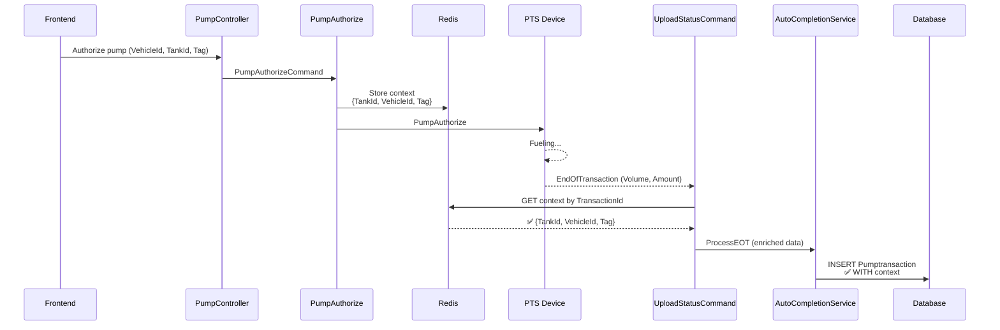
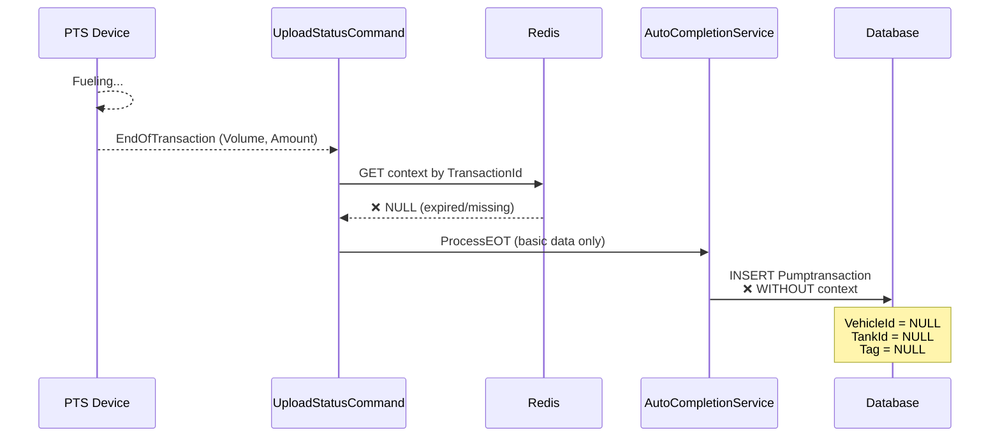

# Transaction Data Missing Analysis - VehicleId & Context Data Loss

## Problem Statement

Some pump transactions saved to the database are missing critical business context data:
- ❌ **VehicleId** is NULL
- ❌ **TankId** is NULL
- ❌ **Tag** is NULL
- ✅ **Volume/Amount** are present (from device)

**Impact**: Cannot track which vehicle fueled or which tank supplied the fuel, breaking the business logic for fuel consumption tracking, reconciliation, and reporting.

## Root Cause Analysis

### Transaction Completion Paths

There are **TWO PATHS** for transaction completion in `UploadStatusCommand.cs`:

#### Path 1: With Redis Context ✅ (CORRECT)

```csharp
// Lines 680-760: When Redis context exists
var transactionKey = $"device:{deviceId}:transaction:{transactionId}";
var contextJson = await _redisDb.StringGetAsync(transactionKey);

if (!contextJson.IsNullOrEmpty)
{
    // ✅ Extract authorization context
    var tankId = context.TryGetProperty("TankId", out var tankProp) ? tankProp.GetInt32() : (int?)null;
    var vehicleId = context.TryGetProperty("VehicleId", out var vehicleProp) ? vehicleProp.GetInt32() : (int?)null;
    var authState = await _authTracker.GetAuthorizationState(deviceId, pumpId);
    var tagId = authState?.TagId;

    // ✅ Create ENRICHED status data
    var statusData = new JObject
    {
        ["Pump"] = pumpId,
        ["Transaction"] = transactionId,
        ["Volume"] = volume,
        ["Amount"] = amount,
        ["TankId"] = tankId,          // ✅ Present
        ["VehicleId"] = vehicleId,    // ✅ Present
        ["Tag"] = tagId,              // ✅ Present
        ["DateTime"] = DateTime.UtcNow
    };

    // Process with full context
    await _autoCompletionService.ProcessEndOfTransactionAsync(deviceId, pumpId, transactionId, statusData);
}
```

**Result**: Transaction saved with **complete business context** ✅

#### Path 2: Without Redis Context ❌ (PROBLEM)

```csharp
// Lines 764-839: When Redis context is NOT found
else
{
    _logger.LogWarning("No authorization context found - may be external transaction");

    // ❌ Create BASIC status data WITHOUT context
    var basicStatusData = new JObject
    {
        ["Pump"] = pumpId,
        ["Transaction"] = transactionId,
        ["Volume"] = volume,          // ✅ Present
        ["Amount"] = amount,          // ✅ Present
        // ❌ TankId = MISSING
        // ❌ VehicleId = MISSING
        // ❌ Tag = MISSING
        ["DateTime"] = DateTime.UtcNow
    };

    // Process WITHOUT context
    await _autoCompletionService.ProcessEndOfTransactionAsync(deviceId, pumpId, transactionId, basicStatusData);
}
```

**Result**: Transaction saved **WITHOUT business context** ❌

### Why Redis Context Goes Missing

**Scenario 1: Context Expires Before EOT**
```
Time 0:00 - Pump authorized → Redis context created (30min TTL)
Time 0:05 - Fueling starts
Time 35:00 - Fueling ends (EOT received)
Time 35:00 - Redis context EXPIRED (30min passed)
Result: ❌ NO CONTEXT - basicStatusData used
```

**Scenario 2: Context Already Consumed**
```
Time 0:00 - EOT received → Context retrieved and deleted
Time 0:01 - Duplicate EOT received (or IdleStatus change)
Time 0:01 - Redis context ALREADY DELETED
Result: ❌ NO CONTEXT - basicStatusData used
```

**Scenario 3: External/Manual Transaction**
```
- Operator manually authorizes pump at PTS device (not via FMS)
- Fueling completes → EOT received by WindowsService
- NO Redis context ever created (transaction not from FMS)
Result: ❌ NO CONTEXT - basicStatusData used (EXPECTED)
```

**Scenario 4: Network/Timing Issues**
```
Time 0:00 - Pump authorized → Context saved to Redis
Time 0:01 - PTS device buffers EOT (network delay)
Time 5:00 - EOT finally arrives at WindowsService
Time 5:00 - Context lookup: Different Redis node? Network partition?
Result: ❌ NO CONTEXT - basicStatusData used
```

## Data Flow Analysis

### Complete Flow with Context



### Incomplete Flow WITHOUT Context



## Evidence from Code

### AutoCompletionService Creates Entity

```csharp
// AutoTransactionCompletionService.cs:320
private Pumptransaction CreatePumpTransactionFromData(string deviceId, int pump, int transaction, JObject data)
{
    return new Pumptransaction {
        PtsId = deviceId,
        Pump = pump,
        Transaction = transaction,
        Volume = data.Value<decimal?>("Volume"),      // ✅ Always present (from device)
        Amount = data.Value<decimal?>("Amount"),      // ✅ Always present (from device)

        // ❌ These are NULL if data doesn't contain them
        TankId = data.Value<int?>("TankId"),          // From Redis context
        VehicleId = data.Value<int?>("VehicleId"),    // From Redis context
        Tag = data.Value<string>("Tag"),              // From auth tracker

        Nozzle = data.Value<int?>("Nozzle"),
        FuelGradeId = data.Value<int?>("FuelGradeId"),
        DateTime = data.Value<DateTime?>("DateTime") ?? DateTime.UtcNow
    };
}
```

**If `data` (JObject) doesn't have `TankId`, `VehicleId`, or `Tag`**:
- `data.Value<int?>("TankId")` returns `NULL`
- `data.Value<int?>("VehicleId")` returns `NULL`
- `data.Value<string>("Tag")` returns `NULL`

**Result**: Database row with NULL values ❌

## Current Mitigation Attempts

### 1. IdleStatus Enrichment (Lines 408-455)

```csharp
// When IdleStatus detects completion, tries to enrich with Redis context
if (!contextJson.IsNullOrEmpty)
{
    _logger.LogInformation("**CONTEXT FOUND** - Enriching IdleStatus completion");

    var tankId = context.TryGetProperty("TankId", out var tankProp) ? tankProp.GetInt32() : (int?)null;
    var vehicleId = context.TryGetProperty("VehicleId", out var vehicleProp) ? vehicleProp.GetInt32() : (int?)null;

    statusData["TankId"] = tankId;
    statusData["VehicleId"] = vehicleId;
    statusData["Tag"] = authState?.TagId;
}
else
{
    _logger.LogWarning("**NO CONTEXT** - No Redis context found for IdleStatus completion");
}
```

**Problem**: If context is missing, IdleStatus completion ALSO creates incomplete records.

### 2. Forced Completion (Lines 962-1143)

```csharp
// ForceTransactionCompletion creates synthetic EOT after timeout
var syntheticStatusData = new JObject
{
    ["Volume"] = lastVolume ?? 0,
    ["Amount"] = lastAmount ?? 0,
    ["TankId"] = tankId,      // ✅ Tries to get from Redis context
    ["VehicleId"] = vehicleId,
    ["Tag"] = tagId
};
```

**Problem**: If context already expired, forced completion ALSO creates incomplete records.

## Solutions

### Solution 1: Query PumpTransactionInformation from Device ✅ (BEST)

When Redis context is missing, **fetch complete transaction data from the PTS device** using the `PumpGetTransactionInformation` command:

```csharp
else // No Redis context found
{
    _logger.LogWarning("[UploadStatus] **NO CONTEXT** - Attempting to retrieve transaction info from device {DeviceId}:{TransactionId}",
        deviceId, detectedTransactionId.Value);

    try
    {
        // **SOLUTION** - Query device for complete transaction data
        var transactionInfo = await _pumpService.GetPumpTransactionInfoAsync(
            deviceId, pumpId, detectedTransactionId.Value);

        if (transactionInfo != null)
        {
            _logger.LogInformation("[UploadStatus] **DEVICE QUERY SUCCESS** - Retrieved transaction info from device");

            // **CHECK AUTH TRACKER** - Try to get context from authorization state
            var authState = await _authTracker.GetAuthorizationState(deviceId, pumpId);

            var enrichedStatusData = new JObject
            {
                ["Pump"] = pumpId,
                ["Transaction"] = detectedTransactionId.Value,
                ["Volume"] = transactionInfo.Volume ?? volume,
                ["Amount"] = transactionInfo.Amount ?? amount,
                ["Nozzle"] = transactionInfo.Nozzle,
                ["FuelGradeId"] = transactionInfo.FuelGradeId,
                ["FuelGradeName"] = transactionInfo.FuelGradeName,
                ["Price"] = transactionInfo.Price,
                ["DateTime"] = transactionInfo.DateTime,
                ["DateTimeStart"] = transactionInfo.DateTimeStart,
                ["Tag"] = transactionInfo.Tag ?? authState?.TagId,

                // **CRITICAL** - Try to correlate with active authorization
                ["TankId"] = authState?.TankId,
                ["VehicleId"] = authState?.VehicleId
            };

            await _autoCompletionService.ProcessEndOfTransactionAsync(
                deviceId, pumpId, detectedTransactionId.Value, enrichedStatusData);

            return; // Exit early, transaction processed
        }
    }
    catch (Exception ex)
    {
        _logger.LogError(ex, "[UploadStatus] **DEVICE QUERY FAILED** - Error querying transaction info from device");
    }

    // Fallback to basic data if device query fails
    // ... existing basicStatusData code ...
}
```

**Benefits**:
- ✅ Gets complete transaction data from device (Tag, Nozzle, FuelGrade, etc.)
- ✅ Correlates with active authorization state for TankId/VehicleId
- ✅ Works even if Redis context expired
- ✅ Handles external transactions gracefully

### Solution 2: Extend Redis Context TTL ⚠️ (PARTIAL)

Increase Redis context expiration from 30 minutes to 2 hours:

```csharp
// In PumpAuthorizeCommand after creating context
await _redisDb.StringSetAsync(
    transactionKey,
    contextJson,
    TimeSpan.FromHours(2) // Increased from 30 minutes
);
```

**Benefits**:
- ✅ Reduces context expiration for normal fueling operations

**Limitations**:
- ❌ Doesn't solve external/manual transactions
- ❌ Doesn't solve duplicate processing race conditions
- ❌ Increases Redis memory usage

### Solution 3: Fallback to Authorization Tracker ⚠️ (PARTIAL)

When Redis context is missing, check if authorization state still exists:

```csharp
else // No Redis context
{
    // **FALLBACK** - Check if authorization state still exists
    var authState = await _authTracker.GetAuthorizationState(deviceId, pumpId);

    if (authState != null)
    {
        _logger.LogInformation("[UploadStatus] **AUTH FALLBACK** - Found active authorization state");

        var statusData = new JObject
        {
            ["Pump"] = pumpId,
            ["Transaction"] = detectedTransactionId.Value,
            ["Volume"] = volume,
            ["Amount"] = amount,
            ["TankId"] = authState.TankId,      // ✅ From auth state
            ["VehicleId"] = authState.VehicleId,
            ["Tag"] = authState.TagId
        };

        await _autoCompletionService.ProcessEndOfTransactionAsync(deviceId, pumpId, transactionId, statusData);
    }
    else
    {
        // Use basicStatusData
    }
}
```

**Benefits**:
- ✅ Recovers context if authorization still active

**Limitations**:
- ❌ Authorization state may also be cleared before EOT
- ❌ Doesn't help for external transactions

### Solution 4: Database Lookup for Pending Transactions 🔍 (COMPREHENSIVE)

Check database for pending transactions that match device/pump/transaction ID:

```csharp
else // No Redis context
{
    // **DATABASE LOOKUP** - Check if transaction already exists with context
    using var scope = _scopeFactory.CreateScope();
    var context = scope.ServiceProvider.GetRequiredService<GpsdataContext>();

    var existingTransaction = await context.Pumptransactions
        .FirstOrDefaultAsync(t =>
            t.PtsId == deviceId &&
            t.Transaction == detectedTransactionId.Value &&
            t.VehicleId.HasValue); // Has context data

    if (existingTransaction != null)
    {
        _logger.LogInformation("[UploadStatus] **DB MATCH** - Found existing transaction with context");

        // Update with final values
        existingTransaction.Volume = volume;
        existingTransaction.Amount = amount;
        existingTransaction.DateTime = DateTime.UtcNow;
        await context.SaveChangesAsync();

        return; // Already processed with context
    }
}
```

**Benefits**:
- ✅ Prevents overwriting good data with incomplete data

**Limitations**:
- ❌ Doesn't help for first-time processing

## Recommended Implementation

**Combine Solutions 1 + 2 + 3** for maximum coverage:

1. **Primary**: Query device for transaction info (`PumpGetTransactionInformation`)
2. **Fallback 1**: Check authorization tracker state
3. **Fallback 2**: Extend Redis TTL to 2 hours
4. **Last Resort**: Save with basic data + flag for manual enrichment

```csharp
private async Task<JObject> GetEnrichedTransactionData(
    string deviceId, int pumpId, int transactionId, decimal? volume, decimal? amount)
{
    // Try 1: Query device
    try
    {
        var deviceInfo = await _pumpService.GetPumpTransactionInfoAsync(deviceId, pumpId, transactionId);
        if (deviceInfo != null)
        {
            var enriched = JObject.FromObject(deviceInfo);

            // Add auth context if available
            var authState = await _authTracker.GetAuthorizationState(deviceId, pumpId);
            if (authState != null)
            {
                enriched["TankId"] = authState.TankId;
                enriched["VehicleId"] = authState.VehicleId;
            }

            return enriched;
        }
    }
    catch (Exception ex)
    {
        _logger.LogWarning(ex, "Device query failed for {DeviceId}:{TransactionId}", deviceId, transactionId);
    }

    // Try 2: Auth tracker
    var authState2 = await _authTracker.GetAuthorizationState(deviceId, pumpId);
    if (authState2 != null)
    {
        return new JObject
        {
            ["Volume"] = volume,
            ["Amount"] = amount,
            ["TankId"] = authState2.TankId,
            ["VehicleId"] = authState2.VehicleId,
            ["Tag"] = authState2.TagId
        };
    }

    // Fallback: Basic data
    return new JObject
    {
        ["Volume"] = volume,
        ["Amount"] = amount,
        ["RequiresEnrichment"] = true // Flag for manual processing
    };
}
```

## Summary

**Root Cause**: When Redis context expires or is missing, transactions are saved with only basic device data (Volume/Amount), losing business context (VehicleId, TankId, Tag).

**Best Solution**: Query PTS device for complete transaction information using `PumpGetTransactionInformation` when Redis context is unavailable.

**Implementation**: Update `UploadStatusCommand.ProcessEndOfTransactionForTransactionData()` to call `_pumpService.GetPumpTransactionInfoAsync()` as fallback before using `basicStatusData`.
