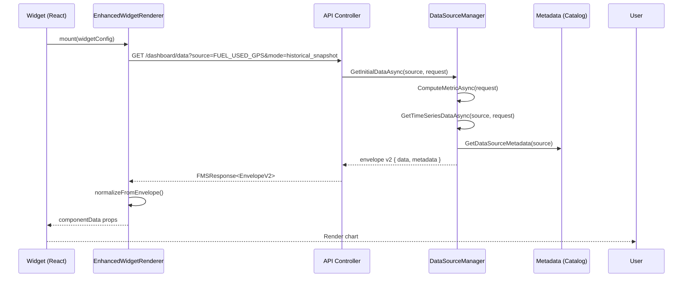
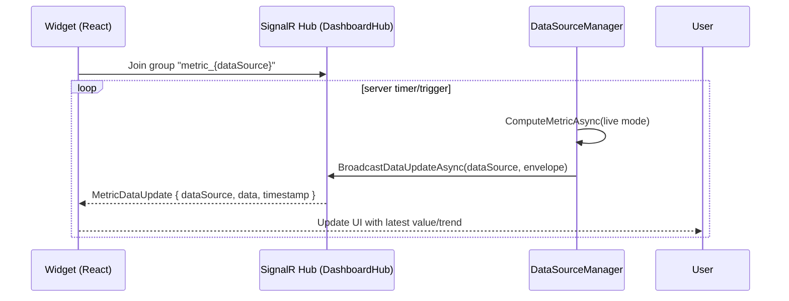

# Dashboard DataSource and Frontend Binding Guide

This guide explains how dashboard data sources are defined, served, and rendered in the FMS system. It covers architecture, metadata catalogs, the server envelope contract (v2), sequence/message flows for historical vs live data, and how to extend the system safely.

- Backend: .NET 8, Clean Architecture, CQRS, EF Core, SignalR
- Frontend: React 18, DevExtreme, EnhancedWidgetRenderer, Tailwind (tw- prefix), FontAwesome (fa-light)
- Repository anchors
  - Backend core: `FMS.Application/Features/Dashboard/Services/DataSourceManager*.cs`
  - Frontend renderer: `fms.frontend/src/components/dashboard/EnhancedWidgetRenderer.js`
  - Example widget: `fms.frontend/src/components/dashboard/widgets/PieChartWidget.js`

## Architecture overview

- Data sources are described by a metadata catalog built by `DataSourceManager` (partial class).
- Queries and metrics are computed server-side and returned in a normalized “envelope v2” response.
- Frontend centralizes ingestion via `EnhancedWidgetRenderer`, which adapts envelopes to specific widgets and removes client-side re-aggregation.
- Live updates use SignalR; historical/aggregated data uses HTTP.

Key backend files (partial split):
- `DataSourceManager.cs` – Public API, orchestration, SignalR broadcasting
- `DataSourceManager.Metadata.cs` – Catalog factories and normalization
- `DataSourceManager.Metrics.cs` – Metric computation helpers (currently stubbed in refactor)
- `DataSourceManager.TimeSeries.cs` – Time-series generation (stubbed while refactor proceeds)
- `DataSourceManager.Transformers.cs` – Widget shaping/transform helpers (stubbed in refactor)

Front-end binding:
- `EnhancedWidgetRenderer.js` – Normalizes envelope v2 to widget-friendly shapes
- Widgets consume normalized props; example: `PieChartWidget.js`

## DataSource metadata model

Each data source is registered with a `DataSourceMetadata` entry and then normalized. Common fields:

- Identity and UX
  - key (dictionary key), `DisplayName`, `Description`, `Category`
  - `IsCatalogVisible`: whether to show in builder/chooser
- Capabilities and defaults
  - `SupportsLiveData`, `SupportsHistoricalData`, `SupportedModes`
  - `SupportedAggregations` (e.g., sum, avg, count)
  - `SupportedGranularities` (e.g., minute, hour, day, week, month)
  - `SupportedGroupBy` (normalized to include "none" first)
  - `DefaultMode`, `DefaultAggregation`, `DefaultGranularity`, `DefaultGroupBy`
- Units and recommendations
  - `Unit`, `RecommendedUnits`
  - `Recommendations` (DatePreset, Granularity, CumulativeDefault, SmoothingDefault)
- `DefaultConfiguration` (merged into frontend config unless overridden)
  - mode, aggregation, granularity, datePreset, unit, groupBy
  - includeTotal (default set by normalization), topK (default set by normalization)

Normalization rules (in `DataSourceManager.Metadata.cs`):
- Ensure `SupportedGroupBy` contains `"none"` and place it first.
- If `DefaultConfiguration.includeTotal` or `topK` is missing, inject from metadata defaults.
- Fall back to sane defaults if fields are absent.

Example metadata (abridged JSON-like):
```
{
  key: "FUEL_USED_GPS",
  DisplayName: "Fuel Used (GPS)",
  Unit: "L",
  SupportsLiveData: false,
  SupportsHistoricalData: true,
  SupportedModes: ["historical_snapshot", "daily_aggregated"],
  SupportedAggregations: ["sum", "avg", "count"],
  SupportedGranularities: ["day", "week", "month"],
  SupportedGroupBy: ["none", "site", "vehicleType"],
  DefaultAggregation: "sum",
  DefaultGranularity: "day",
  DefaultGroupBy: "none",
  DefaultConfiguration: {
    mode: "historical_snapshot",
    aggregation: "sum",
    granularity: "day",
    datePreset: "last_7_days",
    unit: "L",
    groupBy: "none",
    includeTotal: true,
    topK: 10
  }
}
```

## Server response: envelope v2 contract

All widget data should be returned inside a standard envelope. Backend APIs must still wrap with `FMSResponse<T>`, but the inner `data` follows this shape:

```
{
  schemaVersion: 2,
  widgetType: "bar_chart" | "line_chart" | "pie_chart" | "big_stat_card" | ...,
  data: <payload>,             // chart/table/metric payload
  metadata: {
    unit: "L" | "km" | "%" | ...,
    aggregation: "sum" | "avg" | ...,
    granularity: "day" | "hour" | ...,
    groupBy: "none" | "site" | ...,
    includeTotal: true|false,
    topK: number,
    processingTimeMs?: number,
    source?: string
  },
  error?: { code: string, message: string }
}
```

Payload examples:
- Pie/Bar (categorical): `{ slices: [{ category, value, percentage? }], total? }`
- Line (time series): `{ series: [{ timestamp, value }], total?, min?, max? }`
- Big stat: `{ current: { value, unit, timestamp }, previous?: { value }, change?: { value, percentage, direction } }`
- Table: `{ rows: Array<object>, columns?: Array<{ key, title }>, total?: number }`

Error handling:
- On server calculation failure, set `error` and return minimal `data` for widget-safe rendering.
- API transport still uses `FMSResponse<T>`; keep `IsSuccess`, `Message`, and data set accordingly.

## End-to-end sequence flows

### Historical snapshot/aggregated (HTTP)



Notes:
- `ComputeMetricAsync` can compute current/summary metrics.
- `GetTimeSeriesDataAsync` returns series for charting (stubbed during refactor; replace with real logic).

### Live updates (SignalR)

Deprecated note: Do not call HTTP live or refresh endpoints for streaming; subscribe to SignalR groups via `DashboardHub` and listen for `MetricDataUpdate`.



Notes:
- Live widgets should set `mode=live`; server pushes minimal deltas.
- Message name: `"MetricDataUpdate"`, group: `"metric_{dataSource}"`.

## Frontend binding and normalization

Central adapter: `EnhancedWidgetRenderer.js`

- Detects envelope v2 via `schemaVersion === 2` or presence of `{ widgetType, data }`.
- Extracts `units`, `aggregation`, `granularity`, `groupBy`, `topK`, `includeTotal` from `envelope.metadata`.
- Normalizes to component-specific shapes:
  - Bar/Pie: arrays of `{ category, value, percentage? }`
  - Line: `{ chartData: [{ timestamp, value }] }`
  - Table: array of rows
  - Big stat: object with `current`, `previous`, `change` sections
- Passes normalized props and metadata to the widget component.

Example: Pie chart widget
- File: `PieChartWidget.js`
- Accepts either an array or envelope-derived `{ slices, total }`.
- Prefers server-provided `percentage` and `total` when present; otherwise computes client-side as fallback.
- Lint-safe hooks ordering (compute totals above early returns).

## Contract “micro-specs” (inputs/outputs)

- Input (server): `DashboardMetricRequestDto`
  - `MetricType` (dataSource key), `Mode` (live/historical), `DatePreset` (e.g., last_7_days), `SiteIds`, `VehicleIds`, `VehicleType`
- Output (server): `FMSResponse<EnvelopeV2>`
  - `IsSuccess`, `Message`, `Data` (Envelope v2 object), `Errors` (if validation fails)
- Widget props (frontend):
  - `units`, `aggregation`, `granularity`, `groupBy`, `topK`, `includeTotal` populated from envelope metadata
  - Component-specific shape (`chartData`, `slices`, `rows`, etc.)

Error modes:
- Validation failure → `FMSResponse.ValidationFailed` with details
- Computation failure → `error` inside envelope, widget renders graceful fallback
- Unknown data source → default metadata fallback with conservative defaults

## Extending: add a new data source

1) Metadata
- Add a factory in `DataSourceManager.Metadata.cs` or extend `BuildMetadata()` with a new key.
- Set `Supported*` lists and `DefaultConfiguration` (include `includeTotal` and `topK`).
- Ensure `SupportedGroupBy` includes `"none"` and set `DefaultGroupBy`.

2) Metrics/Time-series
- Implement `ComputeMetricAsync` and `GetTimeSeriesDataAsync` logic for the data source.
- Include `Unit`, `DateRange`, `LastUpdated` in responses as relevant.

3) Transformation (optional)
- If a widget needs custom shaping, add a transformer in `DataSourceManager.Transformers.cs` and call it from `TransformDataForWidgetType`.

4) Controller/Query wiring
- Expose an API endpoint that returns `FMSResponse<EnvelopeV2>` for the data source.
- For live data, hook server push via `BroadcastDataUpdateAsync`.

5) Frontend wiring
- Use `EnhancedWidgetRenderer` to render the widget; provide `factoryMetadata` only if needed.
- Follow Tailwind `tw-` prefix, SCSS usage, and `fa-light` icon rules.

## Message flow reference

- SignalR group name: `metric_{dataSource}`
- Broadcast payload: `{ dataSource, data: EnvelopeV2, timestamp }`
- Client handler: `MetricDataUpdate`

## Known limitations during refactor

- `DataSourceManager.TimeSeries.cs` and `.Metrics.cs` currently contain placeholder logic to unblock compilation; replace with production implementations.
- Some transformers are pass-through stubs; widgets will still render if the envelope payload is already widget-shaped.

## Quality checklist (backend)
- Uses `FMSResponse<T>` for all API responses
- Includes validation at command/query level
- Metadata entry created and normalized
- Error handling and logging present
- SignalR group/topic correct for live sources

## Quality checklist (frontend)
- Envelope v2 handled via `EnhancedWidgetRenderer`
- Widget props derive from envelope metadata (units, groupBy, etc.)
- Tailwind classes prefixed with `tw-`; SCSS over CSS; FontAwesome `fa-light`
- Graceful fallbacks when `percentage`/`total` missing

## Quick references
- Backend services: `FMS.Application/Features/Dashboard/Services/DataSourceManager*.cs`
- Frontend renderer: `fms.frontend/src/components/dashboard/EnhancedWidgetRenderer.js`
- Pie chart example: `fms.frontend/src/components/dashboard/widgets/PieChartWidget.js`
- SignalR hub: `FMS.Application/Communication/SignalR/DashboardHub`

---

If you add or modify a data source, please update this document with the new key, defaults, and any widget-specific nuances.