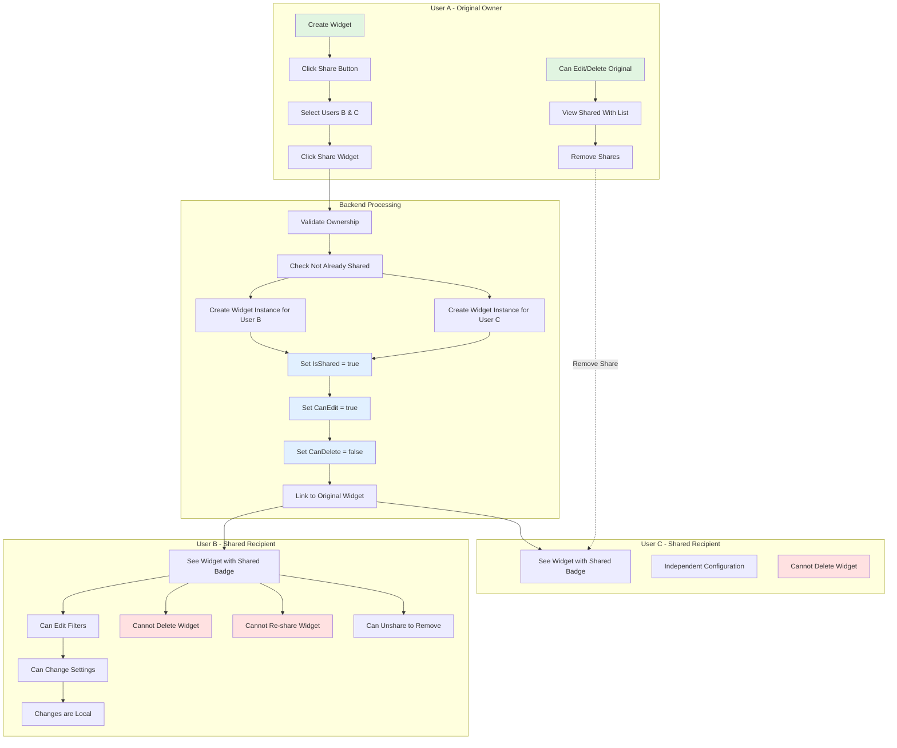
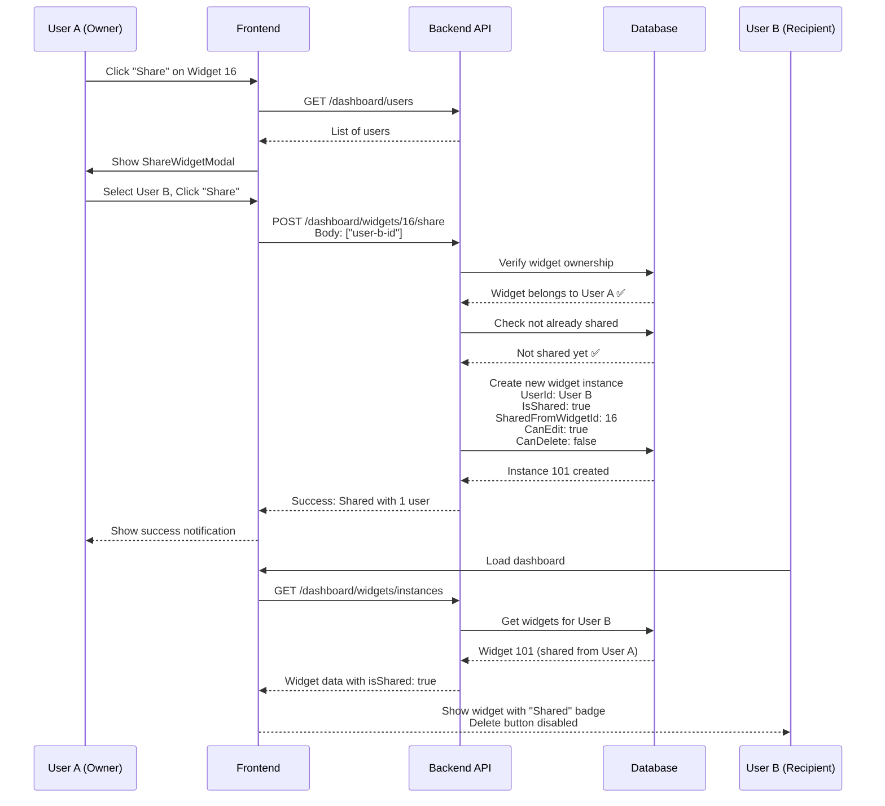

# Widget Sharing Flow Diagram

## Legend
- 🟢 **Green Boxes** - Actions owner can perform
- 🔴 **Red Boxes** - Restrictions for shared users
- 🔵 **Blue Boxes** - System-enforced sharing rules

## Key Relationships

```
Original Widget (Owner: User A, ID: 16)
    ├─ Shared Instance 1 (User: User B, ID: 101)
    │   ├─ IsShared: true
    │   ├─ SharedFromUserId: User A
    │   ├─ SharedFromWidgetId: 16
    │   ├─ CanEdit: true ✅
    │   └─ CanDelete: false ❌
    │
    └─ Shared Instance 2 (User: User C, ID: 102)
        ├─ IsShared: true
        ├─ SharedFromUserId: User A
        ├─ SharedFromWidgetId: 16
        ├─ CanEdit: true ✅
        └─ CanDelete: false ❌
```

## Permission Matrix

| Action | Original Owner | Shared User |
|--------|---------------|-------------|
| View Widget | ✅ Yes | ✅ Yes |
| Edit Filters | ✅ Yes | ✅ Yes |
| Edit Settings | ✅ Yes | ✅ Yes |
| Change Aggregation | ✅ Yes | ✅ Yes |
| Change Date Range | ✅ Yes | ✅ Yes |
| **Delete Widget** | ✅ Yes | ❌ No |
| **Share Widget** | ✅ Yes | ❌ No |
| **Re-share Widget** | ✅ Yes | ❌ No |
| Unshare/Remove | ✅ Yes | ✅ Yes (own copy) |

## Data Isolation

```
Original Widget Configuration:
{
  "siteIds": [1, 2, 3],
  "datePreset": "last_7_days",
  "aggregation": "sum"
}

User B's Shared Instance:
{
  "siteIds": [2, 5],           // ← Changed by User B
  "datePreset": "yesterday",   // ← Changed by User B
  "aggregation": "sum"
}

User C's Shared Instance:
{
  "siteIds": [1, 2, 3],        // ← Still original
  "datePreset": "last_7_days", // ← Still original
  "aggregation": "avg"         // ← Changed by User C
}

✅ Each user's changes are ISOLATED
❌ Changes do NOT affect other users
```

## UI States

### Original Widget (Owner View)
```
┌─────────────────────────────────────────┐
│ Fuel Dispensed This Week               │
│ Category: Fuel Management              │
│                                        │
│ [Edit] [Share] [Delete]                │
│   ✅      ✅       ✅                    │
└─────────────────────────────────────────┘
```

### Shared Widget (Recipient View)
```
┌─────────────────────────────────────────┐
│ Fuel Dispensed This Week               │
│ Category: Fuel Management              │
│ [Shared] ← Blue badge                  │
│                                        │
│ [Edit] [Delete]                        │
│   ✅      ❌  (disabled, grayed out)    │
└─────────────────────────────────────────┘
```

## Sequence Diagram



## Deletion Scenarios

### Scenario 1: Owner Deletes Original
```
Before:
Widget 16 (User A) → Original
Widget 101 (User B) → Shared from 16
Widget 102 (User C) → Shared from 16

User A deletes Widget 16:

After:
Widget 16 (User A) → IsVisible: false ❌
Widget 101 (User B) → Still visible ✅
Widget 102 (User C) → Still visible ✅

Result: Shared copies remain independent!
```

### Scenario 2: Recipient "Deletes" Shared Widget
```
Before:
Widget 16 (User A) → Original
Widget 101 (User B) → Shared from 16

User B clicks "Delete" (actually unshare):

After:
Widget 16 (User A) → Still visible ✅
Widget 101 (User B) → IsVisible: false ❌

Result: Only User B's copy is removed!
```

## Common Use Cases

### Use Case 1: Fleet Manager Shares Performance Dashboard
```
1. Fleet Manager creates "Daily Fleet Performance" widget
2. Shares with:
   - Regional Manager A (East)
   - Regional Manager B (West)
   - Regional Manager C (North)
3. Each regional manager customizes filters:
   - Manager A: Filter to East region sites
   - Manager B: Filter to West region sites
   - Manager C: Filter to North region sites
4. Everyone sees same widget type, different data
```

### Use Case 2: Finance Team Shares Fuel Cost Widget
```
1. Finance Director creates "Fuel Cost Analysis"
2. Shares with finance team members
3. Each member adjusts date ranges for their reports:
   - Member A: Monthly view
   - Member B: Weekly view
   - Member C: Quarterly view
4. All use same calculation logic, different time periods
```

### Use Case 3: Removing Access
```
1. Manager shares widget with contractor
2. Contract ends
3. Manager opens Share modal
4. Clicks X next to contractor's name
5. Contractor immediately loses access
6. Widget disappears from contractor's dashboard
```

---

## Visual States Reference

### Share Button States
- **Original Widget:** 🟢 Green "Share" button visible
- **Shared Widget:** 🔴 "Share" button hidden

### Delete Button States
- **Original Widget:** 🔴 Red "Delete" button enabled
- **Shared Widget:** ⚫ Gray "Delete" button disabled

### Badge Indicators
- **Original Widget:** No badge
- **Shared Widget:** 🔵 Blue "Shared" badge

---

For more details, see:
- Full Documentation: `WIDGET_SHARING_FEATURE.md`
- Implementation Guide: `WIDGET_SHARING_IMPLEMENTATION_SUMMARY.md`
