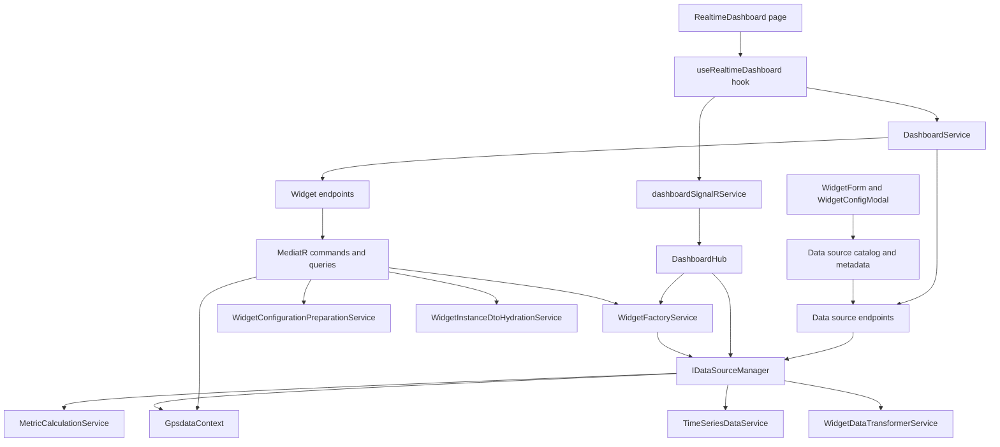
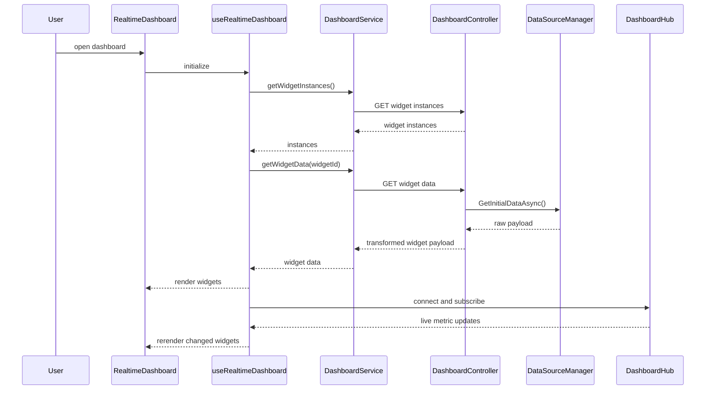

# Dashboard Module Documentation

## 1. Purpose

This document explains the current dashboard module architecture in Tenacity FMS, including:

- day-to-day usage flow
- backend and frontend structure
- runtime data flow
- current dependencies
- how to add new widget templates
- how to add new dashboard data sources
- how to extend the dashboard for another business module

This documentation covers both the backend dashboard feature under `FMS.Application/Features/Dashboard` and the frontend dashboard implementation under `fms.frontend/src`.

---

## 2. Scope of the Dashboard Module

The dashboard module is a metadata-driven, widget-based dashboard platform.

It allows the system to:

- seed reusable widget templates
- let users create widget instances from templates or custom configuration
- persist widget layout and widget settings per user
- fetch initial, historical, aggregated, and live data for widgets
- transform raw metric payloads into widget-specific shapes
- stream dashboard updates through SignalR
- extend the dashboard with module-specific data sources such as event alerts and issue tracker

At a high level, the dashboard is not only a page. It is a platform composed of:

1. widget template catalog
2. widget instance persistence
3. data-source metadata catalog
4. data-source execution engine
5. widget factory and transformation pipeline
6. frontend dashboard shell and editor
7. SignalR live update transport

---

## 3. High-Level Architecture



### Core architectural idea

The dashboard works by combining three axes:

- **what to show** ? widget template or custom widget configuration
- **where the data comes from** ? data source identifier + metadata contract
- **how it should render** ? widget type and widget transformation logic

---

## 4. Backend Architecture

## 4.1 Backend entry points

The backend dashboard surface is split into two main HTTP controllers and one SignalR hub:

- `FMS.WebClient/Controllers/Dashboard/DashboardController.cs`
- `FMS.WebClient/Controllers/Dashboard/DataSourceController.cs`
- `FMS.Application/Communication/SignalR/DashboardHub*.cs`

### `DashboardController`

Primary responsibilities:

- widget template retrieval
- widget instance CRUD
- per-widget data retrieval
- user layout persistence
- widget sharing operations

Examples of responsibilities already implemented:

- `GET /api/v1/dashboard/widgets/templates`
- `GET /api/v1/dashboard/widgets/instances`
- `POST /api/v1/dashboard/widgets/instances`
- `PUT /api/v1/dashboard/widgets/instances/{id}`
- `DELETE /api/v1/dashboard/widgets/instances/{id}`

### `DataSourceController`

Primary responsibilities:

- data-source catalog exposure
- metadata exposure
- initial data retrieval
- aggregated data retrieval
- legacy HTTP live endpoint

Examples:

- `GET /api/v1/dashboard/data-sources`
- `GET /api/v1/dashboard/data-sources/{dataSource}/metadata`
- `GET /api/v1/dashboard/data-sources/{dataSource}/initial`
- `GET /api/v1/dashboard/data-sources/{dataSource}/aggregated`

### `DashboardHub`

Primary responsibilities:

- SignalR connection lifecycle
- metric subscriptions
- batch initial widget loads
- widget data pushes
- streaming updates
- protocol negotiation and telemetry

Current design note:

The codebase already treats SignalR as the preferred path for live updates. The HTTP live endpoint in `DataSourceController` is marked deprecated.

---

## 4.2 Backend feature structure

Current dashboard feature structure:

```text
FMS.Application/Features/Dashboard/
+-- Command/
+-- Commands/
+-- Contracts/
+-- Dtos/
+-- Factory/
¦   +-- Extensions/
¦   +-- WidgetFactories/
+-- Queries/
+-- Services/
    +-- Common/
    +-- DataSourceManager/
    +-- Interface/
```

### Important backend areas

#### Commands

Used for write operations such as:

- create widget instance
- update widget instance
- delete widget instance
- share widget

Key write pipeline pieces:

- `CreateWidgetInstanceCommand.cs`
- `UpdateWidgetInstanceCommand.cs`
- `DeleteWidgetInstanceCommand.cs`
- `ShareWidgetCommand.cs`

#### Queries

Used for read operations such as:

- get available widget templates
- get current user widget instances
- get single widget instance

Key query file:

- `Queries/WidgetQueries.cs`

#### Services

Used for configuration preparation, hydration, metadata access, metric execution, time-series retrieval, transformation, and template seeding.

Key service files:

- `WidgetConfigurationPreparationService.cs`
- `WidgetInstanceDtoHydrationService.cs`
- `DataSourceMetadataService.cs`
- `MetricCalculationService.cs`
- `TimeSeriesDataService.cs`
- `WidgetDataTransformerService.cs`
- `WidgetTemplateSeeder.cs`

#### DataSourceManager

This is the central runtime engine for dashboard data sources.

Current partial-file breakdown:

- `DataSourceManager.cs` ? main orchestration
- `DataSourceManager.Metadata.cs` ? base metadata catalog
- `DataSourceManager.Metrics.cs` ? change/metric helpers
- `DataSourceManager.TimeSeries.cs` ? time-series helpers
- `DataSourceManager.Transformers.cs` ? widget-specific transformation
- `DataSourceManager.EventAlerts.cs` ? event/alert runtime sources
- `DataSourceManager.EventAlerts.Metadata.cs` ? event/alert metadata
- `DataSourceManager.IssueTracker.cs` ? issue tracker runtime sources
- `DataSourceManager.IssueTracker.Metadata.cs` ? issue tracker metadata

This partial split is important because the data-source catalog is now large and domain-specific sources should be isolated to keep files maintainable.

---

## 4.3 Widget lifecycle on the backend

### Step 1: template or custom configuration arrives

When the frontend creates or updates a widget, it sends a `WidgetConfigurationDto`.

### Step 2: configuration normalization

`WidgetConfigurationPreparationService`:

- normalizes incoming `settings` and `filters`
- determines whether the widget is template-based or custom
- resolves category, data source, visualization type, mode, aggregation, and date preset
- validates the widget through `IWidgetFactoryService`
- builds the storage payload written into `ConfigurationJson`

This service is the main normalization guardrail for widget persistence.

### Step 3: persistence

Commands create or update `DashboardWidgetInstance` using normalized values.

Stored fields include:

- template reference
- widget type
- category
- data source
- width and height
- visibility flags
- `ConfigurationJson`

### Step 4: read hydration

When widget instances are loaded back, `WidgetInstanceDtoHydrationService` reads `ConfigurationJson` and hydrates DTO fields like:

- visualization type
- category
- data source
- mode
- date preset
- settings
- filters
- shared widget metadata

This means the stored JSON payload is the long-term configuration contract.

---

## 4.4 Widget factory responsibilities

`WidgetFactoryService` bridges the widget world and the data-source world.

It performs the following steps:

1. validate widget configuration through `WidgetFactoryCoordinator`
2. process widget configuration and determine query mode
3. build a `DashboardMetricRequestDto`
4. call `IDataSourceManager`
5. transform raw data into widget-specific output
6. return enriched widget data result including metadata and processed settings

This service is used by both:

- command-time validation
- runtime widget data requests
- SignalR widget loading paths

### Why this matters

The widget factory layer keeps data-source execution generic while still enforcing widget-type compatibility rules.

---

## 4.5 Data-source architecture

The dashboard data-source design is metadata-first.

Each data source has:

- an identifier, for example `fuel_dispense` or `issues_by_status`
- a `DataSourceMetadata` definition
- a runtime execution path in `IDataSourceManager`
- optional widget transformation behavior

### `DataSourceMetadata` contract

A data source metadata entry typically defines:

- display name
- description
- category
- supported modes
- supported aggregations
- supported granularities
- supported units
- recommended defaults
- compatible widget types
- required filters
- refresh interval
- top-k and include-total defaults

This contract is used by both backend and frontend.

### Why metadata is central

The frontend widget form relies on metadata to:

- show only valid widget types for a source
- apply default mode / aggregation / date preset / granularity
- validate required filters
- generate category and compatibility indexes

The backend relies on metadata to:

- expose the catalog
- answer metadata requests
- enforce live/historical compatibility
- support transformation decisions

---

## 4.6 Current specialized data-source groups

The dashboard currently has three source families:

### 1. Core metric sources

Examples:

- fuel dispensed
- engine hours
- distance travelled
- tank level
- speed and efficiency metrics

These are mostly defined in the base metadata and metric/time-series services.

### 2. Event and alert sources

Added through dedicated partials:

- `active_event_summary`
- `active_events_by_severity`
- `active_events_by_type`
- `active_events_by_category`
- `recent_active_events`
- `events_over_time`

### 3. Issue tracker sources

Added through dedicated partials:

- `issue_tracker_summary`
- `issues_by_status`
- `issues_by_priority`
- `issues_by_category`
- `issues_by_vehicle`
- `issues_by_site`
- `recent_issues`
- `overdue_issues`
- `issues_over_time`

These last two groups show the intended extension model for future modules.

---

## 4.7 Template seeding

`WidgetTemplateSeeder.cs` seeds reusable widget templates.

Responsibilities:

- ensure dashboard reporting permission exists
- add missing widget templates
- synchronize access metadata on existing templates
- provide reusable widgets for major dashboard categories

Template definitions typically include:

- widget type
- name / display name
- category
- data source
- default configuration JSON
- required permissions
- enabled flag

This is the main place to register curated out-of-the-box widgets.

---

## 4.8 Dependency map on the backend

### Direct dependencies

| Area | Depends on |
|---|---|
| `DashboardController` | MediatR, `IWidgetFactoryService`, `IDataSourceManager`, `GpsdataContext` |
| `DataSourceController` | `IDataSourceManager` |
| `DashboardHub` | `IDataSourceManager`, `IWidgetFactoryService`, `GpsdataContext` |
| `WidgetFactoryService` | `WidgetFactoryCoordinator`, `IDataSourceManager` |
| `WidgetConfigurationPreparationService` | `GpsdataContext`, `IWidgetFactoryService` |
| `WidgetInstanceDtoHydrationService` | persisted `ConfigurationJson` payload |
| `TimeSeriesDataService` | `IDataSourceMetadataService`, metric query implementations |
| `DataSourceManager` | `GpsdataContext`, metric service, time-series service, transformer service, SignalR hub context |
| `WidgetQueries` | `GpsdataContext`, AutoMapper, hydration service |
| `Create/Update commands` | `GpsdataContext`, AutoMapper, preparation service, hydration service |

### Persistence dependencies

Main dashboard persistence depends on dashboard entities and user/role/permission lookups in the main context.

### Real-time dependencies

Live dashboard updates depend on:

- `DashboardHub`
- `dashboardSignalRService.js`
- the frontend hook lifecycle in `useRealtimeDashboard.js`

---

## 5. Frontend Architecture

## 5.1 Main frontend entry points

The dashboard frontend is centered around:

- `pages/dashboard/RealtimeDashboard.js`
- `hooks/useRealtimeDashboard.js`
- `components/dashboard/CategoryGroupedWidgetRenderer.js`
- `components/dashboard/ModalPopup/WidgetConfigModal.js`
- `components/dashboard/ModalPopup/WidgetForm.js`
- `services/dashboardService.js`
- `services/dataSourceService.js`
- `signalR/dashboardSignalRService.js`
- `services/core/WidgetService.js`
- `services/widgetFactoryService.js`

### `RealtimeDashboard`

Responsibilities:

- dashboard shell and header
- permission gating
- load and display widgets
- switch edit mode on/off
- open widget manager side panel
- trigger layout save

### `useRealtimeDashboard`

Responsibilities:

- load widget instances from the backend
- fetch widget data
- manage widget loading and error state
- establish SignalR connection
- subscribe to live updates
- keep dashboard state synchronized with widget instances and layout state

### `CategoryGroupedWidgetRenderer`

Responsibilities:

- group widgets by category
- render category sections
- manage layout order and widget sizes
- interact with Redux layout state
- support edit mode and save requests

### `WidgetConfigModal` + `WidgetForm`

Responsibilities:

- load widget templates
- load data-source catalog and metadata
- support both template-based and custom widget creation
- apply metadata defaults
- validate compatibility and guide the user to valid configuration

### `dataSourceService`

Responsibilities:

- fetch source catalog
- fetch per-source metadata
- fetch initial and aggregated data
- normalize widget configuration with metadata defaults
- manage active streams
- manage local metadata and data caches

### `dashboardSignalRService`

Responsibilities:

- connect to `/dashboardHub`
- manage listeners and subscriptions
- negotiate protocol behavior
- handle retries and reconnects
- route `MetricDataUpdate` style events to the frontend state layer

---

## 5.2 Frontend runtime flow



---

## 5.3 Frontend dependency map

| Frontend area | Main dependencies |
|---|---|
| `RealtimeDashboard` | `useRealtimeDashboard`, `usePermissions`, `WidgetConfigModal`, `CategoryGroupedWidgetRenderer` |
| `useRealtimeDashboard` | Redux, `DashboardService`, `dashboardSignalRService`, permission hook |
| `WidgetForm` | `dataSourceService`, `widgetFactoryService`, DevExtreme inputs |
| `WidgetConfigModal` | widget templates, widget list, widget form, side panel shell |
| `CategoryGroupedWidgetRenderer` | Redux dashboard layout actions, `EnhancedWidgetRenderer`, `dashboardService` |
| `dashboardService` | `dataSourceService`, widget endpoints |
| `dataSourceService` | `axiosInstance`, dashboard API factory, `dashboardSignalRService` |
| `dashboardSignalRService` | SignalR client, Redux store, auth token resolution |
| `WidgetService` | dashboard widget HTTP endpoints |
| `widgetFactoryService` | widget factory endpoints, `dataSourceService` metadata |

---

## 5.4 Current frontend behavior model

The current dashboard UX supports:

- permission-checked dashboard access
- template-driven widget creation
- custom widget creation
- shared widget visibility
- M365-style side panel editing
- category-grouped rendering
- edit-layout mode with save flow
- live dashboard updates over SignalR

The frontend is already strongly coupled to the metadata model, which is a good design decision because adding new data sources usually requires no special UI code if metadata is complete.

---

## 6. End-to-End Usage Flow

## 6.1 Viewing the dashboard

1. User opens the dashboard page.
2. `RealtimeDashboard` checks authentication and `_View_Dashboard` permission.
3. `useRealtimeDashboard` loads widget instances.
4. Each widget instance triggers data fetch through `dashboardService`.
5. The backend resolves data via `DataSourceManager` and transforms it for the requested widget type.
6. The renderer groups widgets by category and displays them.
7. SignalR subscriptions start for live-capable metrics.

## 6.2 Adding a widget from a template

1. User opens the widget manager.
2. Frontend loads widget templates and data-source catalog.
3. User selects a template.
4. Template defaults prefill the widget form.
5. User adjusts name, filters, or date scope.
6. Frontend posts a create request.
7. Backend normalizes configuration and validates through widget factory.
8. Widget instance is persisted.
9. Frontend reloads widget instances and the new widget appears.

## 6.3 Creating a custom widget

1. User chooses custom widget mode.
2. Frontend loads category-specific compatible widget types from metadata.
3. User selects category, data source, widget type, filters, aggregation, and time settings.
4. Frontend applies metadata defaults.
5. Backend validates widget/data-source compatibility.
6. Widget is saved as a custom widget with `ConfigurationJson` holding the runtime contract.

## 6.4 Live updates

1. Hook connects to `/dashboardHub`.
2. Frontend subscribes to metric streams.
3. Hub emits metric updates.
4. Hook merges updates into local widget state.
5. Widgets rerender without requiring a full dashboard reload.

---

## 7. Structure Reference

## 7.1 Backend structure summary

### `Command/` and `Commands/`

Write operations for widget lifecycle and sharing.

### `Contracts/`

Envelope types used to return normalized widget payloads.

### `Dtos/`

DTOs for catalog, payloads, sharing, and widget envelopes.

### `Factory/`

Widget-type coordination layer.

Subareas:

- `WidgetFactoryService.cs`
- `WidgetFactories/ChartWidgetFactory.cs`
- `WidgetFactories/StatCardWidgetFactory.cs`
- `WidgetFactories/TableWidgetFactory.cs`
- `WidgetFactories/WidgetFactoryCoordinator.cs`

### `Queries/`

Template and widget instance retrieval.

### `Services/`

Runtime orchestration and normalization.

Subareas:

- metadata
- metric calculation
- time-series
- data transformation
- template seeding
- configuration preparation
- hydration

### `Services/DataSourceManager/`

This is the extensibility center for new dashboard data sources.

## 7.2 Frontend structure summary

Key frontend folders involved:

```text
fms.frontend/src/
+-- pages/dashboard/
+-- hooks/
+-- components/dashboard/
+-- services/
+-- services/core/
+-- signalR/
+-- redux/
```

### Important frontend folders

- `pages/dashboard/` ? page shell and page-specific components
- `components/dashboard/` ? renderers, dialogs, forms, widget shells
- `hooks/` ? dashboard orchestration hook
- `services/` ? dashboard API, data-source API, widget factory helpers
- `signalR/` ? live transport layer
- `redux/` ? saved layout state and dashboard preferences

---

## 8. How to Add a New Widget Template

Use this process when you want a new reusable template to appear in the add-widget flow.

### Step 1: pick the target data source

Identify the existing source ID, for example:

- `fuel_dispense`
- `active_event_summary`
- `issues_by_status`

If the source does not exist yet, add the data source first.

### Step 2: add the template in `WidgetTemplateSeeder.cs`

Define:

- `WidgetType`
- `Name`
- `DisplayName`
- `Description`
- `Category`
- `DataSource`
- `ConfigurationJson`
- `RequiredPermissions`
- `IsEnabled`

### Step 3: include useful defaults

The template configuration should include values such as:

- default mode
- default date preset
- aggregation
- granularity
- group-by
- unit
- display flags

The more complete the defaults are, the better the one-touch setup will feel.

### Step 4: confirm metadata compatibility

The chosen widget type must be present in the source metadata’s `CompatibleWidgetTypes` list.

### Step 5: confirm permission visibility

The template will only appear to users who satisfy the template permission and role requirements.

### Step 6: verify frontend behavior

No new frontend code is usually needed if:

- the data source already exists in catalog metadata
- the widget type is already supported by renderers
- the template is seeded correctly

---

## 9. How to Add a New Data Source

Use this process when the dashboard must show a new business metric or a new module integration.

## 9.1 Decide the source family

Choose whether the new source belongs in:

- core metadata and metric services
- a dedicated `DataSourceManager.{Module}.cs` partial

### Recommended rule

If the source belongs to a business module such as event engine, issue tracker, tank stock, or another domain, create dedicated partial files.

Example pattern:

- `DataSourceManager.TankStock.cs`
- `DataSourceManager.TankStock.Metadata.cs`

## 9.2 Add a constant key

Add a unique string key for the new source.

Example:

- `tank_variance_summary`

## 9.3 Register the key in source routing

Add the key to the module source key array and the module detector method, for example:

- `IsTankStockDataSource(...)`

Then route it from the main `DataSourceManager.cs` public methods:

- `GetInitialDataAsync`
- `GetLiveDataAsync`
- `GetAggregatedDataAsync`

## 9.4 Implement the runtime builder

Create one or more methods that return the expected payload shape.

Common output patterns already used in the dashboard:

- `current`
- `change`
- `total`
- `categories`
- `items`
- `rows`
- `timeSeries`
- `summary`
- `metadata`

Try to keep the payload shape aligned with current widget transformer expectations.

## 9.5 Add metadata

In the module metadata partial, define a `DataSourceMetadata` entry covering:

- display name
- category
- description
- supported modes
- supported aggregations
- supported granularities
- compatible widget types
- required filters
- refresh interval
- defaults

## 9.6 Register metadata in `BuildMetadata()`

Add the source to `DataSourceManager.Metadata.cs`.

If it is not registered there, it will not show up in the catalog or metadata responses.

## 9.7 Verify frontend auto-discovery

The frontend add-widget flow will usually pick it up automatically through:

- `dataSourceService.getDataSourceCatalog()`
- metadata-driven category grouping
- metadata-driven widget compatibility
- `WidgetForm` default application logic

## 9.8 Optional: seed template(s)

If the new source should be user-visible immediately, also add one or more curated templates to `WidgetTemplateSeeder.cs`.

---

## 10. Recommended Data Source Payload Design

To work well with current frontend renderers, prefer one or more of these payload shapes.

### Summary / stat style

```json
{
  "current": {
    "value": 24,
    "unit": "count",
    "timestamp": "2026-03-09T10:00:00Z",
    "label": "Open Issues"
  },
  "change": {
    "value": 4,
    "percentage": 20,
    "direction": "up"
  },
  "total": 40,
  "metadata": {}
}
```

### Distribution / chart style

```json
{
  "categories": [
    { "key": "Open", "value": 12, "percent": 40 },
    { "key": "Closed", "value": 18, "percent": 60 }
  ],
  "items": [
    { "label": "Open", "value": 12 },
    { "label": "Closed", "value": 18 }
  ],
  "metadata": {}
}
```

### Feed / ticker style

```json
{
  "items": [
    {
      "id": 1001,
      "name": "Issue #1001",
      "label": "Overdue Issue",
      "description": "Open • High • Main Site",
      "timestamp": "2026-03-09T08:00:00Z"
    }
  ],
  "metadata": {}
}
```

### Trend style

```json
{
  "timeSeries": [
    { "timestamp": "2026-03-01T00:00:00Z", "value": 10 },
    { "timestamp": "2026-03-02T00:00:00Z", "value": 14 }
  ],
  "summary": {
    "total": 24,
    "latest": 14,
    "previous": 10,
    "granularity": "day"
  },
  "metadata": {}
}
```

---

## 11. How to Add a New Business Module to the Dashboard

The current event-alert and issue-tracker integrations show the preferred extension model.

### Recommended pattern

1. scan the existing module backend queries, services, and DTOs
2. identify reusable domain queries and tables
3. avoid domain changes unless explicitly approved
4. create dedicated dashboard source partials under `DataSourceManager`
5. create matching metadata partials
6. register the sources in `BuildMetadata()`
7. optionally seed curated templates
8. verify the frontend picks them up from the catalog

### What to avoid

- duplicating existing module logic in a second service layer
- hardcoding frontend dropdowns for new sources
- adding module-specific UI logic when metadata already solves the problem
- placing new source logic into the giant base metadata file if the source belongs to a separate business domain

---

## 12. Usage and Operational Notes

## 12.1 Permissions

Dashboard access depends on dashboard permissions. Template visibility also depends on the template’s configured permissions.

## 12.2 Metadata-first frontend behavior

When metadata is complete, the frontend automatically gains:

- discoverability in catalog listings
- compatibility filtering
- default mode and granularity suggestions
- required filter validation
- category grouping

## 12.3 Shared widgets

Widget queries and DTO hydration already include shared-widget fields, including:

- shared owner lookup
- shared count
- permission flags like edit/delete capability

## 12.4 Layout editing

Layout state is managed through the grouped renderer and Redux-backed layout actions. Saving layout is driven by the page shell and renderer coordination.

## 12.5 Live update strategy

Use SignalR for live delivery. Treat the old HTTP live endpoint as compatibility-only.

---

## 13. Current Architectural Strengths

The dashboard currently has several strong design choices:

1. **metadata-driven frontend behavior**
   - reduces frontend special cases
   - makes new sources discoverable automatically

2. **partial-file data-source manager design**
   - supports growth by module
   - prevents the main orchestration file from becoming unmanageable

3. **widget factory bridge**
   - keeps widget validation and data retrieval coordinated

4. **JSON-backed widget configuration contract**
   - flexible for template and custom widgets
   - supports gradual feature growth

5. **SignalR-first live strategy**
   - aligned with real-time dashboard requirements

---

## 14. Current Risks and Maintenance Considerations

1. Some dashboard files are already large on both backend and frontend.
   - keep new domain-specific logic in dedicated partials or helper files

2. There are both legacy and newer service paths in the frontend.
   - prefer the current metadata-driven and SignalR-aware services

3. Template defaults and metadata must remain aligned.
   - a mismatch causes create/edit UX drift

4. Payload shape consistency matters.
   - renderers and transformers assume familiar fields like `current`, `items`, `categories`, and `timeSeries`

5. Permission filtering happens at template level.
   - a valid source may still look “missing” if the template is permission-restricted

---

## 15. Practical Checklists

## 15.1 Checklist: add a template only

- [ ] existing data source confirmed
- [ ] metadata supports desired widget type
- [ ] template added in `WidgetTemplateSeeder.cs`
- [ ] required permissions set
- [ ] default configuration JSON added
- [ ] template category is correct

## 15.2 Checklist: add a new data source

- [ ] source key created
- [ ] source key routed in `DataSourceManager.cs`
- [ ] runtime query builder implemented
- [ ] metadata builder implemented
- [ ] metadata registered in `BuildMetadata()`
- [ ] compatible widget types declared
- [ ] defaults declared
- [ ] catalog returns source correctly

## 15.3 Checklist: add a new module integration

- [ ] existing module APIs and queries scanned first
- [ ] no `FMS.Domain` changes needed
- [ ] dedicated `DataSourceManager.{Module}.cs` created
- [ ] dedicated metadata partial created
- [ ] sources registered in the main catalog
- [ ] optional templates seeded
- [ ] frontend catalog picks up sources without hardcoding

---

## 16. Recommended Future Refactoring Directions

These are architectural recommendations based on the current implementation:

1. split very large frontend dashboard files further
2. keep each future business-domain source family in its own partial pair
3. gradually converge all frontend widget calls on the same service path to reduce overlap
4. document stable payload contracts per widget type if the renderer layer continues to expand
5. consider extracting a small dedicated backend class for source-family registration if the catalog grows significantly further

---

## 17. Summary

The dashboard module is a full widget platform, not only a page.

Its central design is:

- persistent widget instances
- metadata-driven data sources
- widget factory validation and shaping
- SignalR live updates
- frontend auto-discovery from the catalog

The most important extension points are:

- `WidgetTemplateSeeder.cs` for curated templates
- `DataSourceManager.*.cs` partials for source execution
- `DataSourceManager.*.Metadata.cs` partials for source registration and compatibility
- `WidgetForm.js` and `dataSourceService.js` for metadata-driven frontend configuration

If future dashboard work follows the same pattern used for event alerts and issue tracker, the module can continue growing without requiring major frontend rewrites.
