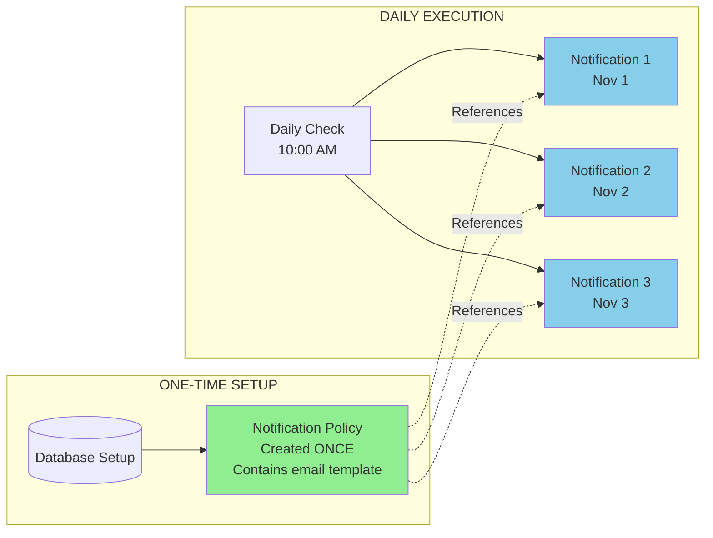
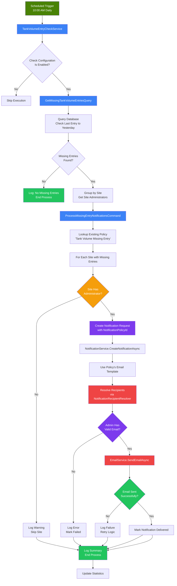
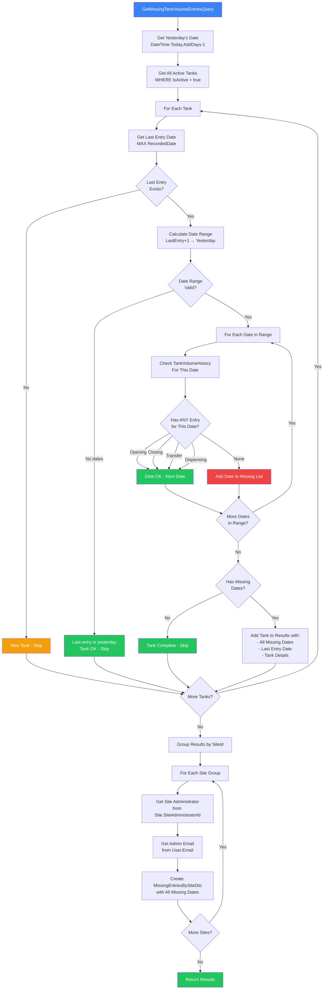
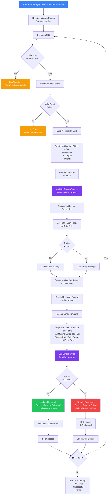
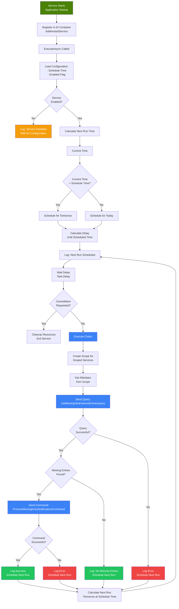
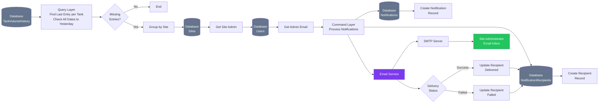
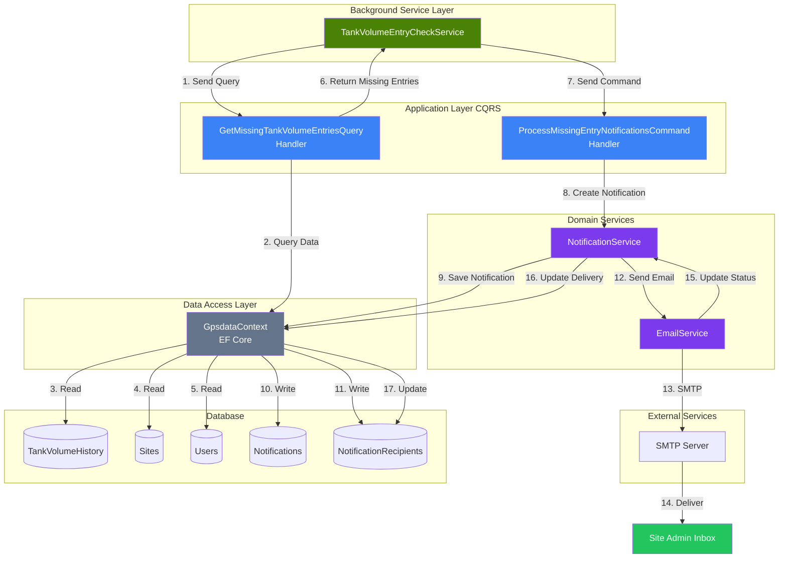
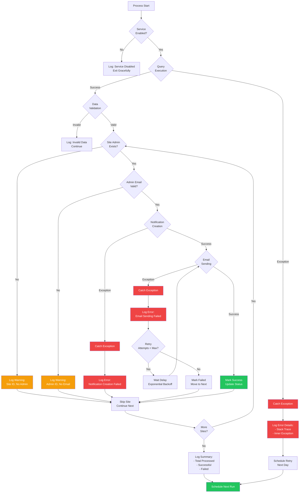

# Tank Volume Missing Entry Notification - Workflow Diagrams

## 🔑 Key Concept: Policy vs Notification

**Understanding**:
- ✅ **Policy** (green): Created ONCE, defines template & settings
- ✅ **Notifications** (blue): Created DAILY, each references the policy
- ✅ **NotificationPolicyId**: Links notification → policy

---

## System Flow Overview

## Detailed Query Logic Flow

## Notification Creation Flow

## Background Service Scheduling Flow

## Data Flow Diagram

## Component Interaction Diagram

## Error Handling Flow

## Color Legend

- 🟢 **Green**: Success states, completion
- 🔵 **Blue**: Processing, queries, commands
- 🟣 **Purple**: Notification/Email services
- ⚫ **Gray**: Database/Data access
- 🟡 **Yellow/Orange**: Warnings, skip conditions
- 🔴 **Red**: Errors, failures
- 🟩 **Dark Green**: Background service, entry points

---

**Note**: These diagrams use Mermaid syntax and can be rendered in:
- GitHub Markdown
- VS Code with Mermaid extension
- Documentation tools that support Mermaid
- Online viewers like mermaid.live
