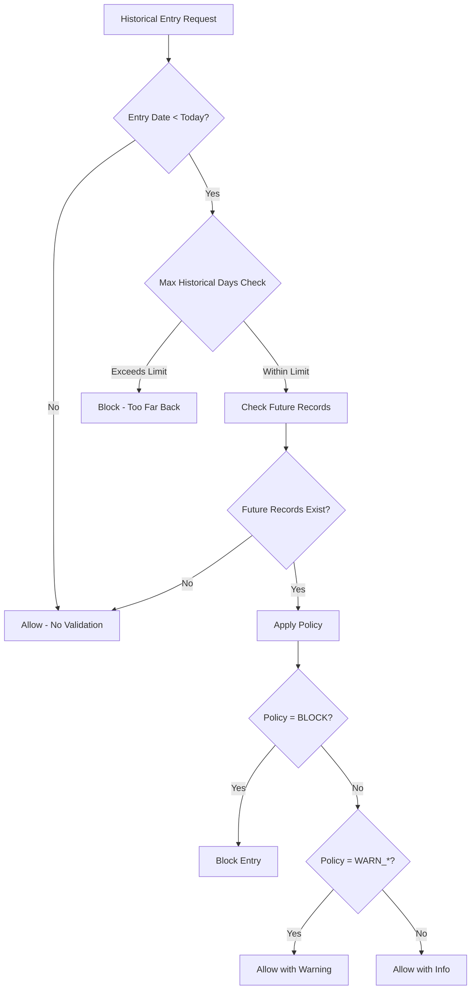

# Tank Stock Future Records Handling - Backend Implementation Guide

## Overview

This document describes the implementation of robust handling for "future records" when entering historical tank stock data in the FMS system. The solution uses a system configuration setting to determine whether to allow controlled recalculation or require reconciliation when future records exist.

## Problem Statement

### The "Future Records" Problem

When users enter historical tank stock data (opening/closing stock, manual refills, tank transfers) for past dates, it can disrupt the volume calculation chain if there are already newer records ("future records") in the ledger.

**Example Scenario:**
1. Tank has opening stock of 1000L on Jan 1st
2. Tank has deliveries and refills throughout January
3. User tries to enter a new opening stock of 1200L for Jan 1st
4. This affects all subsequent volume calculations for the entire month

## Solution Architecture

### System Configuration Approach

The system uses a configurable policy approach with the following settings:

#### Policy Options
- **BLOCK**: Completely prevent historical entries when future records exist
- **WARN_RECONCILE**: Allow with warning, recommend manual reconciliation
- **WARN_RECALCULATE**: Allow with warning, automatic recalculation will occur
- **ALLOW_RECALCULATE**: Allow without warning, automatic recalculation enabled

#### Configuration Keys
- `TankStock.FutureRecordsPolicy`: Main policy setting
- `TankStock.ShowDetailedWarnings`: Enable/disable detailed warning information
- `TankStock.MaxHistoricalDays`: Maximum days in past allowed for historical entries

## Backend Implementation Status: ✅ COMPLETE

### Implementation Overview

The Tank Stock Future Records Handling feature has been successfully implemented with the following components:

#### ✅ Completed Components

1. **Core Service**: `TankStockFutureRecordsService.cs` - Fully implemented
2. **API Endpoints**: Added to `TankStockController.cs` - 2 endpoints created
3. **Frontend Service**: `tankStockFutureRecordsService.js` - Updated with correct paths
4. **Dependency Injection**: Service registered in `Program.cs`
5. **Data Models**: All required models defined
6. **Database Schema**: SQL statements provided for configuration

#### 🔄 Pending Tasks

1. **Configuration Service Extensions**: Need to add methods to `ISystemConfigurationService`
2. **Command Integration**: Need to integrate validation into stock entry commands
3. **Database Setup**: Execute configuration SQL statements

### 1. Core Service Implementation ✅

#### TankStockFutureRecordsService
- **Location**: `FMS.Application/Services/TankStock/TankStockFutureRecordsService.cs`
- **Status**: ✅ Fully Implemented
- **Key Methods**:
  ```csharp
  // Core validation method
  public async Task<TankStockFutureRecordsValidationResult> ValidateHistoricalEntryAsync(
      int tankId, DateTime entryDate, VolumeChangeReasonEnum entryType,
      CancellationToken cancellationToken = default)

  // Policy retrieval method
  public async Task<FutureRecordsPolicyConfig> GetFutureRecordsPolicyAsync(
      CancellationToken cancellationToken = default)
  ```

### 2. API Implementation ✅

#### TankStockController Endpoints
- **Location**: `FMS.WebClient/Controllers/TankStockController.cs`
- **Status**: ✅ Fully Implemented

**Endpoints Added**:
```csharp
[HttpPost("validate-historical-entry")]
public async Task<IActionResult> ValidateHistoricalEntry([FromBody] HistoricalEntryValidationRequest request)

[HttpGet("future-records-policy")]
public async Task<IActionResult> GetFutureRecordsPolicy()
```

**Request Models**:
```csharp
public class HistoricalEntryValidationRequest
{
    public int TankId { get; set; }
    public DateTime EntryDate { get; set; }
    public VolumeChangeReasonEnum EntryType { get; set; }
}
```

### 3. Frontend Service ✅

#### Frontend Integration
- **Location**: `fms.frontend/src/services/tankStockFutureRecordsService.js`
- **Status**: ✅ Updated with correct API paths
- **Key Methods**:
  - `validateHistoricalEntry()` - Calls `/api/tankstock/validate-historical-entry`
  - `getFutureRecordsPolicy()` - Calls `/api/tankstock/future-records-policy`
  - `formatValidationResult()` - UI formatting helper

### 4. Configuration Service Extensions (🔄 Pending)

#### ISystemConfigurationService Interface
The following methods need to be added to the configuration service interface:

```csharp
#region Tank Stock Configuration
/// <summary>
/// Gets the policy for handling historical tank stock entries when future records exist
/// Values: "BLOCK", "WARN_RECONCILE", "WARN_RECALCULATE", "ALLOW_RECALCULATE"
/// </summary>
Task<string> GetTankStockFutureRecordsPolicyAsync(CancellationToken cancellationToken = default);

/// <summary>
/// Gets whether to show detailed warnings when future records exist
/// </summary>
Task<bool> GetTankStockShowDetailedWarningsAsync(CancellationToken cancellationToken = default);

/// <summary>
/// Gets the maximum number of days in the past allowed for historical entries
/// </summary>
Task<int> GetTankStockMaxHistoricalDaysAsync(CancellationToken cancellationToken = default);
#endregion
```

### 2. Future Records Validation Service

#### TankStockFutureRecordsService
```csharp
public class TankStockFutureRecordsService
{
    /// <summary>
    /// Validates if a historical tank stock entry can be processed based on future records policy
    /// </summary>
    public async Task<TankStockFutureRecordsValidationResult> ValidateHistoricalEntryAsync(
        int tankId,
        DateTime entryDate,
        VolumeChangeReasonEnum entryType,
        CancellationToken cancellationToken = default)
}
```

#### Validation Result Model
```csharp
public class TankStockFutureRecordsValidationResult
{
    public bool IsAllowed { get; set; }
    public bool RequiresUserConfirmation { get; set; }
    public string Policy { get; set; } = string.Empty;
    public string Message { get; set; } = string.Empty;
    public string WarningType { get; set; } = string.Empty;
    public string? DetailedWarning { get; set; }
    public int FutureRecordsCount { get; set; }
    public DateTime? EarliestFutureRecord { get; set; }
    public DateTime? LatestFutureRecord { get; set; }
}
```

### 3. Command Integration

All stock entry commands have been updated to include future records validation:

#### OpeningStockCommand
```csharp
// Validate historical entry against future records policy
if (entryDate.Date < DateTime.Now.Date)
{
    var futureRecordsValidation = await _futureRecordsService.ValidateHistoricalEntryAsync(
        request.TankId, entryDate, VolumeChangeReasonEnum.OpeningStock, cancellationToken);

    if (!futureRecordsValidation.IsAllowed)
    {
        return new FMSResponseMessage(false, futureRecordsValidation.Message);
    }

    // Log warning for future reference
    if (futureRecordsValidation.RequiresUserConfirmation)
    {
        _logger.LogWarning("Historical opening stock entry with future records: Tank {TankId}, Date {EntryDate}, Policy {Policy}, Future Records {Count}",
            request.TankId, entryDate, futureRecordsValidation.Policy, futureRecordsValidation.FutureRecordsCount);
    }
}
```

#### Similar integration in:
- `ClosingStockCommand`
- `CreateTankTransfer`
- `CreateFuelRefillCommand`
- `CreateDeliveryCommand`

### 4. Dependency Injection Registration

```csharp
// In Program.cs or Startup.cs
services.AddScoped<TankStockFutureRecordsService>();
```

## Configuration Management

### Default Values
```csharp
public const string DEFAULT_TANK_STOCK_FUTURE_RECORDS_POLICY = "WARN_RECONCILE";
public const bool DEFAULT_TANK_STOCK_SHOW_DETAILED_WARNINGS = true;
public const int DEFAULT_TANK_STOCK_MAX_HISTORICAL_DAYS = 30;
```

### Database Configuration
The settings can be managed through the `SystemConfiguration` table:

```sql
INSERT INTO SystemConfigurations (ConfigurationKey, ConfigurationValue, Description, DataType, Category)
VALUES
('TankStock.FutureRecordsPolicy', 'WARN_RECONCILE', 'Policy for handling historical entries with future records', 'String', 'TankStock'),
('TankStock.ShowDetailedWarnings', 'true', 'Show detailed warning information', 'Bool', 'TankStock'),
('TankStock.MaxHistoricalDays', '30', 'Maximum days in past for historical entries', 'Int', 'TankStock');
```

## Validation Logic Flow



## Error Handling

### Validation Errors
- **HISTORICAL_CUTOFF**: Entry date exceeds maximum historical days
- **BLOCKED**: Policy blocks the entry due to future records
- **ERROR**: System error during validation

### Logging
- **Information**: Successful validations
- **Warning**: Historical entries with future records that proceed
- **Error**: Validation failures and system errors

## Performance Considerations

### Caching
- Configuration values are cached for 5 minutes by default
- Future records queries are optimized with proper indexing

### Database Queries
```sql
-- Optimized query for future records check
SELECT COUNT(*), MIN(Timestamp), MAX(Timestamp)
FROM TankVolumeHistories
WHERE TankId = @tankId AND Timestamp > @entryDate
```

## Testing Guidelines

### Unit Tests
1. Test each policy option behavior
2. Test edge cases (same day, far past dates)
3. Test validation service with different entry types

### Integration Tests
1. Test command integration with validation service
2. Test configuration service integration
3. Test logging behavior

### Test Cases
```csharp
[Test]
public async Task ValidateHistoricalEntry_WithBlockPolicy_ShouldBlockEntry()
{
    // Arrange
    var tankId = 1;
    var entryDate = DateTime.Now.AddDays(-5);
    var entryType = VolumeChangeReasonEnum.OpeningStock;

    // Mock configuration to return BLOCK policy
    _configServiceMock.Setup(x => x.GetTankStockFutureRecordsPolicyAsync(It.IsAny<CancellationToken>()))
               .ReturnsAsync("BLOCK");

    // Mock future records exist
    _contextMock.Setup(/* future records query */).Returns(/* mock data */);

    // Act
    var result = await _service.ValidateHistoricalEntryAsync(tankId, entryDate, entryType);

    // Assert
    Assert.IsFalse(result.IsAllowed);
    Assert.AreEqual("BLOCKED", result.WarningType);
}
```

## Troubleshooting

### Common Issues

#### 1. Configuration Not Applied
**Symptoms**: Default policy always used
**Solution**: Check SystemConfiguration table, verify caching configuration

#### 2. Future Records Not Detected
**Symptoms**: Historical entries allowed when they shouldn't be
**Solution**: Verify TankVolumeHistory data integrity, check date comparisons

#### 3. Performance Issues
**Symptoms**: Slow validation responses
**Solution**: Review database indexes, check query execution plans

### Debug Logging
Enable debug logging for the validation service:
```json
{
  "Logging": {
    "LogLevel": {
      "FMS.Application.Services.TankStock.TankStockFutureRecordsService": "Debug"
    }
  }
}
```

## Security Considerations

### Authorization
- Ensure proper role-based access to configuration changes
- Log all policy changes with user information

### Audit Trail
- All validation decisions are logged
- Configuration changes are tracked in SystemConfiguration table

## Deployment Checklist

### ✅ Completed Items
- [x] Core service implementation (`TankStockFutureRecordsService`)
- [x] API endpoints added to controller
- [x] Frontend service updated with correct paths
- [x] Service registered in dependency injection
- [x] Data models defined
- [x] Documentation updated

### 🔄 Remaining Tasks

#### Database Setup
- [ ] Execute system configuration SQL statements:
```sql
INSERT IGNORE INTO `systemconfigurations`
(`ConfigurationKey`, `ConfigurationValue`, `Description`, `DataType`, `Category`, `IsActive`, `IsEditable`, `CreatedBy`, `DefaultValue`)
VALUES
('TankStock.FutureRecords.Policy', 'WARN_RECALCULATE', 'Policy for handling future records', 'String', 'TankStock', 1, 1, 'System', 'WARN_RECALCULATE'),
('TankStock.FutureRecords.AllowOverride', 'true', 'Allow users to override warnings', 'Boolean', 'TankStock', 1, 1, 'System', 'true'),
('TankStock.FutureRecords.MaxDaysBack', '90', 'Maximum days back to check for future records', 'Int', 'TankStock', 1, 1, 'System', '90'),
('TankStock.FutureRecords.ShowRecordDetails', 'true', 'Show detailed future record information', 'Boolean', 'TankStock', 1, 1, 'System', 'true');
```

#### Configuration Service Integration
- [ ] Add methods to `ISystemConfigurationService` interface
- [ ] Implement methods in `SystemConfigurationService` class

#### Command Integration (Optional)
- [ ] Integrate validation into `OpeningStockCommand`
- [ ] Integrate validation into `ClosingStockCommand`
- [ ] Integrate validation into `CreateFuelRefillCommand`
- [ ] Integrate validation into tank transfer commands

#### Testing
- [ ] Test API endpoints with Postman/Swagger
- [ ] Test frontend service integration
- [ ] Verify configuration retrieval
- [ ] Test validation logic with different policies

### Post-Deployment Verification
- [ ] Verify API endpoints respond correctly
- [ ] Test frontend future records service
- [ ] Confirm configuration values are retrieved
- [ ] Monitor logs for validation decisions

## Related Documentation
- [Tank Stock Operations Guide](../StockManagement/OpeningClosingStockLogic_Implementation.md)
- [System Configuration Architecture](../../../FMS%20System%20Configuration%20Architecture/system-configuration-guide.md)
- [Tank Volume History Management](../TankVolumeHistory/tank-volume-history-guide.md)
