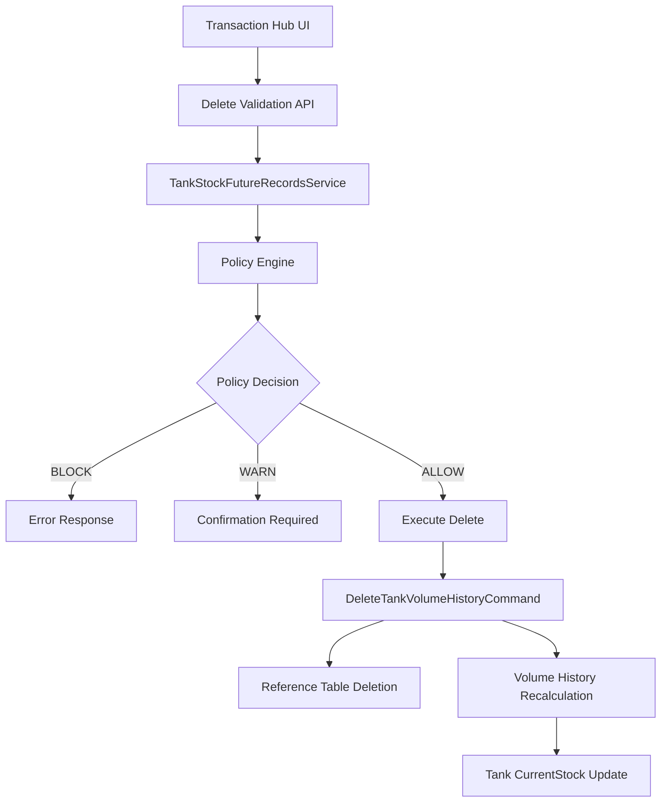

# Enhanced Delete Transaction Feature - Technical Specification

## Executive Summary

This document outlines the technical implementation for adding delete functionality to the Transaction Hub with full integration of the `TankStockFutureRecordsService` to ensure data integrity when deleting transactions that may affect future records and the tank's current stock.

## Architecture Overview

### Component Integration



## Enhanced Service Implementation

### 1. TankStockFutureRecordsService Enhancement

The existing `TankStockFutureRecordsService` needs to be enhanced to support deletion scenarios:

```csharp
public class TankStockFutureRecordsService
{
    // ... existing code ...

    /// <summary>
    /// Validates if a historical tank volume history entry can be deleted
    /// </summary>
    public async Task<TankStockFutureRecordsValidationResult> ValidateHistoricalEntryDeletionAsync(
        int tankVolumeHistoryId,
        CancellationToken cancellationToken = default)
    {
        try
        {
            // Get the volume history record to be deleted
            var recordToDelete = await _context.TankVolumeHistories
                .FirstOrDefaultAsync(h => h.Id == tankVolumeHistoryId, cancellationToken);

            if (recordToDelete == null)
            {
                return new TankStockFutureRecordsValidationResult
                {
                    IsAllowed = false,
                    Policy = "ERROR",
                    WarningType = "ERROR",
                    Message = "Tank volume history record not found"
                };
            }

            // Use existing validation logic with the record's details
            return await ValidateHistoricalEntryAsync(
                recordToDelete.TankId.Value,
                recordToDelete.Timestamp,
                recordToDelete.ChangeReason,
                cancellationToken);
        }
        catch (Exception ex)
        {
            _logger.LogError(ex, "Error validating historical entry deletion for ID {Id}", tankVolumeHistoryId);
            return new TankStockFutureRecordsValidationResult
            {
                IsAllowed = false,
                Policy = "ERROR",
                WarningType = "ERROR",
                Message = $"Validation error: {ex.Message}"
            };
        }
    }

    /// <summary>
    /// Calculates the impact of deleting a specific tank volume history record
    /// </summary>
    public async Task<DeleteImpactAnalysis> AnalyzeDeleteImpactAsync(
        int tankVolumeHistoryId,
        CancellationToken cancellationToken = default)
    {
        try
        {
            var recordToDelete = await _context.TankVolumeHistories
                .Include(h => h.Tank)
                .FirstOrDefaultAsync(h => h.Id == tankVolumeHistoryId, cancellationToken);

            if (recordToDelete == null)
            {
                return new DeleteImpactAnalysis { IsValid = false, ErrorMessage = "Record not found" };
            }

            // Get all future records that will be affected
            var futureRecords = await GetFutureRecordsAsync(
                recordToDelete.TankId.Value,
                recordToDelete.Timestamp,
                cancellationToken);

            // Calculate current stock impact
            var currentStockImpact = await CalculateCurrentStockImpact(
                recordToDelete,
                futureRecords,
                cancellationToken);

            return new DeleteImpactAnalysis
            {
                IsValid = true,
                RecordToDelete = recordToDelete,
                AffectedFutureRecords = futureRecords,
                CurrentStockBefore = recordToDelete.Tank.CurrentStock ?? 0,
                CurrentStockAfter = currentStockImpact,
                VolumeChangeImpact = recordToDelete.VolumeChange ?? 0,
                RequiresRecalculation = futureRecords.Any()
            };
        }
        catch (Exception ex)
        {
            _logger.LogError(ex, "Error analyzing delete impact for ID {Id}", tankVolumeHistoryId);
            return new DeleteImpactAnalysis
            {
                IsValid = false,
                ErrorMessage = $"Analysis error: {ex.Message}"
            };
        }
    }

    private async Task<decimal> CalculateCurrentStockImpact(
        TankVolumeHistory recordToDelete,
        List<TankVolumeHistory> futureRecords,
        CancellationToken cancellationToken)
    {
        // Get current stock
        var currentStock = recordToDelete.Tank.CurrentStock ?? 0;

        // The impact is removing the volume change of the deleted record
        var impactedStock = currentStock - (recordToDelete.VolumeChange ?? 0);

        return impactedStock;
    }
}

/// <summary>
/// Analysis result for delete impact
/// </summary>
public class DeleteImpactAnalysis
{
    public bool IsValid { get; set; }
    public string ErrorMessage { get; set; } = string.Empty;
    public TankVolumeHistory RecordToDelete { get; set; }
    public List<TankVolumeHistory> AffectedFutureRecords { get; set; } = new();
    public decimal CurrentStockBefore { get; set; }
    public decimal CurrentStockAfter { get; set; }
    public decimal VolumeChangeImpact { get; set; }
    public bool RequiresRecalculation { get; set; }

    public string GetImpactSummary()
    {
        if (!IsValid) return $"Error: {ErrorMessage}";

        var summary = $"Deleting this {RecordToDelete?.ChangeReason} transaction will:\n";
        summary += $"• Change tank stock from {CurrentStockBefore:N2}L to {CurrentStockAfter:N2}L\n";
        summary += $"• Impact: {Math.Abs(VolumeChangeImpact):N2}L {(VolumeChangeImpact >= 0 ? "increase" : "decrease")}\n";

        if (RequiresRecalculation)
        {
            summary += $"• Trigger recalculation of {AffectedFutureRecords.Count} future records\n";
        }

        return summary;
    }
}
```

### 2. Enhanced DeleteTankVolumeHistoryCommand

```csharp
public record DeleteTankVolumeHistoryCommand(
    int? Id = null,
    int? TankId = null,
    string ReferenceType = null,
    int? ReferenceId = null,
    DateTime? FromDate = null,
    DateTime? ToDate = null,
    bool UserConfirmed = false,
    string DeleteReason = null,
    string UserId = null) : IRequest<FMSResponseMessage>;

public class DeleteTankVolumeHistoryCommandHandler : IRequestHandler<DeleteTankVolumeHistoryCommand, FMSResponseMessage>
{
    private readonly GpsdataContext _context;
    private readonly ILogger<DeleteTankVolumeHistoryCommandHandler> _logger;
    private readonly IMediator _mediator;
    private readonly TankStockFutureRecordsService _futureRecordsService;

    public DeleteTankVolumeHistoryCommandHandler(
        GpsdataContext context,
        ILogger<DeleteTankVolumeHistoryCommandHandler> logger,
        IMediator mediator,
        TankStockFutureRecordsService futureRecordsService)
    {
        _context = context;
        _logger = logger;
        _mediator = mediator;
        _futureRecordsService = futureRecordsService;
    }

    public async Task<FMSResponseMessage> Handle(DeleteTankVolumeHistoryCommand request, CancellationToken cancellationToken)
    {
        try
        {
            // Step 1: Validate request
            var validationErrors = ValidateRequest(request);
            if (validationErrors.Any())
            {
                return new FMSResponseMessage(false, string.Join("; ", validationErrors));
            }

            // Step 2: Get records to delete
            var records = await GetRecordsToDelete(request, cancellationToken);
            if (!records.Any())
            {
                return new FMSResponseMessage(true, "No records found to delete");
            }

            // Step 3: Validate each deletion with future records policy
            var validationResults = new List<(TankVolumeHistory Record, TankStockFutureRecordsValidationResult Validation, DeleteImpactAnalysis Impact)>();

            foreach (var record in records)
            {
                var validation = await _futureRecordsService.ValidateHistoricalEntryDeletionAsync(
                    record.Id, cancellationToken);

                var impact = await _futureRecordsService.AnalyzeDeleteImpactAsync(
                    record.Id, cancellationToken);

                validationResults.Add((record, validation, impact));

                // Check if deletion is blocked
                if (!validation.IsAllowed)
                {
                    _logger.LogWarning("Delete blocked for record {RecordId}: {Message}",
                        record.Id, validation.Message);

                    return new FMSResponseMessage(false,
                        $"Delete blocked: {validation.Message}")
                    {
                        Data = new { ValidationResult = validation, Impact = impact }
                    };
                }
            }

            // Step 4: Check if user confirmation is required
            var requiresConfirmation = validationResults.Any(v => v.Validation.RequiresUserConfirmation);

            if (requiresConfirmation && !request.UserConfirmed)
            {
                var confirmationData = validationResults
                    .Where(v => v.Validation.RequiresUserConfirmation)
                    .Select(v => new
                    {
                        Record = v.Record,
                        Validation = v.Validation,
                        Impact = v.Impact,
                        ImpactSummary = v.Impact.GetImpactSummary()
                    })
                    .ToList();

                _logger.LogInformation("Delete requires user confirmation for {Count} records",
                    confirmationData.Count);

                return new FMSResponseMessage(false, "User confirmation required")
                {
                    Data = confirmationData,
                    MessageType = "CONFIRMATION_REQUIRED"
                };
            }

            // Step 5: Execute the deletion
            var deleteResult = await ExecuteDelete(validationResults, request, cancellationToken);

            return deleteResult;
        }
        catch (Exception ex)
        {
            _logger.LogError(ex, "Error deleting tank volume history records");
            return new FMSResponseMessage(false, $"Error deleting records: {ex.Message}");
        }
    }

    private async Task<FMSResponseMessage> ExecuteDelete(
        List<(TankVolumeHistory Record, TankStockFutureRecordsValidationResult Validation, DeleteImpactAnalysis Impact)> validationResults,
        DeleteTankVolumeHistoryCommand request,
        CancellationToken cancellationToken)
    {
        var transaction = await _context.Database.BeginTransactionAsync(cancellationToken);
        var deletedRecords = new List<TankVolumeHistory>();
        var affectedTankIds = new HashSet<int>();

        try
        {
            foreach (var (record, validation, impact) in validationResults)
            {
                // Log the deletion attempt
                _logger.LogInformation(
                    "Deleting tank volume history record {RecordId} for tank {TankId} at {Timestamp}. " +
                    "Volume change: {VolumeChange}, Change reason: {ChangeReason}, Impact: {Impact}",
                    record.Id, record.TankId, record.Timestamp, record.VolumeChange,
                    record.ChangeReason, impact.GetImpactSummary());

                // Delete from reference tables first
                var referenceDeleteResult = await DeleteReferenceRecord(record, cancellationToken);
                if (!referenceDeleteResult.Success)
                {
                    _logger.LogWarning("Failed to delete reference record for {RecordId}: {Message}",
                        record.Id, referenceDeleteResult.Message);
                    // Continue with volume history deletion even if reference deletion fails
                }

                // Delete from volume history
                _context.TankVolumeHistories.Remove(record);
                deletedRecords.Add(record);

                if (record.TankId.HasValue)
                {
                    affectedTankIds.Add(record.TankId.Value);
                }

                // Create audit log entry
                await CreateAuditLogEntry(record, request, impact, cancellationToken);
            }

            // Save changes
            await _context.SaveChangesAsync(cancellationToken);

            // Recalculate volume history for affected tanks
            var recalculationResults = new List<string>();
            var earliestTimestamp = deletedRecords.Min(r => r.Timestamp);

            foreach (var tankId in affectedTankIds)
            {
                var updateResult = await _mediator.Send(
                    new UpdateTankVolumeHistoryCommand(tankId, earliestTimestamp, true, true),
                    cancellationToken);

                if (updateResult.Success)
                {
                    recalculationResults.Add($"Tank {tankId}: {updateResult.Message}");
                    _logger.LogInformation("Successfully recalculated volume history for tank {TankId}", tankId);
                }
                else
                {
                    recalculationResults.Add($"Tank {tankId}: FAILED - {updateResult.Message}");
                    _logger.LogWarning("Failed to recalculate volume history for tank {TankId}: {Message}",
                        tankId, updateResult.Message);
                }
            }

            await transaction.CommitAsync(cancellationToken);

            var successMessage = $"Successfully deleted {deletedRecords.Count} tank volume history records. " +
                                 $"Affected tanks: {string.Join(", ", affectedTankIds)}";

            return new FMSResponseMessage(true, successMessage)
            {
                Data = new
                {
                    DeletedRecords = deletedRecords.Count,
                    AffectedTanks = affectedTankIds.Count,
                    RecalculationResults = recalculationResults
                }
            };
        }
        catch (Exception ex)
        {
            await transaction.RollbackAsync(cancellationToken);
            _logger.LogError(ex, "Error executing delete operation");
            throw;
        }
    }

    private async Task<FMSResponseMessage> DeleteReferenceRecord(
        TankVolumeHistory volumeRecord,
        CancellationToken cancellationToken)
    {
        if (!volumeRecord.ReferenceId.HasValue)
        {
            return new FMSResponseMessage(true, "No reference record to delete");
        }

        try
        {
            switch (volumeRecord.ChangeReason)
            {
                case VolumeChangeReasonEnum.OpeningStock:
                case VolumeChangeReasonEnum.ClosingStock:
                    return await _mediator.Send(
                        new DeleteTankStockCommand(volumeRecord.ReferenceId.Value),
                        cancellationToken);

                case VolumeChangeReasonEnum.TransferIn:
                case VolumeChangeReasonEnum.TransferOut:
                    return await _mediator.Send(
                        new DeleteTankTransferCommand(volumeRecord.ReferenceId.Value),
                        cancellationToken);

                case VolumeChangeReasonEnum.Adjustment:
                    // For adjustments, we create a reverse adjustment
                    return await CreateReverseAdjustment(volumeRecord, cancellationToken);

                case VolumeChangeReasonEnum.Delivery:
                    // Handle delivery deletion if needed
                    _logger.LogInformation("Delivery reference deletion not implemented for record {RecordId}",
                        volumeRecord.Id);
                    return new FMSResponseMessage(true, "Delivery reference deletion skipped");

                default:
                    _logger.LogInformation("No reference deletion logic for {ChangeReason} in record {RecordId}",
                        volumeRecord.ChangeReason, volumeRecord.Id);
                    return new FMSResponseMessage(true, "No reference record deletion required");
            }
        }
        catch (Exception ex)
        {
            _logger.LogError(ex, "Error deleting reference record for volume history {RecordId}", volumeRecord.Id);
            return new FMSResponseMessage(false, $"Error deleting reference record: {ex.Message}");
        }
    }

    private async Task<FMSResponseMessage> CreateReverseAdjustment(
        TankVolumeHistory originalRecord,
        CancellationToken cancellationToken)
    {
        // Create a reverse adjustment to undo the original adjustment
        var reverseAdjustment = new CreateStockAdjustmentCommand(
            TankId: originalRecord.TankId.Value,
            AdjustmentVolume: -(originalRecord.VolumeChange ?? 0), // Reverse the change
            Reason: $"Reverse adjustment for deleted record {originalRecord.Id}",
            RecordedBy: originalRecord.RecordedBy ?? "System"
        );

        return await _mediator.Send(reverseAdjustment, cancellationToken);
    }

    private async Task CreateAuditLogEntry(
        TankVolumeHistory record,
        DeleteTankVolumeHistoryCommand request,
        DeleteImpactAnalysis impact,
        CancellationToken cancellationToken)
    {
        // Create audit log for the deletion
        var auditEntry = new AuditLog
        {
            Action = "DELETE_TANK_VOLUME_HISTORY",
            TableName = "TankVolumeHistory",
            RecordId = record.Id.ToString(),
            UserId = request.UserId,
            Timestamp = DateTime.UtcNow,
            Details = System.Text.Json.JsonSerializer.Serialize(new
            {
                DeletedRecord = new
                {
                    record.Id,
                    record.TankId,
                    record.Timestamp,
                    record.VolumeChange,
                    record.NewVolume,
                    record.ChangeReason,
                    record.ReferenceId,
                    record.ReferenceType
                },
                Impact = new
                {
                    impact.CurrentStockBefore,
                    impact.CurrentStockAfter,
                    impact.VolumeChangeImpact,
                    impact.RequiresRecalculation,
                    AffectedRecordsCount = impact.AffectedFutureRecords.Count
                },
                DeleteReason = request.DeleteReason
            })
        };

        _context.AuditLogs.Add(auditEntry);
    }

    // ... other helper methods ...
}
```

## API Implementation

### 1. Delete Validation Endpoint

```csharp
[HttpPost("validate-delete/{id}")]
public async Task<ActionResult<object>> ValidateDelete(int id)
{
    try
    {
        var validation = await _futureRecordsService.ValidateHistoricalEntryDeletionAsync(id);
        var impact = await _futureRecordsService.AnalyzeDeleteImpactAsync(id);

        return Ok(new
        {
            Validation = validation,
            Impact = impact,
            ImpactSummary = impact.GetImpactSummary()
        });
    }
    catch (Exception ex)
    {
        _logger.LogError(ex, "Error validating delete for record {Id}", id);
        return StatusCode(500, new { Message = "Error validating deletion", Error = ex.Message });
    }
}
```

### 2. Execute Delete Endpoint

```csharp
[HttpDelete("{id}")]
public async Task<ActionResult<FMSResponseMessage>> DeleteTransaction(
    int id,
    [FromBody] DeleteTransactionRequest request = null)
{
    try
    {
        var command = new DeleteTankVolumeHistoryCommand(
            Id: id,
            UserConfirmed: request?.UserConfirmed ?? false,
            DeleteReason: request?.Reason,
            UserId: User.Identity.Name);

        var result = await _mediator.Send(command);

        if (result.Success)
        {
            return Ok(result);
        }
        else if (result.MessageType == "CONFIRMATION_REQUIRED")
        {
            return StatusCode(409, result); // Conflict - requires confirmation
        }
        else
        {
            return BadRequest(result);
        }
    }
    catch (Exception ex)
    {
        _logger.LogError(ex, "Error deleting transaction {Id}", id);
        return StatusCode(500, new FMSResponseMessage(false, $"Server error: {ex.Message}"));
    }
}

public class DeleteTransactionRequest
{
    public bool UserConfirmed { get; set; }
    public string Reason { get; set; }
}
```

## Frontend Implementation

### 1. Enhanced TransactionHub with Delete Functionality

```javascript
// Add to TransactionHub.js state management
const [deleteDialog, setDeleteDialog] = useState({
  visible: false,
  transaction: null,
  validation: null,
  impact: null,
  loading: false
});

// Delete transaction handler
const handleDeleteTransaction = async (transaction) => {
  setDeleteDialog({ ...deleteDialog, loading: true });

  try {
    // Step 1: Validate the deletion
    const validationResponse = await fetch(`/api/tank-volume-history/validate-delete/${transaction.id}`, {
      method: 'POST',
      headers: {
        'Content-Type': 'application/json',
        'Authorization': `Bearer ${authToken}`
      }
    });

    if (!validationResponse.ok) {
      throw new Error('Validation request failed');
    }

    const validationData = await validationResponse.json();

    // Step 2: Show confirmation dialog
    setDeleteDialog({
      visible: true,
      transaction,
      validation: validationData.validation,
      impact: validationData.impact,
      impactSummary: validationData.impactSummary,
      loading: false
    });

  } catch (error) {
    console.error('Error validating deletion:', error);
    notify({
      message: 'Error validating deletion. Please try again.',
      type: 'error'
    });
    setDeleteDialog({ ...deleteDialog, loading: false });
  }
};

// Execute deletion after confirmation
const executeDelete = async (reason = '') => {
  try {
    const response = await fetch(`/api/tank-volume-history/${deleteDialog.transaction.id}`, {
      method: 'DELETE',
      headers: {
        'Content-Type': 'application/json',
        'Authorization': `Bearer ${authToken}`
      },
      body: JSON.stringify({
        userConfirmed: true,
        reason: reason
      })
    });

    const result = await response.json();

    if (response.ok && result.success) {
      notify({
        message: 'Transaction deleted successfully',
        type: 'success'
      });

      // Refresh the data
      await handleRefresh();

      // Close dialog
      setDeleteDialog({ visible: false, transaction: null, validation: null, impact: null, loading: false });

    } else if (response.status === 409) {
      // Still requires confirmation - show enhanced dialog
      notify({
        message: 'Additional confirmation required',
        type: 'warning'
      });

    } else {
      throw new Error(result.message || 'Delete operation failed');
    }

  } catch (error) {
    console.error('Error deleting transaction:', error);
    notify({
      message: `Error deleting transaction: ${error.message}`,
      type: 'error'
    });
  }
};
```

### 2. Delete Confirmation Dialog Component

```javascript
const DeleteConfirmationDialog = ({
  visible,
  transaction,
  validation,
  impact,
  impactSummary,
  onConfirm,
  onCancel
}) => {
  const [deleteReason, setDeleteReason] = useState('');
  const [confirmationChecked, setConfirmationChecked] = useState(false);

  const handleConfirm = () => {
    if (validation?.requiresUserConfirmation && !confirmationChecked) {
      notify({
        message: 'Please confirm that you understand the impact of this deletion',
        type: 'warning'
      });
      return;
    }
    onConfirm(deleteReason);
  };

  return (
    <Popup
      visible={visible}
      onHiding={onCancel}
      showTitle={true}
      title="Delete Transaction - Confirmation Required"
      width={600}
      height={500}
      showCloseButton={true}
    >
      <div className="tw-p-4">
        {/* Transaction Details */}
        <div className="tw-mb-4 tw-p-4 tw-bg-gray-50 tw-rounded-lg">
          <h4 className="tw-font-semibold tw-mb-2">Transaction to Delete:</h4>
          <div className="tw-text-sm tw-space-y-1">
            <div>Type: {VolumeChangeReasonEnum.find(r => r.id === transaction?.changeReason)?.name}</div>
            <div>Date: {new Date(transaction?.timestamp).toLocaleString()}</div>
            <div>Volume Change: {transaction?.volumeChange?.toFixed(2)}L</div>
            <div>Tank: {transaction?.tankName}</div>
          </div>
        </div>

        {/* Policy Warning */}
        {validation && (
          <div className={`tw-mb-4 tw-p-4 tw-rounded-lg ${
            validation.warningType === 'BLOCKED'
              ? 'tw-bg-red-50 tw-border tw-border-red-200'
              : 'tw-bg-yellow-50 tw-border tw-border-yellow-200'
          }`}>
            <div className="tw-flex tw-items-start">
              <i className={`tw-mr-2 tw-mt-1 ${
                validation.warningType === 'BLOCKED'
                  ? 'fa-light fa-exclamation-triangle tw-text-red-600'
                  : 'fa-light fa-warning tw-text-yellow-600'
              }`}></i>
              <div>
                <div className="tw-font-semibold tw-text-sm">
                  {validation.warningType === 'BLOCKED' ? 'Delete Blocked' : 'Warning'}
                </div>
                <div className="tw-text-sm tw-mt-1">{validation.message}</div>
              </div>
            </div>
          </div>
        )}

        {/* Impact Analysis */}
        {impact && (
          <div className="tw-mb-4 tw-p-4 tw-bg-blue-50 tw-border tw-border-blue-200 tw-rounded-lg">
            <h4 className="tw-font-semibold tw-mb-2 tw-text-blue-800">Impact Analysis:</h4>
            <pre className="tw-text-xs tw-text-blue-700 tw-whitespace-pre-wrap">
              {impactSummary}
            </pre>
          </div>
        )}

        {/* Delete Reason */}
        <div className="tw-mb-4">
          <label className="tw-block tw-text-sm tw-font-medium tw-mb-2">
            Reason for Deletion (Optional):
          </label>
          <TextArea
            value={deleteReason}
            onValueChanged={(e) => setDeleteReason(e.value)}
            placeholder="Enter reason for deleting this transaction..."
            height={80}
          />
        </div>

        {/* Confirmation Checkbox */}
        {validation?.requiresUserConfirmation && (
          <div className="tw-mb-4">
            <CheckBox
              value={confirmationChecked}
              onValueChanged={(e) => setConfirmationChecked(e.value)}
              text="I understand the impact and want to proceed with the deletion"
            />
          </div>
        )}

        {/* Action Buttons */}
        <div className="tw-flex tw-justify-end tw-space-x-2">
          <Button
            text="Cancel"
            onClick={onCancel}
            stylingMode="outlined"
          />
          <Button
            text="Delete Transaction"
            type="danger"
            onClick={handleConfirm}
            disabled={validation?.warningType === 'BLOCKED'}
          />
        </div>
      </div>
    </Popup>
  );
};
```

### 3. Enhanced Delete Action Options

#### Option A: Meatball Action Button (Recommended)
```javascript
<Column
  type="buttons"
  width={90}
  caption="Actions"
  cellRender={(cellData) => (
    <div className="tw-flex tw-justify-center">
      <DropDownButton
        text=""
        icon="fa-light fa-ellipsis-vertical"
        stylingMode="text"
        className="tw-text-gray-600"
        showArrowIcon={false}
        items={[
          {
            text: 'Delete Transaction',
            icon: 'fa-light fa-trash',
            onClick: () => handleDeleteTransaction(cellData.data),
            className: 'tw-text-red-600'
          },
          {
            text: 'View Details',
            icon: 'fa-light fa-eye',
            onClick: () => handleViewDetails(cellData.data)
          },
          {
            text: 'Edit Transaction',
            icon: 'fa-light fa-edit',
            onClick: () => handleEditTransaction(cellData.data),
            disabled: !canEdit(cellData.data)
          }
        ]}
        onItemClick={(e) => {
          if (e.itemData.onClick) {
            e.itemData.onClick();
          }
        }}
      />
    </div>
  )}
/>
```

#### Option B: Direct Delete Action Column
```javascript
<Column
  type="buttons"
  width={70}
  caption=""
  cellRender={(cellData) => (
    <div className="tw-flex tw-justify-center">
      <Button
        icon="fa-light fa-trash"
        stylingMode="text"
        onClick={() => handleDeleteTransaction(cellData.data)}
        className="tw-text-red-600 hover:tw-text-red-800"
        hint="Delete Transaction"
        disabled={isLoading}
      />
    </div>
  )}
/>
```

### 4. Enhanced Delete Confirmation Dialog with Affected Tanks

```javascript
const DeleteConfirmationDialog = ({
  visible,
  transaction,
  validation,
  impact,
  impactSummary,
  onConfirm,
  onCancel
}) => {
  const [deleteReason, setDeleteReason] = useState('');
  const [confirmationChecked, setConfirmationChecked] = useState(false);
  const [showAllAffectedTanks, setShowAllAffectedTanks] = useState(false);

  // Enhanced: Filter affected tanks list based on show all state
  const displayedTanks = impact?.affectedTanks && impact.affectedTanks.length > 3 && !showAllAffectedTanks
    ? impact.affectedTanks.slice(0, 3)
    : impact?.affectedTanks || [];

  return (
    <Popup
      visible={visible}
      onHiding={onCancel}
      showTitle={true}
      title="Delete Transaction - Confirmation Required"
      width={700}
      height="auto"
      maxHeight="90vh"
      showCloseButton={true}
    >
      <div className="tw-p-4">
        {/* Transaction Details */}
        <div className="tw-mb-4 tw-p-4 tw-bg-gray-50 tw-rounded-lg">
          <h4 className="tw-font-semibold tw-mb-2">Transaction to Delete:</h4>
          <div className="tw-text-sm tw-space-y-1">
            <div>Type: {VolumeChangeReasonEnum.find(r => r.id === transaction?.changeReason)?.name}</div>
            <div>Date: {new Date(transaction?.timestamp).toLocaleString()}</div>
            <div>Volume Change: {transaction?.volumeChange?.toFixed(2)}L</div>
            <div>Tank: {transaction?.tankName}</div>
          </div>
        </div>

        {/* Enhanced: Affected Tanks List with Final Stock Calculations */}
        {impact?.affectedTanks && impact.affectedTanks.length > 0 && (
          <div className="tw-mb-4 tw-p-4 tw-bg-orange-50 tw-border tw-border-orange-200 tw-rounded-lg">
            <h4 className="tw-font-semibold tw-mb-3 tw-text-orange-800 tw-flex tw-items-center">
              <i className="fa-light fa-gas-pump tw-mr-2"></i>
              Affected Tanks ({impact.affectedTanks.length}) - Final Stock Calculation
            </h4>
            <div className="tw-space-y-2">
              {displayedTanks.map((tank, index) => (
                <div key={index} className="tw-flex tw-justify-between tw-items-center tw-p-3 tw-bg-white tw-rounded tw-border tw-shadow-sm">
                  <div className="tw-flex tw-items-center">
                    <i className="fa-light fa-oil-can tw-text-orange-600 tw-mr-3"></i>
                    <div>
                      <div className="tw-font-medium tw-text-gray-800">{tank.tankName}</div>
                      <div className="tw-text-xs tw-text-gray-500">
                        {tank.affectedRecordsCount} records to recalculate
                      </div>
                    </div>
                  </div>
                  <div className="tw-text-right">
                    <div className="tw-flex tw-items-center tw-space-x-3">
                      <div className="tw-text-center">
                        <div className="tw-text-xs tw-text-gray-500">Current</div>
                        <div className="tw-text-sm tw-font-medium">{tank.currentStock.toFixed(2)}L</div>
                      </div>
                      <i className="fa-light fa-arrow-right tw-text-gray-400"></i>
                      <div className="tw-text-center">
                        <div className="tw-text-xs tw-text-gray-500">Final</div>
                        <div className={`tw-text-sm tw-font-semibold ${
                          tank.finalStock > tank.currentStock
                            ? 'tw-text-green-600'
                            : tank.finalStock < tank.currentStock
                            ? 'tw-text-red-600'
                            : 'tw-text-gray-600'
                        }`}>
                          {tank.finalStock.toFixed(2)}L
                        </div>
                      </div>
                    </div>
                    <div className={`tw-text-xs tw-mt-1 tw-text-center ${
                      tank.stockChange > 0
                        ? 'tw-text-green-600'
                        : tank.stockChange < 0
                        ? 'tw-text-red-600'
                        : 'tw-text-gray-500'
                    }`}>
                      {tank.stockChange > 0 ? '+' : ''}{tank.stockChange.toFixed(2)}L change
                    </div>
                  </div>
                </div>
              ))}
            </div>

            {/* Show More/Less Button for many tanks */}
            {impact.affectedTanks.length > 3 && (
              <div className="tw-mt-3 tw-text-center">
                <Button
                  text={showAllAffectedTanks ? 'Show Less' : `Show All ${impact.affectedTanks.length} Tanks`}
                  stylingMode="text"
                  className="tw-text-orange-600 tw-text-sm"
                  onClick={() => setShowAllAffectedTanks(!showAllAffectedTanks)}
                />
              </div>
            )}
          </div>
        )}

        {/* Policy Warning */}
        {validation && (
          <div className={`tw-mb-4 tw-p-4 tw-rounded-lg ${
            validation.warningType === 'BLOCKED'
              ? 'tw-bg-red-50 tw-border tw-border-red-200'
              : 'tw-bg-yellow-50 tw-border tw-border-yellow-200'
          }`}>
            <div className="tw-flex tw-items-start">
              <i className={`tw-mr-2 tw-mt-1 ${
                validation.warningType === 'BLOCKED'
                  ? 'fa-light fa-times-circle tw-text-red-600'
                  : 'fa-light fa-warning tw-text-yellow-600'
              }`}></i>
              <div>
                <div className="tw-font-semibold tw-text-sm">
                  {validation.warningType === 'BLOCKED' ? 'Delete Blocked' : 'Warning'}
                </div>
                <div className="tw-text-sm tw-mt-1">{validation.message}</div>
              </div>
            </div>
          </div>
        )}

        {/* Impact Analysis Summary */}
        {impactSummary && (
          <div className="tw-mb-4 tw-p-4 tw-bg-blue-50 tw-border tw-border-blue-200 tw-rounded-lg">
            <h4 className="tw-font-semibold tw-mb-2 tw-text-blue-800">Impact Summary:</h4>
            <pre className="tw-text-xs tw-text-blue-700 tw-whitespace-pre-wrap tw-font-mono">
              {impactSummary}
            </pre>
          </div>
        )}

        {/* Delete Reason */}
        <div className="tw-mb-4">
          <label className="tw-block tw-text-sm tw-font-medium tw-mb-2">
            Reason for Deletion (Optional):
          </label>
          <TextArea
            value={deleteReason}
            onValueChanged={(e) => setDeleteReason(e.value)}
            placeholder="Enter reason for deleting this transaction..."
            height={80}
          />
        </div>

        {/* Confirmation Checkbox */}
        {validation?.requiresUserConfirmation && (
          <div className="tw-mb-4">
            <CheckBox
              value={confirmationChecked}
              onValueChanged={(e) => setConfirmationChecked(e.value)}
              text="I understand the impact and want to proceed with the deletion"
            />
          </div>
        )}

        {/* Action Buttons */}
        <div className="tw-flex tw-justify-end tw-space-x-2">
          <Button
            text="Cancel"
            onClick={onCancel}
            stylingMode="outlined"
          />
          <Button
            text="Delete Transaction"
            type="danger"
            onClick={() => onConfirm(deleteReason)}
            disabled={validation?.warningType === 'BLOCKED' || (validation?.requiresUserConfirmation && !confirmationChecked)}
          />
        </div>
      </div>
    </Popup>
  );
};
```

```javascript
<Column
  type="buttons"
  width={80}
  caption="Actions"
  cellRender={(cellData) => (
    <div className="tw-flex tw-justify-center">
      <Button
        icon="fa-light fa-trash"
        stylingMode="text"
        onClick={() => handleDeleteTransaction(cellData.data)}
        className="tw-text-red-600 hover:tw-text-red-800"
        hint="Delete Transaction"
        disabled={isLoading}
      />
    </div>
  )}
/>
```

## Testing Strategy

### Unit Tests

1. **TankStockFutureRecordsService Tests**
   - Validation logic for different policies
   - Impact analysis calculations
   - Edge cases (no future records, multiple tanks, etc.)

2. **DeleteTankVolumeHistoryCommand Tests**
   - Single record deletion
   - Batch deletion
   - Policy enforcement
   - Reference table cascading
   - Transaction rollback scenarios

### Integration Tests

1. **End-to-End Delete Workflow**
   - Frontend to backend integration
   - Database transaction integrity
   - Audit logging verification

2. **Policy Enforcement Tests**
   - BLOCK policy prevents deletion
   - WARN policies require confirmation
   - ALLOW policies execute without confirmation

### Performance Tests

1. **Large Dataset Deletion**
   - Multiple records with many future dependencies
   - Recalculation performance for large tanks
   - Database transaction timeout handling

## Security & Audit

### Permissions Required
- `DELETE_TRANSACTIONS` - Basic delete permission
- `DELETE_HISTORICAL_TRANSACTIONS` - Delete past transactions
- `OVERRIDE_FUTURE_RECORDS_POLICY` - Override policy restrictions

### Audit Trail
Every deletion is logged with:
- User ID and timestamp
- Complete transaction details
- Impact analysis results
- Business justification
- System policy applied

## Deployment Considerations

### Database Changes
- Add audit log table if not exists
- Add indexes for performance
- Update stored procedures if needed

### Configuration Updates
- Future records policy settings
- User permission mappings
- Audit retention policies

### Migration Strategy
1. Deploy backend changes first
2. Update database schema
3. Deploy frontend changes
4. Update user permissions
5. Train users on new functionality

This technical specification provides a comprehensive approach to implementing the delete functionality while maintaining data integrity through the TankStockFutureRecordsService integration.
