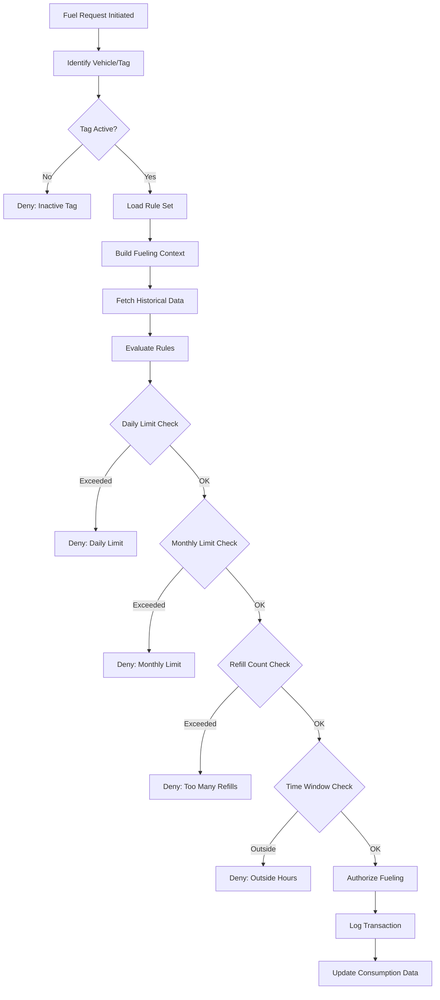

# Fuel Rule Management System Documentation

## Table of Contents
1. [System Overview](#system-overview)
2. [Architecture](#architecture)
3. [Core Entities](#core-entities)
4. [Rule Types](#rule-types)
5. [Real-World Examples](#real-world-examples)
6. [API Reference](#api-reference)
7. [Business Logic Flow](#business-logic-flow)
8. [Configuration Examples](#configuration-examples)
9. [Troubleshooting](#troubleshooting)

---

## System Overview

The Fuel Rule Management System (FMS) is a comprehensive solution for managing and enforcing fuel dispensing rules across a fleet of vehicles. It provides granular control over fuel consumption through configurable rule sets that can be applied to vehicles or fuel tags.

### Key Features
- **Rule-based Authorization**: Define multiple types of rules for fuel dispensing
- **Flexible Assignment**: Apply rules to individual vehicles or fuel tags
- **Real-time Validation**: Evaluate rules during fuel dispensing operations
- **Audit Trail**: Track fuel consumption and rule violations
- **Multi-tenant Support**: Manage rules across different sites

### Use Cases
- Fleet management companies controlling fuel costs
- Government organizations monitoring vehicle fuel usage
- Logistics companies preventing fuel theft
- Construction companies managing equipment fuel consumption

---

## Architecture

### System Components

```
┌─────────────────────────────────────────────────────────────┐
│                        Frontend (React)                      │
│  ┌─────────────┐ ┌──────────────┐ ┌───────────────────┐   │
│  │   Rule Set  │ │     Rule     │ │       Tag         │   │
│  │ Management  │ │   Creation   │ │   Assignment      │   │
│  └─────────────┘ └──────────────┘ └───────────────────┘   │
└─────────────────────────┬───────────────────────────────────┘
                          │ REST API
┌─────────────────────────▼───────────────────────────────────┐
│                   Backend (ASP.NET Core)                     │
│  ┌─────────────────────────────────────────────────────┐   │
│  │              Application Layer (CQRS)                │   │
│  │  ┌──────────────────┐  ┌──────────────────┐        │   │
│  │  │    Commands      │  │     Queries      │        │   │
│  │  └──────────────────┘  └──────────────────┘        │   │
│  └─────────────────────────────────────────────────────┘   │
│  ┌─────────────────────────────────────────────────────┐   │
│  │                  Domain Layer                        │   │
│  │  ┌────────────┐ ┌────────────┐ ┌────────────┐     │   │
│  │  │   Rules    │ │  RuleSet   │ │  Context   │     │   │
│  │  └────────────┘ └────────────┘ └────────────┘     │   │
│  └─────────────────────────────────────────────────────┘   │
│  ┌─────────────────────────────────────────────────────┐   │
│  │            Persistence Layer (EF Core)               │   │
│  └─────────────────────────────────────────────────────┘   │
└─────────────────────────┬───────────────────────────────────┘
                          │
                     ┌────▼────┐
                     │ Database │
                     └─────────┘
```

### Database Schema

```sql
-- Rule Sets Table
CREATE TABLE FuelingRuleSets (
    Id INT PRIMARY KEY AUTO_INCREMENT,
    Name VARCHAR(100) NOT NULL,
    Description VARCHAR(255),
    CreatedAt DATETIME,
    UpdatedAt DATETIME
);

-- Rules Table (TPH - Table Per Hierarchy)
CREATE TABLE FuelingRules (
    Id INT PRIMARY KEY AUTO_INCREMENT,
    Discriminator VARCHAR(50) NOT NULL, -- 'DailyMonthlyLimitRule', 'NoOfRefillRule', 'TimeWindowRule'
    RuleName VARCHAR(100),
    IsActive BOOLEAN DEFAULT TRUE,
    CreatedAt DATETIME,
    UpdatedAt DATETIME,

    -- Foreign Keys
    FuelingRuleSetId INT NOT NULL,
    VehicleId INT NULL,
    SiteId INT NULL,

    -- DailyMonthlyLimitRule Properties
    DailyLimitLiter INT NULL,
    MonthlyLimitLiter INT NULL,

    -- NoOfRefillRule Properties
    MaxRefillsPerDay INT NULL,
    MaxRefillsPerWeek INT NULL,
    MaxRefillsPerMonth INT NULL,

    -- TimeWindowRule Properties
    StartTime TIME NULL,
    EndTime TIME NULL,

    FOREIGN KEY (FuelingRuleSetId) REFERENCES FuelingRuleSets(Id),
    FOREIGN KEY (VehicleId) REFERENCES Vehicles(VehicleId),
    FOREIGN KEY (SiteId) REFERENCES Sites(SiteId)
);

-- Fuel Tags Table
CREATE TABLE FuelTags (
    Id INT PRIMARY KEY AUTO_INCREMENT,
    TagName VARCHAR(50) UNIQUE NOT NULL,
    TagType VARCHAR(50),
    VehicleId INT NULL,
    FuelRuleSetId INT NULL,
    IsActive BOOLEAN DEFAULT TRUE,
    CreatedAt DATETIME,

    FOREIGN KEY (VehicleId) REFERENCES Vehicles(VehicleId),
    FOREIGN KEY (FuelRuleSetId) REFERENCES FuelingRuleSets(Id)
);

-- Vehicles Table
CREATE TABLE Vehicles (
    VehicleId INT PRIMARY KEY AUTO_INCREMENT,
    NumberPlate VARCHAR(20) UNIQUE NOT NULL,
    HyoungNo VARCHAR(50),
    VehicleType INT,
    FuelTankCapacity DECIMAL(10,2),
    AverageFuelConsumption DECIMAL(10,2), -- Liters per 100km
    CreatedAt DATETIME
);

-- Fuel Refills Table (for tracking)
CREATE TABLE FuelRefills (
    Id INT PRIMARY KEY AUTO_INCREMENT,
    VehicleId INT NULL,
    TagId VARCHAR(50) NULL,
    ManualFuelrefillAmount DECIMAL(10,2),
    DateCreated DATETIME,
    SiteId INT,
    DispenserNo VARCHAR(20),

    FOREIGN KEY (VehicleId) REFERENCES Vehicles(VehicleId),
    FOREIGN KEY (SiteId) REFERENCES Sites(SiteId)
);
```

---

## Core Entities

### FuelingRuleSet
Container for a collection of rules that can be applied as a unit.

```csharp
public class FuelingRuleSet
{
    public int Id { get; set; }
    public string Name { get; set; }
    public string Description { get; set; }
    public ICollection<FuelingRule> Rules { get; set; }
    public ICollection<FuelTag> Tags { get; set; }
}
```

### FuelingRule (Base Class)
Abstract base class for all rule types.

```csharp
public abstract class FuelingRule
{
    public int Id { get; set; }
    public string RuleName { get; set; }
    public bool IsActive { get; set; }
    public int FuelingRuleSetId { get; set; }
    public int? VehicleId { get; set; }
    public int? SiteId { get; set; }
    public DateTime? CreatedAt { get; set; }
    public DateTime? UpdatedAt { get; set; }

    public abstract bool Evaluate(FuelingContext context);
}
```

### FuelingContext
Provides context information for rule evaluation.

```csharp
public class FuelingContext
{
    public Vehicle Vehicle { get; set; }
    public FuelTag Tag { get; set; }
    public string TagName { get; set; }
    public decimal FuelTakenToday { get; set; }
    public decimal FuelTakenThisMonth { get; set; }
    public int NoOfRefillToday { get; set; }
    public int NoOfRefillThisWeek { get; set; }
    public int NoOfRefillThisMonth { get; set; }
    public int SiteId { get; set; }
}
```

---

## Rule Types

### 1. DailyMonthlyLimitRule
Controls fuel consumption based on daily and monthly limits.

```csharp
public class DailyMonthlyLimitRule : FuelingRule
{
    public int? DailyLimitLiter { get; set; }
    public int? MonthlyLimitLiter { get; set; }

    public override bool Evaluate(FuelingContext context)
    {
        if (DailyLimitLiter.HasValue && context.FuelTakenToday >= DailyLimitLiter.Value)
            return false;

        if (MonthlyLimitLiter.HasValue && context.FuelTakenThisMonth >= MonthlyLimitLiter.Value)
            return false;

        return true;
    }
}
```

### 2. NoOfRefillRule
Limits the number of refills within specific time periods.

```csharp
public class NoOfRefillRule : FuelingRule
{
    public int? MaxRefillsPerDay { get; set; }
    public int? MaxRefillsPerWeek { get; set; }
    public int? MaxRefillsPerMonth { get; set; }

    public override bool Evaluate(FuelingContext context)
    {
        if (MaxRefillsPerDay.HasValue && context.NoOfRefillToday >= MaxRefillsPerDay.Value)
            return false;

        if (MaxRefillsPerWeek.HasValue && context.NoOfRefillThisWeek >= MaxRefillsPerWeek.Value)
            return false;

        if (MaxRefillsPerMonth.HasValue && context.NoOfRefillThisMonth >= MaxRefillsPerMonth.Value)
            return false;

        return true;
    }
}
```

### 3. TimeWindowRule
Restricts fuel dispensing to specific time periods.

```csharp
public class TimeWindowRule : FuelingRule
{
    public TimeSpan StartTime { get; set; }
    public TimeSpan EndTime { get; set; }

    public override bool Evaluate(FuelingContext context)
    {
        var now = DateTime.UtcNow.TimeOfDay;
        return now >= StartTime && now <= EndTime;
    }
}
```

---

## Real-World Examples

### Example 1: Company Fleet Management

**Scenario**: A logistics company managing 150 delivery trucks wants to control fuel costs and prevent unauthorized refueling.

#### Rule Set Configuration

```json
{
  "ruleSet": {
    "id": 1,
    "name": "Standard Delivery Truck Rules",
    "description": "Rules for regular delivery vehicles operating in urban areas",
    "rules": [
      {
        "type": "DailyMonthlyLimitRule",
        "ruleName": "Fuel Consumption Limits",
        "isActive": true,
        "dailyLimitLiter": 80,
        "monthlyLimitLiter": 1600
      },
      {
        "type": "NoOfRefillRule",
        "ruleName": "Refill Frequency Control",
        "isActive": true,
        "maxRefillsPerDay": 2,
        "maxRefillsPerWeek": 8,
        "maxRefillsPerMonth": 30
      },
      {
        "type": "TimeWindowRule",
        "ruleName": "Business Hours Only",
        "isActive": true,
        "startTime": "06:00",
        "endTime": "20:00"
      }
    ]
  }
}
```

#### Vehicle Data

```json
{
  "vehicles": [
    {
      "vehicleId": 101,
      "numberPlate": "KBA 123A",
      "hyoungNo": "ISUZU-NQR-2021",
      "vehicleType": "Delivery Truck",
      "fuelTankCapacity": 100,
      "averageFuelConsumption": 12.5,
      "assignedRuleSet": "Standard Delivery Truck Rules",
      "monthlyFuelBudget": 160000
    },
    {
      "vehicleId": 102,
      "numberPlate": "KCA 456B",
      "hyoungNo": "MITSUBISHI-CANTER-2020",
      "vehicleType": "Delivery Truck",
      "fuelTankCapacity": 95,
      "averageFuelConsumption": 11.8,
      "assignedRuleSet": "Standard Delivery Truck Rules",
      "monthlyFuelBudget": 150000
    }
  ]
}
```

#### Fuel Tag Assignment

```json
{
  "fuelTags": [
    {
      "tagId": "TAG-001",
      "tagName": "FT-KBA123A",
      "tagType": "RFID",
      "vehicleId": 101,
      "fuelRuleSetId": 1,
      "isActive": true
    },
    {
      "tagId": "TAG-002",
      "tagName": "FT-KCA456B",
      "tagType": "RFID",
      "vehicleId": 102,
      "fuelRuleSetId": 1,
      "isActive": true
    }
  ]
}
```

### Example 2: Construction Equipment Management

**Scenario**: A construction company managing heavy equipment with varying fuel needs.

#### Different Rule Sets for Different Equipment

```json
{
  "ruleSets": [
    {
      "id": 2,
      "name": "Excavator Rules",
      "description": "High consumption equipment operating on construction sites",
      "rules": [
        {
          "type": "DailyMonthlyLimitRule",
          "ruleName": "Heavy Equipment Limits",
          "dailyLimitLiter": 300,
          "monthlyLimitLiter": 6000
        },
        {
          "type": "TimeWindowRule",
          "ruleName": "Site Operating Hours",
          "startTime": "07:00",
          "endTime": "18:00"
        }
      ]
    },
    {
      "id": 3,
      "name": "Generator Rules",
      "description": "Stationary equipment with continuous operation",
      "rules": [
        {
          "type": "DailyMonthlyLimitRule",
          "ruleName": "Generator Consumption",
          "dailyLimitLiter": 150,
          "monthlyLimitLiter": 4500
        },
        {
          "type": "NoOfRefillRule",
          "ruleName": "Generator Refill Schedule",
          "maxRefillsPerDay": 3,
          "maxRefillsPerWeek": 21,
          "maxRefillsPerMonth": 90
        }
      ]
    },
    {
      "id": 4,
      "name": "Pickup Truck Rules",
      "description": "Light vehicles for site supervision",
      "rules": [
        {
          "type": "DailyMonthlyLimitRule",
          "ruleName": "Supervisor Vehicle Limits",
          "dailyLimitLiter": 50,
          "monthlyLimitLiter": 1000
        },
        {
          "type": "NoOfRefillRule",
          "ruleName": "Pickup Refill Control",
          "maxRefillsPerDay": 1,
          "maxRefillsPerWeek": 5,
          "maxRefillsPerMonth": 20
        },
        {
          "type": "TimeWindowRule",
          "ruleName": "Standard Work Hours",
          "startTime": "06:00",
          "endTime": "19:00"
        }
      ]
    }
  ]
}
```

### Example 3: Government Fleet with Different Departments

**Scenario**: Government agency with vehicles assigned to different departments, each with specific fuel allowances.

#### Department-Specific Rule Sets

```json
{
  "ruleSets": [
    {
      "id": 5,
      "name": "Emergency Services Rules",
      "description": "24/7 operation vehicles with no time restrictions",
      "rules": [
        {
          "type": "DailyMonthlyLimitRule",
          "ruleName": "Emergency Vehicle Fuel",
          "dailyLimitLiter": 200,
          "monthlyLimitLiter": 6000
        },
        {
          "type": "NoOfRefillRule",
          "ruleName": "Emergency Refill Allowance",
          "maxRefillsPerDay": 5,
          "maxRefillsPerWeek": 35,
          "maxRefillsPerMonth": 150
        }
      ]
    },
    {
      "id": 6,
      "name": "Administrative Staff Rules",
      "description": "Office hours operation with weekend restrictions",
      "rules": [
        {
          "type": "DailyMonthlyLimitRule",
          "ruleName": "Admin Vehicle Limits",
          "dailyLimitLiter": 40,
          "monthlyLimitLiter": 800
        },
        {
          "type": "NoOfRefillRule",
          "ruleName": "Admin Refill Control",
          "maxRefillsPerDay": 1,
          "maxRefillsPerWeek": 3,
          "maxRefillsPerMonth": 12
        },
        {
          "type": "TimeWindowRule",
          "ruleName": "Office Hours Only",
          "startTime": "07:00",
          "endTime": "17:00"
        }
      ]
    }
  ]
}
```

---

## API Reference

### Rule Set Management

#### Create Rule Set
```http
POST /api/fuelingrules/ruleset
Content-Type: application/json

{
  "name": "Standard Vehicle Rules",
  "description": "Default rules for company vehicles"
}
```

**Response:**
```json
{
  "success": true,
  "message": "Fuel Rule Set created successfully",
  "data": {
    "id": 1
  }
}
```

#### Get All Rule Sets
```http
GET /api/fuelingrules/rulesets
```

**Response:**
```json
{
  "success": true,
  "data": [
    {
      "id": 1,
      "name": "Standard Vehicle Rules",
      "description": "Default rules for company vehicles",
      "rules": [...]
    }
  ]
}
```

#### Update Rule Set
```http
PUT /api/fuelingrules/ruleset/{id}
Content-Type: application/json

{
  "id": 1,
  "name": "Updated Rule Set Name"
}
```

#### Delete Rule Set
```http
DELETE /api/fuelingrules/ruleset/{id}
```

### Rule Management

#### Create Daily/Monthly Limit Rule
```http
POST /api/fuelingrules/rules/dailymonthly
Content-Type: application/json

{
  "ruleSetId": 1,
  "ruleName": "Standard Fuel Limits",
  "isActive": true,
  "dailyLimitLiter": 80,
  "monthlyLimitLiter": 1600
}
```

#### Create Refill Count Rule
```http
POST /api/fuelingrules/rules/refillcount
Content-Type: application/json

{
  "ruleSetId": 1,
  "ruleName": "Refill Frequency Control",
  "isActive": true,
  "maxRefillsPerDay": 2,
  "maxRefillsPerWeek": 10,
  "maxRefillsPerMonth": 40
}
```

#### Create Time Window Rule
```http
POST /api/fuelingrules/rules/timewindow
Content-Type: application/json

{
  "ruleSetId": 1,
  "ruleName": "Business Hours",
  "isActive": true,
  "startTime": "06:00",
  "endTime": "20:00"
}
```

### Rule Assignment

#### Assign Rule Set to Vehicle
```http
POST /api/fuelingrules/assign/vehicle
Content-Type: application/json

{
  "vehicleId": 101,
  "ruleSetId": 1
}
```

**Response:**
```json
{
  "success": true,
  "message": "Fuel rule set 'Standard Vehicle Rules' assigned to vehicle successfully (3 rules created)"
}
```

#### Assign Rule Set to Tag
```http
POST /api/fuelingrules/assign/tag
Content-Type: application/json

{
  "tagId": 1001,
  "ruleSetId": 1
}
```

### Fuel Consumption Queries

#### Get Fuel Taken Today
```http
GET /api/fuelingrules/consumption/today/{tagId}
```

#### Get Monthly Fuel Consumption
```http
GET /api/fuelingrules/consumption/month/{tagId}
```

#### Get Refill Count
```http
GET /api/fuelingrules/refills/today/{tagId}
GET /api/fuelingrules/refills/week/{tagId}
GET /api/fuelingrules/refills/month/{tagId}
```

---

## Business Logic Flow

### Fuel Authorization Process



### Rule Evaluation Priority

1. **Time Window Rules** - Evaluated first (immediate rejection if outside hours)
2. **Daily Limits** - Check current day consumption
3. **Monthly Limits** - Check current month consumption
4. **Refill Count** - Check frequency limits
5. **Custom Rules** - Any additional business-specific rules

---

## Configuration Examples

### Minimal Configuration (Small Fleet)

```json
{
  "configuration": {
    "defaultRuleSet": {
      "name": "Basic Fleet Rules",
      "rules": [
        {
          "type": "DailyMonthlyLimitRule",
          "dailyLimitLiter": 100,
          "monthlyLimitLiter": 2000
        }
      ]
    },
    "applyToAllVehicles": true
  }
}
```

### Complex Configuration (Multi-Site Operation)

```json
{
  "configuration": {
    "sites": [
      {
        "siteId": 1,
        "siteName": "Nairobi Main Depot",
        "defaultRuleSet": "Urban Operations",
        "overrideRules": [
          {
            "type": "TimeWindowRule",
            "startTime": "05:00",
            "endTime": "22:00"
          }
        ]
      },
      {
        "siteId": 2,
        "siteName": "Mombasa Port Operations",
        "defaultRuleSet": "24/7 Operations",
        "overrideRules": []
      }
    ],
    "vehicleCategories": [
      {
        "category": "Heavy Trucks",
        "ruleSet": "Heavy Vehicle Rules"
      },
      {
        "category": "Light Vehicles",
        "ruleSet": "Light Vehicle Rules"
      },
      {
        "category": "Motorcycles",
        "ruleSet": "Motorcycle Rules"
      }
    ]
  }
}
```

### Seasonal Adjustments

```json
{
  "seasonalRules": [
    {
      "name": "Peak Season Rules",
      "activePeriod": {
        "start": "2024-11-01",
        "end": "2024-12-31"
      },
      "adjustments": {
        "dailyLimitMultiplier": 1.5,
        "monthlyLimitMultiplier": 1.3,
        "additionalRefillsPerDay": 1
      }
    },
    {
      "name": "Low Season Rules",
      "activePeriod": {
        "start": "2024-02-01",
        "end": "2024-04-30"
      },
      "adjustments": {
        "dailyLimitMultiplier": 0.8,
        "monthlyLimitMultiplier": 0.8,
        "additionalRefillsPerDay": 0
      }
    }
  ]
}
```

---

## Troubleshooting

### Common Issues and Solutions

#### Issue 1: Rules Not Being Applied

**Symptoms:**
- Vehicles can refuel without restrictions
- Rules appear to be ignored

**Possible Causes:**
1. Rule set not properly assigned to vehicle/tag
2. Rules marked as inactive
3. Missing or incorrect discriminator in database

**Solution:**
```sql
-- Check rule assignment
SELECT v.NumberPlate, v.VehicleId, ft.TagName, ft.FuelRuleSetId, frs.Name
FROM Vehicles v
LEFT JOIN FuelTags ft ON v.VehicleId = ft.VehicleId
LEFT JOIN FuelingRuleSets frs ON ft.FuelRuleSetId = frs.Id
WHERE v.NumberPlate = 'KBA 123A';

-- Verify rules are active
SELECT * FROM FuelingRules
WHERE FuelingRuleSetId = 1 AND IsActive = 1;
```

#### Issue 2: Incorrect Fuel Consumption Calculation

**Symptoms:**
- Daily/monthly totals don't match actual consumption
- Refill counts are wrong

**Possible Causes:**
1. Timezone issues (UTC vs Local)
2. Missing transactions in database
3. Duplicate entries

**Solution:**
```sql
-- Check for duplicate entries
SELECT TagId, DATE(DateCreated) as RefillDate,
       COUNT(*) as RefillCount,
       SUM(ManualFuelrefillAmount) as TotalFuel
FROM FuelRefills
WHERE TagId = 'TAG-001'
GROUP BY TagId, DATE(DateCreated)
HAVING COUNT(*) > 5; -- Suspicious if more than 5 refills per day

-- Verify timezone handling
SELECT
    CONVERT_TZ(DateCreated, 'UTC', 'Africa/Nairobi') as LocalTime,
    DateCreated as UTCTime,
    ManualFuelrefillAmount
FROM FuelRefills
WHERE TagId = 'TAG-001'
ORDER BY DateCreated DESC
LIMIT 10;
```

#### Issue 3: Performance Issues

**Symptoms:**
- Slow rule evaluation
- Timeout during authorization

**Possible Causes:**
1. Missing database indexes
2. Loading too much data
3. Inefficient queries

**Solution:**
```sql
-- Add necessary indexes
CREATE INDEX idx_fuel_refills_tag_date ON FuelRefills(TagId, DateCreated);
CREATE INDEX idx_fuel_refills_vehicle_date ON FuelRefills(VehicleId, DateCreated);
CREATE INDEX idx_fueling_rules_set ON FuelingRules(FuelingRuleSetId, IsActive);

-- Optimize query for fuel consumption
CREATE VIEW v_daily_fuel_consumption AS
SELECT
    TagId,
    DATE(DateCreated) as ConsumptionDate,
    SUM(ManualFuelrefillAmount) as DailyTotal,
    COUNT(*) as RefillCount
FROM FuelRefills
WHERE DateCreated >= DATE_SUB(CURRENT_DATE, INTERVAL 31 DAY)
GROUP BY TagId, DATE(DateCreated);
```

### Error Messages Reference

| Error Code | Message | Description | Solution |
|------------|---------|-------------|----------|
| `VEHICLE_NOT_FOUND` | Vehicle not found | Vehicle ID doesn't exist in database | Verify vehicle exists before assignment |
| `RULESET_NOT_FOUND` | Rule set not found | Rule set ID doesn't exist | Ensure rule set is created first |
| `NO_RULES_IN_RULESET` | Rule set contains no rules | Empty rule set | Add at least one rule to the set |
| `TAG_NOT_FOUND` | Tag not found | Tag ID doesn't exist | Verify tag exists |
| `DAILY_LIMIT_EXCEEDED` | Daily fuel limit exceeded | Vehicle has consumed daily allowance | Wait until next day or adjust limits |
| `MONTHLY_LIMIT_EXCEEDED` | Monthly fuel limit exceeded | Vehicle has consumed monthly allowance | Wait until next month or adjust limits |
| `REFILL_COUNT_EXCEEDED` | Maximum refills exceeded | Too many refills in period | Wait for period reset |
| `OUTSIDE_TIME_WINDOW` | Fueling outside allowed hours | Current time not in allowed window | Wait for allowed time period |

---

## Best Practices

### 1. Rule Design Guidelines

- **Start Conservative**: Begin with restrictive rules and relax as needed
- **Monitor Patterns**: Analyze consumption data before setting limits
- **Seasonal Adjustments**: Account for seasonal variations in fuel consumption
- **Emergency Overrides**: Implement override mechanism for emergencies

### 2. Performance Optimization

- **Cache Rule Sets**: Cache frequently accessed rule sets in memory
- **Batch Operations**: Process multiple rule evaluations in batches
- **Async Processing**: Use async methods for database queries
- **Regular Cleanup**: Archive old fuel consumption data

### 3. Security Considerations

- **Audit Trail**: Log all rule changes and assignments
- **Role-Based Access**: Implement proper authorization for rule management
- **Data Validation**: Validate all inputs to prevent SQL injection
- **Encryption**: Encrypt sensitive fuel consumption data

### 4. Maintenance Schedule

**Daily:**
- Monitor rule violations
- Check system performance metrics

**Weekly:**
- Review fuel consumption reports
- Analyze rule effectiveness

**Monthly:**
- Archive old transaction data
- Update rule sets based on consumption patterns
- Generate management reports

**Quarterly:**
- Full system audit
- Performance tuning
- Rule optimization based on historical data

---

## Appendix

### Sample SQL Reports

#### Monthly Fuel Consumption Report
```sql
SELECT
    v.NumberPlate,
    v.HyoungNo as VehicleModel,
    frs.Name as RuleSetName,
    MONTH(fr.DateCreated) as Month,
    YEAR(fr.DateCreated) as Year,
    SUM(fr.ManualFuelrefillAmount) as TotalFuel,
    COUNT(*) as RefillCount,
    AVG(fr.ManualFuelrefillAmount) as AvgRefillAmount
FROM FuelRefills fr
JOIN Vehicles v ON fr.VehicleId = v.VehicleId
LEFT JOIN FuelTags ft ON v.VehicleId = ft.VehicleId
LEFT JOIN FuelingRuleSets frs ON ft.FuelRuleSetId = frs.Id
WHERE fr.DateCreated >= DATE_SUB(CURRENT_DATE, INTERVAL 3 MONTH)
GROUP BY v.NumberPlate, v.HyoungNo, frs.Name, MONTH(fr.DateCreated), YEAR(fr.DateCreated)
ORDER BY Year DESC, Month DESC, v.NumberPlate;
```

#### Rule Violation Report
```sql
SELECT
    v.NumberPlate,
    fr.DateCreated,
    fr.ManualFuelrefillAmount,
    'Daily Limit Exceeded' as ViolationType,
    CONCAT('Consumed: ', daily_total.TotalToday, 'L, Limit: ', r.DailyLimitLiter, 'L') as Details
FROM FuelRefills fr
JOIN Vehicles v ON fr.VehicleId = v.VehicleId
JOIN FuelTags ft ON v.VehicleId = ft.VehicleId
JOIN FuelingRules r ON ft.FuelRuleSetId = r.FuelingRuleSetId
JOIN (
    SELECT VehicleId, DATE(DateCreated) as RefillDate, SUM(ManualFuelrefillAmount) as TotalToday
    FROM FuelRefills
    GROUP BY VehicleId, DATE(DateCreated)
) daily_total ON fr.VehicleId = daily_total.VehicleId
    AND DATE(fr.DateCreated) = daily_total.RefillDate
WHERE r.Discriminator = 'DailyMonthlyLimitRule'
    AND r.DailyLimitLiter IS NOT NULL
    AND daily_total.TotalToday > r.DailyLimitLiter
ORDER BY fr.DateCreated DESC;
```

### Integration Examples

#### SignalR Real-Time Notifications
```csharp
public class FuelAuthorizationHub : Hub
{
    public async Task NotifyRuleViolation(int vehicleId, string violationType)
    {
        await Clients.Group($"fleet-managers").SendAsync("RuleViolation", new
        {
            VehicleId = vehicleId,
            ViolationType = violationType,
            Timestamp = DateTime.UtcNow,
            Message = $"Vehicle {vehicleId} violated {violationType} rule"
        });
    }

    public async Task RequestOverride(int vehicleId, int requestedAmount)
    {
        await Clients.Group($"supervisors").SendAsync("OverrideRequest", new
        {
            VehicleId = vehicleId,
            RequestedAmount = requestedAmount,
            Timestamp = DateTime.UtcNow
        });
    }
}
```

#### External API Integration
```csharp
public interface IFuelPriceService
{
    Task<decimal> GetCurrentFuelPrice(string fuelType);
    Task<decimal> CalculateFuelCost(decimal liters, string fuelType);
}

public class FuelCostCalculator
{
    private readonly IFuelPriceService _priceService;

    public async Task<FuelCostReport> GenerateCostReport(int vehicleId, DateTime startDate, DateTime endDate)
    {
        var consumption = await GetVehicleConsumption(vehicleId, startDate, endDate);
        var currentPrice = await _priceService.GetCurrentFuelPrice("DIESEL");

        return new FuelCostReport
        {
            VehicleId = vehicleId,
            TotalLiters = consumption.TotalLiters,
            TotalCost = consumption.TotalLiters * currentPrice,
            AverageDailyCost = (consumption.TotalLiters * currentPrice) / consumption.Days,
            Period = $"{startDate:yyyy-MM-dd} to {endDate:yyyy-MM-dd}"
        };
    }
}
```

---

## Version History

| Version | Date | Changes |
|---------|------|---------|
| 1.0.0 | 2024-01-15 | Initial release with basic rule types |
| 1.1.0 | 2024-03-20 | Added time window rules |
| 1.2.0 | 2024-06-10 | Added vehicle-specific rule assignments |
| 1.3.0 | 2024-09-05 | Added real-time monitoring via SignalR |
| 1.4.0 | 2024-11-10 | Current version with enhanced reporting |

---

## Contact & Support

For technical support or questions about the Fuel Rule Management System:

- **Technical Documentation**: `/docs/api`
- **Support Email**: support@fms.example.com
- **Issue Tracker**: https://github.com/company/fms/issues
- **API Status**: https://status.fms.example.com

---

*Last Updated: November 10, 2024*
*Documentation Version: 1.4.0*