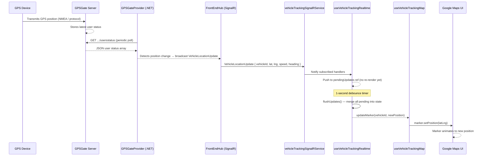
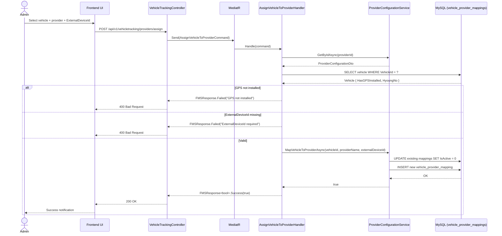
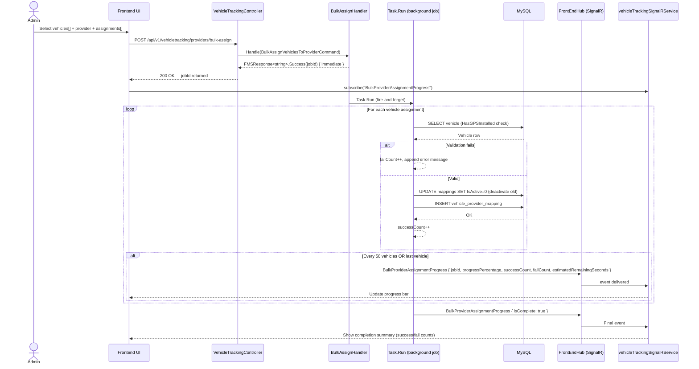
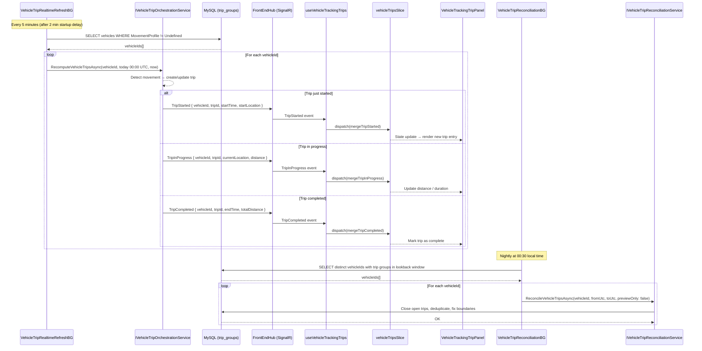
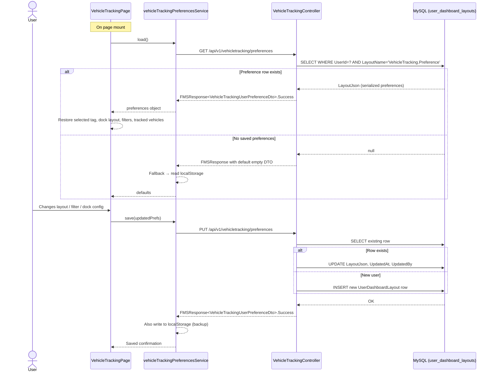
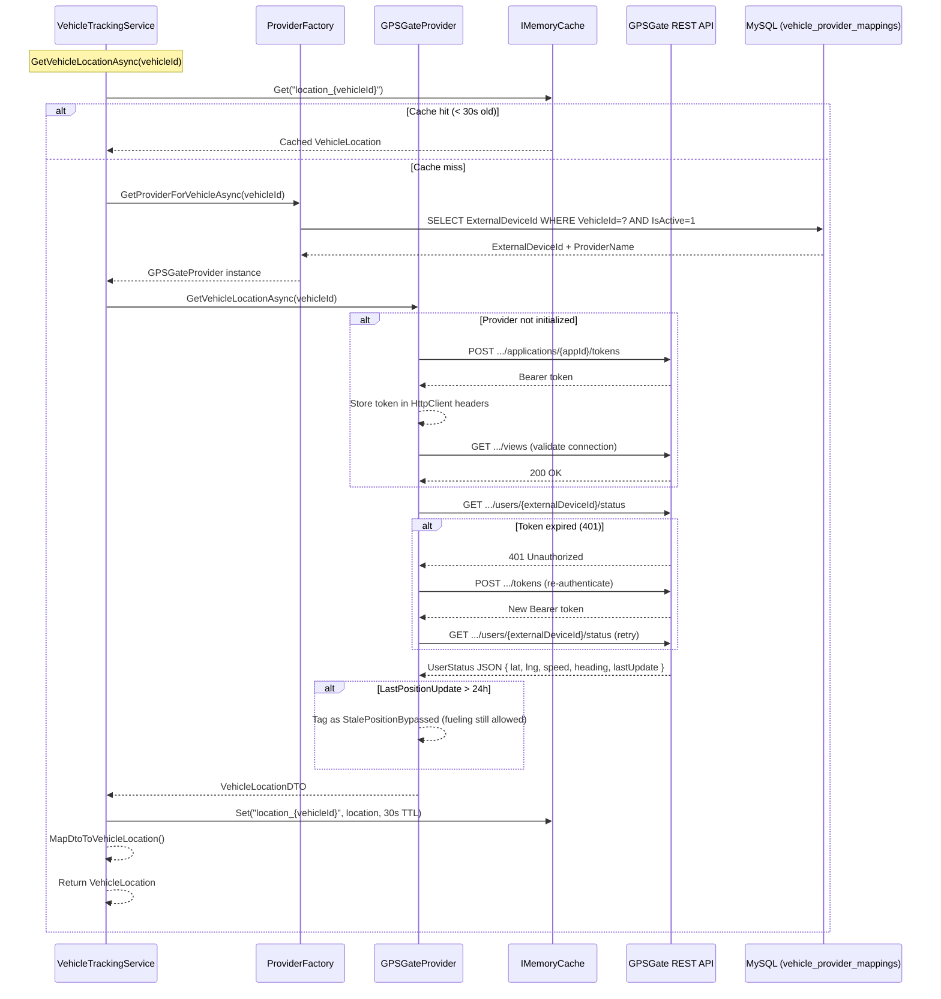
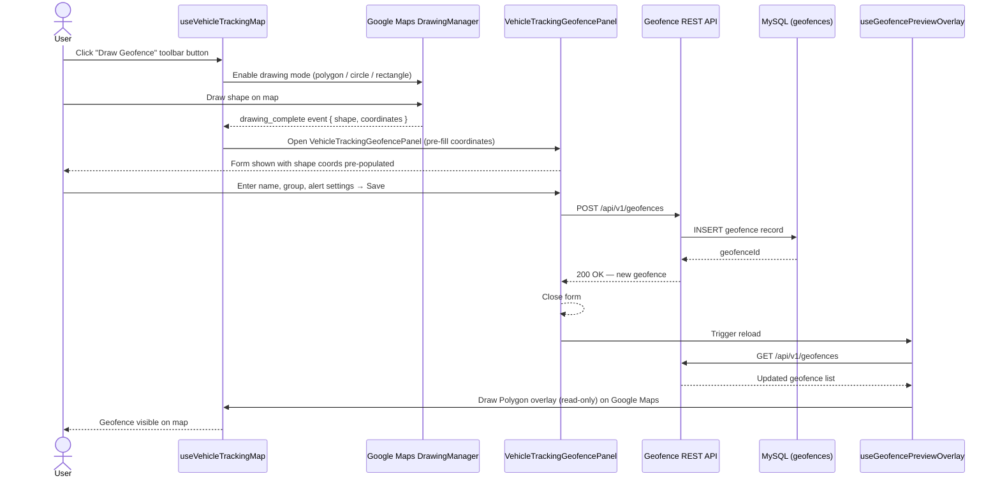

# Vehicle Tracking — Full System Documentation

> **Version:** V1
> **Module:** Vehicle Tracking
> **Domain:** Vehicle
> **Last Updated:** 2026-03-20
> **Status:** Production

---

## Table of Contents

1. [Overview](#1-overview)
2. [System Architecture](#2-system-architecture)
3. [Database & Entities](#3-database--entities)
4. [Backend — Application Layer (CQRS)](#4-backend--application-layer-cqrs)
5. [Backend — Infrastructure Layer](#5-backend--infrastructure-layer)
6. [Backend — API Controller](#6-backend--api-controller)
7. [Background Services](#7-background-services)
8. [SignalR Real-Time Events](#8-signalr-real-time-events)
9. [Frontend Architecture](#9-frontend-architecture)
10. [Frontend — Hooks](#10-frontend--hooks)
11. [Frontend — Components](#11-frontend--components)
12. [Frontend — Redux State](#12-frontend--redux-state)
13. [Frontend — Services & API Clients](#13-frontend--services--api-clients)
14. [User Preferences Persistence](#14-user-preferences-persistence)
15. [GPS Provider Abstraction](#15-gps-provider-abstraction)
16. [Permissions & Security](#16-permissions--security)
17. [Configuration](#17-configuration)
18. [API Reference](#18-api-reference)
19. [Data Flow Diagrams](#19-data-flow-diagrams)
20. [Sequence Diagrams](#20-sequence-diagrams)
21. [Troubleshooting](#21-troubleshooting)

---

## 1. Overview

The Vehicle Tracking module provides real-time GPS tracking, trip management, geofence monitoring, and provider integration for the FMS fleet. It supports:

- **Live vehicle positions** via Google Maps with marker clustering
- **Real-time updates** pushed over SignalR at sub-second intervals
- **Trip tracking** — automatic start/in-progress/complete lifecycle
- **Geofence management** — drawing, browsing, and overlay on the map
- **Provider-agnostic architecture** — pluggable GPS backends (currently GPSGate)
- **MDI workspace** — FlexLayout-based multi-panel dock with user-persisted layouts
- **Fuel level tracking** — intraday sensor readings from GPS hardware
- **Odometer sync** — hardware accumulator data from GPS devices

---

## 2. System Architecture

```
┌──────────────────────────────────────────────────────────────────┐
│                         FRONTEND (React)                         │
│                                                                  │
│  VehicleTrackingPage.js (orchestrator)                           │
│     ├── useVehicleTrackingMap       (Google Maps, markers)       │
│     ├── useVehicleTrackingRealtime  (SignalR batched updates)    │
│     └── useVehicleTrackingTrips     (Redux trips + SignalR)      │
│                                                                  │
│  vehicleTrackingSignalRService  ←→  /vehicleTrackingHub          │
│  vehicleGPSTrackingService      ←→  GET /api/v1/vehicletracking  │
└──────────────────────────────────────────────────────────────────┘
                          │                       ↑
                    REST + SignalR         FMSResponse<T>
                          ↓                       │
┌──────────────────────────────────────────────────────────────────┐
│                         BACKEND (.NET 8)                         │
│                                                                  │
│  VehicleTrackingController  /api/v1/vehicletracking              │
│     └── MediatR → Commands / Queries                             │
│                                                                  │
│  Infrastructure Layer                                            │
│     ├── VehicleTrackingService  (cache + failover router)        │
│     ├── ProviderConfigurationService  (DB-backed config)         │
│     └── GPSGateProvider  (HTTP client to GPSGate API)            │
│                                                                  │
│  Background Services                                             │
│     ├── VehicleTripRealtimeRefreshBackgroundService  (5 min)     │
│     └── VehicleTripReconciliationBackgroundService  (nightly)    │
│                                                                  │
│  MySQL DB  →  vehicle_provider_mappings, provider_configurations │
│              vehicle_last_known_location, provider_health_history│
└──────────────────────────────────────────────────────────────────┘
                          │
               GPSGate REST API
             ({baseUrl}/applications/{appId}/...)
```

---

## 3. Database & Entities

### 3.1 Tables

| Table                         | Purpose                                                |
| ----------------------------- | ------------------------------------------------------ |
| `vehicle_provider_mappings`   | Links FMS vehicles to GPS device IDs on a provider     |
| `provider_configurations`     | Stores GPS provider settings (URL, credentials, flags) |
| `vehicle_last_known_location` | Cached last GPS position per vehicle                   |
| `provider_health_history`     | Historical connectivity health records per provider    |

### 3.2 Entity Configurations

| Configuration Class                         | Path                                                    |
| ------------------------------------------- | ------------------------------------------------------- |
| `VehicleProviderMappingEntityConfiguration` | `FMS.Persistence/EntityConfigurations/VehicleTracking/` |
| `ProviderConfigurationEntityConfiguration`  | `FMS.Persistence/EntityConfigurations/VehicleTracking/` |
| `VehicleLastKnownLocationConfiguration`     | `FMS.Persistence/EntityConfigurations/VehicleTracking/` |
| `ProviderHealthHistoryEntityConfiguration`  | `FMS.Persistence/EntityConfigurations/VehicleTracking/` |
| `VehicleHealthMonitorEntityConfiguration`   | `FMS.Persistence/EntityConfigurations/VehicleTracking/` |

### 3.3 `VehicleProviderMappingEntity` Fields

| Field              | Type       | Description                                          |
| ------------------ | ---------- | ---------------------------------------------------- |
| `VehicleId`        | `int`      | FK → `vehicles.VehicleId`                            |
| `ProviderConfigId` | `int`      | FK → `provider_configurations.Id`                    |
| `ExternalDeviceId` | `string`   | Device ID on the GPS provider (e.g. GPSGate user ID) |
| `DeviceIMEI`       | `string?`  | Physical device IMEI                                 |
| `DeviceName`       | `string?`  | Human-readable device label                          |
| `DeviceType`       | `string?`  | Hardware type (e.g. `GPS_TRACKER`)                   |
| `Metadata`         | `string?`  | JSON blob for additional provider metadata           |
| `IsActive`         | `bool`     | Soft-delete / deactivation flag                      |
| `CreatedAt`        | `DateTime` | UTC creation timestamp                               |
| `CreatedBy`        | `string?`  | User who created the mapping                         |

---

## 4. Backend — Application Layer (CQRS)

All CQRS artifacts live in:

```
FMS.Application/Features/VehicleTracking/
├── Commands/
│   ├── AssignVehicleToProvider/
│   ├── BulkAssignVehiclesToProvider/
│   ├── BulkUnassignVehiclesFromProvider/
│   ├── MapVehicleToDevice/
│   └── UnassignVehicleFromProvider/
├── Queries/
│   └── GetVehicleProviderMappings/
├── DTOs/
│   ├── VehicleProviderMappingDTO.cs
│   ├── ProviderConfigurationDTO.cs
│   ├── GPSDeviceDTO.cs
│   └── BulkAssignmentDTO.cs
└── Services/
    └── IProviderConfigurationService.cs
```

### 4.1 Commands

#### `AssignVehicleToProviderCommand`

Assigns a single vehicle to a GPS provider with a mandatory `ExternalDeviceId`.

```csharp
public class AssignVehicleToProviderCommand : IRequest<FMSResponse<bool>>
{
    public int VehicleId { get; set; }
    public int ProviderId { get; set; }
    public string ExternalDeviceId { get; set; }
    public string UserId { get; set; }
}
```

**Validation rules:**

- Vehicle must exist and have `HasGPSInstalled = 1`
- Provider must exist
- `ExternalDeviceId` must not be blank

**Returns:** `FMSResponse<bool>` — `true` on success

---

#### `BulkAssignVehiclesToProviderCommand`

Assigns multiple vehicles asynchronously. Runs as a fire-and-forget `Task.Run` background job and broadcasts progress via SignalR (`BulkProviderAssignmentProgress`).

```csharp
public class BulkAssignVehiclesToProviderCommand : IRequest<FMSResponse<string>>
{
    public int ProviderId { get; set; }
    public List<VehicleProviderAssignmentItemDTO> Assignments { get; set; }
    public string UserId { get; set; }
}
```

**Returns:** `FMSResponse<string>` — `jobId` (GUID) for SignalR progress tracking

**SignalR payload `BulkProviderAssignmentProgress`:**

```json
{
  "jobId": "abc123",
  "operation": "BulkAssign",
  "providerId": 1,
  "providerName": "GPSGate",
  "totalVehicles": 50,
  "processedVehicles": 25,
  "successCount": 24,
  "failCount": 1,
  "progressPercentage": 50,
  "estimatedRemainingSeconds": 12,
  "isComplete": false,
  "errors": ["Vehicle VH-003: GPS not installed"],
  "timestamp": "2026-03-20T10:00:00Z"
}
```

---

#### `BulkUnassignVehiclesFromProviderCommand`

Unassigns multiple vehicles. Also runs as a background job with SignalR progress.

```csharp
public record BulkUnassignVehiclesFromProviderCommand(
    List<int> VehicleIds,
    string UserId) : IRequest<FMSResponse<string>>;
```

---

#### `MapVehicleToDeviceCommand`

Maps a vehicle to a specific device with optional metadata fields (IMEI, device name, device type).

```csharp
public class MapVehicleToDeviceCommand : IRequest<FMSResponse<bool>>
{
    public int VehicleId { get; set; }
    public int? ProviderId { get; set; }
    public string? ProviderName { get; set; }
    public string ExternalDeviceId { get; set; }
    public string? DeviceIMEI { get; set; }
    public string? DeviceName { get; set; }
    public string? DeviceType { get; set; }
    public string? Metadata { get; set; }
    public string UserId { get; set; }
}
```

> Either `ProviderId` or `ProviderName` must be supplied.

---

#### `UnassignVehicleFromProviderCommand`

Soft-deactivates all active provider mappings for a vehicle.

```csharp
public class UnassignVehicleFromProviderCommand : IRequest<FMSResponse<bool>>
{
    public int VehicleId { get; set; }
    public string UserId { get; set; }
}
```

---

### 4.2 Queries

#### `GetVehicleProviderMappingsQuery`

Retrieves active vehicle-to-provider mappings, optionally scoped to one vehicle.

```csharp
public class GetVehicleProviderMappingsQuery : IRequest<FMSResponse<List<VehicleProviderMappingDTO>>>
{
    public int? VehicleId { get; set; }
}
```

**Returns:** List of `VehicleProviderMappingDTO` with:

- Vehicle name, number plate, type
- Provider name and ID
- Device metadata (external ID, IMEI, name, type)
- Mapping audit fields (`MappedAt`, `MappedBy`)

---

### 4.3 DTOs

#### `VehicleProviderMappingDTO`

```csharp
public class VehicleProviderMappingDTO
{
    public int VehicleId { get; set; }
    public string? VehicleName { get; set; }
    public string? NumberPlate { get; set; }
    public string? VehicleType { get; set; }
    public int ProviderId { get; set; }
    public string? ProviderName { get; set; }
    public string? ExternalDeviceId { get; set; }
    public string? DeviceIMEI { get; set; }
    public string? DeviceName { get; set; }
    public string? DeviceType { get; set; }
    public bool IsActive { get; set; }
    public DateTime? MappedAt { get; set; }
    public string? MappedBy { get; set; }
}
```

#### `BulkAssignmentRequestDTO`

```csharp
public class BulkAssignmentRequestDTO
{
    public int ProviderId { get; set; }
    public List<int> VehicleIds { get; set; }
    public List<VehicleProviderAssignmentItemDTO> Assignments { get; set; }
}

public class VehicleProviderAssignmentItemDTO
{
    public int VehicleId { get; set; }
    public string ExternalDeviceId { get; set; }
}
```

---

## 5. Backend — Infrastructure Layer

```
FMS.Infrastructure/VehicleTracking/
├── Services/
│   ├── VehicleTrackingService.cs            (cache + failover router)
│   ├── IVehicleTrackingService.cs
│   ├── ProviderConfigurationService.cs      (DB-backed CRUD for providers)
│   ├── IProviderConfigurationService.cs
│   ├── ProviderConfigurationServiceAdapter.cs
│   └── GPSGate/
│       ├── OdometerSyncService.cs
│       ├── GPSGateDriverNameService.cs
│       └── GPSGateAccumulatorService.cs
├── Providers/
│   └── GPSGateProvider.cs                   (concrete GPS provider)
├── Models/
│   ├── VehicleLocation.cs
│   ├── ProviderConfiguration.cs
│   ├── ProviderCapabilities.cs
│   ├── ProviderHealthStatus.cs
│   └── ProviderMetadata.cs
├── Adapters/
├── Base/
├── Extensions/
├── Factory/
└── Interfaces/
```

### 5.1 `VehicleTrackingService`

**Responsibilities:**

- Routes location requests to the correct provider per vehicle mapping
- Maintains a 30-second in-memory cache (`IMemoryCache`) keyed as `location_{vehicleId}`
- Implements provider failover: if primary provider is unhealthy, tries next healthy provider
- Exposes usage statistics (total requests, success/fail counts, failover events)

**Key methods:**

| Method                                                         | Description                                         |
| -------------------------------------------------------------- | --------------------------------------------------- |
| `GetVehicleLocationAsync(int vehicleId)`                       | Returns cached or live location for one vehicle     |
| `GetVehicleLocationsAsync(IEnumerable<int>)`                   | Parallel fan-out to provider via `Task.WhenAll`     |
| `GetVehicleLocationHistoryAsync(int, DateTime, DateTime, int)` | History from provider, down-sampled to `maxPoints`  |
| `GetProvidersHealthAsync()`                                    | All provider health, cached 1 minute                |
| `TestProviderConnectivityAsync(string)`                        | Calls provider `ValidateConnectionAsync()`          |
| `GetProviderStatisticsAsync()`                                 | Request counts + average response times by provider |

**Cache TTL:** 30 seconds per vehicle

**Failover logic:**

1. Look up configured provider for vehicle
2. If unhealthy, iterate all providers ordered by priority
3. Select first healthy provider
4. Increment `_failoverCountField` counter

---

### 5.2 `ProviderConfigurationService`

Manages `provider_configurations` and `vehicle_provider_mappings` entities.

**Key operations:**

| Method                                                   | Description                                     |
| -------------------------------------------------------- | ----------------------------------------------- |
| `GetAllAsync(bool includeDisabled)`                      | All providers sorted by priority                |
| `GetForVehicleAsync(int vehicleId)`                      | Provider for vehicle, falls back to default     |
| `MapVehicleToProviderAsync(...)`                         | Deactivates existing mappings, inserts new one  |
| `UnmapVehicleFromProviderAsync(int, string?)`            | Soft-deactivates all active mappings            |
| `SetDefaultAsync(string, string?)`                       | Transaction: clears existing defaults, sets new |
| `RecordHealthStatusAsync(ProviderHealthStatus)`          | Inserts health event                            |
| `GetHealthHistoryAsync(string, DateTime, DateTime, int)` | Health history query                            |

> Uses `IDbContextFactory<GpsdataContext>` — creates a new context per operation to prevent concurrency issues.

---

### 5.3 `GPSGateProvider`

The concrete implementation of `IVehicleTrackingProvider` for GPSGate API v2.

**Attribute registration:**

```csharp
[Provider("GPSGate", DisplayName = "GPSGate Vehicle Tracker", Version = "2.0.0")]
```

**Authentication:** `POST {baseUrl}/applications/{appId}/tokens` — Bearer token cached in `HttpClient` headers.

**Capabilities declared:**

| Capability              | Supported |
| ----------------------- | --------- |
| Real-time Location      | ✅        |
| Historical Data         | ✅        |
| Geofencing              | ✅        |
| Odometer                | ✅        |
| Events                  | ❌        |
| Driver Behavior         | ❌        |
| Fuel Level (via tracks) | ✅        |

**Key API calls:**

| Method                        | HTTP Call                                                             |
| ----------------------------- | --------------------------------------------------------------------- |
| `GetVehicleLocationAsync`     | `GET .../users/{externalDeviceId}/status`                             |
| `GetVehicleHistoryAsync`      | `GET .../users/{id}/tracks?Date=...&From=...&Until=...&Filtered=true` |
| `GetAllVehicleLocationsAsync` | `GET .../usersstatus?PageSize=1000`                                   |
| `GetVehicleOdometerAsync`     | `GET .../accumulators?UserId=...` (AccumulatorTypeId=1, meters→km)    |
| `GetHealthStatusAsync`        | `GET .../views`                                                       |
| `GetAllDevicesAsync`          | `GET .../users?PageSize=5000`                                         |
| `ValidateConnectionAsync`     | `GET .../views`                                                       |

**Stale position handling:** If `LastPositionUpdate` is >24 hours old, status is tagged `StalePositionBypassed` and fueling is still permitted.

**Device lookup:** Resolves `ExternalDeviceId` from `VehicleProviderMappings` table. Falls back to legacy `Vehicle.DeviceId` with a deprecation warning.

---

### 5.4 `VehicleLocation` Model

```csharp
public class VehicleLocation
{
    public int VehicleId { get; set; }
    public double Latitude { get; set; }
    public double Longitude { get; set; }
    public double? Altitude { get; set; }
    public double? Speed { get; set; }         // km/h
    public double? Heading { get; set; }       // 0–360°
    public DateTime Timestamp { get; set; }   // UTC
    public double? Accuracy { get; set; }      // meters
    public int? SatelliteCount { get; set; }
    public string? SignalQuality { get; set; }
    public bool IsMoving { get; set; }
    public string? Address { get; set; }
    public string? ProviderName { get; set; }
    public Dictionary<string, object> Metadata { get; set; }
    public string? ExternalDeviceId { get; set; }
}
```

---

## 6. Backend — API Controller

**Controller:** `VehicleTrackingController`
**Route:** `api/v1/vehicletracking`
**Authorization:** JWT Bearer · Permission: `Vehicle.Read`

### 6.1 Endpoint Reference

| Method | Route                          | Description                                                      |
| ------ | ------------------------------ | ---------------------------------------------------------------- |
| `GET`  | `/{vehicleId}/location`        | Single vehicle live location                                     |
| `GET`  | `/{vehicleId}/odometer`        | Vehicle odometer from GPS hardware                               |
| `GET`  | `/locations`                   | All vehicle locations (`?onlineOnly&gpsEnabledOnly`)             |
| `GET`  | `/{vehicleId}/online-status`   | Is vehicle currently online                                      |
| `GET`  | `/connection-status`           | GPS provider connectivity check                                  |
| `GET`  | `/summary`                     | Fleet GPS status summary (online/offline/moving counts)          |
| `GET`  | `/{vehicleId}/gps-information` | Full GPS data incl sensors                                       |
| `GET`  | `/views`                       | GPS provider views (vehicle groups)                              |
| `GET`  | `/tags`                        | GPS provider tags                                                |
| `GET`  | `/tags/{tagId}/vehicles`       | Vehicles under a tag with live positions (`?fromIndex&pageSize`) |
| `GET`  | `/preferences`                 | User's persisted tracking workspace preferences                  |
| `PUT`  | `/preferences`                 | Save user tracking workspace preferences                         |
| `GET`  | `/{vehicleId}/fuel-levels/day` | Intraday fuel sensor readings (`?date=2026-03-20`)               |

### 6.2 Response Format

All endpoints return `FMSResponse<T>`:

```json
{
  "isSuccess": true,
  "message": "...",
  "data": { ... },
  "statusCode": 200,
  "errors": []
}
```

### 6.3 User Preferences Storage

Preferences are serialized as JSON and stored in `UserDashboardLayouts` with `LayoutName = "VehicleTracking.Preference"`, scoped per `UserId` extracted from the JWT claim.

---

## 7. Background Services

### 7.1 `VehicleTripRealtimeRefreshBackgroundService`

| Setting       | Value                                                        |
| ------------- | ------------------------------------------------------------ |
| Initial delay | 2 minutes after startup                                      |
| Refresh cycle | Every 5 minutes                                              |
| Scope         | Scoped `GpsdataContext` + `IVehicleTripOrchestrationService` |

**What it does:**

1. Queries all vehicles with `MovementProfile != Undefined`
2. For each vehicle, calls `RecomputeVehicleTripsAsync(vehicleId, today 00:00 UTC, now)`
3. Refreshes trip data for active fleet in near real-time

---

### 7.2 `VehicleTripReconciliationBackgroundService`

| Setting                | Config Key                                      | Default    |
| ---------------------- | ----------------------------------------------- | ---------- |
| Enabled/Disabled flag  | `VehicleTrips.Reconciliation.Enabled`           | `true`     |
| Daily run time (local) | `VehicleTrips.Reconciliation.DailyRunTimeLocal` | `00:30`    |
| Lookback days          | `VehicleTrips.Reconciliation.LookbackDays`      | `1`        |
| Disabled poll interval | —                                               | 15 minutes |

**What it does:**

1. Runs once daily at the configured local time
2. Selects all vehicles with trip groups in the lookback window
3. Calls `ReconcileVehicleTripsAsync(vehicleId, fromUtc, toUtc, previewOnly: false)` per vehicle
4. Ensures trips are properly closed and de-duplicated after midnight

---

## 8. SignalR Real-Time Events

**Hub:** `/vehicleTrackingHub`
**Service:** `fms.frontend/src/signalR/vehicleTrackingSignalRService.js`

### 8.1 Events Received by Frontend

| Event Name                       | Payload                                                        | Description                       |
| -------------------------------- | -------------------------------------------------------------- | --------------------------------- |
| `VehicleLocationUpdate`          | `{ vehicleId, lat, lng, speed, heading, isMoving, timestamp }` | Live position update              |
| `VehicleConnectionStatusChanged` | `{ vehicleId, isOnline, statusChangedAt }`                     | Online/offline state change       |
| `TripStarted`                    | `{ vehicleId, tripId, startTime, startLocation }`              | Trip lifecycle event              |
| `TripInProgress`                 | `{ vehicleId, tripId, currentLocation, distance }`             | Trip update                       |
| `TripCompleted`                  | `{ vehicleId, tripId, endTime, totalDistance }`                | Trip closed                       |
| `BulkProviderAssignmentProgress` | See §4.1                                                       | Bulk assign/unassign job progress |

### 8.2 Batched Update Strategy

`useVehicleTrackingRealtime` does **not** apply every event immediately. It queues incoming updates in a `pendingUpdates` ref and flushes them in a **1-second debounced batch** to `setVehicles`, preventing excessive React re-renders during high-frequency GPS bursts.

---

## 9. Frontend Architecture

### 9.1 File Structure

```
fms.frontend/src/pages/vehicles/tracking/
├── VehicleTrackingPage.js                  Main page orchestrator (~1420 lines)
├── VehicleTrackingPage.scss
├── VehicleTrackingWorkspaceLayout.js       Split-pane layout shell (~359 lines)
├── VehicleTrackingWorkspaceLayout.scss
├── vehicleTrackingDockConfig.js            FlexLayout MDI panel/preset config (~494 lines)
├── vehicleTrackingSidebarConfig.js         Filter/sort/column definitions
├── vehicleTrackingPreferencesService.js    API + localStorage preferences adapter
│
├── hooks/
│   ├── useVehicleTrackingMap.js            Google Maps + MarkerClusterer (~994 lines)
│   ├── useVehicleTrackingRealtime.js       SignalR batched live updates
│   ├── useVehicleTrackingTrips.js          Redux trips + SignalR trip events
│   └── useGeofencePreviewOverlay.js        Read-only geofence overlay on map
│
├── utils/
│   └── vehicleTrackingHelpers.js           Data normalizers, formatters, marker builders (~402 lines)
│
└── components/
    ├── workspace/
    │   ├── VehicleTrackingPanels.js        DataGrid + map panel containers
    │   ├── VehicleTrackingTabbedPanel.js   Generic tab shell
    │   └── VehicleTrackingPanelController.js Floating drag-panel controller
    ├── dock/
    │   ├── VehicleTrackingDockLayout.js    FlexLayout MDI wrapper
    │   ├── VehicleTrackingMenuBar.js       IDE-style Window/Workspace menu bar
    │   └── VehicleTrackingDashboardPanel.js Fleet stats summary panel
    ├── detail/
    │   ├── VehicleTrackingDetailPanelContent.js  Detail panel — metrics, GPS, tabs
    │   ├── VehicleTrackingDetailPopup.js         Draggable/resizable floating popup
    │   └── VehicleTrackingApplicationPreviews.js  Embedded trip/fuel/consumption previews
    ├── geofence/
    │   ├── VehicleTrackingGeofencePanel.js        Geofence creation shell
    │   ├── VehicleTrackingGeofenceWorkspacePanel.js Workspace geofence browser
    │   ├── VehicleTrackingGeofenceSidebarPanel.js Sidebar tab list
    │   └── VehicleTrackingGeofenceListPanel.js    Per-group geofence DataGrid
    └── trips/
        └── VehicleTrackingTripPanel.js             Slide-in trip timeline panel
```

### 9.2 Other Tracking-Related Files

| File                               | Path                                      |
| ---------------------------------- | ----------------------------------------- |
| `vehicleTrackingSignalRService.js` | `src/signalR/`                            |
| `vehicleGPSTrackingService.js`     | `src/services/`                           |
| `useVehicleTracking.js`            | `src/hooks/` (polling-based simpler hook) |
| `vehicleTripsSlice.js`             | `src/redux/slices/`                       |

---

## 10. Frontend — Hooks

### 10.1 `useVehicleTrackingMap`

**Purpose:** Owns the entire Google Maps lifecycle for the tracking workspace.

**Key responsibilities:**

- Dynamically loads the Google Maps JS SDK (API key from `GET /SystemConfiguration/by-key/GoogleMaps.ApiKey`)
- Loads `@googlemaps/markerclusterer` for vehicle cluster rendering
- Creates and manages per-vehicle markers with custom SVG icons (color-coded by status)
- Opens/updates `InfoWindow` on marker click showing vehicle summary
- Manages `DrawingManager` for geofence polygon creation
- Exposes `panToVehicle(vehicleId)` and `fitBoundsToTracked()` functions
- Handles cluster right-click context menu for group operations

**Returns:**

```js
{
  (mapRef, // ref to attach to <div>
    mapInstance, // google.maps.Map instance
    panToVehicle,
    fitBoundsToTracked,
    updateMarker, // called by realtime hook per update
    removeMarker,
    clearAllMarkers);
}
```

---

### 10.2 `useVehicleTrackingRealtime`

**Purpose:** Subscribes to `vehicleTrackingSignalRService` and batches incoming GPS updates.

**Batching strategy:**

1. Each `VehicleLocationUpdate` is pushed to `pendingUpdates` ref (no state update)
2. A 1-second debounced `flushUpdates` function merges all pending updates into `setVehicles` in one state write
3. `VehicleConnectionStatusChanged` events also batched the same way
4. Does NOT own the SignalR connection — that belongs to `SignalRConnectionManager`

---

### 10.3 `useVehicleTrackingTrips`

**Purpose:** Wires trip SignalR events to Redux state.

- Listens for `TripStarted`, `TripInProgress`, `TripCompleted` from `vehicleTrackingSignalRService`
- Dispatches `mergeTripStarted`, `mergeTripInProgress`, `mergeTripCompleted` reducers in `vehicleTripsSlice`
- Exposes `openTripPanel(vehicleId)` handler used by the trip panel component

---

### 10.4 `useGeofencePreviewOverlay`

**Purpose:** Renders read-only geofence polygons on the map.

- Fetches geofence groups from the geofence API
- Draws non-interactive `google.maps.Polygon` overlays per geofence zone
- Does NOT use `DrawingManager` — read-only rendering only

---

### 10.5 `useVehicleTracking` (simpler polling hook)

**Purpose:** Lightweight polling-based hook for other pages that need vehicle locations without the full tracking workspace (e.g., dispatch views).

```js
const { vehicles, isLoading, error, trackVehicle, stopTracking } =
  useVehicleTracking({ pollIntervalMs: 30000 });
```

---

## 11. Frontend — Components

### 11.1 `VehicleTrackingPage.js` (Orchestrator)

Main mount point under `/vehicletracking` route. Responsible for:

1. Loading tag list via `GET /vehicletracking/tags`
2. Loading vehicles under selected tag via `GET /vehicletracking/tags/{tagId}/vehicles`
3. Loading and saving user preferences via `vehicleTrackingPreferencesService`
4. Composing the three tracking hooks
5. Managing all shared state:
   - `selectedVehicle` — currently focused vehicle
   - `trackedVehicleIds` — set of vehicles being highlighted on map
   - `statusFilter` — online/offline/moving filter
   - `geofenceGroups` — geofence data
   - `openTripPanels` — map of vehicleId → trip panel open state
   - `dockLayout` — FlexLayout state

---

### 11.2 `vehicleTrackingDockConfig.js` (MDI Workspace)

Defines the FlexLayout panel definitions for the MDI dock system:

| Panel ID    | Description                                      |
| ----------- | ------------------------------------------------ |
| `map`       | Google Maps canvas                               |
| `vehicles`  | Vehicle list DataGrid with status/filter sidebar |
| `geofence`  | Geofence browser pane                            |
| `trips`     | Trip timeline list                               |
| `detail`    | Selected vehicle detail panel                    |
| `dashboard` | Fleet stats summary                              |

**Workspace presets:**

| Preset            | Layout                             |
| ----------------- | ---------------------------------- |
| `default`         | Map (70%) + Vehicles sidebar (30%) |
| `mapFocused`      | Map full-screen                    |
| `vehiclesFocused` | Vehicles grid (60%) + Map (40%)    |
| `tripsLayout`     | Trips (40%) + Map (60%)            |

---

### 11.3 `VehicleTrackingDetailPanelContent.js`

Shows per-vehicle detail when a vehicle is selected:

- GPS coordinates, speed, heading, satellite count, signal quality
- Last seen timestamp
- Provider name and external device ID
- Embedded sub-tabs: **Trips**, **Fuel History**, **Consumption**
- All sub-tab content is rendered via `VehicleTrackingApplicationPreviews`

---

### 11.4 Geofence Components

| Component                                  | Role                                                       |
| ------------------------------------------ | ---------------------------------------------------------- |
| `VehicleTrackingGeofencePanel.js`          | Floating creation panel — form inputs for name, type, zone |
| `VehicleTrackingGeofenceWorkspacePanel.js` | Embedded geofence browser in dock pane                     |
| `VehicleTrackingGeofenceSidebarPanel.js`   | Sidebar tab showing geofence group list                    |
| `VehicleTrackingGeofenceListPanel.js`      | DataGrid with per-group geofences                          |

The `DrawingManager` in `useVehicleTrackingMap` provides the polygon/circle/rectangle drawing tools. On shape completion, a `geofenceCreated` callback fires which opens `VehicleTrackingGeofencePanel` pre-populated with the shape coordinates.

---

## 12. Frontend — Redux State

**Slice:** `vehicleTripsSlice`
**Location:** `fms.frontend/src/redux/slices/vehicleTripsSlice.js`

### State Shape

```js
{
  tripGroups: {
    [vehicleId]: {
      groups: [ TripGroup ],
      loading: boolean,
      error: string | null,
      lastFetched: Date | null
    }
  }
}
```

### Async Thunks

| Thunk                                      | Endpoint                        | Description                               |
| ------------------------------------------ | ------------------------------- | ----------------------------------------- |
| `fetchVehicleTrips(vehicleId, from, to)`   | `GET /vehicletrips/{vehicleId}` | Load trip groups for a vehicle            |
| `fetchVehicleTripGroupDetail(tripGroupId)` | `GET /vehicletrips/groups/{id}` | Load detailed trip data (cached in state) |

### Reducers (SignalR-driven)

| Reducer                         | Triggered By                   |
| ------------------------------- | ------------------------------ |
| `mergeTripStarted(tripData)`    | `TripStarted` SignalR event    |
| `mergeTripInProgress(tripData)` | `TripInProgress` SignalR event |
| `mergeTripCompleted(tripData)`  | `TripCompleted` SignalR event  |

> This slice is shared between `VehicleTrackingPage` and the standalone Trips Management page.

---

## 13. Frontend — Services & API Clients

### 13.1 `vehicleGPSTrackingService.js`

Axios-based REST client for all vehicle tracking API calls.

```js
class VehicleGPSTrackingService {
  getVehicleLocation(vehicleId)              // GET /{vehicleId}/location
  getVehicleOdometer(vehicleId)              // GET /{vehicleId}/odometer
  getAllVehicleLocations(onlineOnly, gpsOnly) // GET /locations
  getVehicleOnlineStatus(vehicleId)          // GET /{vehicleId}/online-status
  getBatchLocations(vehicleIds[])            // Multiple parallel GETs
  getGPSSummary()                            // GET /summary
  getVehicleGPSInformation(vehicleId)        // GET /{vehicleId}/gps-information
  calculateHaversineDistance(lat1,lng1,lat2,lng2)  // Local calculation (no API)
}
```

---

### 13.2 `vehicleTrackingSignalRService.js`

Singleton SignalR client for `/vehicleTrackingHub`.

```js
class VehicleTrackingSignalRService {
  subscribe(eventName, handler)   // Register event handler
  unsubscribe(eventName, handler) // Remove event handler
  // Events: VehicleLocationUpdate, VehicleConnectionStatusChanged,
  //         TripStarted, TripInProgress, TripCompleted,
  //         BulkProviderAssignmentProgress
}
```

> The connection lifecycle (start/stop/reconnect) is managed by the global `SignalRConnectionManager`, not by this service.

---

### 13.3 `vehicleTrackingPreferencesService.js`

Persists and retrieves user workspace preferences. Strategy:

1. **On load:** `GET /vehicletracking/preferences` → merge with localStorage fallback
2. **On save:** `PUT /vehicletracking/preferences` → also write localStorage
3. **On API failure:** Falls back silently to localStorage-only mode

**Persisted preference fields:**

- Active tag ID
- Selected workspace preset
- Dock layout JSON (FlexLayout serialization)
- Tracked vehicle IDs
- Status filters
- Column visibility settings

---

## 14. User Preferences Persistence

Flow:

```
User changes layout/filter
        ↓
vehicleTrackingPreferencesService.save(prefs)
        ↓
PUT /api/v1/vehicletracking/preferences
        ↓
VehicleTrackingController.SavePreferences()
        ↓
UserDashboardLayouts (LayoutName = "VehicleTracking.Preference")
        ↓
On next page load: GET /preferences → restore state
```

---

## 15. GPS Provider Abstraction

The infrastructure uses a factory + interface pattern to allow swapping GPS providers without changing the application layer.

### Interface: `IVehicleTrackingProvider`

```csharp
public interface IVehicleTrackingProvider
{
    string Name { get; }
    ProviderCapabilities Capabilities { get; }
    Task InitializeAsync(ProviderConfiguration config);
    Task ShutdownAsync();
    Task<VehicleLocationDTO> GetVehicleLocationAsync(int vehicleId);
    Task<IEnumerable<VehicleLocationDTO>> GetAllVehicleLocationsAsync(bool onlineOnly, bool gpsEnabledOnly);
    Task<IEnumerable<VehicleLocationHistoryDTO>> GetVehicleHistoryAsync(int vehicleId, DateTime from, DateTime to);
    Task<ProviderHealthStatus> GetHealthStatusAsync();
    Task<bool> ValidateConnectionAsync();
    Task<VehicleOdometerDTO> GetVehicleOdometerAsync(int vehicleId);
    Task<List<GPSDeviceDTO>> GetAllDevicesAsync();
}
```

### Adding a New Provider

1. Create a class implementing `IVehicleTrackingProvider`
2. Decorate with `[Provider("ProviderName", DisplayName = "...", Version = "...")]`
3. Register via `ProviderFactory`
4. Insert a row into `provider_configurations` with the provider's settings JSON
5. Assign vehicles via `VehicleProviderMappings`

---

## 16. Permissions & Security

| Permission Key     | Required For               |
| ------------------ | -------------------------- |
| `Vehicle.Read`     | All GET tracking endpoints |
| JWT `UserId` claim | Preference storage scoping |

- All tracking API endpoints are protected by `[RequirePermission(Permissions.Vehicle.Read)]`
- Preferences are scoped per `UserId` extracted from JWT claims (`NameIdentifier`, `sub`, or `userId`)
- SignalR hub requires an authenticated JWT token in the connection handshake

---

## 17. Configuration

### `appsettings.json` Keys

```json
{
  "VehicleTrips": {
    "Reconciliation": {
      "Enabled": true,
      "DailyRunTimeLocal": "00:30",
      "LookbackDays": 1
    }
  }
}
```

### GPS Provider Settings (in `provider_configurations.Settings` JSON)

```json
{
  "Username": "api_user",
  "Password": "secret",
  "BaseUrl": "https://gpsgate.example.com/api/1",
  "ApplicationId": "12345"
}
```

### Google Maps API Key

Stored in system configuration table, retrieved at runtime via:

```
GET /api/v1/SystemConfiguration/by-key/GoogleMaps.ApiKey
```

---

## 18. API Reference

### Quick Reference Table

| Endpoint                                                  | Auth   | Description                        |
| --------------------------------------------------------- | ------ | ---------------------------------- |
| `GET /api/v1/vehicletracking/tags`                        | Bearer | GPS provider tags (vehicle groups) |
| `GET /api/v1/vehicletracking/tags/{tagId}/vehicles`       | Bearer | Live vehicles in a tag             |
| `GET /api/v1/vehicletracking/locations`                   | Bearer | All vehicle GPS positions          |
| `GET /api/v1/vehicletracking/{vehicleId}/location`        | Bearer | Single vehicle position            |
| `GET /api/v1/vehicletracking/{vehicleId}/odometer`        | Bearer | Odometer from hardware             |
| `GET /api/v1/vehicletracking/{vehicleId}/online-status`   | Bearer | Online/offline status              |
| `GET /api/v1/vehicletracking/connection-status`           | Bearer | Provider health check              |
| `GET /api/v1/vehicletracking/summary`                     | Bearer | Fleet GPS summary counts           |
| `GET /api/v1/vehicletracking/{vehicleId}/gps-information` | Bearer | Full GPS sensor data               |
| `GET /api/v1/vehicletracking/views`                       | Bearer | Provider vehicle group views       |
| `GET /api/v1/vehicletracking/preferences`                 | Bearer | User workspace preferences         |
| `PUT /api/v1/vehicletracking/preferences`                 | Bearer | Save workspace preferences         |
| `GET /api/v1/vehicletracking/{vehicleId}/fuel-levels/day` | Bearer | Intraday fuel sensor data          |

---

## 19. Data Flow Diagrams

### 19.1 Live Location Update Flow

```
GPSGate device transmits position
        ↓
GPSGate server stores position
        ↓
Backend polling / provider push
        ↓
SignalR Hub broadcasts VehicleLocationUpdate
        ↓
vehicleTrackingSignalRService (frontend) receives event
        ↓
useVehicleTrackingRealtime enqueues in pendingUpdates ref
        ↓
1-second debounced flush → setVehicles(mergedState)
        ↓
React re-render
        ↓
useVehicleTrackingMap.updateMarker(vehicleId, newPosition)
        ↓
Google Maps marker animates to new position
```

### 19.2 Vehicle Assignment Flow

```
Admin selects vehicles + provider in UI
        ↓
POST /api/v1/vehicletracking/providers/bulk-assign
        ↓
BulkAssignVehiclesToProviderCommand dispatched via MediatR
        ↓
Fire-and-forget Task.Run loop
        ↓ (per vehicle)
ValidateGPS + LookupVehicle
        ↓
ProviderConfigurationService.MapVehicleToProviderAsync()
        ↓
INSERT vehicle_provider_mappings (deactivate old, insert new)
        ↓ (every 50 vehicles or at end)
SignalR BulkProviderAssignmentProgress → frontend progress bar
        ↓
UI shows completion summary
```

### 19.3 Trip Lifecycle Flow

```
Vehicle starts moving
        ↓
VehicleTripRealtimeRefreshBackgroundService detects movement
        ↓
TripStarted SignalR event → FrontEndHub
        ↓
vehicleTrackingSignalRService receives TripStarted
        ↓
useVehicleTrackingTrips dispatches mergeTripStarted
        ↓
vehicleTripsSlice updates Redux state
        ↓
VehicleTrackingTripPanel renders new trip entry

...vehicle in motion → TripInProgress events...

Vehicle stops
        ↓
TripCompleted → dispatch mergeTripCompleted
        ↓
Nightly: VehicleTripReconciliationBackgroundService deduplicates/closes trips
```

---

## 20. Sequence Diagrams

### 20.1 Live Location Update (SignalR Real-Time)



---

### 20.2 Single Vehicle Assignment to Provider



---

### 20.3 Bulk Vehicle Assignment (Async Job + Progress)



---

### 20.4 Trip Lifecycle (Start → In Progress → Complete → Reconciliation)



---

### 20.5 User Preferences Load & Save



---

### 20.6 GPS Provider Authentication & Location Fetch



---

### 20.7 Provider Health Check & Failover

```mermaid
sequenceDiagram
    participant VTS as VehicleTrackingService
    participant PrimaryP as Primary Provider
    participant FallbackP as Fallback Provider (next healthy)
    participant ConfigSVC as ProviderConfigurationService
    participant DB as MySQL (provider_health_history)

    VTS->>PrimaryP: GetHealthStatusAsync()
    PrimaryP->>PrimaryP: GET .../views
    alt Provider healthy
        PrimaryP-->>VTS: HealthStatus.Healthy
        VTS-->>VTS: Use primary provider
    else Provider degraded / error
        PrimaryP-->>VTS: HealthStatus.Unhealthy
        Note over VTS: Failover triggered — increment failoverCount
        VTS->>ConfigSVC: GetAllAsync(includeDisabled: false)
        ConfigSVC->>DB: SELECT providers ORDER BY Priority
        DB-->>ConfigSVC: providers[]
        loop Each provider by priority
            VTS->>FallbackP: GetHealthStatusAsync()
            alt Fallback healthy
                FallbackP-->>VTS: HealthStatus.Healthy
                Note over VTS: Use fallback provider for this request
                VTS->>ConfigSVC: RecordHealthStatusAsync(primaryProvider, Unhealthy)
                ConfigSVC->>DB: INSERT provider_health_history
                VTS-->>VTS: Proceed with fallback
                break
            end
        end
    end
```

---

### 20.8 Geofence Creation Flow



---

## 21. Troubleshooting

### Vehicle Not Showing on Map

1. Check `vehicle_provider_mappings` — is there an active record for the vehicle?
2. Check `Vehicle.HasGPSInstalled = 1`
3. Verify `ExternalDeviceId` matches the device username in GPSGate
4. Check `GET /api/v1/vehicletracking/connection-status` — is the provider healthy?

### Stale Position Displayed

1. Check if `LastPositionUpdate` is >24h — this triggers `StalePositionBypassed` status
2. The vehicle is still allowed to fuel but position may be outdated
3. Check GPSGate device for connectivity issues

### SignalR Not Receiving Updates

1. Verify JWT token is valid and not expired
2. Check hub connection in browser DevTools → Network → WS tab
3. Ensure `vehicleTrackingSignalRService` is subscribed to the correct event names
4. Verify SignalR Redis backplane is running (if using multi-instance deployment)

### Bulk Assignment Job Stuck

1. Check for `BulkProviderAssignmentProgress` SignalR events in browser
2. Check backend logs for `Job {JobId}: Error`
3. Verify `IServiceScopeFactory` is registered — background `Task.Run` uses a new DI scope

### Preferences Not Persisting

1. Verify JWT contains a valid `UserId` claim
2. Check `UserDashboardLayouts` table for a row with `LayoutName = 'VehicleTracking.Preference'`
3. Check browser DevTools for a 401 on `PUT /preferences` — token may have expired

### Google Maps Not Loading

1. Verify `GoogleMaps.ApiKey` exists in the system configuration table
2. Check browser console for Google Maps JS loading errors
3. Ensure the API key has `Maps JavaScript API` and `Marker Clusterer` enabled

---

_Documentation generated: 2026-03-20 | Domain: Vehicle | Feature: Vehicle Tracking | Version: V1 | Sequence Diagrams: §20_
