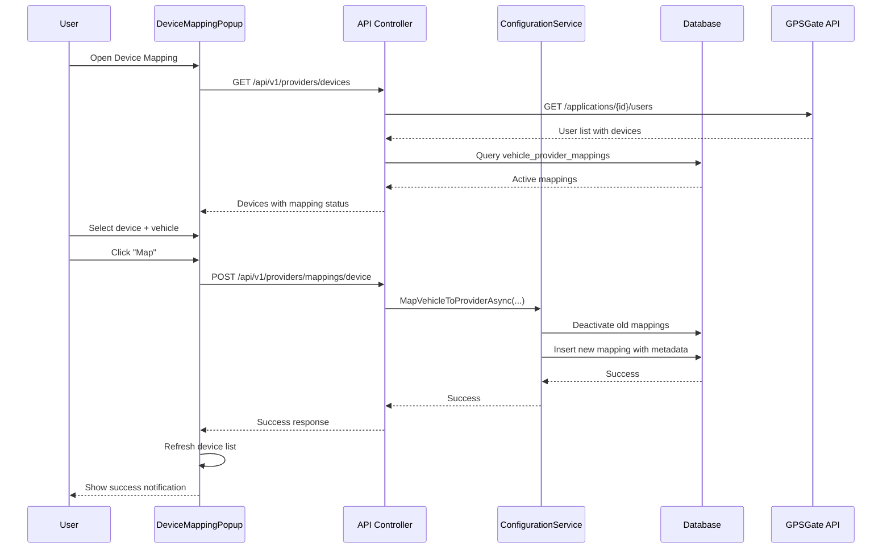

# GPS Device Mapping - Complete Implementation Summary

## Overview
Complete implementation of GPS device mapping workflow allowing users to fetch GPS devices from tracking providers (GPSGate) and manually map them one-by-one to FMS vehicles. This replaces the legacy single-provider GPS fields with a flexible multi-provider architecture.

**Date:** January 28, 2025
**Status:** ? Implementation Complete - Ready for Testing

---

## ?? Features Implemented

### 1. Backend Infrastructure

#### Database Changes
- **VehicleProviderMappingEntity Enhanced** (`FMS.Domain/Entities/VehicleTracking/VehicleProviderMappingEntity.cs`)
  - Added `DeviceIMEI` (VARCHAR 50) - Device IMEI number
  - Added `DeviceName` (VARCHAR 200) - Device name from provider
    - Added `DeviceType` (VARCHAR 100) - Device type/model
  - Added `Metadata` (TEXT) - Additional device metadata (JSON string)
  - Index on `device_imei` for faster lookups

#### Service Layer Updates
- **IProviderConfigurationService** - Enhanced interface
  ```csharp
  Task<bool> MapVehicleToProviderAsync(
      int vehicleId,
      string providerName,
      string? externalDeviceId = null,
      string? deviceIMEI = null,
      string? deviceName = null,
      string? deviceType = null,
      string? metadata = null,
      string? currentUser = null);
  ```

- **ProviderConfigurationService** - Implementation updated
  - Stores device metadata when mapping vehicles
  - Logs device ID in mapping operations

#### API Endpoints

**1. GET /api/v1/providers/devices**
- Fetches all GPS devices from provider
- Returns device list with mapping status
- Query params: `providerName` (optional)
- Response:
  ```json
  {
    "success": true,
    "data": [
      {
        "id": "12345",
        "username": "vehicle_001",
        "name": "Device 001",
        "imei": "123456789012345",
        "phoneNumber": "+1234567890",
        "deviceType": "GPS Tracker",
        "protocol": "GT06",
        "latitude": 37.7749,
        "longitude": -122.4194,
        "speed": 45.5,
        "heading": 180,
        "lastPositionUpdate": "2025-01-28T10:30:00Z",
        "lastDeviceActivity": "2025-01-28T10:35:00Z",
        "isOnline": true,
        "isPositionValid": true,
        "isMapped": false,
        "mappedVehicleId": null,
        "mappedVehicleName": null,
        "providerName": "GPSGate"
      }
    ],
    "totalDevices": 150,
    "mappedDevices": 45,
    "unmappedDevices": 105,
    "providerName": "GPSGate",
    "timestamp": "2025-01-28T12:00:00Z"
  }
  ```

**2. POST /api/v1/providers/mappings/device**
- Maps a GPS device to a vehicle with metadata
- Request body:
  ```json
  {
    "vehicleId": 123,
    "providerName": "GPSGate",
    "externalDeviceId": "12345",
    "deviceIMEI": "123456789012345",
    "deviceName": "Device 001",
    "deviceType": "GPS Tracker",
    "metadata": "{\"username\":\"vehicle_001\",\"protocol\":\"GT06\"}"
  }
  ```

**3. GET /api/v1/providers/mappings**
- Returns vehicle-provider mappings with device info
- Enhanced response includes:
  - `externalDeviceId`
  - `deviceIMEI`
  - `deviceName`
  - `deviceType`
  - `mappedAt`
  - `mappedBy`
- Query params: `vehicleId` (optional)

### 2. Frontend Components

#### DeviceMappingPopup Component
**Location:** `fms.frontend/src/pages/providermanagement/assignments/DeviceMappingPopup.js`

**Features:**
- Two-grid layout: GPS Devices (left) and FMS Vehicles (right)
- Real-time device data from provider API
- Search and filter capabilities:
  - Show online devices only
  - Show unmapped devices only
  - Full-text search on username, name, IMEI
- Device information display:
  - Online/offline status with color coding
  - Last activity timestamp (relative time)
  - Current position (lat/long/speed)
  - Mapping status (mapped vehicle name or "Not mapped")
- Click-to-map workflow:
  - Select device from left grid
  - Select vehicle from right grid
  - Click "Map Device to Vehicle" button
  - Stores complete device metadata
- Unmap functionality:
  - Unmap button for each mapped device
  - Refreshes data after unmapping
- Responsive design with Tailwind CSS

**Usage:**
```jsx
<DeviceMappingPopup
  visible={deviceMappingVisible}
  onHiding={() => setDeviceMappingVisible(false)}
  providerName="GPSGate"
  onMappingComplete={() => {
    dispatch(fetchProviderMappings());
  }}
/>
```

#### VehicleAssignments Component Updates
**Location:** `fms.frontend/src/pages/providermanagement/assignments/VehicleAssignments.js`

**Enhancements:**
1. **New Columns Added:**
   - Device ID (external device ID)
   - Device IMEI (with mono font)
   - Device Name
   - Mapped At (datetime with formatting)

2. **New Button:**
   - "Map GPS Devices" button in header
   - Opens DeviceMappingPopup
   - Uses default provider or first available

3. **Data Integration:**
   - Merges vehicle data with mapping device info
   - Shows device details for each vehicle
   - Real-time updates after mapping

### 3. Database Migration

**Script:** `Database/Scripts/20250128_Add_VehicleProviderMapping_DeviceMetadata.sql`

```sql
-- Add device metadata columns
ALTER TABLE vehicle_provider_mappings
ADD COLUMN device_imei VARCHAR(50) NULL COMMENT 'Device IMEI number';

ALTER TABLE vehicle_provider_mappings
ADD COLUMN device_name VARCHAR(200) NULL COMMENT 'Device name from provider';

ALTER TABLE vehicle_provider_mappings
ADD COLUMN device_type VARCHAR(100) NULL COMMENT 'Device type/model';

ALTER TABLE vehicle_provider_mappings
ADD COLUMN metadata JSON NULL COMMENT 'Additional device metadata (JSON)';

-- Create index for faster lookups
CREATE INDEX idx_vehicle_provider_mappings_device_imei
ON vehicle_provider_mappings(device_imei);
```

**Verification Query:**
```sql
SELECT
    vpm.id,
    vpm.vehicle_id,
    v.vehicle_code,
    vpm.external_device_id,
    vpm.device_imei,
    vpm.device_name,
    vpm.device_type,
    vpm.metadata,
    pc.name AS provider_name,
    vpm.is_active,
    vpm.created_at
FROM vehicle_provider_mappings vpm
INNER JOIN vehicles v ON vpm.vehicle_id = v.vehicle_id
INNER JOIN provider_configurations pc ON vpm.provider_config_id = pc.id
WHERE vpm.is_active = 1;
```

---

## ?? Complete Workflow

### User Journey

1. **Navigate to Provider Management**
   - Go to Provider Management ? Vehicle Assignments

2. **Open Device Mapping**
   - Click "Map GPS Devices" button
   - DeviceMappingPopup opens with two grids

3. **Filter Devices (Optional)**
   - Toggle "Show online devices only"
   - Toggle "Show unmapped devices only"
   - Use search to find specific devices by IMEI, name, or username

4. **Select Device**
   - Click on a device in the left grid
   - View device details: IMEI, position, last activity, online status

5. **Select Vehicle**
   - Click on a vehicle in the right grid
   - See vehicle details: ID, name, number plate, type

6. **Map Device to Vehicle**
   - Review selection in action bar
   - Click "Map Device to Vehicle" button
   - Backend stores:
     - External Device ID
     - Device IMEI
     - Device Name
     - Device Type
     - Metadata (JSON with username, protocol, phone, etc.)

7. **Verify Mapping**
   - Grid automatically refreshes
   - Mapped device shows vehicle name in "Mapped To" column
   - Device removed from unmapped list (if filter active)

8. **View in Vehicle Assignments**
   - Close popup
   - Vehicle Assignments grid shows:
     - Device ID
     - Device IMEI
     - Device Name
     - Mapped At timestamp

### Technical Flow



---

## ?? Testing Checklist

### Backend Tests

- [ ] **Database Migration**
  - [ ] Run migration script successfully
  - [ ] Verify new columns exist
  - [ ] Verify index created on device_imei

- [ ] **API Endpoint: GET /api/v1/providers/devices**
  - [ ] Returns all devices from GPSGate
  - [ ] Each device has IMEI, name, position
  - [ ] Mapping status correctly indicates mapped vehicles
  - [ ] Unmapped devices show `isMapped: false`
  - [ ] Mapped devices show correct vehicle name
  - [ ] Handles provider errors gracefully

- [ ] **API Endpoint: POST /api/v1/providers/mappings/device**
  - [ ] Accepts device metadata
  - [ ] Stores ExternalDeviceId, IMEI, Name, Type
  - [ ] Stores metadata JSON
  - [ ] Deactivates previous mapping
  - [ ] Returns success with mapping details
  - [ ] Handles validation errors

- [ ] **API Endpoint: GET /api/v1/providers/mappings**
  - [ ] Returns device info for each mapping
  - [ ] Includes ExternalDeviceId, DeviceIMEI, DeviceName
  - [ ] Includes MappedAt timestamp
  - [ ] Filters by vehicleId correctly

### Frontend Tests

- [ ] **DeviceMappingPopup Component**
  - [ ] Opens when "Map GPS Devices" clicked
  - [ ] Loads devices from API
  - [ ] Loads vehicles from API
  - [ ] Displays device online status correctly
  - [ ] Shows last activity in relative time
  - [ ] Search filters devices
  - [ ] "Show online only" filter works
  - [ ] "Show unmapped only" filter works
  - [ ] Device selection highlights row
  - [ ] Vehicle selection highlights row
  - [ ] Map button disabled when selections incomplete
  - [ ] Map button creates mapping successfully
  - [ ] Success notification appears
  - [ ] Grid refreshes after mapping
  - [ ] Unmap button removes mapping
  - [ ] Close button works correctly

- [ ] **VehicleAssignments Grid**
  - [ ] Device ID column shows external device ID
  - [ ] Device IMEI column shows IMEI
  - [ ] Device Name column shows name
  - [ ] Mapped At column shows timestamp
  - [ ] Empty cells show "-" or "Not mapped"
  - [ ] Grid updates after device mapping

### Integration Tests

- [ ] **Complete Workflow**
  - [ ] Open Device Mapping popup
  - [ ] See all GPSGate devices
  - [ ] Filter unmapped devices
  - [ ] Search for specific IMEI
  - [ ] Select device and vehicle
  - [ ] Click Map button
  - [ ] See success notification
  - [ ] Verify device shows as mapped
  - [ ] Close popup
  - [ ] See device info in VehicleAssignments grid
  - [ ] Verify database record created
  - [ ] Verify metadata stored correctly

- [ ] **Edge Cases**
  - [ ] Map device already mapped to another vehicle
  - [ ] Map multiple vehicles to different devices
  - [ ] Unmap and remap same device
  - [ ] Handle API errors gracefully
  - [ ] Handle empty device list
  - [ ] Handle empty vehicle list

---

## ?? Files Changed

### Backend Files

1. **FMS.Domain/Entities/VehicleTracking/VehicleProviderMappingEntity.cs**
   - Added device metadata properties

2. **FMS.Infrastructure/VehicleTracking/Services/IProviderConfigurationService.cs**
   - Updated MapVehicleToProviderAsync signature

3. **FMS.Infrastructure/VehicleTracking/Services/ProviderConfigurationService.cs**
   - Implemented device metadata storage

4. **FMS.WebClient/Controllers/VehicleManagement/ProviderManagementController.cs**
   - Added DeviceMappingRequest DTO
   - Added POST /api/v1/providers/mappings/device endpoint
   - Enhanced GET /api/v1/providers/mappings to return device info
   - Added using statements for GpsdataContext, EntityFrameworkCore

### Frontend Files

1. **fms.frontend/src/pages/providermanagement/assignments/DeviceMappingPopup.js** *(NEW)*
   - Complete device mapping component

2. **fms.frontend/src/pages/providermanagement/assignments/VehicleAssignments.js**
   - Added DeviceMappingPopup import
   - Added device mapping state
   - Enhanced vehicles useMemo to merge device data
   - Added "Map GPS Devices" button
   - Added new grid columns (Device ID, IMEI, Name, Mapped At)
   - Added DeviceMappingPopup component

### Database Files

1. **Database/Scripts/20250128_Add_VehicleProviderMapping_DeviceMetadata.sql** *(NEW)*
   - Migration script for device metadata columns

---

## ?? Deployment Steps

### 1. Database Migration
```bash
# Connect to MySQL
mysql -u root -p gpsdata

# Run migration script
source Database/Scripts/20250128_Add_VehicleProviderMapping_DeviceMetadata.sql

# Verify columns
DESCRIBE vehicle_provider_mappings;
```

### 2. Backend Deployment
```bash
# Build solution
dotnet build Tenacity.Fms.sln

# Run tests (if any)
dotnet test

# Publish API
cd FMS.WebClient
dotnet publish -c Release

# Restart API service
```

### 3. Frontend Deployment
```bash
cd fms.frontend

# Install dependencies (if needed)
npm install

# Build production
npm run build:prod

# Deploy to web server
```

### 4. Verification
1. Open Provider Management ? Vehicle Assignments
2. Click "Map GPS Devices"
3. Verify devices load from GPSGate
4. Map a device to a vehicle
5. Verify mapping appears in grid
6. Check database for correct data

---

## ?? Data Model

### VehicleProviderMapping Table Schema

```sql
CREATE TABLE vehicle_provider_mappings (
    id INT PRIMARY KEY AUTO_INCREMENT,
    vehicle_id INT NOT NULL,
    provider_config_id INT NOT NULL,
    external_device_id VARCHAR(200) NULL,
    device_imei VARCHAR(50) NULL,              -- NEW
    device_name VARCHAR(200) NULL,             -- NEW
    device_type VARCHAR(100) NULL,             -- NEW
    metadata TEXT NULL,                        -- NEW (JSON string, MySQL 5.5 compatible)
    is_active BOOLEAN DEFAULT TRUE,
    created_at DATETIME DEFAULT CURRENT_TIMESTAMP,
    updated_at DATETIME DEFAULT CURRENT_TIMESTAMP ON UPDATE CURRENT_TIMESTAMP,
    created_by VARCHAR(100) NULL,
    updated_by VARCHAR(100) NULL,
    FOREIGN KEY (vehicle_id) REFERENCES vehicles(vehicle_id),
    FOREIGN KEY (provider_config_id) REFERENCES provider_configurations(id),
    INDEX idx_vehicle_provider_mappings_device_imei (device_imei)  -- NEW
);
```

### Metadata JSON Structure

```json
{
  "username": "vehicle_001",
  "phoneNumber": "+1234567890",
  "protocol": "GT06",
  "lastPositionUpdate": "2025-01-28T10:30:00Z",
  "lastDeviceActivity": "2025-01-28T10:35:00Z"
}
```

---

## ?? Configuration

### Provider Configuration
Ensure GPSGate provider is configured in `provider_configurations` table:

```sql
SELECT * FROM provider_configurations WHERE name = 'GPSGate';
```

Required settings in JSON:
```json
{
  "BaseUrl": "https://your-gpsgate-server.com",
  "ApplicationId": "your-app-id",
  "Username": "api-user",
  "Password": "api-password"
}
```

---

## ?? Known Issues & Limitations

1. **Performance:** Loading 1000+ devices may be slow. Consider pagination if needed.
2. **Provider Specific:** Currently only GPSGate provider implements GetAllDevicesAsync(). Other providers (Geotab, Traccar) need implementation.
3. **Real-time Updates:** Device online status is fetched on popup open, not real-time. Refresh button available.
4. **Concurrent Mapping:** Two users mapping same device simultaneously may cause race condition.

---

## ?? Developer Notes

### Adding Support for Other Providers

To add device mapping for Geotab/Traccar:

1. Implement `GetAllDevicesAsync()` in provider class
2. Map provider's device structure to `GPSDeviceDTO`
3. Query provider-specific device endpoint
4. Check for active mappings
5. Return devices with mapping status

Example for Geotab:
```csharp
public async Task<FMSResponse<List<GPSDeviceDTO>>> GetAllDevicesAsync()
{
    var response = await _httpClient.GetAsync("/api/devices");
    var geotabDevices = await response.Content.ReadAsAsync<List<GeotabDevice>>();

    var mappings = await _context.VehicleProviderMappings
        .Where(m => m.IsActive && m.ProviderConfiguration.Name == "Geotab")
        .ToListAsync();

    var devices = geotabDevices.Select(d => new GPSDeviceDTO
    {
        Id = d.Id,
        Name = d.Name,
        IMEI = d.SerialNumber,
        // ... map other fields
        IsMapped = mappings.Any(m => m.ExternalDeviceId == d.Id)
    }).ToList();

    return FMSResponse<List<GPSDeviceDTO>>.Success(devices);
}
```

---

## ? Success Criteria

The implementation is considered successful when:

- [x] Backend API returns GPS devices with mapping status
- [x] Backend API accepts device metadata when mapping
- [x] Backend API returns device info in mappings endpoint
- [x] Frontend popup loads and displays devices
- [x] Frontend popup allows search and filtering
- [x] Frontend popup maps devices to vehicles
- [x] Frontend grid shows device columns
- [x] Database stores device metadata
- [ ] End-to-end workflow tested successfully
- [ ] Production deployment completed

---

## ?? Support

For issues or questions:
- **Backend Issues:** Check `FMS.WebClient` logs
- **Frontend Issues:** Check browser console
- **Database Issues:** Check MySQL error logs
- **API Errors:** Review API response in Network tab

**Created:** January 28, 2025
**Last Updated:** January 28, 2025
**Status:** Implementation Complete - Ready for Testing
