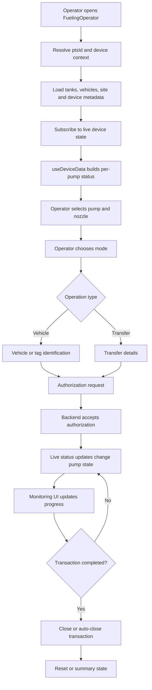
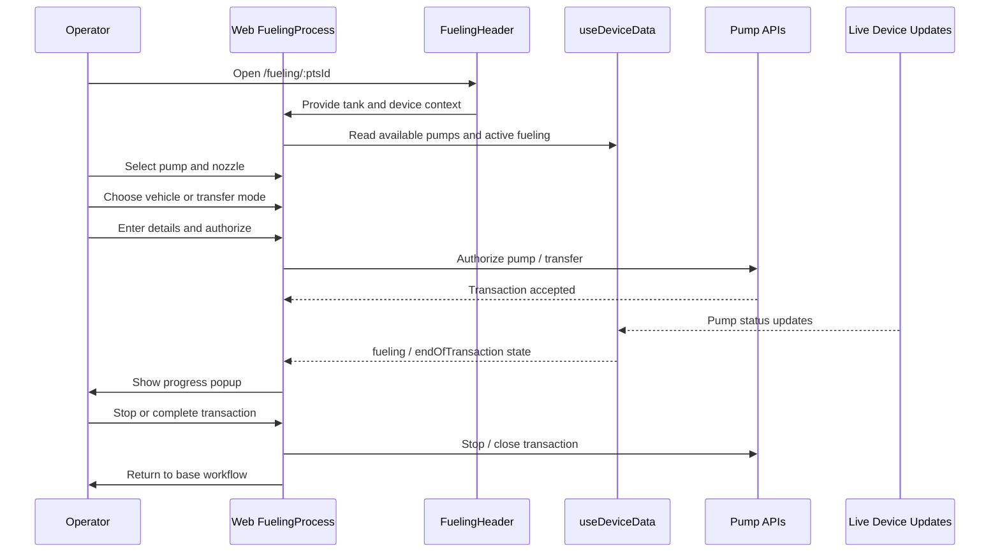
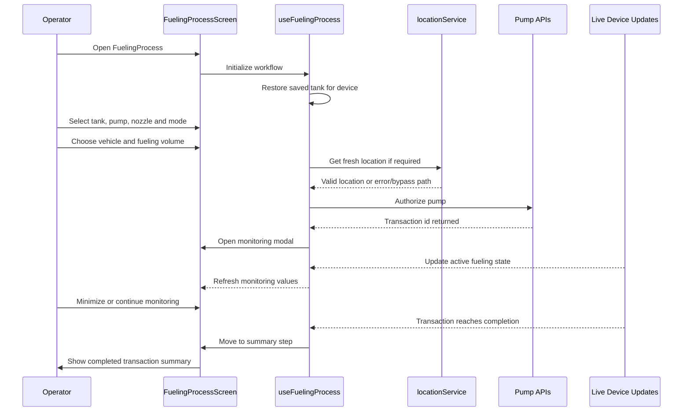
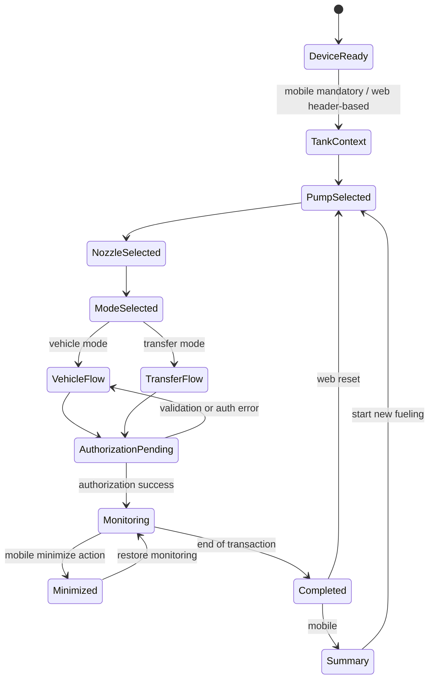

# FuelingOperator Implementation Guide

## Overview

`FuelingOperator` is the operator-facing fueling workflow implemented in both the web application (`fms.frontend`) and the mobile application (`fms.mobile`).

The feature supports:
- tank-aware fueling initiation
- pump and nozzle selection
- vehicle fueling and tank-to-tank transfer modes
- RFID/manual vehicle identification
- real-time transaction monitoring
- live device status updates through SignalR-driven device state
- transaction completion and operator recovery flows

This document describes the current implementation based on the active code paths in the frontend and mobile applications.

---

## Implementation Scope

### Web frontend
Primary entry points:
- `fms.frontend/src/Content.js`
- `fms.frontend/src/pages/ATG/fuelingprocess/fuelingprocess.js`
- `fms.frontend/src/pages/ATG/fuelingprocess/hooks/useFuelingState.js`
- `fms.frontend/src/pages/ATG/fuelingprocess/hooks/useFuelingActions.js`
- `fms.frontend/src/pages/ATG/fuelingprocess/hooks/useFuelingEffects.js`
- `fms.frontend/src/pages/ATG/fuelingprocess/Components/FuelingHeader.js`
- `fms.frontend/src/pages/ATG/fuelingprocess/TransactionMonitoringStatus.js`

### Mobile
Primary entry points:
- `fms.mobile/src/navigation/AppNavigator.js`
- `fms.mobile/src/screens/fueling/FuelingProcessScreen.js`
- `fms.mobile/src/hooks/useFuelingProcess.js`
- `fms.mobile/src/components/fueling/FuelingHeader.js`
- `fms.mobile/src/components/fueling/TransactionMonitoringModal.js`
- `fms.mobile/src/hooks/useDeviceData.js`

### Existing related documentation
Supporting implementation notes already exist under:
- `Documentation/Features/FuelingProcess/`

---

## Shared Functional Model

Both clients are built around the same operator workflow:

1. identify target device
2. load live pump and tank state
3. choose pump
4. choose nozzle
5. choose operation mode
   - vehicle fueling
   - tank transfer
6. identify vehicle or tag when applicable
7. authorize transaction
8. monitor fueling in real time
9. complete and close transaction

### Shared runtime dependencies
- Redux-managed device and transaction state
- `useDeviceData` abstraction for processed pump status
- SignalR/device updates for active fueling and connection state
- pump authorization APIs
- tank and vehicle lookup APIs

---

## Web Frontend Implementation

## Routing
The web flow is mounted through:
- route: `/fueling/:ptsId`
- backward compatibility redirect: `/atg/:ptsId` -> `/fueling/:ptsId`

The route is defined in `fms.frontend/src/Content.js` and wrapped in an error boundary.

## Main orchestrator
The web workflow is centered in `fms.frontend/src/pages/ATG/fuelingprocess/fuelingprocess.js`.

The screen composes:
- local workflow state from `useFuelingState`
- command handlers from `useFuelingActions`
- side-effect synchronization from `useFuelingEffects`
- processed real-time pump data from `useDeviceData`

## Web step model
Observed step flow:
- `pump`
- `nozzle`
- `operationMode`
- `tankTransfer`
- `transferDetails`
- `scan`
- `details`
- `authorization`

## Web operator capabilities
- start a new fueling session from the header
- see active fueling sessions across pumps
- open a popup for any active fueling session
- perform tank transfer with source/destination tank context
- identify vehicles through scan/manual/lookup patterns
- authorize fueling with preset values
- monitor transaction status live
- stop fueling from popup
- complete and close transaction
- view pump transactions
- use stuck transaction recovery tooling

## Web-specific implementation details

### 1. Tank-aware header
The header owns tank context and supports selecting the source tank before fueling or transfer. The implementation aligns with the existing tank selection work described in `Documentation/Features/FuelingProcess/TANK_SELECTION_IMPLEMENTATION.md`.

### 2. Real-time popup-driven monitoring
The web client uses popup renderers to show:
- fueling in progress
- fueling complete
- navigation guard dialog
- active fueling list

### 3. Connection-resilience behavior
The web flow includes connection-aware disabling and delayed/disconnected behavior. This is documented further in `Documentation/Features/FuelingProcess/CONNECTION_RESILIENCE.md`.

### 4. Operational recovery tools
The web implementation includes:
- `PumpTransactionPopup`
- `StuckTransactionManager`

These tools make the browser implementation the more operations-heavy client.

---

## Mobile Implementation

## Navigation
The mobile flow is available through:
- bottom tab: `Fueling` (permission-gated)
- stack screen: `FuelingProcess`

The route is registered in `fms.mobile/src/navigation/AppNavigator.js`.

## Main orchestrator
The mobile screen is `fms.mobile/src/screens/fueling/FuelingProcessScreen.js`.

All business flow is centralized in `fms.mobile/src/hooks/useFuelingProcess.js`, which manages:
- initialization
- tank persistence per device
- step transitions
- authorization
- location validation
- external fueling viewing
- transaction completion
- minimized monitoring state

## Mobile step model
Observed step flow:
- `tank`
- `pump`
- `nozzle`
- `mode`
- `transfer`
- `vehicle`
- `volume`
- `scan`
- `summary`

## Mobile operator capabilities
- select tank before any pump interaction
- choose fueling mode or transfer mode
- select vehicle and driver
- validate fueling rules before authorization
- enforce mobile GPS proximity when the device requires it
- use location bypass when user/device settings allow it
- monitor transaction in a modal
- minimize active monitoring and restore it later
- display a transaction summary after completion
- inspect active fueling directly from the header

## Mobile-specific implementation details

### 1. Device-based tank persistence
The hook stores tank selection using a per-device storage key prefix:
- `@fms_selected_tank_{ptsId}`

This keeps the operator on the same tank context when reopening the same device.

### 2. Location-aware authorization
Mobile adds a stricter authorization path than web.

When `requireMobileAppProximity === 1`, the hook attempts to:
- reuse a fresh location from the location indicator
- otherwise fetch a fresh GPS reading
- block authorization if location is required and unavailable
- allow bypass only when user or device bypass flags permit it

### 3. Auto-close transaction behavior
The mobile authorization payload explicitly sends:
- `autoCloseTransaction: true`

This supports automatic completion persistence when fueling ends.

### 4. Summary-first completion UX
After monitoring completes, the mobile client transitions to a dedicated `summary` step with transaction receipt-style data rather than returning immediately to the base workflow.

---

## Shared Data and Event Flow

---

## Web Sequence

---

## Mobile Sequence

---

## Web vs Mobile Comparison

| Area | Web frontend | Mobile |
|---|---|---|
| Entry pattern | Route `/fueling/:ptsId` | Tab + stack navigation |
| Initial context | Device-first | Tank-first |
| Monitoring UI | Popup-based | Modal + minimized banner |
| Completion UX | Return to workflow after popup completion | Dedicated summary step |
| Location validation | Not the main gate in current flow | First-class authorization rule |
| Recovery tooling | Pump transactions + stuck transaction manager | Lightweight operator monitoring |
| Tank persistence | Header-driven selection | AsyncStorage per device |

---

## Operator Flow State Model

---

## Important Operational Notes

1. The web client is the heavier operations console.
   - It exposes active fueling views, transaction history popups, and stuck transaction cleanup.

2. The mobile client is the stricter field-operator client.
   - It adds GPS-driven authorization, tank persistence, minimized monitoring, and transaction summary.

3. Both clients depend on live device state correctness.
   - `useDeviceData` is the shared abstraction that converts raw device state into operator-ready pump information.

4. Both paths support transfer and vehicle fueling, but the UI sequencing differs.
   - Web emphasizes quick inline operator actions.
   - Mobile emphasizes guided progression with validation gates.

---

## Recommended Reference Files

Use these files when extending or debugging the feature:

### Web
- `fms.frontend/src/pages/ATG/fuelingprocess/fuelingprocess.js`
- `fms.frontend/src/pages/ATG/fuelingprocess/hooks/useFuelingActions.js`
- `fms.frontend/src/pages/ATG/fuelingprocess/hooks/useFuelingEffects.js`
- `fms.frontend/src/pages/ATG/fuelingprocess/Components/FuelingHeader.js`
- `fms.frontend/src/pages/ATG/fuelingprocess/TransactionMonitoringStatus.js`

### Mobile
- `fms.mobile/src/screens/fueling/FuelingProcessScreen.js`
- `fms.mobile/src/hooks/useFuelingProcess.js`
- `fms.mobile/src/components/fueling/TransactionMonitoringModal.js`
- `fms.mobile/src/components/fueling/FuelingVolumeStep.js`
- `fms.mobile/src/components/fueling/LocationStatusIndicator.js`

---

## Current Design Summary

`FuelingOperator` is not a single shared component. It is a shared business workflow implemented twice:
- a browser-first operations experience in `fms.frontend`
- a guided, field-first operator experience in `fms.mobile`

Both implementations depend on the same live device model, but mobile adds stronger contextual validation while web adds broader operational tooling.
