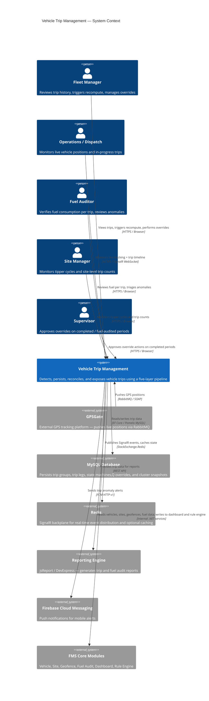

<!--
File: 01-system-context.md
Purpose: C4 Level 1 System Context diagram for Vehicle Trip Management.
         Shows the system as a single box with all external actors and systems.
Dependencies: PRD.md
Last Modified: 2026-03-12
-->

# System Context — Vehicle Trip Management (C4 Level 1)

The Vehicle Trip Management system is shown as a single boundary. External actors and
systems are placed outside, with labeled relationships showing the primary data
or interaction that flows between them.

## Actors

| Actor | Role in Trip Management |
|---|---|
| **Fleet Manager** | Primary consumer: reviews trip history, triggers recompute, performs manual overrides |
| **Operations / Dispatch** | Real-time consumer: monitors in-progress trips on the tracking workspace |
| **Fuel Auditor** | Reviews fuel consumption per trip leg, triages anomalies, verifies reconciliation |
| **Site Manager** | Monitors tipper load cycles and per-site trip counts |
| **Supervisor** | Approves override actions that affect already-reconciled or fuel-audited periods |

## External Systems

| System | Interaction |
|---|---|
| **GPSGate** | Source of all GPS position data — pushes via RabbitMQ (consumed by `GPSGateRabbitMQConsumerService`) |
| **MySQL** | Persistence for all trip entities — accessed via EF Core with Pomelo MySQL provider |
| **Redis** | SignalR backplane for distributing real-time trip events across multiple server instances |
| **Reporting Engine** | Consumes trip data via REST API to generate route analysis and fuel audit reports |
| **Firebase** | Delivers push notifications for trip anomaly alerts to mobile users |
| **FMS Core Modules** | Vehicle registry, site/geofence catalog, fuel audit data, dashboard, rule engine — all read by the trip pipeline |
