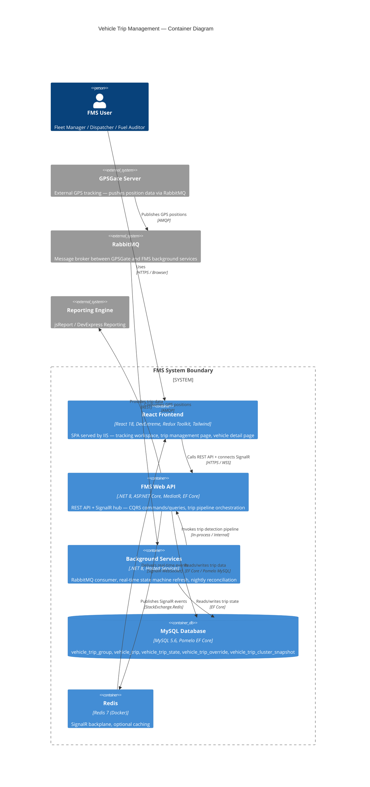

<!--
File: 02-container-diagram.md
Purpose: C4 Level 2 Container diagram for Vehicle Trip Management.
         Shows the major deployable containers and how data flows between them.
Dependencies: PRD.md, AGENTS.md
Last Modified: 2026-03-12
-->

# Container Diagram — Vehicle Trip Management (C4 Level 2)

Zooms into the Vehicle Trip Management system boundary to show the major containers,
their technology, and the connections between them.

## Containers

| Container | Technology | Responsibility |
|---|---|---|
| **React Frontend** | React 18, DevExtreme 23.2, Redux Toolkit, Tailwind CSS (tw-), CRACO | Three access points: Tracking workspace (live), Trip Management page (historical), Vehicle Detail (embedded). Shared service layer (`vehicleTripService.js`), normalizers (`vehicleTripUi.js`), badge components. |
| **FMS Web API** | .NET 8, ASP.NET Core, MediatR 12.5, AutoMapper, EF Core 8 | `VehicleTripsController` exposes REST endpoints. CQRS handlers orchestrate the five-layer pipeline. SignalR hub (`dashboardHub`) pushes trip events. |
| **Background Services** | .NET 8 Hosted Services | `GPSGateRabbitMQConsumerService` — consumes GPS from RabbitMQ, broadcasts via SignalR. `VehicleTripRealtimeRefreshBackgroundService` — periodic state machine processing. `VehicleTripReconciliationBackgroundService` — nightly batch reconciliation. |
| **MySQL Database** | MySQL 5.6 via Pomelo.EntityFrameworkCore.MySql | Six trip-related tables (see diagram 06 for full ERD). Plus existing FMS tables: `vehicle`, `site`, `gps_geofence`. |
| **Redis** | Redis 7 (Docker) | SignalR backplane for distributing trip events (`TripStarted`, `TripInProgress`, `TripCompleted`) across API instances. Optional caching layer. |

## External Systems

| System | Role |
|---|---|
| **GPSGate** | Publishes raw GPS positions to RabbitMQ — the origin of all trip data |
| **RabbitMQ** | Message broker sitting between GPSGate and the FMS background consumer service |
| **Reporting Engine** | Consumes trip data via REST for route analysis and fuel audit reports (jsReport + DevExpress) |

## Data Flow Summary

1. **GPSGate → RabbitMQ → Background Services**: Raw GPS positions ingested
2. **Background Services → Web API (in-process)**: Trip detection pipeline triggered per point or per refresh cycle
3. **Web API → MySQL**: Trip groups, legs, state, overrides persisted
4. **Web API → Redis → React Frontend**: Real-time trip events pushed via SignalR
5. **React Frontend → Web API**: REST calls for trip list, detail, recompute, overrides
6. **Web API → Reporting Engine**: Trip data served for report generation
