<!--
File: 03-backend-component-diagram.md
Purpose: C4 Level 3 Component diagram for the FMS Web API container.
         Shows the five pipeline layers as component groups with service-to-service dependencies.
Dependencies: SERVICES_README.md, PRD.md
Last Modified: 2026-03-12
-->

# Backend Component Diagram — FMS Web API (C4 Level 3)

Zooms into the FMS Web API container to show the five pipeline layers as component groups.
Each service references its actual interface and implementation class from the codebase.

```mermaid
graph TB
    subgraph API["API Layer — FMS.WebClient"]
        Controller["VehicleTripsController<br/><i>REST + MediatR dispatch</i>"]
    end

    subgraph CQRS["CQRS Layer — FMS.Application/Features/VehicleTrips"]
        direction TB
        subgraph Commands
            CmdRecompute["RecomputeVehicleTripsCommand"]
            CmdReconcile["ReconcileVehicleTripsCommand"]
            CmdSplit["SplitVehicleTripCommand"]
            CmdMerge["MergeVehicleTripsCommand"]
            CmdReassign["ReassignVehicleTripSiteCommand"]
            CmdAdd["AddVehicleTripCommand"]
            CmdDelete["DeleteVehicleTripCommand"]
            CmdAdjust["AdjustVehicleTripTimesCommand"]
        end
        subgraph Queries
            QryList["GetVehicleTripsQuery"]
            QryHistory["GetVehicleTripHistoryQuery"]
            QryDetail["GetVehicleTripDetailQuery"]
            QryBreadcrumbs["GetVehicleTripBreadcrumbsQuery"]
            QryInProgress["GetInProgressVehicleTripsQuery"]
            QryOverrideHist["GetVehicleTripOverrideHistoryQuery"]
            QryReconSummary["GetVehicleTripReconciliationSummaryQuery"]
            QryRuleEval["GetVehicleTripRuleEvaluationQuery"]
            QrySettings["GetVehicleTripSettingsQuery"]
            QryLiveOps["GetVehicleTripLiveOperationsReportQuery"]
            QryPreviewCluster["PreviewClusterDetectionQuery"]
            QryPreviewGeofence["PreviewGeofenceDetectionQuery"]
        end
    end

    subgraph Layer1["Layer 1 — GPS Pre-Processing"]
        PreProcessor["IVehicleTripGpsPreProcessor<br/>VehicleTripGpsPreProcessor<br/><i>Filter · Enrich · Buffer</i>"]
        PreProcessorOpts["VehicleTripPreProcessorOptions<br/><i>appsettings: VehicleTrips:PreProcessor</i>"]
    end

    subgraph Layer2["Layer 2 — Real-Time Detection"]
        GeofenceDetect["IVehicleTripGeofenceDetectionService<br/>VehicleTripGeofenceDetectionService<br/><i>AT_SITE → DEPARTING → ARRIVING</i>"]
        ClusterDetect["IVehicleTripClusterDetectionService<br/>VehicleTripClusterDetectionService<br/><i>Progressive cluster discovery</i>"]
        StateMachines["StateMachines/<br/>VehicleTripGeofenceStateMachine<br/>VehicleTripClusterStateMachine<br/>VehicleTripRealtimeDispatcher"]
    end

    subgraph Enrichment["Enrichment & Scoring"]
        FuelContext["IVehicleTripFuelContextService<br/>VehicleTripFuelContextService<br/><i>Fuel at departure/arrival, delta</i>"]
        Confidence["IVehicleTripConfidenceScoringService<br/>VehicleTripConfidenceScoringService<br/><i>0.0–1.0 score + anomaly flags</i>"]
        Grouping["IVehicleTripGroupingService<br/>VehicleTripGroupingService<br/><i>RoundTrip / LoadCycle assembly</i>"]
    end

    subgraph Orchestration["Orchestration"]
        Orchestrator["IVehicleTripOrchestrationService<br/>VehicleTripOrchestrationService<br/><i>Top-level pipeline coordinator</i>"]
    end

    subgraph Layer3["Layer 3 — Reconciliation"]
        Reconciliation["IVehicleTripReconciliationService<br/>VehicleTripReconciliationService<br/><i>Replay · Compare · Classify · Persist</i>"]
    end

    subgraph Layer4["Layer 4 — Manual Override"]
        Override["IVehicleTripManualOverrideService<br/>VehicleTripManualOverrideService<br/><i>Split · Merge · Reassign · Add · Delete · Adjust</i>"]
        Validation["IVehicleTripManualOverrideValidationService<br/>VehicleTripManualOverrideValidationService<br/><i>Physics · timeline · fuel audit lock</i>"]
        Audit["IVehicleTripOverrideAuditService<br/>VehicleTripOverrideAuditService<br/><i>Immutable audit log</i>"]
        Factory["VehicleTripManualOverrideFactory<br/><i>Static builder functions</i>"]
        ModeHelper["VehicleTripDetectionModeHelper<br/><i>ManualOverride:Action · Superseded encoding</i>"]
    end

    subgraph Persistence["Persistence — FMS.Persistence"]
        DbContext["GpsdataContext<br/><i>EF Core DbSets</i>"]
    end

    subgraph SignalRHub["SignalR"]
        Hub["dashboardHub<br/><i>TripStarted · TripInProgress · TripCompleted</i>"]
    end

    %% API → CQRS
    Controller --> Commands
    Controller --> Queries

    %% Commands → Services
    CmdRecompute --> Orchestrator
    CmdReconcile --> Reconciliation
    CmdSplit --> Override
    CmdMerge --> Override
    CmdReassign --> Override
    CmdAdd --> Override
    CmdDelete --> Override
    CmdAdjust --> Override

    %% Preview Queries → Detection Services
    QryPreviewCluster --> ClusterDetect
    QryPreviewGeofence --> GeofenceDetect

    %% Orchestration → Pipeline
    Orchestrator --> GeofenceDetect
    Orchestrator --> ClusterDetect
    Orchestrator --> FuelContext
    Orchestrator --> Confidence
    Orchestrator --> Grouping
    Orchestrator --> DbContext

    %% Detection → PreProcessor
    GeofenceDetect --> PreProcessor
    ClusterDetect --> PreProcessor
    PreProcessor -.-> PreProcessorOpts

    %% State machines
    StateMachines --> GeofenceDetect
    StateMachines --> ClusterDetect

    %% Reconciliation → Orchestration
    Reconciliation --> Orchestrator

    %% Override → Validation → Audit
    Override --> Validation
    Override --> Audit
    Override --> Factory
    Override --> ModeHelper
    Override --> DbContext

    %% Queries → Persistence
    Queries --> DbContext

    %% SignalR events
    Orchestrator --> Hub
    StateMachines --> Hub
```

## Component Groups

### Layer 1 — GPS Pre-Processing
| Component | Responsibility |
|---|---|
| `VehicleTripGpsPreProcessor` | Filters invalid/duplicate points, enriches with Haversine distance + time delta + geofence containment, buffers sliding window per vehicle |
| `VehicleTripPreProcessorOptions` | Configuration POCO from `appsettings.json` — window size, min satellites, max jump, duplicate thresholds, max speed |

### Layer 2 — Real-Time Detection
| Component | Responsibility |
|---|---|
| `VehicleTripGeofenceDetectionService` | Geofence-based detection for `SiteToSite` vehicles — AT_SITE / DEPARTING / ARRIVING state machine |
| `VehicleTripClusterDetectionService` | Cluster-based detection for `Shuttle` vehicles — progressive cluster discovery + classification |
| `VehicleTripGeofenceStateMachine` | Per-vehicle persistent state machine for geofence transitions |
| `VehicleTripClusterStateMachine` | Per-vehicle persistent state machine for cluster transitions |
| `VehicleTripRealtimeDispatcher` | Routes GPS points to the correct state machine based on vehicle movement profile |

### Enrichment & Scoring
| Component | Responsibility |
|---|---|
| `VehicleTripFuelContextService` | Attaches fuel-at-departure, fuel-at-arrival, and fuel-consumed to each trip leg |
| `VehicleTripConfidenceScoringService` | Scores legs (0.0–1.0) and groups, sets anomaly flags (bitmask) |
| `VehicleTripGroupingService` | Assembles legs into RoundTrip or LoadCycle groups with aggregate totals |

### Orchestration
| Component | Responsibility |
|---|---|
| `VehicleTripOrchestrationService` | Single entry point — sequences detection → fuel → confidence → grouping → persistence. Called by commands and background jobs. |

### Layer 3 — Reconciliation
| Component | Responsibility |
|---|---|
| `VehicleTripReconciliationService` | Full-day batch replay, compare vs real-time, classify (Confirmed/Split/Merged/Adjusted/Anomaly), persist reconciled records, flag anomalies |

### Layer 4 — Manual Override
| Component | Responsibility |
|---|---|
| `VehicleTripManualOverrideService` | Executes six operator actions: Split, Merge, Reassign, Add, Delete, Adjust |
| `VehicleTripManualOverrideValidationService` | Guards: mandatory reason, timeline overlap check, physics validation, fuel audit period lock |
| `VehicleTripOverrideAuditService` | Immutable audit log — records action, original values, new values, operator, reason |
| `VehicleTripManualOverrideFactory` | Static builders for cloning state, building entities, building audit payloads |
| `VehicleTripDetectionModeHelper` | Encodes `ManualOverride:Action` and `Superseded:Action:GroupId` detection mode strings |
