<!--
File: 04-frontend-component-diagram.md
Purpose: C4 Level 3 Component diagram for the React Frontend container.
         Shows the three access points, shared service layer, hooks, and SignalR connection.
Dependencies: FRONTEND_PRD.md
Last Modified: 2026-03-17
-->

# Frontend Component Diagram — React Frontend (C4 Level 3)

Zooms into the React Frontend container to show the three access points for trip data,
the shared service and utility layers, and the real-time connection infrastructure.

```mermaid
graph TB
    subgraph Browser["React Frontend — fms.frontend/src"]

        subgraph AccessPoints["Four Access Points"]
            Tracking["VehicleTrackingPage.js<br/><i>Route: /tracking</i><br/>Live view — map + vehicle list + trip panel"]
            TripMgmt["VehicleTripsPage.js<br/><i>Route: /trips</i><br/>Historical grid workbench"]
            VehicleDetail["Vehicle Detail Page<br/><i>Route: /vehicles/:id</i><br/>Embedded trip history panel"]
            PreviewPlayground["ClusterDetectionPreviewPanel.js<br/><i>Route: /vehicles/trips/preview</i><br/>Interactive cluster + geofence detection playground"]
        end

        subgraph TrackingComponents["Tracking Workspace Components"]
            TripPanel["VehicleTrackingTripPanel.js<br/><i>Slide-in: in-progress + recent trips</i>"]
            DetailPopup["VehicleTrackingDetailPopup.js<br/><i>Vehicle detail popup on map</i>"]
        end

        subgraph TripComponents["Trip Management Components"]
            DetailPanel["VehicleTripDetailPanel.js<br/><i>M365 slide panel — group + legs + badges</i>"]
            OverridePanel["VehicleTripOverridePanel.js<br/><i>M365 slide panel — 6 override actions + audit</i>"]
            Badges["VehicleTripBadges.js<br/><i>StatusBadge · ReconciliationBadge ·<br/>ConfidenceBadge · AnomalyBadges · BadgeCluster</i>"]
        end

        subgraph PreviewComponents["Detection Preview Components"]
            PreviewMap["ClusterDetectionPreviewMap.js<br/><i>Google Maps with track, geofence overlays,<br/>classification-colored markers</i>"]
            PreviewResults["ClusterDetectionPreviewResults.js<br/><i>Stops/clusters/site visits + trip legs grids<br/>with ClassificationBadge</i>"]
            PreviewCharts["ClusterDetectionPreviewCharts.js<br/><i>Speed profile + state band chart</i>"]
            PreviewHelp["ClusterDetectionPreviewHelpSlide.js<br/><i>Usage help overlay</i>"]
            PreviewInsights["VehicleTripClusterPreviewInsights.js<br/><i>Analytics explorer — strip charts,<br/>detection summary, comparison metrics</i>"]
        end

        subgraph PreviewPages["Preview Page Wrappers"]
            PreviewPage["VehicleTripClusterPreviewPage.js<br/><i>Route: /vehicles/trips/preview<br/>Permission-gated standalone page</i>"]
            SettingsPage["VehicleTripSettingsPage.js<br/><i>Route: /vehicles/trips/settings<br/>Embeds preview panel + settings tabs</i>"]
        end

        subgraph PreviewUtils["Detection Playground Utilities"]
            GeofencePlayground["geofenceDetectionPlayground.js<br/><i>Ray-casting, Haversine containment,<br/>state machine, classification propagation</i>"]
            ClusterPlayground["clusterDetectionPlayground.js<br/><i>DBSCAN clustering, stop detection,<br/>trip leg builder</i>"]
        end

        subgraph Hooks["Custom Hooks"]
            UseTrips["useVehicleTrackingTrips.js<br/><i>30s poll → inProgressTrips + recentTrips</i>"]
            UseRealtime["useVehicleTrackingRealtime.js<br/><i>SignalR position updates (debounced)</i>"]
        end

        subgraph SharedServices["Shared Service Layer"]
            TripService["vehicleTripService.js<br/><i>All REST calls: list, detail, history,<br/>recompute, override/*, reconcile</i>"]
            TripUi["vehicleTripUi.js<br/><i>normalizeTripGroup · normalizeTripDetail ·<br/>normalizeTripLeg · formatters · badge config ·<br/>anomaly bitmask decoder · planning placeholders</i>"]
        end

        subgraph SignalR["SignalR Connection"]
            SignalRService["vehicleTrackingSignalRService.js<br/><i>Hub: /vehicleTrackingHub<br/>Events: PositionUpdate, ConnectionStatus<br/>⚠️ TripStarted/InProgress/Completed not yet wired</i>"]
            ConnMgr["SignalRConnectionManager<br/><i>Route-based lifecycle management</i>"]
        end
    end

    subgraph Backend["FMS Web API"]
        RestApi["REST API<br/>/api/v1/vehicletrips/*"]
        Hub["dashboardHub<br/>SignalR WebSocket"]
    end

    %% Access point → components
    Tracking --> TripPanel
    Tracking --> DetailPopup
    Tracking --> DetailPanel
    Tracking --> OverridePanel

    TripMgmt --> DetailPanel
    TripMgmt --> OverridePanel

    VehicleDetail --> DetailPanel

    %% Components → shared
    TripPanel --> Badges
    DetailPanel --> Badges
    OverridePanel --> Badges

    TripPanel --> TripUi
    DetailPanel --> TripUi
    OverridePanel --> TripUi
    TripMgmt --> TripUi

    %% Hooks
    Tracking --> UseTrips
    Tracking --> UseRealtime
    UseTrips --> TripService
    UseRealtime --> SignalRService

    %% Service → API calls
    TripService --> RestApi
    TripMgmt -.->|"⚠️ currently uses axiosInstance directly"| RestApi
    DetailPanel --> TripService
    OverridePanel --> TripService

    %% Preview playground
    PreviewPlayground --> PreviewMap
    PreviewPlayground --> PreviewResults
    PreviewPlayground --> PreviewCharts
    PreviewPlayground --> PreviewHelp
    PreviewPlayground --> PreviewInsights
    PreviewPlayground --> TripService
    PreviewPlayground --> GeofencePlayground
    PreviewPlayground --> ClusterPlayground

    %% Page wrappers
    PreviewPage --> PreviewPlayground
    SettingsPage --> PreviewPlayground

    %% SignalR
    SignalRService --> ConnMgr
    Hub --> SignalRService
```

## Access Points

| Access Point | Route | Primary User | Trip Data Source |
|---|---|---|---|
| **Tracking Workspace** | `/tracking` | Operations / dispatch | `useVehicleTrackingTrips` (30s poll) + SignalR positions |
| **Trip Management Page** | `/trips` | Fleet managers / fuel auditors | Direct `vehicleTripService.js` calls on filter submit |
| **Vehicle Detail** | `/vehicles/:id` | Fleet managers | `vehicleTripService.js` per-vehicle history |
| **Detection Preview** | `/vehicles/trips/preview` | Operators / analysts | `vehicleTripService.js` preview endpoints + local playground replay |

## Shared Components

| Component | File | Used By |
|---|---|---|
| `VehicleTripDetailPanel` | `trips/components/VehicleTripDetailPanel.js` | Tracking, Trip Mgmt, Vehicle Detail |
| `VehicleTripOverridePanel` | `trips/components/VehicleTripOverridePanel.js` | Tracking, Trip Mgmt |
| `VehicleTripBadges` | `trips/components/VehicleTripBadges.js` | All panels that show trip data |
| `vehicleTripService` | `trips/services/vehicleTripService.js` | All API calls (except VehicleTripsPage — Gap #5) |
| `vehicleTripUi` | `trips/utils/vehicleTripUi.js` | All components needing normalization/formatting |
| `ClusterDetectionPreviewPanel` | `trips/preview/ClusterDetectionPreviewPanel.js` | Preview playground entry point |
| `ClusterDetectionPreviewMap` | `trips/preview/ClusterDetectionPreviewMap.js` | Preview playground — map with geofence overlays |
| `ClusterDetectionPreviewResults` | `trips/preview/ClusterDetectionPreviewResults.js` | Preview playground — grids with ClassificationBadge |
| `geofenceDetectionPlayground` | `trips/utils/geofenceDetectionPlayground.js` | Preview playground — geofence containment algorithm |
| `clusterDetectionPlayground` | `trips/utils/clusterDetectionPlayground.js` | Preview playground — cluster detection algorithm |
| `VehicleTripClusterPreviewInsights` | `trips/components/VehicleTripClusterPreviewInsights.js` | Preview playground — analytics explorer strips |
| `VehicleTripClusterPreviewPage` | `trips/VehicleTripClusterPreviewPage.js` | Standalone preview page wrapper |
| `VehicleTripSettingsPage` | `trips/VehicleTripSettingsPage.js` | Settings admin page with embedded preview |

## Real-Time Architecture

| Channel | Technology | What It Carries | Status |
|---|---|---|---|
| **SignalR (positions)** | WebSocket via `vehicleTrackingSignalRService` | `VehicleLocationUpdate`, `VehicleConnectionStatusChanged` | ✅ Wired |
| **SignalR (trips)** | WebSocket via `dashboardHub` | `TripStarted`, `TripInProgress`, `TripCompleted` | ⚠️ Backend emits, frontend not listening |
| **Polling** | REST `GET /vehicletrips` every 30s | All trip groups in 24h window | ✅ Active fallback |

## Permission Gates

| Permission | Where Enforced | Controls |
|---|---|---|
| `_Read_Vehicle` | API controller | Access to any trip endpoint |
| `canManageTrips` | Frontend (JWT) | Recompute button, override panel actions |
