<!--
File: 05-service-dependency-diagram.md
Purpose: Code-level dependency map showing exact interface relationships between
         all VehicleTrips services, matching the SERVICES_README dependency map.
Dependencies: SERVICES_README.md
Last Modified: 2026-03-12
-->

# Service Dependency Diagram

Exact dependency map for all services in `FMS.Application/Features/VehicleTrips/Services/`
and `FMS.Application/Features/VehicleTrips/StateMachines/`. Each node references
the actual interface or class name from the codebase.

```mermaid
graph TD
    subgraph Orchestration
        Orch["IVehicleTripOrchestrationService<br/><small>VehicleTripOrchestrationService</small>"]
    end

    subgraph Detection["Layer 2 — Detection"]
        Geofence["IVehicleTripGeofenceDetectionService<br/><small>VehicleTripGeofenceDetectionService</small>"]
        Cluster["IVehicleTripClusterDetectionService<br/><small>VehicleTripClusterDetectionService</small>"]
    end

    subgraph PreProcessing["Layer 1 — Pre-Processing"]
        PreProc["IVehicleTripGpsPreProcessor<br/><small>VehicleTripGpsPreProcessor</small>"]
        Options["VehicleTripPreProcessorOptions<br/><small>IOptions&lt;T&gt; from appsettings / Vehicle Trips Settings</small>"]
    end

    subgraph EnrichScore["Enrichment & Scoring"]
        Fuel["IVehicleTripFuelContextService<br/><small>VehicleTripFuelContextService</small>"]
        Confidence["IVehicleTripConfidenceScoringService<br/><small>VehicleTripConfidenceScoringService</small>"]
        Grouping["IVehicleTripGroupingService<br/><small>VehicleTripGroupingService</small>"]
    end

    subgraph Recon["Layer 3 — Reconciliation"]
        Reconciliation["IVehicleTripReconciliationService<br/><small>VehicleTripReconciliationService</small>"]
    end

    subgraph Override["Layer 4 — Manual Override"]
        ManualOverride["IVehicleTripManualOverrideService<br/><small>VehicleTripManualOverrideService</small>"]
        OverrideValid["IVehicleTripManualOverrideValidationService<br/><small>VehicleTripManualOverrideValidationService</small>"]
        OverrideAudit["IVehicleTripOverrideAuditService<br/><small>VehicleTripOverrideAuditService</small>"]
        OverrideFactory["VehicleTripManualOverrideFactory<br/><small>Static helper</small>"]
    end

    subgraph StateMachines["Real-Time State Machines"]
        Dispatcher["VehicleTripRealtimeDispatcher"]
        GeoSM["VehicleTripGeofenceStateMachine"]
        ClusterSM["VehicleTripClusterStateMachine"]
    end

    subgraph Helpers["Support / Helpers"]
        ModeHelper["VehicleTripDetectionModeHelper<br/><small>Static — ManualOverride:Action encoding</small>"]
    end

    subgraph Persistence["Data Access"]
        DbContext["GpsdataContext"]
    end

    subgraph PreviewQueries["Preview Queries"]
        PreviewCluster["PreviewClusterDetectionQuery<br/><small>PreviewClusterDetectionQueryHandler</small>"]
        PreviewGeofence["PreviewGeofenceDetectionQuery<br/><small>PreviewGeofenceDetectionQueryHandler</small>"]
    end

    subgraph Settings["Settings"]
        SettingsService["IVehicleTripSettingsService<br/><small>VehicleTripSettingsService</small>"]
        GeofenceOpts["VehicleTripGeofenceDetectionOptions<br/><small>IOptions&lt;T&gt; from appsettings / Vehicle Trips Settings</small>"]
        ClusterOpts["VehicleTripClusterDetectionOptions<br/><small>IOptions&lt;T&gt; from appsettings / Vehicle Trips Settings</small>"]
    end

    %% Orchestration dependencies
    Orch -->|"selects engine by profile"| Geofence
    Orch -->|"selects engine by profile"| Cluster
    Orch --> Fuel
    Orch -->|"ScoreTrips"| Confidence
    Orch -->|"ScoreGroups"| Confidence
    Orch --> Grouping
    Orch --> DbContext

    %% Detection → PreProcessor
    Geofence -->|"shared cleaned GPS stream"| PreProc
    Cluster -->|"shared cleaned GPS stream"| PreProc
    PreProc -.->|"IOptions"| Options

    %% Reconciliation → Orchestration
    Reconciliation --> Orch

    %% Manual Override chain
    ManualOverride --> OverrideValid
    ManualOverride --> OverrideAudit
    ManualOverride --> OverrideFactory
    ManualOverride --> ModeHelper
    ManualOverride --> DbContext

    %% State Machines
    Dispatcher --> GeoSM
    Dispatcher --> ClusterSM
    GeoSM --> Geofence
    ClusterSM --> Cluster

    %% Preview Queries → Detection Services (dry-run, no persistence)
    PreviewCluster -->|"PreviewDetectionAsync"| Cluster
    PreviewGeofence -->|"PreviewDetectionAsync"| Geofence
    PreviewGeofence -.->|"GpsGeofenceGroupMember"| DbContext

    %% Settings
    SettingsService --> DbContext
    Geofence -.->|"IOptions"| GeofenceOpts
    Cluster -.->|"IOptions"| ClusterOpts
```



## Dependency Summary Table

| Service | Depends On |
|---|---|
| `VehicleTripOrchestrationService` | `IVehicleTripGeofenceDetectionService`, `IVehicleTripClusterDetectionService`, `IVehicleTripFuelContextService`, `IVehicleTripConfidenceScoringService`, `IVehicleTripGroupingService`, `GpsdataContext` |
| `VehicleTripGeofenceDetectionService` | `IVehicleTripGpsPreProcessor`, `GpsdataContext` (sites + geofences) |
| `VehicleTripClusterDetectionService` | `IVehicleTripGpsPreProcessor`, `GpsdataContext` (sites + geofences for hybrid labeling) |
| `VehicleTripGpsPreProcessor` | `IOptions<VehicleTripPreProcessorOptions>` |
| `VehicleTripReconciliationService` | `IVehicleTripOrchestrationService`, `GpsdataContext` |
| `VehicleTripManualOverrideService` | `IVehicleTripManualOverrideValidationService`, `IVehicleTripOverrideAuditService`, `VehicleTripManualOverrideFactory` (static), `VehicleTripDetectionModeHelper` (static), `GpsdataContext` |
| `VehicleTripManualOverrideValidationService` | `GpsdataContext` |
| `VehicleTripOverrideAuditService` | `GpsdataContext` |
| `VehicleTripRealtimeDispatcher` | `VehicleTripGeofenceStateMachine`, `VehicleTripClusterStateMachine` |
| `VehicleTripGeofenceStateMachine` | `IVehicleTripGeofenceDetectionService` |
| `VehicleTripClusterStateMachine` | `IVehicleTripClusterDetectionService` |
| `PreviewClusterDetectionQueryHandler` | `IVehicleTripClusterDetectionService` |
| `PreviewGeofenceDetectionQueryHandler` | `IVehicleTripGeofenceDetectionService`, `GpsdataContext` (GpsGeofenceGroupMember for group filtering) |
| `VehicleTripSettingsService` | `GpsdataContext` |

## Detection Strategy Configuration

The trip pipeline supports two detection strategies:

- `Geofence Detection`
- `Cluster Detection`

Operationally, the selected strategy should be configurable from Vehicle Trips Settings at `../vehicle/trips/settings`.
At code level, orchestration still resolves the concrete detection engine through:

- `IVehicleTripGeofenceDetectionService`
- `IVehicleTripClusterDetectionService`

## Why Both Detection Strategies Depend on `VehicleTripGpsPreProcessor`

Both detection engines consume the same pre-processed GPS stream before any trip-state logic runs.
This keeps geofence-based and cluster-based detection aligned on one cleaned timeline instead of each service applying its own filtering rules.

The shared pre-processor exists because raw GPS data must be cleaned for issues such as:

- invalid coordinates and invalid point flags
- duplicate positions within configured distance and time windows
- timestamp anomalies handled through chronological ordering and normalized time deltas
- impossible jumps and speed filtering through maximum jump and implied-speed thresholds

These thresholds are provided by `VehicleTripPreProcessorOptions` and are documented as configuration-backed settings, so they should be surfaced under Vehicle Trips Settings rather than hard-coded per detection strategy.

## Call Direction

All dependencies flow **downward** through the layers:

```
Commands/Background Jobs
        ↓
    Orchestration
        ↓
    Detection ← PreProcessor
        ↓
    Enrichment (Fuel → Confidence → Grouping)
        ↓
    Persistence (GpsdataContext)
```

Reconciliation wraps Orchestration (full pipeline replay).
Manual Override operates independently, writing directly to persistence with validation and audit.
