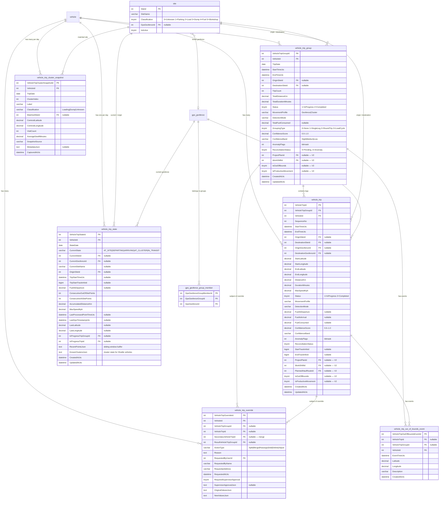

<!--
File: 06-entity-relationship-diagram.md
Purpose: Database ERD showing all trip-related tables, their columns, relationships,
         and foreign keys to existing FMS tables.
Dependencies: mysql-phase1 through phase4 SQL files, domain entities
Last Modified: 2026-03-17
-->

# Entity Relationship Diagram

Database tables for Vehicle Trip Management. Built across four SQL migration phases.
Foreign keys reference existing FMS tables (`vehicle`, `site`, `gps_geofence`, `gps_geofence_group_member`).

## Tables by Migration Phase

| Phase | SQL File | Tables / Columns Added |
|---|---|---|
| **Phase 1** | `mysql-phase1-trip-management.sql` | `vehicle_trip_group` (core), `vehicle_trip` (core) |
| **Phase 2** | `mysql-phase2-trip-management-persistence.sql` | + `GroupingType`, `ConfidenceScore`, `ConfidenceBand`, `AnomalyFlags`, `ReconciliationStatus` |
| **Phase 3** | `mysql-phase3-trip-management-status-and-fuel.sql` | + `Status`, `TotalFuelConsumed`, `FuelAtDeparture`, `FuelAtArrival`, `FuelConsumed`, `StartTrackInfoId`, `EndTrackInfoId` |
| **Phase 4** | `mysql-phase4-trip-management-state-planning-audit.sql` | + `vehicle_trip_state`, `vehicle_trip_override`, `vehicle_trip_cluster_snapshot`, planning fields (`ProjectPlanId`, `WorkShiftId`, etc.) |
| **Phase 5** | — (schema only: `SiteConfiguration`) | + `site.classification` TINYINT column (0=Unknown, 1=Parking, 2=Load, 3=Dump, 4=Fuel, 5=Workshop) |

## Enum Reference

| Column | Values |
|---|---|
| `Status` | `1 = InProgress`, `2 = Completed` |
| `GroupingType` | `0 = None`, `1 = SingleLeg`, `2 = RoundTrip`, `3 = LoadCycle` |
| `ReconciliationStatus` | `0 = Pending`, `1 = Confirmed`, `2 = Split`, `3 = Merged`, `4 = Adjusted`, `5 = Anomaly` |
| `AnomalyFlags` (bitmask) | `1 = LowConfidence`, `2 = UnknownEndpoint`, `4 = GpsGap`, `8 = OffSiteIdle`, `16 = UnmatchedReturn`, `32 = MissingFuel`, `64 = NegativeFuel`, `128 = UnrealisticSpeed`, `256 = AsymmetricCycle`, `512 = NoReturn`, `1024 = WeakFuel`, `2048 = SuspiciousFuelRate` |
| `ActionType` (override) | `Split`, `Merge`, `Reassign`, `Add`, `Delete`, `Adjust` |
| `Classification` (cluster) | `Loading`, `Dump`, `Unknown` |
| `SiteClassification` (site) | `0 = Unknown`, `1 = Parking`, `2 = Load`, `3 = Dump`, `4 = Fuel`, `5 = Workshop` |
| `CurrentState` (state machine) | `AT_SITE`, `DEPARTING`, `ARRIVING`, `AT_CLUSTER`, `IN_TRANSIT` |
