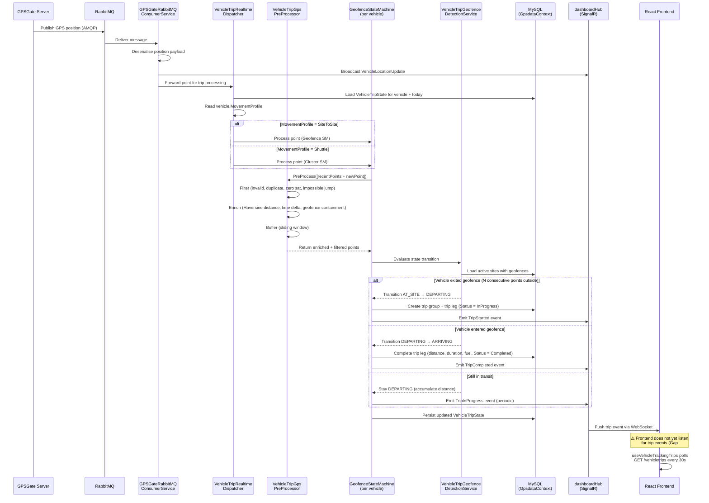

<!--
File: 07-seq-realtime-trip-detection.md
Purpose: Sequence diagram showing the real-time trip detection flow from GPS point
         arrival through to frontend update.
Dependencies: PRD.md, SERVICES_README.md, FRONTEND_PRD.md
Last Modified: 2026-03-12
-->

# Sequence: Real-Time Trip Detection

A GPS point arrives from GPSGate, flows through the five-layer pipeline, and reaches
the frontend. This diagram shows the happy path for a geofence-based detection
(cluster detection follows the same flow with a different state machine).

## Participants

| Participant | Actual Component |
|---|---|
| GPSGate Server | External GPS tracking platform |
| RabbitMQ | Message broker (AMQP) |
| GPSGateRabbitMQConsumerService | `FMS.BackgroundServices/VehicleTracking/GPSGateRabbitMQConsumerService.cs` |
| VehicleTripRealtimeDispatcher | `FMS.Application/Features/VehicleTrips/StateMachines/VehicleTripRealtimeDispatcher.cs` |
| VehicleTripGpsPreProcessor | `FMS.Application/Features/VehicleTrips/Services/VehicleTripGpsPreProcessor.cs` |
| GeofenceStateMachine | `FMS.Application/Features/VehicleTrips/StateMachines/VehicleTripGeofenceStateMachine.cs` |
| VehicleTripGeofenceDetectionService | `FMS.Application/Features/VehicleTrips/Services/VehicleTripGeofenceDetectionService.cs` |
| MySQL (GpsdataContext) | `FMS.Persistence/DataAccess/GpsdataContext.cs` |
| dashboardHub (SignalR) | SignalR hub — publishes `TripStarted`, `TripInProgress`, `TripCompleted` |
| React Frontend | `useVehicleTrackingTrips.js` + `vehicleTrackingSignalRService.js` |

## Key Behaviors

1. **Position and trip processing are decoupled**: The consumer broadcasts the position update via SignalR immediately (so the map updates), then forwards the point to the trip dispatcher asynchronously.
2. **State recovery**: The dispatcher loads `VehicleTripState` from the database on each point, ensuring recovery after service restart.
3. **Noise filtering**: The PreProcessor's sliding window and the N-consecutive-points guard prevent single noisy points from triggering false state transitions.
4. **In-progress persistence**: Trips in DEPARTING/IN_TRANSIT state are persisted with `Status = InProgress` so the API can return them for the tracking page.
