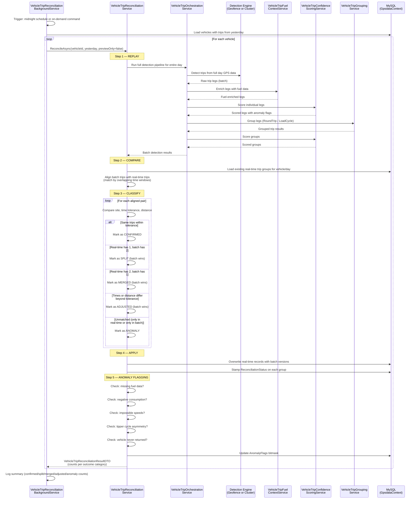

<!--
File: 08-seq-end-of-day-reconciliation.md
Purpose: Sequence diagram showing the nightly end-of-day reconciliation flow.
Dependencies: PRD.md section 10, SERVICES_README.md
Last Modified: 2026-03-12
-->

# Sequence: End-of-Day Reconciliation

The reconciliation service runs after midnight (or on demand) to clean up real-time
detection artifacts by replaying the full day's GPS data in batch and comparing
against the real-time trip records.

## Reconciliation Outcome Categories

| Category | Condition | Resolution |
|---|---|---|
| **Confirmed** | Same trips, same sites, times within tolerance | Keep real-time records as-is, stamp `ReconciliationStatus = 1` |
| **Split** | Real-time: 1 trip → Batch: 2 trips | Batch version wins — single record split into two |
| **Merged** | Real-time: 2 trips → Batch: 1 trip | Batch version wins — two records merged into one |
| **Adjusted** | Same trip count, but times/distance differ | Batch version wins — values updated |
| **Anomaly** | Unmatched trips, or anomaly conditions flagged | Flagged for manual review |

## Anomaly Checks Performed

| Check | Anomaly Flag Bit | Description |
|---|---|---|
| Missing fuel data | `32` (MissingFuelData) | No fuel telemetry during trip window |
| Negative consumption | `64` (NegativeFuelConsumption) | Fuel at arrival > fuel at departure |
| Impossible speed | `128` (UnrealisticSpeed) | Speed exceeds physically plausible threshold |
| Tipper cycle asymmetry | `256` (AsymmetricCycle) | Loading/dump visits don't pair evenly |
| No return to origin | `512` (NoReturnToOrigin) | Vehicle departed but never returned to any known site |

## Trigger Modes

| Mode | Source | How |
|---|---|---|
| **Scheduled** | `VehicleTripReconciliationBackgroundService` | Fires after midnight, processes previous day |
| **On-demand** | `ReconcileVehicleTripsCommand` via API | `POST /vehicletrips/reconcile` (permission-gated) |
| **Preview** | Same command with `previewOnly = true` | Returns diff without writing to database |
