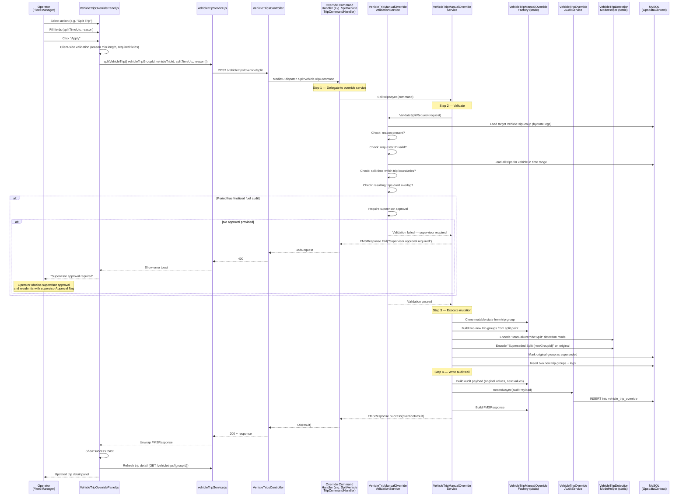

<!--
File: 09-seq-manual-override.md
Purpose: Sequence diagram showing the manual override flow from operator action
         through validation, mutation, audit trail, and frontend refresh.
Dependencies: PRD.md section 11, SERVICES_README.md
Last Modified: 2026-03-12
-->

# Sequence: Manual Override

An operator selects a correction action in the Override Panel. The request flows
through validation, mutation, and audit before returning to the frontend.

## Six Override Actions

| Action | Command | Key Validation |
|---|---|---|
| **Split** | `SplitVehicleTripCommand` | Split time must be within trip boundaries |
| **Merge** | `MergeVehicleTripsCommand` | Trips must be consecutive for the same vehicle |
| **Reassign Site** | `ReassignVehicleTripSiteCommand` | Target site must exist (when siteId provided) |
| **Add Trip** | `AddVehicleTripCommand` | Time range must not overlap existing trips |
| **Delete Trip** | `DeleteVehicleTripCommand` | Trip must exist and not already be superseded |
| **Adjust Times** | `AdjustVehicleTripTimesCommand` | Arrival cannot be before departure; no overlaps |

## Validation Checks (All Actions)

| Check | Description |
|---|---|
| Mandatory reason | `reason` field must be non-empty |
| Valid requester | `requestedByUserId` must reference a valid user |
| Timeline check | Resulting trips must not create overlaps in the vehicle's schedule |
| Physics check | Arrival time cannot precede departure time |
| Fuel audit lock | If the period has a finalized fuel audit, supervisor approval is required |

## Audit Trail Record

Every override writes to `vehicle_trip_override`:

| Field | Source |
|---|---|
| `ActionType` | The action performed (Split, Merge, etc.) |
| `OriginalValuesJson` | Snapshot of the trip group before mutation |
| `NewValuesJson` | Snapshot of the trip group after mutation |
| `RequestedByUserId` / `RequestedByName` | Operator identity from JWT |
| `RequestIpAddress` | Captured from HTTP context |
| `Reason` | Operator-provided justification text |
| `SupervisorApprovalJson` | If supervisor approval was required and provided |
