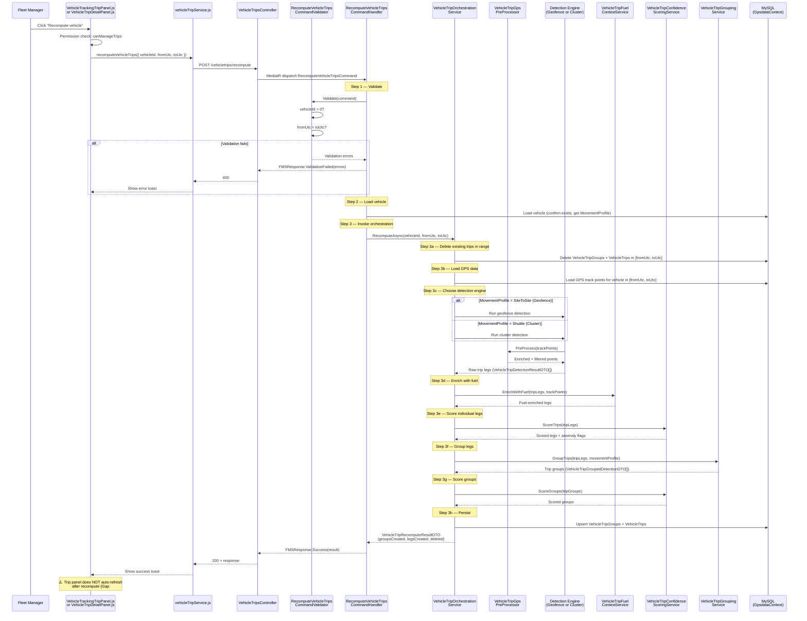

<!--
File: 10-seq-recompute.md
Purpose: Sequence diagram showing the user-triggered recompute flow through the
         full orchestration pipeline.
Dependencies: PRD.md, SERVICES_README.md
Last Modified: 2026-03-12
-->

# Sequence: Recompute Vehicle Trips

A user triggers a recompute from the tracking page or vehicle detail panel.
The command handler invokes the orchestration service which runs the full
detection → enrichment → scoring → grouping → persistence pipeline.

## Pipeline Steps (Orchestration Service)

| Step | Service | Action |
|---|---|---|
| 3a | `GpsdataContext` | Delete existing `VehicleTripGroup` + `VehicleTrip` records in the date range |
| 3b | `GpsdataContext` | Load GPS track points from the existing tracking data store |
| 3c | `GeofenceDetection` or `ClusterDetection` | Run detection using the vehicle's configured movement profile |
| 3d | `FuelContextService` | Attach fuel levels at departure/arrival + compute consumed |
| 3e | `ConfidenceScoringService.ScoreTrips` | Assign 0.0–1.0 confidence per leg + set anomaly flags |
| 3f | `GroupingService` | Assemble legs into `RoundTrip` or `LoadCycle` groups |
| 3g | `ConfidenceScoringService.ScoreGroups` | Score group-level confidence + coherence checks |
| 3h | `GpsdataContext` | Upsert new trip groups and legs to database |

## Result DTO

`VehicleTripRecomputeResultDTO` contains:

| Field | Description |
|---|---|
| `groupsCreated` | Number of new trip groups persisted |
| `tripsCreated` | Number of new trip legs persisted |
| `groupsDeleted` | Number of old groups removed |
| `tripsDeleted` | Number of old legs removed |
| `vehicleId` | The vehicle that was recomputed |
| `fromUtc` / `toUtc` | The time range that was reprocessed |

## Frontend Feedback

| Current | Required (Gap #6) |
|---|---|
| DevExtreme `notify` toast with success/error message | Loading spinner while recompute runs |
| No trip panel refresh | Call `refreshTrips()` from `useVehicleTrackingTrips` after completion |
