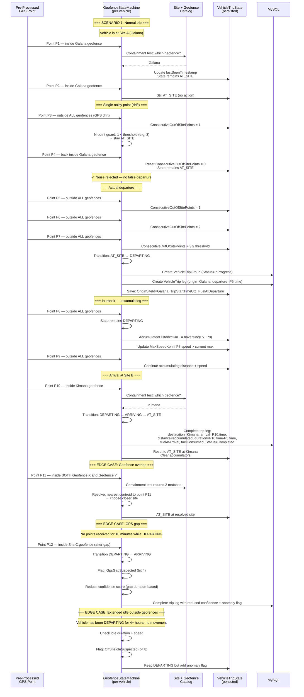
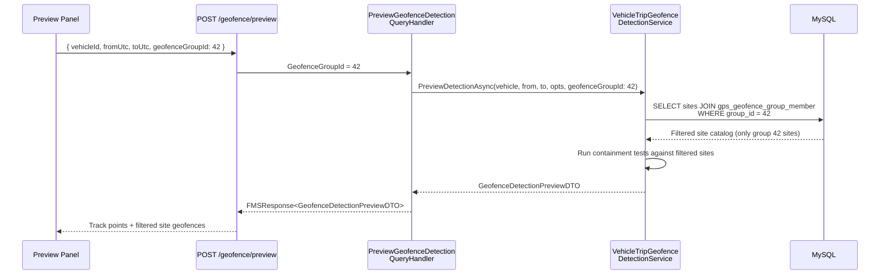
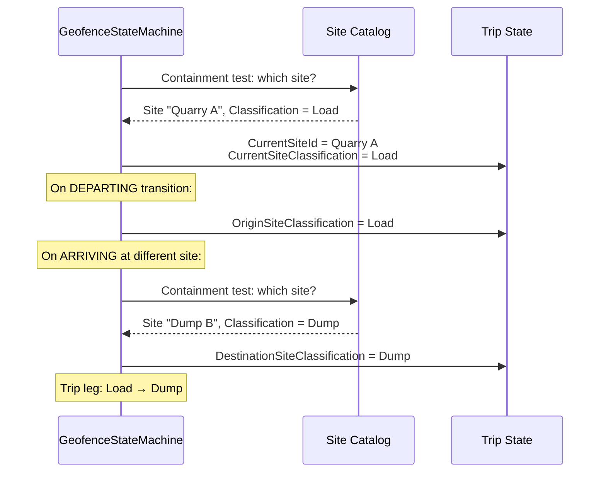

<!--
File: 11-seq-geofence-state-machine.md
Purpose: Point-by-point sequence showing the geofence detector state machine transitions
         including noise filter and edge cases.
Dependencies: PRD.md section 9.1
Last Modified: 2026-03-12
-->

# Sequence: Geofence State Machine — Point-by-Point

Detailed walkthrough of the geofence detector's three-state machine processing
individual GPS points. Includes the N-consecutive-points noise filter and
edge case handling.



## State Transition Summary

| From | To | Trigger | Guard |
|---|---|---|---|
| `AT_SITE` | `DEPARTING` | Point outside all geofences | N consecutive points outside (noise filter) |
| `AT_SITE` | `AT_SITE` | Point still inside current geofence | — |
| `DEPARTING` | `ARRIVING` → `AT_SITE` | Point inside any geofence | — |
| `DEPARTING` | `DEPARTING` | Point outside all geofences | Accumulate distance, update max speed |
| `ARRIVING` | `DEPARTING` | Vehicle exits the new site's geofence | N consecutive points outside |

## Noise Filter Mechanism

The N-consecutive-points guard prevents single GPS drift points from triggering false departures:

```
ConsecutiveOutOfSitePoints < N → stay AT_SITE (increment counter)
ConsecutiveOutOfSitePoints ≥ N → transition to DEPARTING
Point returns inside geofence → reset counter to 0
```

Default threshold `N = 3` (configurable).

## Edge Cases

| Case | Handling |
|---|---|
| **Geofence overlap** | Use nearest centroid distance to resolve which site |
| **GPS gap** | Complete the trip but set `GpsGapSuspected` anomaly flag and reduce confidence |
| **Extended idle outside** | Keep DEPARTING but flag `OffSiteIdleSuspected` for review |
| **Round trip** | `Origin → Destination → same Origin` pattern detected by grouping service post-detection |

## Group-Filtered Detection (Preview Mode)

When `geofenceGroupId` is provided (e.g., from the preview playground), the site catalog
is filtered before detection begins:



## Classification in Containment Test

When a containment test resolves a site, the site’s `Classification` is propagated:


