<!--
File: 12-seq-cluster-discovery.md
Purpose: Sequence diagram showing progressive cluster discovery for tipper/shuttle vehicles.
Dependencies: PRD.md section 9.2
Last Modified: 2026-03-12
-->

# Sequence: Cluster Discovery

Progressive cluster discovery for Shuttle/Tipper vehicles where trip endpoints
are not known in advance. Clusters are built incrementally through the day,
classification refines over multiple cycles.

```mermaid
sequenceDiagram
    participant GPS as Pre-Processed<br/>GPS Points
    participant SM as ClusterStateMachine<br/>(per vehicle)
    participant Detection as VehicleTripCluster<br/>DetectionService
    participant Sites as Site + Geofence<br/>Catalog
    participant State as VehicleTripState<br/>(persisted)
    participant DB as MySQL

    Note over SM: === START OF DAY — No clusters known ===
    SM->>State: Load KnownClustersJson → empty []

    Note over SM: === First significant stop ===
    GPS->>SM: Points — vehicle moving (speed > 3 km/h)
    SM->>SM: State: IN_TRANSIT (or initial)

    GPS->>SM: Point — speed drops below 3 km/h
    SM->>SM: Start dwell timer

    GPS->>SM: Points — speed < 3 km/h for 90+ seconds
    SM->>SM: ✅ Significant stop detected!

    SM->>Detection: Check against known clusters
    Detection-->>SM: No known clusters — create new one

    SM->>SM: Create Cluster A at current position
    SM->>SM: Label: "Cluster-A" (auto-generated)
    SM->>SM: Classification: provisional "Loading" (first stop assumption)
    SM->>State: KnownClusters = [{ A: centroid, visits: 1, avgDwell: 2min }]
    SM->>SM: Transition: → AT_CLUSTER (Cluster A)

    Note over SM: === Vehicle departs Cluster A ===
    GPS->>SM: Points — speed > 3 km/h (moving away from Cluster A)
    SM->>SM: Transition: AT_CLUSTER → IN_TRANSIT
    SM->>DB: Create trip leg (origin=Cluster A, departure=now, Status=InProgress)
    SM->>State: Accumulate distance as vehicle moves

    Note over SM: === Second significant stop ===
    GPS->>SM: Points — speed < 3 km/h for 90+ seconds
    SM->>SM: ✅ Significant stop detected!

    SM->>Detection: Check against known clusters
    Detection->>Detection: Distance from Cluster A centroid = 3.2 km<br/>→ exceeds 150m radius → NOT Cluster A

    SM->>SM: Create Cluster B at current position
    SM->>SM: Label: "Cluster-B" (auto-generated)
    SM->>SM: Classification: provisional "Dump" (second stop assumption)
    SM->>State: KnownClusters = [A, B]
    SM->>SM: Transition: IN_TRANSIT → AT_CLUSTER (Cluster B)
    SM->>DB: Complete trip leg (dest=Cluster B, Status=Completed)

    Note over SM: === Hybrid labeling check ===
    SM->>Sites: Does Cluster B centroid fall inside any site geofence?
    alt Cluster B is inside Site X geofence
        Sites-->>SM: Site X matched
        SM->>SM: Replace label: "Cluster-B" → "Site X"
        SM->>State: MatchedSiteId = Site X
    else No geofence match
        Sites-->>SM: No match
        SM->>SM: Keep auto-generated label "Cluster-B"
    end

    Note over SM: === Vehicle returns to Cluster A ===
    GPS->>SM: Points — speed > 3 km/h (departs Cluster B)
    SM->>SM: IN_TRANSIT
    SM->>DB: Create trip leg (origin=Cluster B, Status=InProgress)

    GPS->>SM: Points — speed < 3 km/h for 90+ seconds
    SM->>Detection: Check against known clusters
    Detection->>Detection: Distance from Cluster A centroid = 45m<br/>→ within 150m radius → IS Cluster A

    SM->>SM: Match to existing Cluster A (visit #2)
    SM->>State: Cluster A: visits=2, update avgDwell
    SM->>SM: Transition: IN_TRANSIT → AT_CLUSTER (Cluster A)
    SM->>DB: Complete trip leg (dest=Cluster A, Status=Completed)

    Note over SM: === CYCLE 1 COMPLETE: A → B → A ===
    Note over SM: Classification still provisional

    Note over SM: === Cycle 2: A → B → A (again) ===
    SM->>SM: Cluster A: visits=3, avgDwell=4.5min
    SM->>SM: Cluster B: visits=2, avgDwell=1.2min

    Note over SM: === Cycle 3: Classification refinement ===
    SM->>SM: Cluster A: visits=4, avgDwell=5.1min
    SM->>SM: Cluster B: visits=3, avgDwell=1.0min

    SM->>Detection: Enough cycles (≥3) — refine classification
    Detection->>Detection: Compare average dwell times:
    Detection->>Detection: Cluster A avgDwell (5.1min) > Cluster B avgDwell (1.0min)
    Detection->>Detection: Longest dwell = LOADING (Cluster A)
    Detection->>Detection: Shortest dwell = DUMP (Cluster B)
    Detection-->>SM: Reclassify: A=Loading, B=Dump

    SM->>DB: Update cluster_snapshot: A=Loading, B=Dump
    SM->>DB: Update trip legs with finalized labels

    Note over SM: === New stop far from A and B ===
    GPS->>SM: Significant stop 2.5 km from both A and B

    SM->>Detection: Check against all known clusters
    Detection->>Detection: Distance from A = 2.5km > 150m
    Detection->>Detection: Distance from B = 1.8km > 150m
    Detection-->>SM: No match → create Cluster C

    SM->>SM: Create Cluster C (provisional "Unknown")
    SM->>State: KnownClusters = [A, B, C]
```

## Cluster Detection Parameters

| Parameter | Default | Description |
|---|---|---|
| Stop speed threshold | 3 km/h | Vehicle speed below which a stop is considered |
| Minimum stop duration | 90 seconds | How long vehicle must be stopped to register |
| Cluster radius | 150 meters | Maximum distance from centroid to match an existing cluster |
| Minimum trip distance | 0.50 km | Suppress very short movements between clusters |
| Minimum trip duration | 2 minutes | Suppress very brief trips |

All thresholds are configurable (not hard-coded).

## Classification Logic

| Criterion | Classification |
|---|---|
| Longest average dwell time | **Loading** (assumed heavy material loading takes longer) |
| Shortest average dwell time | **Dump** (assumed quick dump and return) |
| Insufficient data (< 3 cycles) | **Unknown** (provisional) |

## Cluster Snapshot Persistence

Each cluster's state is captured in `vehicle_trip_cluster_snapshot`:

| Field | Purpose |
|---|---|
| `ClusterIndex` | Sequential index (0, 1, 2, …) |
| `Label` | Auto-generated or site-derived name |
| `Classification` | Loading / Dump / Unknown |
| `MatchedSiteId` | If centroid falls inside a known geofence |
| `CentroidLatitude/Longitude` | Geometric center of all stops in the cluster |
| `VisitCount` | How many times the vehicle visited this cluster |
| `AverageDwellMinutes` | Average time spent per visit |

## Hybrid Labeling

When a cluster centroid falls inside a known site geofence:
1. The site name replaces the auto-generated cluster label for display
2. `MatchedSiteId` is populated for database linkage
3. This improves reporting readability (e.g., "Galana Quarry" instead of "Cluster-A")
