<!--
File: 13-seq-fuel-enrichment.md
Purpose: Sequence diagram showing the fuel enrichment and confidence scoring pipeline
         after trip detection.
Dependencies: SERVICES_README.md, PRD.md
Last Modified: 2026-03-12
-->

# Sequence: Fuel Enrichment

After trip legs are detected, the fuel context service enriches them with fuel
telemetry data, then the confidence scoring service evaluates quality and flags
anomalies.

```mermaid
sequenceDiagram
    participant Orch as VehicleTripOrchestration<br/>Service
    participant Fuel as VehicleTripFuel<br/>ContextService
    participant Scoring as VehicleTripConfidence<br/>ScoringService
    participant DB as MySQL<br/>(GpsdataContext)

    Note over Orch: Detection complete — raw trip legs available

    Orch->>Fuel: EnrichWithFuel(tripLegs[], trackPoints[])

    loop For each trip leg
        Fuel->>Fuel: Find GPS point nearest to leg.StartTimeUtc
        Fuel->>Fuel: Read fuelLevel from departure point → FuelAtDeparture
        Fuel->>Fuel: Find GPS point nearest to leg.EndTimeUtc
        Fuel->>Fuel: Read fuelLevel from arrival point → FuelAtArrival
        Fuel->>Fuel: Compute FuelConsumed = FuelAtDeparture - FuelAtArrival
        Fuel->>Fuel: Floor FuelConsumed at 0 (prevent negative from refill mid-trip)

        alt No fuel telemetry at departure or arrival
            Fuel->>Fuel: FuelAtDeparture = null, FuelAtArrival = null
            Fuel->>Fuel: FuelConsumed = null
            Fuel->>Fuel: Flag: candidate for MissingFuelData
        end

        Fuel->>Fuel: Attach fuel fields to trip leg DTO
    end

    Fuel-->>Orch: Fuel-enriched trip legs

    Note over Orch: Step 2 — Score individual legs

    Orch->>Scoring: ScoreTrips(enrichedTripLegs[])

    loop For each trip leg
        Note over Scoring: === Confidence Score Calculation ===

        Scoring->>Scoring: Start at 1.0

        alt Missing origin or destination site
            Scoring->>Scoring: Deduct 0.15 — UnknownOriginOrDestination (bit 2)
        end

        alt GPS gap detected (time delta > threshold between points)
            Scoring->>Scoring: Deduct 0.10–0.25 based on gap duration
            Scoring->>Scoring: Flag: GpsGapSuspected (bit 4)
        end

        alt No fuel data available
            Scoring->>Scoring: Deduct 0.10
            Scoring->>Scoring: Flag: MissingFuelData (bit 32)
        end

        alt Weak fuel data (only partial readings)
            Scoring->>Scoring: Deduct 0.05
            Scoring->>Scoring: Flag: WeakFuelData (bit 1024)
        end

        alt FuelConsumed < 0 (negative — possible refill mid-trip)
            Scoring->>Scoring: Deduct 0.20
            Scoring->>Scoring: Flag: NegativeFuelConsumption (bit 64)
        end

        alt MaxSpeedKph exceeds plausible threshold
            Scoring->>Scoring: Deduct 0.15
            Scoring->>Scoring: Flag: UnrealisticSpeed (bit 128)
        end

        alt Fuel consumption rate suspiciously high or low
            Scoring->>Scoring: Deduct 0.10
            Scoring->>Scoring: Flag: SuspiciousFuelRate (bit 2048)
        end

        Scoring->>Scoring: Clamp score to [0.0, 1.0]
        Scoring->>Scoring: Assign ConfidenceBand:<br/>≥ 0.80 = "High"<br/>0.55–0.79 = "Medium"<br/>< 0.55 = "Low"

        alt Score < 0.55
            Scoring->>Scoring: Also flag: LowConfidence (bit 1)
        end

        Scoring->>Scoring: Combine all flags into AnomalyFlags bitmask
    end

    Scoring-->>Orch: Scored trip legs

    Note over Orch: Step 3 — Group legs

    Orch->>Orch: GroupingService assembles legs into groups<br/>(RoundTrip / LoadCycle)

    Note over Orch: Step 4 — Score groups

    Orch->>Scoring: ScoreGroups(tripGroups[])

    loop For each trip group
        Scoring->>Scoring: Average confidence of constituent legs
        Scoring->>Scoring: Check group coherence:

        alt Tipper LoadCycle with uneven loading/dump visits
            Scoring->>Scoring: Deduct 0.10
            Scoring->>Scoring: Flag: AsymmetricCycle (bit 256)
        end

        alt Outbound trip with no corresponding return
            Scoring->>Scoring: Deduct 0.10
            Scoring->>Scoring: Flag: NoReturnToOrigin (bit 512)
        end

        alt Return trip destination ≠ origin of outbound
            Scoring->>Scoring: Deduct 0.05
            Scoring->>Scoring: Flag: UnmatchedReturn (bit 16)
        end

        Scoring->>Scoring: Assign group ConfidenceScore + ConfidenceBand
        Scoring->>Scoring: Combine leg + group anomaly flags
        Scoring->>Scoring: Sum TotalFuelConsumed from all legs
    end

    Scoring-->>Orch: Scored trip groups

    Orch->>DB: Persist enriched + scored groups and legs
```

## Fuel Enrichment Fields

| Field | Source | Description |
|---|---|---|
| `FuelAtDeparture` | GPS telemetry at trip start time | Fuel level when vehicle departed |
| `FuelAtArrival` | GPS telemetry at trip end time | Fuel level when vehicle arrived |
| `FuelConsumed` | `FuelAtDeparture - FuelAtArrival` | Net fuel used (floored at 0) |
| `TotalFuelConsumed` | Sum of leg `FuelConsumed` values | Group-level total |

## Confidence Score Components

| Factor | Deduction | Anomaly Flag |
|---|---|---|
| Unknown origin/destination | -0.15 | `UnknownOriginOrDestination` (bit 2) |
| GPS gap detected | -0.10 to -0.25 | `GpsGapSuspected` (bit 4) |
| No fuel data | -0.10 | `MissingFuelData` (bit 32) |
| Weak/partial fuel data | -0.05 | `WeakFuelData` (bit 1024) |
| Negative fuel consumption | -0.20 | `NegativeFuelConsumption` (bit 64) |
| Unrealistic speed | -0.15 | `UnrealisticSpeed` (bit 128) |
| Suspicious fuel rate | -0.10 | `SuspiciousFuelRate` (bit 2048) |
| Low final score (< 0.55) | — | `LowConfidence` (bit 1) |

## Confidence Bands

| Band | Score Range | Badge Tone |
|---|---|---|
| **High** | ≥ 0.80 | Success (green) |
| **Medium** | 0.55 – 0.79 | Warning (amber) |
| **Low** | < 0.55 | Danger (red) |

## Group-Level Scoring Additions

| Factor | Deduction | Anomaly Flag |
|---|---|---|
| Asymmetric tipper cycle | -0.10 | `AsymmetricCycle` (bit 256) |
| No return to origin | -0.10 | `NoReturnToOrigin` (bit 512) |
| Unmatched return trip | -0.05 | `UnmatchedReturn` (bit 16) |
| Off-site idle detected | -0.05 | `OffSiteIdleSuspected` (bit 8) |
