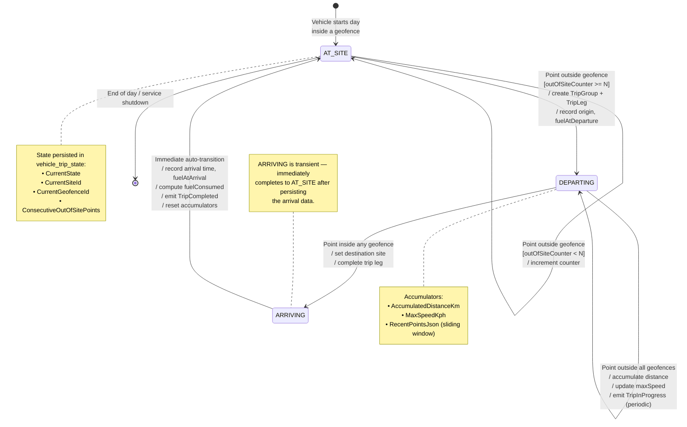

<!--
File: 14-state-geofence-detector.md
Purpose: State machine diagram for the geofence detector with all states,
         transitions, guards, and actions.
Dependencies: PRD.md section 9.1, VehicleTripGeofenceStateMachine.cs
Last Modified: 2026-03-12
-->

# State Machine: Geofence Detector

Three-state model used for SiteToSite vehicles. Implemented in
`VehicleTripGeofenceStateMachine.cs`.

## State Details

### AT_SITE
| Property | Value |
|---|---|
| Entry Action | Set `CurrentSiteId`, `CurrentGeofenceId` |
| Internal Action | Receive GPS point → containment test |
| Guard → DEPARTING | `ConsecutiveOutOfSitePoints >= N` |
| Persisted Fields | `CurrentState`, `CurrentSiteId`, `CurrentGeofenceId`, `LastProcessedPointTimeUtc` |

### DEPARTING
| Property | Value |
|---|---|
| Entry Action | Create `VehicleTripGroup` (Status=InProgress) + `VehicleTrip` (origin populated) |
| Internal Action | Accumulate `DistanceKm` via Haversine, track `MaxSpeedKph` |
| Guard → ARRIVING | Point falls inside any site geofence |
| Persisted Fields | `TripStartTimeUtc`, `OriginSiteId`, `FuelAtDeparture`, `AccumulatedDistanceKm`, `MaxSpeedKph`, `InProgressTripGroupId`, `InProgressTripId` |

### ARRIVING (transient)
| Property | Value |
|---|---|
| Entry Action | Complete the in-progress `VehicleTrip` leg: set destination, arrival time, distance, fuel, Status=Completed |
| Auto-Transition | Immediately → `AT_SITE` |
| Side Effects | Emit `TripCompleted` via SignalR |

## Configuration Parameters

| Parameter | Description | Default |
|---|---|---|
| `N` (consecutive points threshold) | Number of consecutive outside-geofence points required to trigger departure | 3 |
| `PeriodicUpdateInterval` | How frequently to emit `TripInProgress` events while DEPARTING | every 5th point |
| `MaxGapBeforeAnomalyMinutes` | If gap between consecutive points exceeds this, flag GPS gap anomaly | 10 min |
| `IdleOutsideGeofenceMinutes` | If DEPARTING with near-zero speed for this long, flag off-site idle | 60 min |

## Site Catalog & Group Filtering

The geofence detector loads a site catalog at the start of each detection run.
Each site carries its `SiteClassification` (Unknown, Parking, Load, Dump, Fuel, Workshop).

**Group filtering**: When a `geofenceGroupId` is provided (e.g., from the preview playground),
the site catalog is filtered to only include sites whose geofence belongs to the specified group
via a `GpsGeofenceGroupMember` join. This allows operators to test detection scoped to a subset of sites.

## Classification Propagation

Site classification flows through the state machine:

1. **AT_SITE**: `CurrentSiteClassification` is set from the site catalog lookup.
2. **DEPARTING**: The origin trip leg records `OriginSiteClassification` from the site the vehicle departed.
3. **ARRIVING**: The completed trip leg records `DestinationSiteClassification` from the arrival site.
4. **Site visits**: Each site visit carries the classification of the visited site.
5. **Preview mode**: `SiteGeofenceDTO.Classification` string field is propagated through
   `geofenceDetectionPlayground.js` into annotated points, site visits, and trip legs.

Classification enables color-coded map overlays and `ClassificationBadge` components in result grids.

## Recovery After Restart

When the background service restarts:
1. `VehicleTripRealtimeDispatcher` loads `VehicleTripState` from the database
2. State machine resumes from the persisted `CurrentState`
3. The sliding window is rebuilt from `RecentPointsJson`
4. In-progress trips continue accumulating from `AccumulatedDistanceKm`

No data loss occurs because all state is persisted after every GPS point.
