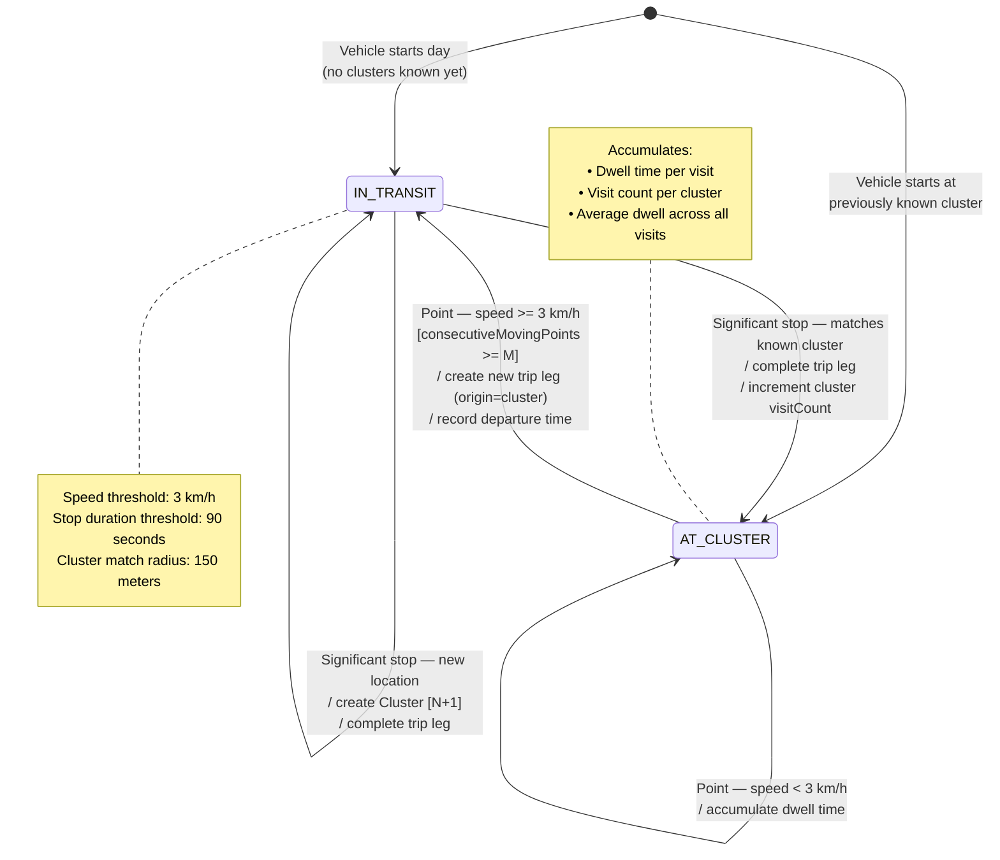
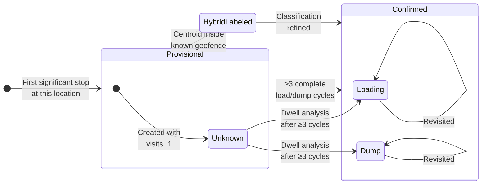

<!--
File: 15-state-cluster-detector.md
Purpose: State machine diagram for cluster-based detection used by Shuttle/Tipper vehicles.
Dependencies: PRD.md section 9.2, VehicleTripClusterStateMachine.cs
Last Modified: 2026-03-12
-->

# State Machine: Cluster Detector

Two-state model used for Shuttle/Tipper vehicles. Implemented in
`VehicleTripClusterStateMachine.cs`. Unlike geofence detection, endpoints
are not predefined — clusters are discovered progressively.



## State Details

### IN_TRANSIT
| Property | Value |
|---|---|
| Entry Action | Begin trip leg, start accumulating distance |
| Internal Actions | Haversine distance accumulation, max speed tracking |
| Guard → AT_CLUSTER (known) | Speed < 3 km/h for ≥ 90s AND position within 150m of known cluster centroid |
| Guard → AT_CLUSTER (new) | Speed < 3 km/h for ≥ 90s AND position NOT within 150m of any known cluster → create new cluster, then transition |
| Persisted Fields | `AccumulatedDistanceKm`, `MaxSpeedKph`, `InProgressTripId` |

### AT_CLUSTER
| Property | Value |
|---|---|
| Entry Action | Complete in-progress trip leg (set destination = cluster), update cluster visit count and avg dwell |
| Internal Actions | Accumulate dwell time while vehicle remains stopped |
| Guard → IN_TRANSIT | Speed ≥ 3 km/h for M consecutive points |
| Side Effects | Begin new trip leg with origin = current cluster |
| Persisted Fields | `CurrentState`, dwell accumulators, `KnownClustersJson` |

## Cluster Lifecycle



## Cluster Classification Algorithm

After ≥ 3 complete cycles visiting the same set of clusters:

1. Rank all clusters by average dwell time (descending)
2. Longest dwell → **Loading** (material loading takes longer)
3. Shortest dwell → **Dump** (quick dump and return)
4. Others → **Unknown** (not enough distinction)

## KnownClustersJson Schema

Persisted in `vehicle_trip_state.KnownClustersJson`:

```json
[
  {
    "index": 0,
    "label": "Cluster-A",
    "classification": "Loading",
    "matchedSiteId": null,
    "centroidLat": -1.4523,
    "centroidLng": 36.9876,
    "visitCount": 4,
    "avgDwellMinutes": 5.1,
    "totalDwellMinutes": 20.4,
    "lastVisitUtc": "2026-03-12T10:30:00Z"
  },
  {
    "index": 1,
    "label": "Site X",
    "classification": "Dump",
    "matchedSiteId": 42,
    "centroidLat": -1.4601,
    "centroidLng": 37.0012,
    "visitCount": 3,
    "avgDwellMinutes": 1.0,
    "totalDwellMinutes": 3.0,
    "lastVisitUtc": "2026-03-12T10:45:00Z"
  }
]
```

## Configuration Parameters

| Parameter | Default | Description |
|---|---|---|
| Speed threshold | 3 km/h | Below this = stopped, above = moving |
| Minimum stop duration | 90 seconds | Time at low speed before registering a stop |
| Cluster match radius | 150 meters | Max distance from centroid to match existing cluster |
| Consecutive moving points (M) | 3 | Points above speed threshold to confirm departure |
| Minimum cycles for classification | 3 | Complete A→B→A cycles before classifying |
| Minimum trip distance | 500 meters | Suppress micro-movements between detection points |
| Minimum trip duration | 2 minutes | Suppress very brief spurious trips |
