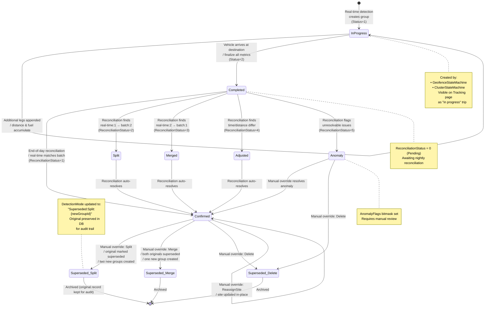
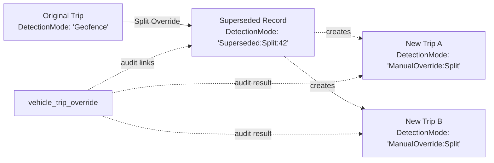

<!--
File: 16-state-trip-lifecycle.md
Purpose: State machine showing the lifecycle of a VehicleTripGroup from creation
         through completion, reconciliation, override, and potential anomaly flagging.
Dependencies: PRD.md, database schema
Last Modified: 2026-03-12
-->

# State Machine: Trip Lifecycle

End-to-end lifecycle of a `VehicleTripGroup` record from real-time detection
through reconciliation and optional manual override.

## Status Values

| Entity | Field | Values |
|---|---|---|
| `VehicleTripGroup` / `VehicleTrip` | `Status` | `1 = InProgress`, `2 = Completed` |
| `VehicleTripGroup` / `VehicleTrip` | `ReconciliationStatus` | `0 = Pending`, `1 = Confirmed`, `2 = Split`, `3 = Merged`, `4 = Adjusted`, `5 = Anomaly` |
| Superseded records | `DetectionMode` | `"Superseded:{action}:{newGroupId}"` |

## Lifecycle Events

| Transition | Triggered By | Side Effects |
|---|---|---|
| → InProgress | State machine creates a new trip | `TripStarted` SignalR event |
| InProgress → Completed | Vehicle arrives at destination | `TripCompleted` SignalR event, fuel + distance finalized |
| Completed → Confirmed | Reconciliation (matches batch) | `ReconciliationStatus` stamped |
| Completed → Split/Merged/Adjusted | Reconciliation (differs from batch) | Original records overwritten with batch values |
| Completed → Anomaly | Reconciliation (unresolvable) | `AnomalyFlags` bitmask set, appears in anomaly reports |
| Confirmed → Superseded* | Manual override (Split/Merge/Delete) | Audit trail in `vehicle_trip_override`, original preserved |
| Anomaly → Confirmed | Manual override resolves the issue | Override audit recorded |

## Override Supersession Model

When a manual override creates new records (Split, Merge, Add):

1. **Original record**: `DetectionMode` updated to `"Superseded:{action}:{newGroupId}"`
2. **New record(s)**: `DetectionMode` set to `"ManualOverride:{action}"`
3. **Audit**: `vehicle_trip_override` row captures full before/after JSON
4. **Query filter**: Default queries exclude superseded records (filter on `DetectionMode NOT LIKE 'Superseded%'`)

## Anomaly Resolution Paths

| Anomaly | Possible Resolution |
|---|---|
| `MissingFuelData` | AdjustTimes to align with available fuel window |
| `NegativeFuelConsumption` | AdjustTimes or Reassign (refill happened at different site) |
| `UnrealisticSpeed` | Delete (GPS artifact) or AdjustTimes |
| `GpsGapSuspected` | Split into two trips at the gap boundary |
| `NoReturnToOrigin` | Merge with a later trip or Add a manual return trip |
| `AsymmetricCycle` | Add missing trip leg to balance the cycle |
