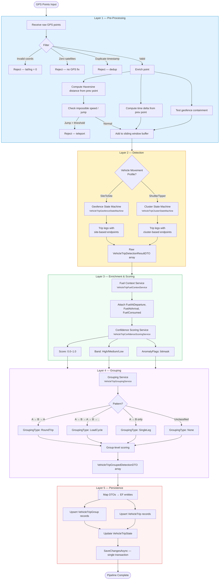

<!--
File: 17-flow-five-layer-pipeline.md
Purpose: Flow diagram showing the five-layer trip detection pipeline architecture.
Dependencies: PRD.md section 8, SERVICES_README.md
Last Modified: 2026-03-12
-->

# Flow: Five-Layer Trip Detection Pipeline

The core orchestration pipeline processes GPS data through five layers in sequence.
Each layer has a specific responsibility and well-defined inputs/outputs.

## Layer Responsibilities

| Layer | Service | Input | Output |
|---|---|---|---|
| **1 — Pre-Processing** | `VehicleTripGpsPreProcessor` | Raw GPS track points | Filtered, enriched, buffered points |
| **2 — Detection** | `VehicleTripGeofenceDetectionService` or `VehicleTripClusterDetectionService` | Enriched points | Raw trip legs (`VehicleTripDetectionResultDTO[]`) |
| **3 — Enrichment & Scoring** | `VehicleTripFuelContextService` + `VehicleTripConfidenceScoringService` | Raw trip legs + track points | Fuel-enriched, scored legs with anomaly flags |
| **4 — Grouping** | `VehicleTripGroupingService` + `VehicleTripConfidenceScoringService.ScoreGroups` | Scored trip legs | Grouped trips (`VehicleTripGroupedDetectionDTO[]`) |
| **5 — Persistence** | `GpsdataContext` | Grouped trip DTOs | Database records (EF entities) |

## Filter Statistics (Layer 1)

Points rejected by the pre-processor are silently dropped. Typical rejection rates:

| Filter | Typical Rejection Rate |
|---|---|
| Invalid coordinates (0,0) | < 0.1% |
| Zero satellites | 1–3% |
| Duplicate timestamps | < 0.5% |
| Impossible speed jumps | < 0.2% |

## Detection Engine Selection (Layer 2)

| Vehicle Movement Profile | Detection Engine | Trip Endpoint Source |
|---|---|---|
| `SiteToSite` | `VehicleTripGeofenceStateMachine` | Known site geofences |
| `Shuttle` / `Tipper` | `VehicleTripClusterStateMachine` | Progressively discovered clusters |

## Grouping Patterns (Layer 4)

| Pattern | Example | GroupingType |
|---|---|---|
| A → B → A | Galana → Kimana → Galana | `RoundTrip` |
| A → B → A → B → A | Loading → Dump → Loading → Dump → Loading | `LoadCycle` |
| A → B | Galana → Kimana (no return within day) | `SingleLeg` |
| Unclassifiable | Insufficient data or ambiguous pattern | `None` |

## Execution Modes

| Mode | Trigger | Layers Used |
|---|---|---|
| **Real-time** | Each GPS point as it arrives | L1 → L2 (incremental), L5 |
| **Batch (Recompute)** | User-triggered `RecomputeVehicleTripsCommand` | L1 → L2 → L3 → L4 → L5 (full) |
| **Batch (Reconciliation)** | Nightly `VehicleTripReconciliationBackgroundService` | L1 → L2 → L3 → L4 → L5 (full), then compare |
