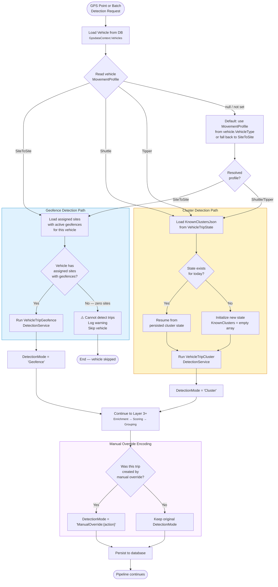

<!--
File: 18-flow-movement-profile-decision.md
Purpose: Flow diagram showing how the system decides which detection engine to use
         based on vehicle movement profile.
Dependencies: PRD.md, VehicleTripDetectionModeHelper.cs
Last Modified: 2026-03-12
-->

# Flow: Movement Profile Decision

How the system selects the correct detection engine based on the vehicle's configured
movement profile. This decision is made by `VehicleTripDetectionModeHelper` and the
`VehicleTripOrchestrationService`.

## Movement Profile Configuration

| Profile | Typical Vehicle Type | Detection Engine | Trip Endpoints |
|---|---|---|---|
| `SiteToSite` | Fuel tankers, delivery trucks, passenger buses | `VehicleTripGeofenceDetectionService` | Known site geofences |
| `Shuttle` | Tipper trucks, shuttle buses, haul trucks | `VehicleTripClusterDetectionService` | Discovered clusters |
| `Tipper` | Same as Shuttle — alias for backward compat | `VehicleTripClusterDetectionService` | Discovered clusters |

## DetectionMode Field Values

The `DetectionMode` column on `vehicle_trip` and `vehicle_trip_group` records the
provenance of each trip record:

| Value Pattern | Meaning |
|---|---|
| `Geofence` | Detected by geofence state machine |
| `Cluster` | Detected by cluster state machine |
| `ManualOverride:Split` | Created by a manual split override |
| `ManualOverride:Merge` | Created by a manual merge override |
| `ManualOverride:Add` | Manually added trip |
| `ManualOverride:AdjustTimes` | Times adjusted by operator |
| `ManualOverride:ReassignSite` | Site reassigned by operator |
| `Superseded:Split:{newGroupId}` | Original record before split |
| `Superseded:Merge:{newGroupId}` | Original record before merge |
| `Superseded:Delete` | Soft-deleted by operator |

## Decision Priority

1. **Vehicle-level `MovementProfile`** — highest priority (explicit assignment)
2. **VehicleType-level `MovementProfile`** — fallback for vehicles without explicit assignment
3. **System default** — `SiteToSite` if neither vehicle nor type specifies a profile

## Site Assignment Requirements

For geofence detection to work, the vehicle must have:
1. At least one assigned site (via vehicle-site assignment)
2. Each site must have at least one active geofence polygon
3. If these conditions are not met, the system logs a warning and skips trip detection for that vehicle
