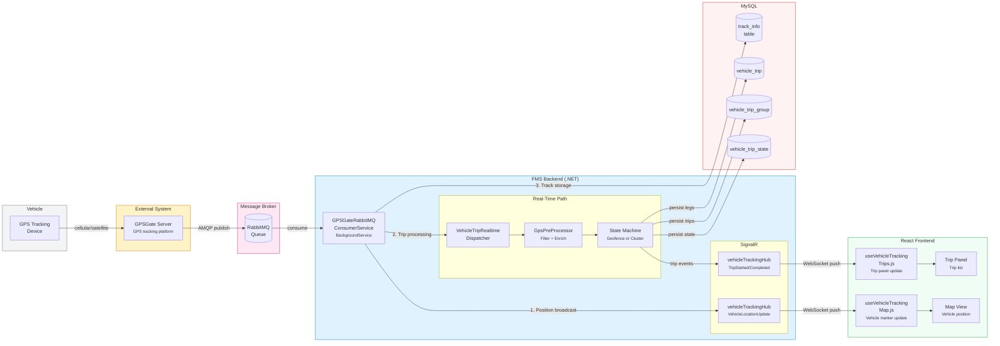

<!--
File: 21-dataflow-gps-point.md
Purpose: Data flow diagram showing the journey of a single GPS point through
         all systems from device to database.
Dependencies: AGENTS.md, PRD.md
Last Modified: 2026-03-12
-->

# Data Flow: GPS Point Journey

Tracks a single GPS position from the vehicle's tracking device through every
system layer to final persistence and display.

## Data Transformations

| Stage | Input | Transformation | Output |
|---|---|---|---|
| **Device → GPSGate** | Raw NMEA/proprietary protocol | Device protocol decoding | Normalized position record |
| **GPSGate → RabbitMQ** | HTTP callback / internal | AMQP message serialization | JSON message on queue |
| **RabbitMQ → Consumer** | AMQP message | Deserialization, validation | .NET object (vehicle position) |
| **Consumer → SignalR** | Position object | Broadcast packaging | `VehicleLocationUpdate` event |
| **Consumer → PreProcessor** | Position object | Filter (invalid, duplicate, jumps), Enrich (distance, time delta, geofence containment) | Enriched GPS point |
| **PreProcessor → State Machine** | Enriched point | State transition evaluation | Trip state change + trip events |
| **State Machine → DB** | Trip leg/group DTOs | EF Core entity mapping | MySQL rows in trip tables |
| **State Machine → SignalR** | Trip events | Event packaging | `TripStarted` / `TripCompleted` events |
| **SignalR → Frontend** | WebSocket events | Redux state update | UI re-render (map markers + trip list) |

## Dual-Write Pattern

The consumer performs three parallel writes from a single GPS point:

1. **Position broadcast** (SignalR) — immediate map update
2. **Trip processing** (state machine pipeline) — trip detection and persistence
3. **Track storage** (track_info table) — raw GPS track for historical replay

These are independent operations — a failure in trip processing does not block
position broadcasting or track storage.

## Latency Budget

| Segment | Typical Latency |
|---|---|
| Device → GPSGate | 1–5 seconds (cellular) |
| GPSGate → RabbitMQ | < 100ms |
| RabbitMQ → Consumer | < 50ms |
| Consumer → SignalR broadcast | < 10ms |
| Consumer → Trip processing | 50–200ms |
| SignalR → Frontend render | < 100ms |
| **End-to-end (device → map)** | **2–6 seconds** |
| **End-to-end (device → trip update)** | **2–7 seconds** |
