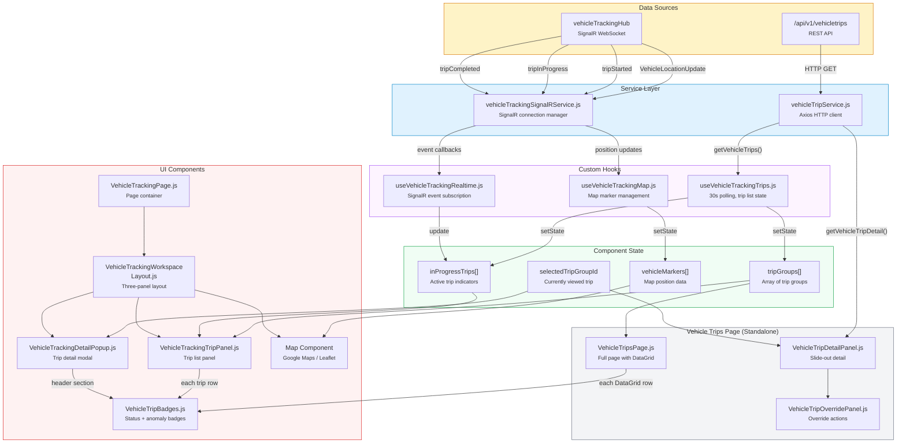
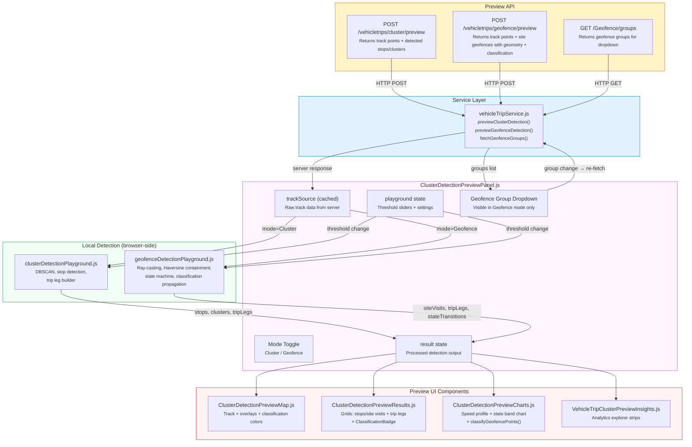

<!--
File: 22-dataflow-frontend.md
Purpose: Data flow diagram showing how trip data flows through the frontend
         from API/SignalR to rendered UI components.
Dependencies: FRONTEND_PRD.md, frontend source files
Last Modified: 2026-03-12
-->

# Data Flow: Frontend Trip Data

How trip data flows through the React frontend — from API calls and SignalR events
through Redux state to rendered DevExtremea components.

## Two Entry Points

| Page | URL | Purpose |
|---|---|---|
| **Vehicle Tracking Page** | `/vehicletracking` | Real-time map + trip panel, operational monitoring |
| **Vehicle Trips Page** | `/vehicles/trips` | Historical trip management with DataGrid, overrides |

Both pages use the same `vehicleTripService.js` and `VehicleTripBadges.js`.

## Preview Playground Data Flow

The detection preview playground is a third data flow path with a distinct pattern:
server provides raw data, then all detection runs locally in the browser.

### Preview Key Behaviors

| Behavior | Details |
|---|---|
| **Shared track data** | Switching Cluster ↔ Geofence does not re-fetch; same `trackSource` drives both algorithms |
| **Local replay** | Threshold slider changes trigger `< 200ms` browser-side re-computation, no server call |
| **Group filter** | Changing geofence group triggers a new API call (group filters on server) and invalidates cache |
| **Cache key** | `buildClusterSourceKey` / `buildGeofenceSourceKey` include vehicleId + dates + geofenceGroupId |
| **Classification** | Geofence mode propagates `SiteClassification` through site visits, trip legs, map overlays, and badge components |

## API Calls

| Function | Endpoint | Usage |
|---|---|---|
| `getVehicleTrips(params)` | `GET /vehicletrips` | Trip list with pagination, filtering, date range |
| `getVehicleTripsByVehicle(vehicleId)` | `GET /vehicletrips/vehicle/{vehicleId}` | Trips for a specific vehicle |
| `getVehicleTripDetail(groupId)` | `GET /vehicletrips/{groupId}` | Full trip detail with legs |
| `getInProgressTrips()` | `GET /vehicletrips/in-progress` | Currently active trips |

## SignalR Events

| Event | Payload | UI Effect |
|---|---|---|
| `VehicleLocationUpdate` | `{ vehicleId, lat, lng, speed, heading, timestamp }` | Move vehicle marker on map |
| `VehicleEventReceived` | `{ vehicleId, eventType, data }` | General event handler |
| `VehicleConnectionStatusChanged` | `{ vehicleId, isConnected }` | Online/offline indicator |
| `tripStarted` | `{ vehicleTripGroupId, vehicleId, originSite }` | Add "in progress" badge to trip panel |
| `tripInProgress` | `{ vehicleTripGroupId, distanceSoFar, currentSpeed }` | Update in-progress trip metrics |
| `tripCompleted` | `{ vehicleTripGroupId, tripSummary }` | Move trip from "in progress" to completed list |

## Badge Component (VehicleTripBadges.js)

Renders contextual badges per trip group:

| Badge | Condition | Color |
|---|---|---|
| Status badge | `InProgress` or `Completed` | Blue / Green |
| Confidence band | `High` / `Medium` / `Low` | Green / Amber / Red |
| Grouping type | `RoundTrip` / `LoadCycle` / `SingleLeg` | Purple / Teal / Gray |
| Anomaly count | `AnomalyFlags > 0` | Red with count |
| Reconciliation | `ReconciliationStatus` value | Various |
| Override indicator | `DetectionMode LIKE 'ManualOverride%'` | Orange |

## Utility Functions (vehicleTripUi.js)

| Function | Purpose |
|---|---|
| `formatTripDuration()` | Human-readable duration (e.g., "2h 15m") |
| `formatDistance()` | Distance with units (e.g., "45.3 km") |
| `getConfidenceBadgeColor()` | Map confidence band to CSS class |
| `getAnomalyFlagLabels()` | Decode bitmask to human-readable flag names |
| `getGroupingTypeLabel()` | Display name for grouping type enum |
