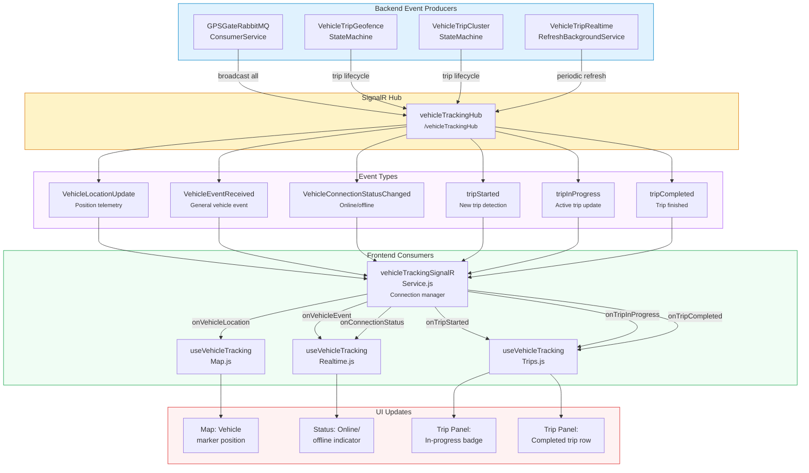

<!--
File: 23-dataflow-signalr-events.md
Purpose: Data flow diagram showing SignalR event flow for vehicle tracking
         and trip management real-time updates.
Dependencies: vehicleTrackingSignalRService.js, backend SignalR hub
Last Modified: 2026-03-12
-->

# Data Flow: SignalR Events

Shows the complete SignalR event topology — which backend components emit events,
how the hub routes them, and which frontend components consume them.



## Event Specifications

### VehicleLocationUpdate
```json
{
  "vehicleId": 1234,
  "latitude": -1.4523,
  "longitude": 36.9876,
  "speed": 45.2,
  "heading": 180,
  "altitude": 1650,
  "satellites": 12,
  "timestamp": "2026-03-12T10:30:00Z",
  "fuelLevel": 85.3,
  "ignition": true
}
```
**Producer**: `GPSGateRabbitMQConsumerService` (every GPS point)
**Frequency**: Every 10–30 seconds per vehicle (depends on device interval)

### tripStarted
```json
{
  "vehicleTripGroupId": 5678,
  "vehicleTripId": 9012,
  "vehicleId": 1234,
  "originSiteId": 42,
  "originSiteName": "Galana Quarry",
  "departureTimeUtc": "2026-03-12T10:30:00Z",
  "movementProfile": "Geofence",
  "fuelAtDeparture": 85.3
}
```
**Producer**: State machine (geofence or cluster) on `AT_SITE → DEPARTING` transition

### tripInProgress
```json
{
  "vehicleTripGroupId": 5678,
  "vehicleTripId": 9012,
  "vehicleId": 1234,
  "accumulatedDistanceKm": 12.5,
  "currentSpeed": 45.2,
  "durationMinutes": 15.3,
  "lastLatitude": -1.4601,
  "lastLongitude": 37.0012
}
```
**Producer**: State machine (periodic, every ~5th point while `DEPARTING`)

### tripCompleted
```json
{
  "vehicleTripGroupId": 5678,
  "vehicleTripId": 9012,
  "vehicleId": 1234,
  "destinationSiteId": 56,
  "destinationSiteName": "Kimana Depot",
  "arrivalTimeUtc": "2026-03-12T11:15:00Z",
  "distanceKm": 34.5,
  "durationMinutes": 45.0,
  "fuelConsumed": 12.3,
  "confidenceBand": "High"
}
```
**Producer**: State machine on `DEPARTING → ARRIVING` transition

### VehicleConnectionStatusChanged
```json
{
  "vehicleId": 1234,
  "isConnected": false,
  "lastSeenUtc": "2026-03-12T10:30:00Z"
}
```
**Producer**: `GPSGateRabbitMQConsumerService` (heartbeat timeout detection)

## Connection Management

`vehicleTrackingSignalRService.js` handles:

| Feature | Implementation |
|---|---|
| **Auto-connect** | Connects when tracking page mounts |
| **Auto-reconnect** | Exponential backoff on disconnect (1s, 2s, 4s, 8s, max 30s) |
| **Group subscription** | Joins SignalR group for `site:{siteId}` or `vehicle:{vehicleId}` |
| **Token refresh** | Passes JWT access token on each reconnect |
| **Cleanup** | Disconnects when tracking page unmounts |

## Known Gap

The `tripStarted`, `tripInProgress`, and `tripCompleted` events are **emitted by the
backend** but the frontend's `useVehicleTrackingTrips.js` hook currently relies on
**30-second polling** rather than subscribing to these events. This is documented as
**Gap #1** in the FRONTEND_PRD.md. Wiring these events would reduce the trip panel
update latency from ~30 seconds to ~2 seconds.
