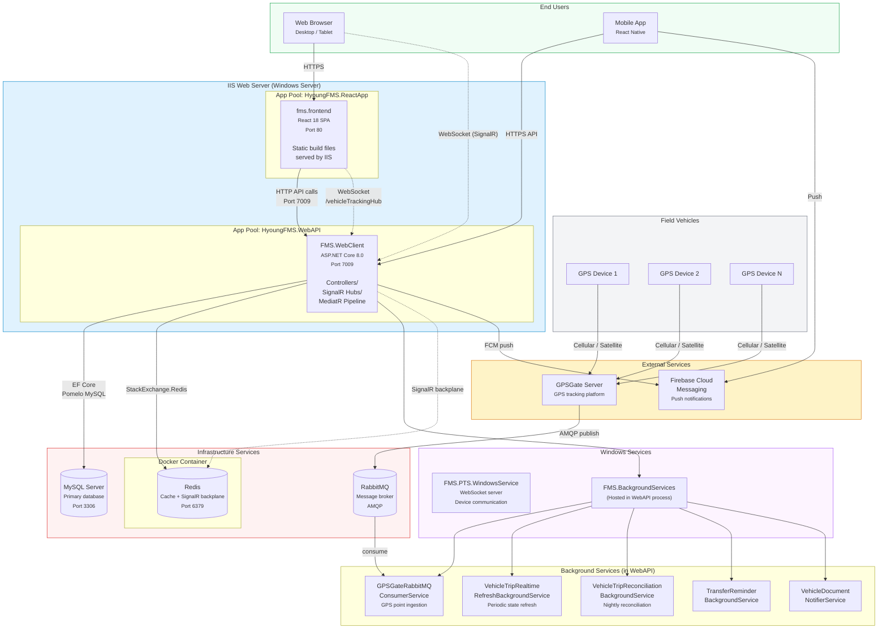

<!--
File: 24-deployment-diagram.md
Purpose: Deployment/infrastructure diagram showing how all services
         and components are deployed.
Dependencies: AGENTS.md, deployment documentation
Last Modified: 2026-03-12
-->

# Deployment Diagram

Physical deployment topology for the FMS application including all services
relevant to vehicle trip management.



## Server Roles

| Component | Host | Port | Technology |
|---|---|---|---|
| **FMS.WebClient** (API) | IIS App Pool `HyoungFMS.WebAPI` | 7009 | ASP.NET Core 8.0, Kestrel behind IIS |
| **fms.frontend** (SPA) | IIS App Pool `HyoungFMS.ReactApp` | 80 | Static React build files |
| **MySQL** | Database server | 3306 | MySQL with Pomelo EF Core provider |
| **Redis** | Docker container | 6379 | StackExchange.Redis (cache + SignalR backplane) |
| **RabbitMQ** | Message broker server | 5672 (AMQP) | GPS point ingestion from GPSGate |
| **FMS.PTS.WindowsService** | Windows Service | Custom | WebSocket server for fuel device communication |

## Deployment Paths

| Component | Deployment Method |
|---|---|
| **Backend** | `dotnet publish` → copy to `C:\inetpub\wwwroot\hyoungFMS\webAPI` |
| **Frontend** | `npm run build` → copy to `C:\inetpub\wwwroot\hyoungFMS\reactApp` |
| **CI/CD** | GitHub Actions (`.github/workflows/deploy-to-iis.yml`) |
| **Redis** | Docker: `scripts/redis/start-redis.bat` |

## Network Topology

```
Internet                                    Internal Network
─────────────                               ──────────────────
                    ┌─────────────┐
GPS Devices ──────► │  GPSGate    │
                    └──────┬──────┘
                           │ AMQP
                    ┌──────▼──────┐
                    │  RabbitMQ   │◄─────── Internal only
                    └──────┬──────┘
                           │
Browser ──► HTTPS ─► ┌─────▼──────────────┐
                     │  IIS (port 80/7009) │
Mobile  ──► HTTPS ─► │  ├── React SPA     │
                     │  └── .NET API       │──► MySQL :3306
                     │      └── SignalR    │──► Redis :6379
                     └─────────────────────┘
```

## Scaling Considerations

| Component | Current | Scaling Path |
|---|---|---|
| **Web API** | Single instance | Multiple IIS instances behind load balancer (SignalR uses Redis backplane) |
| **Background Services** | Hosted in API process | Extract to standalone worker service for independent scaling |
| **Redis** | Single Docker instance | Redis Sentinel or Redis Cluster for HA |
| **MySQL** | Single instance | Read replicas for query scaling |
| **RabbitMQ** | Single instance | RabbitMQ cluster for HA |
