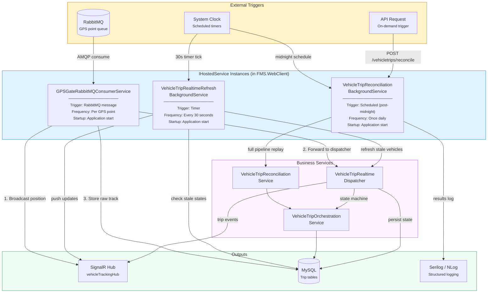

<!--
File: 25-background-job-topology.md
Purpose: Diagram showing all background services, their triggers, schedules,
         and relationships to the trip management system.
Dependencies: AGENTS.md, FMS.BackgroundServices/ source
Last Modified: 2026-03-12
-->

# Background Job Topology

All background services involved in vehicle trip management — their triggers,
schedules, dependencies, and data flows.



## Service Details

### 1. GPSGateRabbitMQConsumerService

| Property | Value |
|---|---|
| **File** | `FMS.BackgroundServices/VehicleTracking/GPSGateRabbitMQConsumerService.cs` |
| **Type** | `BackgroundService` (IHostedService) |
| **Trigger** | RabbitMQ message arrival |
| **Startup** | Immediately on application start |
| **Shutdown** | Graceful — closes RabbitMQ connection |
| **Error Handling** | Message NACK + requeue on transient failure; dead-letter on permanent failure |
| **Throughput** | Processes hundreds of GPS points per second across all vehicles |

**Actions per message:**
1. Deserialize GPS position from AMQP message
2. Broadcast `VehicleLocationUpdate` via SignalR (immediate — map update)
3. Forward to `VehicleTripRealtimeDispatcher` for trip processing
4. Store raw position in `track_info` table

### 2. VehicleTripRealtimeRefreshBackgroundService

| Property | Value |
|---|---|
| **File** | `FMS.BackgroundServices/VehicleTracking/VehicleTripRealtimeRefreshBackgroundService.cs` |
| **Type** | `BackgroundService` with periodic timer |
| **Trigger** | Timer (every 30 seconds) |
| **Purpose** | Detect and recover stale trip states |
| **Startup** | Immediately on application start |

**Actions per tick:**
1. Query `vehicle_trip_state` for states with `LastProcessedPointTimeUtc` older than threshold
2. For stale vehicles with `Status = InProgress`:
   - Check if GPS data has resumed (new track points exist)
   - If yes: trigger state machine catch-up
   - If no: consider timeout-based trip completion
3. Push any changes to SignalR

### 3. VehicleTripReconciliationBackgroundService

| Property | Value |
|---|---|
| **File** | `FMS.BackgroundServices/VehicleTracking/VehicleTripReconciliationBackgroundService.cs` |
| **Type** | `BackgroundService` with scheduled trigger |
| **Trigger** | Post-midnight schedule (configurable time) |
| **Also triggered by** | `POST /api/v1/vehicletrips/reconcile` (on-demand) |
| **Purpose** | Replay full day's GPS data in batch and compare with real-time results |

**Actions per execution:**
1. Determine target date (yesterday for scheduled, specified date for on-demand)
2. Load all vehicles with trip data for that date
3. For each vehicle: invoke `VehicleTripReconciliationService`
4. Log summary (confirmed/split/merged/adjusted/anomaly counts)
5. Report failures to error logging (Serilog)

## Schedule Timeline

```
00:00  00:30  01:00  ... 06:00  ... 12:00  ... 18:00  ... 23:59
  │      │      │          │          │          │          │
  ▼      │      │          │          │          │          │
  BG3    │      │          │          │          │          │
  (reconcile yesterday)    │          │          │          │
  │      │      │          │          │          │          │
  ├──────┤──────┤──────────┤──────────┤──────────┤──────────┤
  BG2: ┃▪▪▪▪▪▪▪▪▪▪▪▪▪▪▪▪▪▪▪▪▪▪▪▪▪▪▪▪▪▪▪▪▪▪▪▪▪▪▪▪▪▪▪▪▪▪▪┃
       (every 30s — continuous throughout the day)
  │      │      │          │          │          │          │
  BG1: ┃▪▪▪▪▪▪▪▪▪▪▪▪▪▪▪▪▪▪▪▪▪▪▪▪▪▪▪▪▪▪▪▪▪▪▪▪▪▪▪▪▪▪▪▪▪▪▪┃
       (continuous — processes every GPS point as it arrives)
```

## Failure Modes

| Service | Failure Type | Impact | Recovery |
|---|---|---|---|
| **BG1** | RabbitMQ connection lost | GPS points queue up in RabbitMQ | Auto-reconnect with exponential backoff; messages consumed when connection restores |
| **BG1** | Database unavailable | Trip processing fails, position broadcast unaffected | Points are NACKed and requeued; no data loss |
| **BG2** | Timer exception | Stale states not detected for one cycle | Next tick retries; self-healing |
| **BG3** | Reconciliation failure (one vehicle) | That vehicle's trips unreconciled | Logged for manual retry; other vehicles unaffected |
| **BG3** | Full service failure | No reconciliation for the day | On-demand trigger available via API; run manually next day |

## Configuration

| Setting | Default | Environment Variable |
|---|---|---|
| RabbitMQ connection | `localhost:5672` | `RABBITMQ_CONNECTION` |
| Refresh interval | 30 seconds | `TRIP_REFRESH_INTERVAL_SECONDS` |
| Reconciliation time | 00:30 (12:30 AM) | `TRIP_RECONCILIATION_TIME` |
| Stale state threshold | 5 minutes | `TRIP_STALE_STATE_THRESHOLD_MINUTES` |
