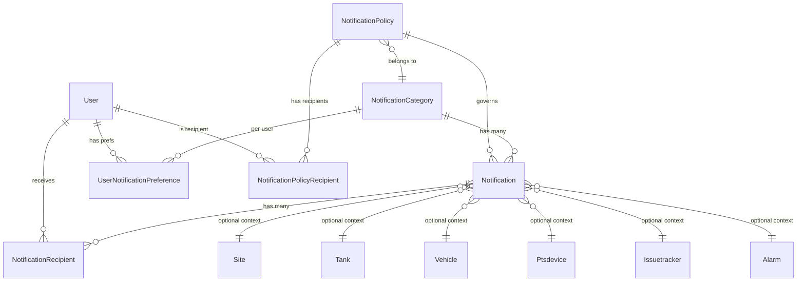
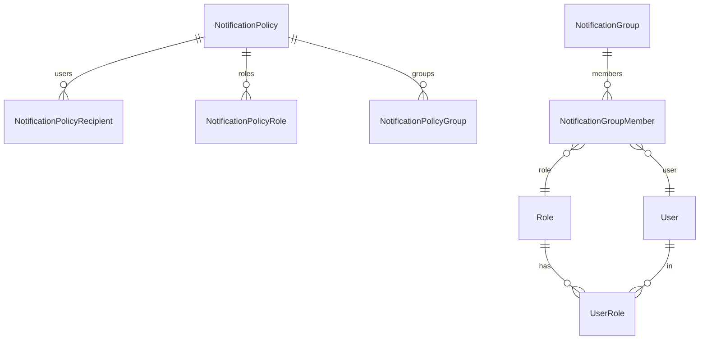

# FMS Notification System

## Overview

The FMS Notification System is a comprehensive solution for managing notifications, alerts, and alarms within the Fuel Management System. It provides real-time notifications through multiple channels (email, SMS, system notifications) with configurable policies, alarm handling, and integration with issue tracking.

## Features

### Core Features

- **Multi-Channel Delivery**: System notifications, email, SMS
- **Notification Policies**: Configurable rules for different notification types
- **Alarm Handling**: Automated alarm processing with customizable handlers
- **PTS Alert Processing**: Direct integration with PTS UploadAlertRecord packets
- **Scheduled Notifications**: Support for delayed/scheduled notifications
- **Issue Tracker Integration**: Automatic issue creation for critical alarms
- **Real-time Delivery**: SignalR integration for instant system notifications
- **Acknowledgment System**: Require user acknowledgment for critical notifications
- **Rate Limiting**: Configurable limits to prevent notification spam
- **Escalation Rules**: Auto-escalate unacknowledged notifications
- **Comprehensive Tracking**: Full audit trail of all notifications

### Alarm Types Supported

- **Tank Alarms**: Low/high volume, water detection, temperature alerts
- **Device Alarms**: Disconnection, communication failures
- **System Alarms**: Stale data, unusual consumption patterns
- **PTS Alerts**: All PTS protocol alert codes (pump, probe, device, etc.)
- **Custom Alarms**: User-defined alarm types
- **Scheduled Checks**: Automated monitoring and alerting

## Architecture

### Core Components

1. **NotificationService**: Main service for creating and sending notifications
2. **AlarmHandlerService**: Processes alarms and triggers notifications
3. **NotificationBackgroundService**: Handles scheduled notifications and monitoring
4. **NotificationController**: REST API endpoints for notification management
5. **UploadAlertRecordHandler**: Processes PTS alert packets and triggers notifications

### Database Entities

- **Notification**: Core notification record
- **NotificationRecipient**: Tracks delivery to specific users
- **NotificationPolicy**: Defines notification rules and templates
- **NotificationPolicyRecipient**: Policy-specific recipient configuration
- **AlarmHandler**: Defines how alarms trigger notifications
- **AlarmHandlerExecution**: Tracks alarm handler executions
- **AlertRecord**: Stores PTS alert records from UploadAlertRecord packets

For detailed fields, defaults, indices, and relationships, see: [Notification System Entities and Data Model](./NotificationSystem_Entities.md)

## Notification Categories

The system organizes notifications by category. Categories drive defaults (priority, acknowledgment, delivery methods, icon, display order) and can be stored in the database (`NotificationCategory`) while also being exposed via an in-memory provider for code-friendly usage.

### Category metadata

Category metadata shape (`CategoryMetadata`):

- Id: int
- Name: string
- Description: string?
- DefaultPriority: string (Low, Medium, High, Critical)
- DefaultRequireAcknowledgment: bool
- DefaultDeliveryMethods: string (comma-separated, e.g., "System,Email,SMS")
- DisplayOrder: int
- IconClass: string?
- IsActive: bool

Provider interface (`ICategoryMetadataProvider`) supports:

- `Get(WellKnownCategories category)`
- `GetAll()`
- `IsActive(WellKnownCategories category)`

Current implementation: `InMemoryCategoryMetadataProvider` backed by `WellKnownCategories` enum. It can later be replaced by a DB/config-backed provider without changing consumers.

### WellKnownCategories (defaults)

- SensorVariance — desc: Sensor vs Manual variance — priority: Medium — ack: false — methods: System — order: 10 — icon: icon-sensor — active: true
- TankVariance — Tank variance alerts — Medium — false — System — 11 — icon-tank — true
- OpeningStock — Opening stock reports — Low — false — System — 20 — icon-report — true
- ClosingStock — Closing stock reports — Low — false — System — 21 — icon-report — true
- StockReconciliation — Reconciliation alerts — Medium — false — System — 30 — icon-reconcile — true
- Reconciliation — Reconciliation — Medium — false — System — 31 — icon-balance — true
- DeliveryAlerts — Delivery events — Medium — false — System — 40 — icon-truck — true
- InventoryAlerts — Inventory alerts — Medium — false — System — 41 — icon-inventory — true
- PtsDeviceAlarm — PTS device alarm — High — true — System,SMS,Email — 55 — icon-pts — true
- PtsTankAlarm — PTS tank alarm — High — true — System,SMS,Email — 56 — icon-tank — true
- DiscrepancyDetected — Discrepancy detected — High — true — System,Email — 57 — icon-alert — true
- TagMonitoring — Tag monitoring — Medium — false — System — 58 — icon-tag — true
- DeviceAlerts — Generic device alerts — Medium — false — System — 60 — icon-device — true
- IssueTracker — Issue tracker updates — Medium — false — System — 65 — icon-issue — true
- System — System notices — Medium — false — System — 70 — icon-gear — true
- UserActivity — User activity — Low — false — System — 80 — icon-user — true
- SystemMaintenance — Maintenance notifications — Low — false — Email,System — 90 — icon-wrench — true
- SecurityAlerts — Security notifications — High — true — Email,System,SMS — 95 — icon-shield — true
- SystemError — System errors — High — true — Email,System,SMS — 99 — icon-error — true
- Generic — Generic notifications — Medium — false — System — 100 — icon-bell — true

These defaults inform UI ordering, default delivery channels, and acknowledgment requirements when user preferences or policies don’t override them.

### NotificationCategoryService

Encapsulates DB access and caching for categories:

- `GetCategoryAsync(WellKnownCategories)` and `GetCategoryByNameAsync(string)` resolve active categories.
- `GetCategoryIdAsync(WellKnownCategories)` shortcut for FK lookups.
- `GetCategoryByIdAsync(int)` for reverse lookups.
- Uses `IMemoryCache` with a 30-minute TTL per entry.

Usage example:

```csharp
// Resolve a category id for WellKnownCategories.SystemError
var catId = await _notificationCategoryService.GetCategoryIdAsync(WellKnownCategories.SystemError, cancellationToken);
```

### NotificationCategorySeeder

Seeds predefined categories into the database on startup/migration. Each seeded `NotificationCategory` sets:

- Name, Description, DefaultPriority
- IsActive = true, DefaultDeliveryMethods = "System"
- DisplayOrder = index in the seed array
- CreatedBy = "System", CreatedAt = UtcNow

How to run during startup:

```csharp
// Program.cs (after building service provider and getting a scoped context)
using (var scope = app.Services.CreateScope())
{
    var ctx = scope.ServiceProvider.GetRequiredService<GpsdataContext>();
    await NotificationCategorySeeder.SeedCategoriesAsync(ctx);
}
```

Notes:

- The seeder ensures idempotency by checking `Name` uniqueness before insert.
- InMemory metadata and DB categories should align by name to keep UX and policy mapping consistent.

## Entity relationships (Mermaid ER diagram)



## Category sync checklist (enum, metadata, seed)

Keep these in sync whenever you add/rename a category:

- Update enum: `FMS.Application/Features/Notification/Enums/NotificationEnums.cs` (WellKnownCategories)
- Update in-memory metadata: `FMS.Application/Features/Notification/Services/InMemoryCategoryMetadataProvider.cs`
  - Ensure `Name` matches `WellKnownCategories.SomeName.ToString()` exactly
  - Set defaults (priority, ack, delivery methods, order, icon)
- Update DB seed: `FMS.Application/Features/Notification/Services/NotificationCategorySeeder.cs`
  - Add an entry with the same `Name` and sensible defaults

Quick verification:

- Run the seeder once (on startup) and check the `notification_category` table contains the new row
- Call `NotificationCategoryService.GetCategoryIdAsync(WellKnownCategories.NewValue)` and ensure it returns a valid Id
- Trigger a test notification in that category and verify defaults apply

## Configuration

### 1. Notification Policies

Notification policies define how different types of notifications should be handled:

```json
{
  "name": "Tank Alarm Policy",
  "category": "Tank",
  "notificationType": "Alert",
  "priority": "High",
  "enableEmail": true,
  "enableSms": false,
  "enableSystem": true,
  "maxNotificationsPerHour": 10,
  "maxNotificationsPerDay": 50,
  "cooldownMinutes": 30,
  "titleTemplate": "Tank Alarm: {AlarmType}",
  "messageTemplate": "Tank {TankNumber} alarm: {Message}",
  "requireAcknowledgment": true
}
```

### 2. Alarm Handlers

Alarm handlers define how specific alarm types trigger notifications:

```json
{
  "name": "Low Tank Volume Handler",
  "alarmType": "LowTankVolume",
  "priority": "High",
  "cooldownMinutes": 60,
  "createIssueTracker": true,
  "messageTemplate": "URGENT: Tank {TankNumber} has low fuel volume: {CurrentVolume}L"
}
```

## API Endpoints

### Notification Management

#### Create Notification

```http
POST /api/notification
Content-Type: application/json

{
  "type": "Alert",
  "category": "Tank",
  "priority": "High",
  "title": "Low Tank Volume",
  "message": "Tank 1 has low fuel volume",
  "triggerSource": "Manual",
  "recipients": [
    {
      "userId": "user123",
      "deliveryMethods": ["Email", "System"]
    }
  ]
}
```

#### Get Notifications

```http
GET /api/notification?type=Alert&category=Tank&isRead=false
```

#### Mark as Read

```http
POST /api/notification/{notificationId}/read
```

#### Acknowledge Notification

```http
POST /api/notification/{notificationId}/acknowledge
```

### Alarm Management

#### Trigger Custom Alarm

```http
POST /api/notification/alarm
Content-Type: application/json

{
  "alarmType": "CustomAlarm",
  "category": "System",
  "message": "Custom alarm triggered",
  "siteId": 1,
  "tankId": 5
}
```

#### Trigger Device Disconnection

```http
POST /api/notification/alarm/device-disconnection/{deviceId}
```

## PTS Alert Processing

The system automatically processes PTS `UploadAlertRecord` packets and converts them into notifications based on the alert codes defined in the PTS protocol.

### Supported PTS Alert Codes

#### PTS Device Alerts (DeviceType: "PTS")

- **Code 1**: Low battery voltage detected
- **Code 2**: High CPU temperature detected
- **Code 3**: Power down detected
- **Code 4**: Restart detected

#### Pump Alerts (DeviceType: "Pump")

- **Code 1**: Offline state detected
- **Code 20**: Overfilling detected
- **Code 21-26**: Overfilling detected for nozzle 1-6
- **Code 30**: Filling in offline mode detected
- **Code 31-36**: Filling in offline mode detected for nozzle 1-6

#### Probe Alerts (DeviceType: "Probe")

- **Code 1**: Offline state detected
- **Code 2**: Error detected
- **Code 3**: Critical high product level detected
- **Code 4**: High product level detected
- **Code 5**: Low product level detected
- **Code 6**: Critical low product level detected
- **Code 7**: High water level detected
- **Code 8**: Tank leakage detected

#### PriceBoard/Reader Alerts

- **Code 1**: Offline state detected
- **Code 2**: Error detected

### Alert Processing Flow

1. **PTS Device** sends `UploadAlertRecord` packet
2. **UploadAlertRecordHandler** processes the packet
3. **Alert Record** is stored in database with alarm mapping
4. **AlarmHandlerService** processes the alert based on type
5. **NotificationService** creates and sends notifications
6. **Real-time notifications** are delivered via SignalR
7. **Issue tracker** entries are created for critical alerts

## Usage Examples

### 1. Creating a Manual Notification

```csharp
var request = new CreateNotificationRequest
{
    Type = "Info",
    Category = "System",
    Priority = "Medium",
    Title = "Maintenance Scheduled",
    Message = "Tank maintenance scheduled for tomorrow",
    TriggerSource = "Manual",
    TriggeredBy = userId,
    Recipients = new List<CreateNotificationRecipientRequest>
    {
        new CreateNotificationRecipientRequest
        {
            UserId = "maintenance-team",
            DeliveryMethods = new List<string> { "Email", "System" }
        }
    }
};

var result = await notificationService.CreateNotificationAsync(request);
```

### 2. Processing Tank Alarms

The system automatically processes tank alarms when tank measurements are received:

```csharp
// In CreateTankMeasurementCommand
await alarmHandlerService.ProcessTankMeasurementAlarmsAsync(tankMeasurement, deviceId);
```

### 3. Creating Scheduled Notifications

```csharp
var request = new CreateNotificationRequest
{
    Type = "Reminder",
    Category = "Maintenance",
    Title = "Weekly Tank Inspection",
    Message = "Time for weekly tank inspection",
    ScheduledAt = DateTime.UtcNow.AddDays(7), // Send in 7 days
    TriggerSource = "Scheduled",
    Recipients = recipients
};
```

## Frontend Integration

### Frontend capabilities (backed by NotificationService)

The frontend can leverage these features via existing endpoints and SignalR:

- Real-time in-app notifications (system and alarms) via SignalR
- Browse and filter notifications (type, category, status/read, priority, date range; plus site/tank when present)
- Mark as read and acknowledge critical notifications
- Create manual notifications (POST /api/notification) for system notices/reminders
- Trigger test/custom alarms (POST /api/notification/alarm and device-specific variants)
- See scheduled notifications when they send (background service dispatches by ScheduledAt)
- View per-recipient delivery status and errors (from NotificationRecipient rows)
- Optional: manage user preferences per category (opt-in/out, delivery methods) when endpoints are exposed

Note on category helpers such as `CreateSensorVarianceNotificationAsync`: these are backend conveniences that build a `CreateNotificationRequest` with the right `CategoryId` and defaults. Expose them through thin API endpoints if you want one-click frontend actions (e.g., “Send sensor variance test”).

### NotificationCenter Component

The notification system integrates with the existing `NotificationCenter.js` component:

```javascript
// The component automatically receives real-time notifications via SignalR
// and displays them in the notification panel

// API calls for notification management
const markAsRead = async (notificationId) => {
  await fetch(`/api/notification/${notificationId}/read`, { method: 'POST' });
};

const acknowledgeNotification = async (notificationId) => {
  await fetch(`/api/notification/${notificationId}/acknowledge`, { method: 'POST' });
};
```

### Notification Dashboard

The comprehensive notification dashboard provides full management capabilities:

**Location**: `fms.frontend/src/components/notifications/NotificationDashboard.js`

**Features**:

- **Overview Tab**: Statistics, charts, and system health metrics
- **Notifications Tab**: Complete notification history with filtering and search
- **Policies Tab**: Manage notification policies and rules
- **Alarm Handlers Tab**: Configure and monitor alarm processing
- **PTS Alerts Tab**: View and analyze PTS alert records
- **Tools Tab**: Create custom triggers, test notifications, export data

**Key Components**:

```javascript
// Dashboard usage
import NotificationDashboard from './components/notifications/NotificationDashboard';
import NotificationDashboardPage from './components/notifications/NotificationDashboardPage';

// Route configuration
<Route path="/notifications/dashboard" element={<NotificationDashboardPage />} />
```

**Dashboard Capabilities**:

- Real-time statistics and reporting
- Visual analytics with charts and graphs
- Policy creation and management
- Custom notification triggers
- Test notification functionality
- Data export capabilities
- Responsive design for mobile/tablet access

**Usage Examples**:

1. **Viewing Notification Reports**:
   - Access dashboard at `/notifications/dashboard`
   - Use date range filters to view specific periods
   - Export data for external analysis
   - Monitor delivery rates and failure patterns

2. **Creating Notification Policies**:

   ```javascript
   // Create a new policy via dashboard
   const newPolicy = {
     name: "Tank Critical Alert Policy",
     category: "Tank",
     priority: "Critical",
     enableEmail: true,
     enableSms: true,
     maxNotificationsPerHour: 5,
     titleTemplate: "CRITICAL: {AlarmType}",
     messageTemplate: "Tank {TankNumber} requires immediate attention: {Message}",
     requireAcknowledgment: true
   };
   ```

3. **Creating Custom Triggers**:

   ```javascript
   // Send custom notification via dashboard
   const customNotification = {
     type: "Alert",
     category: "Maintenance",
     priority: "High",
     title: "Scheduled Maintenance",
     message: "Tank 5 maintenance scheduled for tomorrow at 2 PM",
     recipients: ["maintenance-team", "site-manager"]
   };
   ```

4. **Monitoring PTS Alerts**:

   - View real-time PTS alert processing
   - Filter by device type, alert code, or time range
   - Track alert-to-notification conversion rates
   - Identify problematic devices or recurring issues

### SignalR Integration

System notifications are delivered in real-time through SignalR:

```javascript
// SignalR automatically handles these notification types:
connection.on("SystemNotification", (notification) => {
  // Add to notification center
  dispatch(addNotification(notification));
});

connection.on("AlarmNotification", (alarm) => {
  // Handle alarm notifications with special styling/sound
  dispatch(addNotification({...alarm, type: 'alarm'}));
});
```

## Configuration Files

### appsettings.json

```json
{
  "NotificationSettings": {
    "DefaultSender": "FMS System",
    "MaxRetryAttempts": 3,
    "RetryDelayMinutes": 5,
    "EnableBackgroundService": true,
    "ScheduledCheckIntervalMinutes": 1,
    "AlarmCheckIntervalMinutes": 5
  },
  "EmailSettings": {
    "SmtpServer": "smtp.example.com",
    "SmtpPort": 587,
    "UseSsl": true,
    "Username": "notifications@example.com",
    "Password": "password",
    "FromAddress": "FMS Notifications <notifications@example.com>"
  },
  "SmsSettings": {
    "Provider": "Twilio",
    "AccountSid": "your-account-sid",
    "AuthToken": "your-auth-token",
    "FromNumber": "+1234567890"
  }
}
```

## Deployment

### 1. Database Migration

Run the MySQL script to create the notification tables:

```sql
-- Run the script in Documentation/Database/NotificationSystem_MySQL.sql
```

### 2. Service Registration

Add services to dependency injection in `Program.cs`:

```csharp
// Register notification services
builder.Services.AddScoped<INotificationService, NotificationService>();
builder.Services.AddScoped<IAlarmHandlerService, AlarmHandlerService>();
builder.Services.AddScoped<IEmailService, EmailService>();
builder.Services.AddScoped<ISmsService, SmsService>();

// Register background service
builder.Services.AddHostedService<NotificationBackgroundService>();
```

### 3. Entity Framework Configuration

The entity configurations are automatically applied in `GpsdataContext.cs`.

## Monitoring and Reporting

### Notification Reports

The system provides comprehensive reporting capabilities:

- **Delivery Statistics**: Success/failure rates by delivery method
- **Alarm Frequency**: Most common alarm types and trends
- **User Engagement**: Read/acknowledgment rates
- **Policy Effectiveness**: Notification volume and user response
- **System Performance**: Processing times and error rates

### Health Checks

Monitor the notification system health:

- **Background Service Status**: Ensure scheduled processing is running
- **Delivery Service Health**: Check email/SMS service connectivity
- **Database Performance**: Monitor notification table sizes and query performance
- **Rate Limiting**: Track policy limit violations

## Troubleshooting

### Common Issues

1. **Notifications Not Sending**
   - Check notification policy limits
   - Verify recipient addresses (email/phone)
   - Check service configuration (SMTP/SMS)
   - Review error logs in notification_recipient table

2. **Alarms Not Triggering**
   - Verify alarm handlers are active
   - Check cooldown periods
   - Review trigger conditions
   - Ensure notification policies exist

3. **Performance Issues**
   - Monitor notification table size
   - Check background service performance
   - Review database indexes
   - Consider archiving old notifications

### Debugging

Enable detailed logging:

```json
{
  "Logging": {
    "LogLevel": {
      "FMS.Application.Services.NotificationService": "Debug",
      "FMS.Application.Services.AlarmHandlerService": "Debug",
      "FMS.BackgroundServices.FMS.NotificationBackgroundService": "Debug"
    }
  }
}
```

## Security Considerations

- **Authorization**: All API endpoints require authentication
- **Data Privacy**: Notification content should not contain sensitive data
- **Rate Limiting**: Prevent abuse through policy limits
- **Audit Trail**: Full tracking of all notification activities
- **Secure Communication**: Use HTTPS for all API calls
- **Email Security**: Configure SMTP with proper authentication

## Future Enhancements

- **Push Notifications**: Mobile app integration
- **Webhook Support**: External system integration
- **Advanced Templates**: Rich text and HTML templates
- **Multi-language Support**: Localized notifications
- **Advanced Reporting**: Dashboard and analytics
- **Integration APIs**: Third-party notification services

## NotificationRecipientResolver (recipient resolution)

Determines who should receive a notification and through which channels.

- Input: `CreateNotificationRequest` (must include `CategoryId`; `Recipients` optional)
- Output: `List<ResolvedNotificationRecipient>` with `UserId`, `DeliveryMethods`, `PriorityOverride` (optional)

Resolution order:

1. Explicit recipients from request. If `DeliveryMethods` are omitted, defaults are chosen by priority (Critical: System,Email,SMS; High: System,Email; else: System,Email).
2. Site administrator when `SiteId` is supplied (System, Email).
3. Policy recipients for the `CategoryId` (global + site-specific). Delivery methods are constrained by policy channel flags and intersected with user preferences.
4. Subscribed users via `UserNotificationPreference` for the `CategoryId` (only `IsEnabled = true`). Uses their `DeliveryMethods` or priority defaults.

Behavior notes:

- De-duplicates by `UserId` across all sources.
- Respects user opt-out (`IsEnabled = false`) and per-recipient `PriorityOverride` from policies or explicit recipients.
- `CategoryId` scopes policies and preferences; site filtering includes both site-specific and global policies.

Quick usage:

```csharp
// Inject INotificationRecipientResolver and call when request.Recipients is empty or partial
List<ResolvedNotificationRecipient> resolved =
    await _recipientResolver.ResolveRecipientsAsync(request, cancellationToken);

// resolved contains unique users with effective delivery methods
foreach (var r in resolved)
{
    // create NotificationRecipient rows or let NotificationService handle sending
}
```

API surface:

- ResolveRecipientsAsync(CreateNotificationRequest, CancellationToken)
- GetSiteAdministratorAsync(int siteId)
- GetSubscribedUsersAsync(int categoryId, int? siteId)
- GetDeliveryMethodsForUserAsync(string userId, string priority)

## Recipient targeting: roles vs groups (configurable)

Current behavior:

- Site Administrator: If `SiteId` is provided, the site admin (`Site.SiteAdministratorId`) is included.
- Policy recipients: `NotificationPolicyRecipient` maps specific users to a policy/category.
- Subscriptions: `UserNotificationPreference` allows users to opt-in per category and channel.

If you need the site admin to configure which roles receive which categories, you have two options.

Option A — Role-based policy recipients (lighter change):

- Add a new table to map policies to roles (e.g., `NotificationPolicyRole` with `RoleId`, `DeliveryMethods`, `IsActive`).
- Resolver expands role recipients to users (filter by site when `SiteId` is present, e.g., via `UserSites`).
- Delivery methods are intersected with policy channel flags and user preferences.

Option B — Notification Groups (more flexible):

- Introduce `NotificationGroup` and `NotificationGroupMember`. Groups can include Users and/or Roles; scope can be global or per-site.
- Add `NotificationPolicyGroup` to target whole groups per category.
- Resolver expands groups to users (respect site scope), then de-duplicates with other sources.

Mermaid ER (proposed extension):



Resolver changes (summary):

1. Expand policy roles to users for the current site scope (when provided).
2. Expand policy groups to users (group users + users in group roles) for the current site scope.
3. Apply channel constraints (policy flags → user prefs → default-by-priority) and de-duplicate.

Implementation checklist:

- Data model: Add tables `NotificationPolicyRole`, `NotificationGroup`, `NotificationGroupMember`, `NotificationPolicyGroup`.
- Resolver: Add expansion steps for roles and groups; keep de-dup and channel intersection.
- Admin UI: Allow Site Admin to assign roles/groups per category and choose allowed channels.
- Auditing: Track who configured recipients and when.
- Migration & seed: Add initial groups or role mappings if needed.

## Notification channels (pluggable delivery)

Pluggable channels deliver notifications via specific methods (system, email, sms, slack, push).

- Interface: `INotificationChannel`
  - `string Name` (canonical, lowercase: "system", "email", "sms", "slack", "push")
  - `Task<bool> SendAsync(Notification notification, NotificationRecipient recipient, CancellationToken ct)`
- Registry: `INotificationChannelRegistry`
  - Discovers channels from DI and resolves by delivery method; case-insensitive keys.
  - Used by `NotificationService` to send before falling back to built-in handlers.

Built-in channels (folder `Services/Channels`):

- SystemNotificationChannel — Name: `system` — in-app/SignalR delivery
- EmailNotificationChannel — Name: `email` — SMTP delivery
- SmsNotificationChannel — Name: `sms` — SMS provider delivery
- SlackNotificationChannel — Name: `slack` — Slack webhook/bot delivery
- PushNotificationChannel — Name: `push` — push/mobile (extensible)

Dependency injection setup (register channels + registry):

```csharp
// Program.cs / composition root
builder.Services.AddSingleton<INotificationChannel, SystemNotificationChannel>();
builder.Services.AddSingleton<INotificationChannel, EmailNotificationChannel>();
builder.Services.AddSingleton<INotificationChannel, SmsNotificationChannel>();
// Optional channels
builder.Services.AddSingleton<INotificationChannel, SlackNotificationChannel>();
builder.Services.AddSingleton<INotificationChannel, PushNotificationChannel>();

builder.Services.AddSingleton<INotificationChannelRegistry, NotificationChannelRegistry>();
```

How sending works:

- `NotificationService` checks the registry with `recipient.DeliveryMethod` and uses the channel if found.
- If not found, it falls back to internal methods (system/email/sms switch).
- Policy flags (`EnableSystem`, `EnableEmail`, `EnableSms`) and user preferences determine which methods are allowed; the resolver/logic produces delivery methods accordingly.

Adding a new channel:

```csharp
public sealed class TeamsNotificationChannel : INotificationChannel {
    public string Name => "teams"; // lowercase canonical name

    public async Task<bool> SendAsync(Notification notification, NotificationRecipient recipient, CancellationToken ct = default) {
        // Resolve target from recipient (e.g., recipient.Address or user mapping)
        // Call external API; return true on success, false on transient failure
        return await SendToTeamsAsync(notification, recipient, ct);
    }
}
```

- Implement `INotificationChannel`, choose a lowercase `Name`.
- Register it in DI as `INotificationChannel` (the registry will auto-register it).
- Use configuration/secret injection inside the channel for API credentials.

Quick checks:

```csharp
// Inspect registered delivery methods
var registry = app.Services.GetRequiredService<INotificationChannelRegistry>();
IEnumerable<string> methods = registry.GetRegisteredMethods();
// e.g., ["system", "email", "sms", "slack", "push"]
```

Notes:

- Ensure delivery method strings in DB/user preferences (e.g., `NotificationRecipient.DeliveryMethod`) match channel `Name` values.
- Names are resolved case-insensitively, but prefer lowercase for consistency.
- Channels should return `false` for retryable failures; `NotificationService` will log and proceed per policy.

## Notification Groups (grouping implementation)

Notification Groups let admins target sets of recipients by Users and/or Roles, optionally scoped to a Site. Policies map to groups, and the resolver expands groups to concrete users at send time with de-duplication and channel intersections.

Key entities:

- `NotificationGroup` — Name, Description, SiteId (nullable/global), AllowedDeliveryMethods, IsActive
- `NotificationGroupMember` — MemberType ("User" | "Role"), MemberId
- `NotificationPolicyGroup` — PolicyId ↔ GroupId with optional AllowedDeliveryMethods override

Resolver rules (effective methods):

1) Start from user default methods by priority
2) Intersect with group AllowedDeliveryMethods if set
3) Intersect with mapping AllowedDeliveryMethods if set
4) Intersect with policy channel flags (EnableSystem/Email/Sms)
5) Intersect with user preferences for the Category (if present; skip user if disabled)
6) De-duplicate across explicit recipients, policy recipients, groups, and subscriptions

Site scope: When `SiteId` is provided, only groups matching the site (or global) are considered; role expansions are filtered by `UserSites` membership.

Seeder (optional demo):

```csharp
// After app is built (one-time/local env only)
using (var scope = app.Services.CreateScope())
{
  var ctx = scope.ServiceProvider.GetRequiredService<GpsdataContext>();
  await FMS.Application.Features.Notification.Services.Groups.NotificationGroupSeeder.SeedAsync(ctx);
}
```

This seeds two groups (one site-scoped, one global), adds a sample user/role as members, and maps the first active policy to both groups.