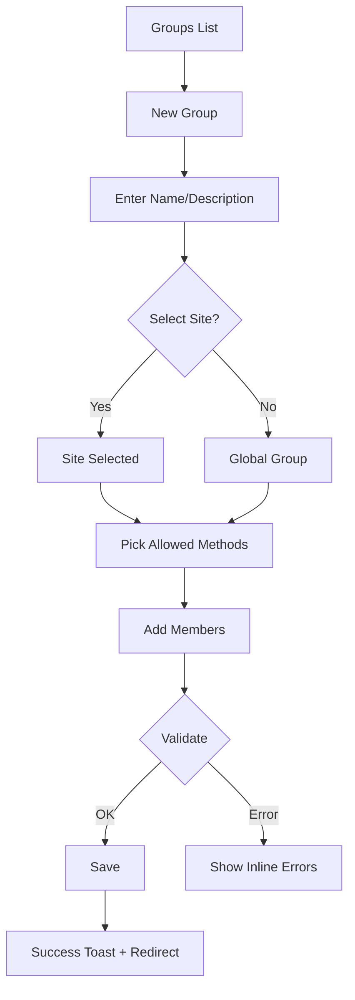
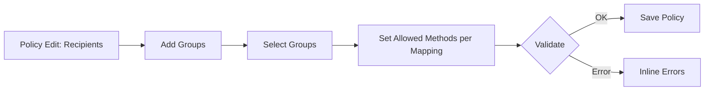
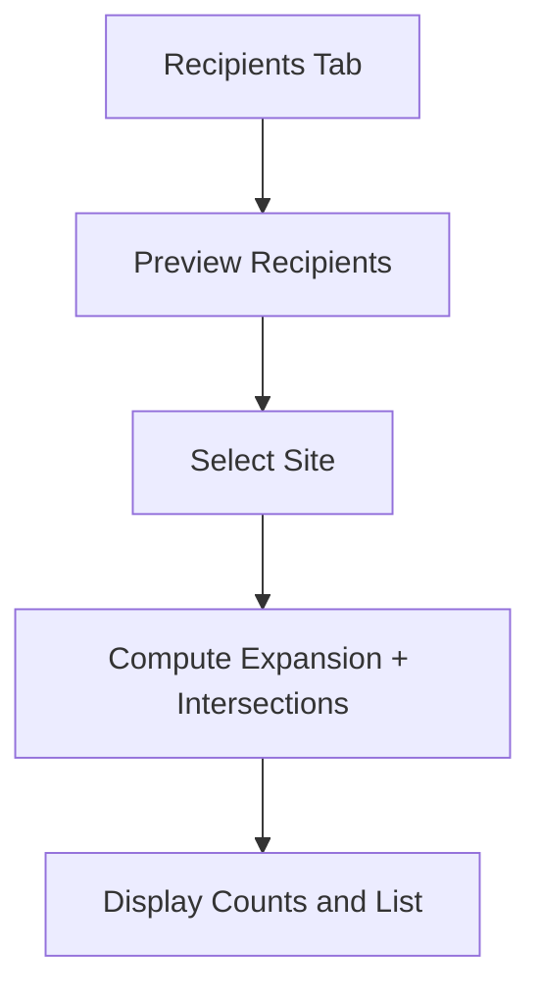

# Notification Groups — User Flows

## Purpose

This document describes end-to-end user flows for creating and managing Notification Groups, mapping groups to policies, and previewing effective recipients. It complements the Notification Groups PRD and guides UX design, development, and QA.

## Personas and Permissions

- Global Admin: Full access to all sites and policies.
- Site Admin: Can manage groups scoped to their site and map groups to policies visible to that site.
- Read-only User: Can view policies and previews but cannot modify groups or mappings.

## Global UX Conventions

- Search and filters on lists (by name, site, active/inactive).
- Pagination with last-used filters remembered per user.
- Standard actions: Save, Cancel, Delete (with confirmation), and toast notifications for outcomes.

## Flow A: Create a Notification Group

Preconditions:

- User has Global Admin or Site Admin permission.

Happy Path Steps:

1. Navigate to Notifications → Recipients → Groups.
2. Click “New Group”.
3. Fill Name, optional Description.
4. Select Site scope (optional for Global Admin; Site Admin defaults to their site, non-editable).
5. Optionally choose Allowed Delivery Methods for the group.
6. Add Members: select Users and/or Roles.
7. Save. Show success toast; redirect to group details.

Validation and Errors:

- Duplicate Name within the same Site scope → inline error under Name.
- No members added → allow save (empty group) but show non-blocking warning.
- Invalid characters in Name → inline validation.
- Server error → toast with retry link and keep form state.

## Flow B: Edit/Deactivate a Group

Steps:

1. Open a Group from list.
2. Edit Name/Description/Site scope/Allowed Methods.
3. Toggle Active (IsActive). If deactivating, confirmation modal explains effect on policy targeting.
4. Save changes.

Edge Cases:

- Changing Site scope may invalidate role/user memberships; keep memberships but warn if members are outside site.
- Deactivating a group does not remove existing policy mappings; resolver should ignore inactive groups.

## Flow C: Manage Group Members

Steps:

1. Open Group → Members tab.
2. Click “Add Members”.
3. Search and multi-select Users and/or Roles. Respect site scope.
4. Save members.
5. Remove members via row actions; confirm removal.

Validation:

- Prevent duplicate entries.
- Roles must be valid for the selected site when site-scoped.

## Flow D: Map Policy to Groups (Policy Edit → Recipients)

Preconditions:

- Policy exists and is editable by the user.

Steps:

1. Navigate to Policies → Edit → Recipients tab.
2. Click “Add Groups”.
3. Search and select one or more Groups (filtered by site if applicable).
4. For each mapping, optionally select Allowed Delivery Methods (defaults to Policy flags intersection).
5. Save policy.

Validation and Rules:

- Duplicates prevented; show inline tag if group already mapped.
- If group Allowed Methods conflicts with Policy flags, policy flags win (intersection UI hint).

## Flow E: Preview Effective Recipients (Site-aware)

Goal: Show deduplicated list of users who will receive a policy notification by method, given a site context.

Steps:

1. From Policy Edit → Recipients, click “Preview Recipients”.
2. Select Site (if applicable).
3. System computes recipients by expanding: Users + Roles + Groups (users + users-in-roles), intersecting with user preferences and policy flags; removes duplicates.
4. Show counts by method and a paginated list of users with badges for source (User/Role/Group) and methods.

Edge Cases:

- Users from multiple sources appear once; show merged badges.
- If no recipients, show empty state with guidance.

## Flow F: Permission Denied

If a non-privileged user accesses group management or recipient mapping:

- Redirect to an access-denied page with a link to request access.
- Log event for auditing.

## Empty States and UX Copy

- Groups List (empty): “No groups yet. Create your first group to target recipients efficiently.” [Create Group]
- Members (empty): “No members added. Add users or roles to include in this group.” [Add Members]
- Policy Recipients (no groups): “No groups mapped. Add groups or individual users/roles to target recipients.” [Add Groups]
- Preview (empty): “No recipients match the current filters and preferences.”

## Error Handling

- Network/Server errors: non-blocking toast; preserve form state.
- 409 Conflict (duplicate name): Inline error under Name.
- 400 Validation: Inline field errors, list at top for multi-field issues.

## Analytics and Audit (Optional but Recommended)

- Track create/edit/delete group events with user and site context.
- Track policy→group mapping changes.
- Record preview actions for usage insights (no PII in analytics).

## Accessibility

- Keyboard navigation for pickers and lists.
- ARIA labels for action buttons and status messages.
- High contrast and focus indicators; toast messages announced to screen readers.

## Links

- PRD: ./NotificationGroups_PRD.md
- Main Notification System README: ../README.md
