# Part 2: Enhanced Transaction Monitoring Flow with Redis Pub/Sub Integration

## Complete Monitoring Flow Diagram

```mermaid
sequenceDiagram
    participant UI as Frontend
    participant PAH as PumpAuthorizeHandler
    participant CE as CommandExecutor
    participant RedisPS as Redis Pub/Sub
    participant RCP as RedisPTSCommandProcessor
    participant PCM as PTSConnectionManager
    participant PDC as PTSDeviceConnection
    participant TMS as TransactionMonitoringService
    participant AST as AuthorizationStateTracker
    participant REH as RefuelingEventHandler
    participant USC as UploadStatusCommand
    participant Redis as Redis Cache
    participant PTS as PTS Device

    Note over UI, PTS: Part 2: Enhanced Transaction Monitoring with Redis Pub/Sub

    %% Authorization Phase with Redis Pub/Sub
    UI->>PAH: Authorize Pump Request
    PAH->>PAH: Validate request & generate transaction ID

    Note over PAH, CE: Enhanced Redis Pub/Sub Communication
    PAH->>CE: ExecuteCommandAsync("PumpAuthorize", commandData)
    CE->>CE: Generate Correlation ID
    CE->>RedisPS: Publish RedisPTSCommand to "pts-commands"
    Note right of CE: Command: DeviceId, CommandType,<br/>CommandData, CorrelationId

    RedisPS-->>RCP: Push RedisPTSCommand
    RCP->>RCP: Extract DeviceId & validate connection
    RCP->>PCM: SendMessageAsync(DeviceId, PTSMessage)

    PCM->>PDC: Get PTSDeviceConnection(DeviceId)
    PDC->>PDC: Setup Dual Correlation
    Note right of PDC: Maps both PtsId and PacketId<br/>to correlation ID

    PDC->>PTS: Send PumpAuthorize via WebSocket
    Note right of PDC: Uses Newtonsoft.Json serialization

    PTS->>PTS: Process authorization command
    PTS-->>PDC: Send PumpAuthorizeConfirmation

    PDC->>PDC: Match Response via Dual Correlation
    Note right of PDC: Primary: PtsId match<br/>Fallback: PacketId match

    PDC-->>PCM: Return correlated response
    PCM-->>RCP: Return PTSMessage response

    RCP->>RCP: BuildRedisPTSCommandResponse
    Note right of RCP: Extract packet data from nested structure<br/>Use consistent JSON serialization

    RCP->>RedisPS: Publish response to "pts-command-responses"
    RedisPS-->>CE: Push RedisPTSCommandResponse

    CE->>CE: ConvertRedisResponseToPTSMessage
    Note right of CE: Extract actual packet data:<br/>ResponsePayload.Packets[0].Data

    CE-->>PAH: Return CommandResult with pump/transaction data

    PAH->>AST: SetAuthorized(authState with transactionId)
    PAH->>Redis: Store transaction context with connection type

    Note over PAH, TMS: Enhanced Monitoring Integration
    PAH->>TMS: StartMonitoringTransaction(deviceId, pumpId, nozzleId, txnId)
    TMS->>Redis: Create monitoring context with connection metadata
    TMS->>AST: UpdateAuthState("Monitoring")

    %% Active Monitoring Phase with Connection Awareness
    Note over REH, USC: Connection-Aware Monitoring with Enhanced Communication

    alt WebSocket Device (Redis Pub/Sub)
        PTS-->>PDC: Unsolicited status update (WebSocket)
        PDC->>PDC: Process as unsolicited message
        Note right of PDC: No correlation match = status update

        PDC->>REH: Broadcast PumpStateChangeEvent("InProgress")
        REH->>AST: GetAuthorizationState() → get expected txnId
        REH->>TMS: ValidateTransactionExecution(expectedTxnId)

        Note over TMS, CE: Direct validation via Redis Pub/Sub
        TMS->>CE: ExecuteCommandAsync("PumpGetStatus", statusQuery)
        CE->>RedisPS: Publish status query with correlation
        RedisPS-->>RCP: Push status command
        RCP->>PCM: Query pump status
        PCM->>PDC: Send status request with correlation
        PDC->>PTS: Send status query via WebSocket
        PTS-->>PDC: Return pump status with transaction data
        PDC->>PDC: Correlate status response
        PDC-->>PCM: Return status with actual txnId
        PCM-->>RCP: Return status response
        RCP->>RedisPS: Publish status response
        RedisPS-->>CE: Push status response
        CE-->>TMS: Return status with actual txnId

        TMS->>TMS: Validate expected vs actual transaction ID

        alt Transaction Valid
            TMS->>REH: Validation successful
            REH->>TMS: UpdateTransactionProgress("InProgress")
            REH->>AST: UpdateAuthState("InProgress")
        else Transaction Invalid
            TMS->>REH: Validation failed ⚠️
            Note right of REH: Log correlation mismatch warning
        end

    else HTTPDirect Device
        PTS-->>REH: Direct HTTP status update
        REH->>AST: GetAuthorizationState() → get expected txnId
        REH->>TMS: ValidateTransactionExecution(expectedTxnId)
        TMS->>PTS: Direct HTTP pump status query
        PTS-->>TMS: Status with actual txnId
        TMS->>TMS: Validate expected vs actual

        alt Transaction Valid
            TMS->>REH: Validation successful
            REH->>TMS: UpdateTransactionProgress("InProgress")
            REH->>AST: UpdateAuthState("InProgress")
        else Transaction Invalid
            TMS->>REH: Validation failed ⚠️
            Note right of REH: Log transaction mismatch
        end

    else HTTPPolling Device
        PTS->>USC: UploadStatus with pump status
        USC->>USC: Process pump status internally
        USC->>AST: GetAuthorizationState() → get expected txnId

        Note over USC: Enhanced Transaction Correlation
        USC->>USC: Extract actual txnId from status
        USC->>USC: Validate expected vs actual txnId

        USC->>TMS: UpdateTransactionProgress("InProgress")
        USC->>AST: UpdateAuthState("InProgress")
    end

    %% Transaction Completion Phase with Enhanced Processing
    Note over REH, USC: End of Transaction with Redis Pub/Sub Integration

    alt WebSocket Device (Redis Pub/Sub)
        PTS-->>PDC: Transaction completion via WebSocket
        PDC->>PDC: Process completion as unsolicited message
        PDC->>REH: Broadcast PumpStateChangeEvent("Completed")
        REH->>AST: GetAuthorizationState() → get txnId

        Note over REH, CE: Enhanced completion via Redis Pub/Sub
        REH->>CE: ExecuteCommandAsync("PumpGetTransactionInfo", txnQuery)
        CE->>RedisPS: Publish transaction query with correlation
        RedisPS-->>RCP: Process transaction info command
        RCP->>PCM: Get transaction details
        PCM->>PDC: Send transaction query with correlation
        PDC->>PTS: Query transaction details via WebSocket
        PTS-->>PDC: Return transaction details
        PDC->>PDC: Correlate transaction response
        PDC-->>PCM: Return transaction data
        PCM-->>RCP: Return transaction details
        RCP->>RCP: Extract transaction data properly
        RCP->>RedisPS: Publish transaction response
        RedisPS-->>CE: Push transaction response
        CE->>CE: Extract packet data from nested structure
        CE-->>REH: Return transaction details

        REH->>TMS: UpdateTransactionProgress("Completed", volume, amount)
        REH->>TMS: StopMonitoringTransaction(txnId)
        REH->>AST: ClearAuthorization()

    else HTTPDirect Device
        PTS-->>REH: Direct completion notification
        REH->>AST: GetAuthorizationState() → get txnId
        REH->>TMS: UpdateTransactionProgress("Completed")
        REH->>TMS: StopMonitoringTransaction(txnId)
        REH->>AST: ClearAuthorization()

    else HTTPPolling Device
        PTS->>USC: UploadStatus with EndOfTransaction
        USC->>AST: GetAuthorizationState() → get expected txnId
        USC->>PTS: GetTransactionDetails(actual txnId)
        PTS-->>USC: Transaction details

        USC->>USC: Enhanced transaction validation
        Note right of USC: Validate expected vs actual txnId<br/>with comprehensive logging

        alt Transaction Match
            USC->>TMS: UpdateTransactionProgress("Completed", volume, amount)
            USC->>TMS: StopMonitoringTransaction(expectedTxnId)
            USC->>AST: ClearAuthorization()
            USC->>UI: Broadcast TransactionCompleted via SignalR
        else Transaction Mismatch
            USC->>USC: Log correlation mismatch warning ⚠️
            Note right of USC: Enhanced error logging with<br/>correlation context
            USC->>TMS: StopMonitoringTransaction(expectedTxnId)
        end
    end

    %% Enhanced Cleanup with Correlation Management
    TMS->>Redis: Delete monitoring context
    TMS->>TMS: Cleanup correlation mappings
    Redis->>Redis: Clean up transaction context
    Note over Redis: Enhanced cleanup includes<br/>correlation data and monitoring state
```

## Key Benefits of Enhanced Part 2 with Redis Pub/Sub

### 1. **Enhanced Transaction ID Correlation** ✅
- **Before**: No validation that expected transaction is actually running
- **After**: Active validation with Redis pub/sub communication and dual correlation mechanism
- **Enhancement**: Comprehensive correlation tracking with PtsId and PacketId fallback

### 2. **Redis Pub/Sub Integration** ✅
- **Before**: Limited to direct WebSocket or HTTP communication
- **After**: Scalable Redis pub/sub messaging with correlation tracking
- **Enhancement**: Dual correlation system prevents lost responses and enables reliable request-response matching

### 3. **Enhanced JSON Processing** ✅
- **Before**: Mixed JSON serialization causing data corruption
- **After**: Consistent Newtonsoft.Json usage throughout communication pipeline
- **Enhancement**: Proper packet data extraction from nested message structures

### 4. **Connection-Aware Monitoring with Pub/Sub** ✅
- **Before**: One-size-fits-all approach regardless of device connection
- **After**: Optimized monitoring strategy per connection type with Redis pub/sub for WebSocket devices
- **Enhancement**: Real-time WebSocket status verification and adaptive communication mode selection

### 5. **Real-Time Progress Tracking with Correlation** ✅
- **Before**: Authorization state disconnected from actual execution
- **After**: Synchronized auth state and transaction monitoring with enhanced correlation
- **Enhancement**: Dual correlation ensures reliable progress tracking even when devices don't echo correlation IDs

### 6. **Enhanced RefuelingEventHandler with Pub/Sub** ✅
- **Before**: Underutilized, basic state updates only
- **After**: Central hub for transaction validation and progress tracking with Redis pub/sub communication
- **Enhancement**: Integrated with Redis pub/sub for scalable, reliable device communication

### 7. **Comprehensive Error Handling** ✅
- **Before**: Basic error handling with limited recovery options
- **After**: Enhanced error handling with correlation cleanup, timeout management, and fallback mechanisms
- **Enhancement**: Automatic correlation cleanup prevents memory leaks and ensures system reliability

The enhanced monitoring system provides clear transaction correlation, Redis pub/sub scalability, connection-aware strategies, and comprehensive validation - eliminating the confusion around pump transaction tracking while ensuring reliable, scalable communication!
