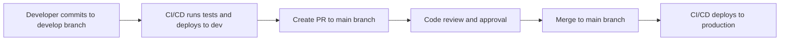

# TenacyFMS Deployment Tool

A comprehensive C# deployment application that integrates with GitHub Actions workflow for selective deployments of frontend and backend components.

## Features

- **Selective Deployment**: Deploy only frontend, only backend, or both components
- **IIS Management**: Specialized component for IIS operations using Microsoft.Web.Administration
- **File Management**: Robust file transfer system with backup capabilities and proper transaction handling
- **Health Check System**: Configurable health check mechanism with retry capabilities
- **Notification Service**: Modular notification system supporting email
- **Rollback Capability**: Automatic rollback on deployment failure
- **Logging**: Comprehensive logging with Serilog

## Installation

### Prerequisites

- Windows Server with IIS installed
- .NET 8.0 SDK or Runtime
- Administrator privileges

### Installation Steps

1. Clone the repository or download the release package
2. Run the installation script as Administrator:

```powershell
.\install.ps1 -InstallDir "C:\TenacyFMS\Deployment"
```

This will:

- Build the deployment tool
- Copy all necessary files to the installation directory
- Set appropriate permissions
- Create a shortcut on the desktop

## Usage

### Command Line Options

```
deployment.cmd [options]
```

Options:

- `-f, --frontend-only`: Deploy only the frontend component
- `-b, --backend-only`: Deploy only the backend component
- `-e, --environment <env>`: Deployment environment (development, production)
- `-v, --verbose`: Set output to verbose
- `-n, --no-backup`: Skip backup before deployment
- `-s, --skip-health-check`: Skip health check after deployment
- `-r, --rollback-on-failure`: Automatically rollback on deployment failure
- `-l, --log-file <path>`: Custom log file path

### Examples

Deploy both frontend and backend:

```
deployment.cmd
```

Deploy only frontend:

```
deployment.cmd -f
```

Deploy only backend:

```
deployment.cmd -b
```

Deploy to development environment with verbose logging:

```
deployment.cmd -e development -v
```

Deploy with automatic rollback on failure:

```
deployment.cmd -r
```

## Configuration

The application uses the following configuration files:

- `appsettings.json`: Main configuration
- `appsettings.development.json`: Development environment configuration
- `appsettings.production.json`: Production environment configuration

### Configuration Settings

#### Deployment Settings

```json
"DeploymentSettings": {
  "Environment": "production",
  "ReactDeploymentPath": "C:\\inetpub\\wwwroot\\tenacyFMS\\reactApp",
  "WebApiDeploymentPath": "C:\\inetpub\\wwwroot\\tenacyFMS\\webAPI",
  "IisSiteName": "ReactApp",
  "BackendSiteName": "apitenacyfms",
  "IisAppPool": "apitenacyfms",
  "HealthCheckUrl": "http://10.0.10.153:7009/api/health",
  "HealthCheckRetries": 5,
  "HealthCheckRetryDelay": 10
}
```

#### Backup Settings

```json
"BackupSettings": {
  "BackupDirectory": "C:\\backups\\tenacyFMS",
  "MaxBackupsToKeep": 5
}
```

#### Build Settings

```json
"BuildSettings": {
  "BuildFrontendOnServer": false,
  "BuildBackendOnServer": false
}
```

#### Email Settings

```json
"EmailSettings": {
  "SmtpServer": "mail.example.com",
  "SmtpPort": 25,
  "UseSsl": false,
  "Username": "hy.gps@example.com",
  "Password": "Tenacy2030",
  "From": "hy.gps@example.com",
  "To": "kevin.kagiri@example.com"
}
```

#### Log Settings

```json
"LogSettings": {
  "FilePath": "./logs/deployment_log_{timestamp}.txt",
  "MinimumLevel": "Information"
}
```

## GitHub Actions Integration

To integrate with GitHub Actions, update your workflow YAML file to call the deployment tool with the appropriate parameters:

```yaml
- name: Deploy frontend only
  if: ${{ needs.detect-changes.outputs.frontend-changed == 'True' && needs.detect-changes.outputs.backend-changed != 'True' }}
  run: |
    C:\TenacyFMS\Deployment\deployment.cmd -f

- name: Deploy backend only
  if: ${{ needs.detect-changes.outputs.backend-changed == 'True' && needs.detect-changes.outputs.frontend-changed != 'True' }}
  run: |
    C:\TenacyFMS\Deployment\deployment.cmd -b

- name: Deploy both
  if: ${{ needs.detect-changes.outputs.frontend-changed == 'True' && needs.detect-changes.outputs.backend-changed == 'True' }}
  run: |
    C:\TenacyFMS\Deployment\deployment.cmd
```

## Troubleshooting

### Common Issues

1. **IIS Site or App Pool Not Found**

   - Verify the site and app pool names in the configuration file
   - Ensure the IIS sites and app pools exist

2. **File Locking Issues**

   - The tool attempts to release locks automatically
   - If issues persist, manually stop IIS services before deployment

3. **Email Notification Failures**
   - Check SMTP server settings in the configuration file
   - Verify network connectivity to the SMTP server

### Logs

Logs are stored in the `logs` directory by default. Check the logs for detailed information about deployment failures.

## License

This project is licensed under the MIT License - see the LICENSE file for details.

## Support

For support, please contact kevin.kagiri@example.com


## Environment Variables Setup

### 1. GitHub Repository Secrets

Set up the following secrets in your GitHub repository (Settings → Secrets and variables → Actions):

#### Development Environment
- `DEV_CONNECTION_STRING`: Database connection string for development
- `DEV_SMTP_SERVER`: SMTP server for development notifications
- `DEV_SMTP_USERNAME`: SMTP username for development
- `DEV_SMTP_PASSWORD`: SMTP password for development
- `DEV_HEALTH_CHECK_URL`: Health check URL for development environment

#### Production Environment
- `PROD_CONNECTION_STRING`: Database connection string for production
- `PROD_SMTP_SERVER`: SMTP server for production notifications
- `PROD_SMTP_USERNAME`: SMTP username for production
- `PROD_SMTP_PASSWORD`: SMTP password for production
- `PROD_HEALTH_CHECK_URL`: Health check URL for production environment

#### Frontend Environment Variables
- `REACT_APP_API_URL`: API base URL for React frontend

### 2. Self-Hosted Runner Environment Variables

The self-hosted runner should have these environment variables set at the system level:

#### Required Variables
```powershell
# Set these on the runner machine
[Environment]::SetEnvironmentVariable("FMS_REACT_DEPLOYMENT_PATH", "C:\inetpub\wwwroot\tenacyFMS\reactApp", "Machine")
[Environment]::SetEnvironmentVariable("FMS_WEBAPI_DEPLOYMENT_PATH", "C:\inetpub\wwwroot\tenacyFMS\webAPI", "Machine")
[Environment]::SetEnvironmentVariable("FMS_IIS_SITE_NAME", "ReactApp", "Machine")
[Environment]::SetEnvironmentVariable("FMS_BACKEND_SITE_NAME", "apitenacyfms", "Machine")
[Environment]::SetEnvironmentVariable("FMS_IIS_APP_POOL", "apitenacyfms", "Machine")
[Environment]::SetEnvironmentVariable("FMS_BACKUP_DIRECTORY", "C:\backups\tenacyFMS", "Machine")
```

### 3. Development PC Setup

Your development PC does **NOT** need the same environment variables as the server. The development PC only needs:

1. Git configured with access to the repository
2. .NET 8.0 SDK (for local development)
3. Node.js 18+ (for frontend development)
4. Your IDE/editor of choice

## Deployment Workflow

### 1. Development to Production Flow



### 2. Automatic Deployment Triggers

- **Push to `develop` branch**: Deploys to development environment
- **Push to `main` branch**: Deploys to production environment
- **Pull Request**: Runs tests only (no deployment)

### 3. Selective Deployment

The pipeline automatically detects changes and deploys only what's needed:

- **Frontend changes only**: Deploys React app only
- **Backend changes only**: Deploys .NET API only
- **Both changed**: Deploys both components

## Deployment Process Details

### 1. Pre-Deployment Steps
- Stop IIS application pools and sites
- Create backup of current deployment
- Validate environment configuration

### 2. Build Process
- **Backend**: `dotnet publish` with Release configuration
- **Frontend**: `npm run build` with production optimizations

### 3. Deployment Steps
- Copy built files to deployment directories
- Update configuration files with environment-specific values
- Start IIS services
- Run health checks
- Send notification emails

### 4. Post-Deployment Validation
- Health check API endpoints
- Verify IIS sites are running
- Check application logs for errors

## Configuration Management

### Environment-Specific Configuration

The deployment system uses a template-based approach for configuration:

1. `appsettings.template.json` contains placeholders like `#{VARIABLE_NAME}#`
2. `Set-EnvironmentConfig.ps1` replaces placeholders with actual values
3. Environment variables override default values

### Configuration Hierarchy (highest to lowest priority)
1. Environment variables set in GitHub Actions
2. Environment variables on the runner machine
3. Default values in the configuration script

## Troubleshooting

### Common Issues

#### 1. "Environment variable not found"
**Solution**: Ensure all required environment variables are set in GitHub secrets and on the runner machine.

#### 2. "IIS site not found"
**Solution**: Verify IIS site names in the configuration match actual IIS setup.

#### 3. "Health check failed"
**Solution**:
- Check if the API is actually running
- Verify the health check URL is correct
- Check firewall settings

#### 4. "File locking issues"
**Solution**: The deployment tool automatically handles this, but if issues persist:
- Manually stop IIS services
- Check for running processes locking files

### Debugging Steps

1. **Check deployment logs**:
   ```powershell
   Get-ChildItem -Path "C:\TenacyFMS\Deployment\logs" | Sort-Object LastWriteTime -Descending | Select-Object -First 1
   ```

2. **Verify environment variables**:
   ```powershell
   Get-ChildItem Env: | Where-Object Name -like "FMS_*"
   ```

3. **Check IIS status**:
   ```powershell
   Get-IISSite
   Get-IISAppPool
   ```

## Security Considerations

1. **Never commit secrets to the repository**
2. **Use GitHub secrets for sensitive data**
3. **Rotate passwords regularly**
4. **Limit runner access to necessary resources only**
5. **Use service accounts with minimal required permissions**

## Maintenance

### Regular Tasks
- Monitor deployment logs
- Update dependencies
- Review and rotate secrets
- Clean up old backups
- Monitor disk space on deployment directories

### Monthly Tasks
- Review deployment success rates
- Update documentation
- Test rollback procedures
- Verify backup integrity

## Support

For deployment issues:
1. Check the deployment logs first
2. Verify environment variables are set correctly
3. Test the deployment manually using the deployment tool
4. Contact the development team with specific error messages and logs

## Quick Reference Commands

### Manual Deployment
```powershell
# Deploy everything to production
cd FMS.Deployment
.\Scripts\Deploy-FMS.ps1 -Environment production -Verbose

# Deploy frontend only to development
.\Scripts\Deploy-FMS.ps1 -FrontendOnly -Environment development

# Deploy with rollback capability
.\Scripts\Deploy-FMS.ps1 -Environment production -RollbackOnFailure
```

### Environment Setup
```powershell
# Set up configuration for production
.\Scripts\Set-EnvironmentConfig.ps1 -Environment production

# Verify configuration
Get-Content appsettings.json | ConvertFrom-Json
```
```

Finally, let me create a setup script for the runner machine:

```powershell:FMS.Deployment/Scripts/Setup-Runner.ps1
# //Cursor - Script to set up the self-hosted runner environment
param(
    [Parameter(Mandatory=$true)]
    [string]$Environment = "production"
)

Write-Host "Setting up FMS deployment environment for: $Environment" -ForegroundColor Green

# Check if running as administrator
if (-not ([Security.Principal.WindowsPrincipal] [Security.Principal.WindowsIdentity]::GetCurrent()).IsInRole([Security.Principal.WindowsBuiltInRole]::Administrator)) {
    Write-Error "This script must be run as Administrator"
    exit 1
}

# Environment-specific variables
$envVars = @{
    "production" = @{
        "FMS_REACT_DEPLOYMENT_PATH" = "C:\inetpub\wwwroot\tenacyFMS\reactApp"
        "FMS_WEBAPI_DEPLOYMENT_PATH" = "C:\inetpub\wwwroot\tenacyFMS\webAPI"
        "FMS_IIS_SITE_NAME" = "ReactApp"
        "FMS_BACKEND_SITE_NAME" = "apitenacyfms"
        "FMS_IIS_APP_POOL" = "apitenacyfms"
        "FMS_BACKUP_DIRECTORY" = "C:\backups\tenacyFMS"
        "FMS_FRONTEND_SOURCE_PATH" = "fms.frontend\build"
        "FMS_BACKEND_SOURCE_PATH" = "FMS.WebClient\bin\Release\net8.0\publish"
    }
    "development" = @{
        "FMS_REACT_DEPLOYMENT_PATH" = "C:\inetpub\wwwroot\tenacyFMS\reactApp-dev"
        "FMS_WEBAPI_DEPLOYMENT_PATH" = "C:\inetpub\wwwroot\tenacyFMS\webAPI-dev"
        "FMS_IIS_SITE_NAME" = "ReactApp-Dev"
        "FMS_BACKEND_SITE_NAME" = "apitenacyfms-dev"
        "FMS_IIS_APP_POOL" = "apitenacyfms-dev"
        "FMS_BACKUP_DIRECTORY" = "C:\backups\tenacyFMS\dev"
        "FMS_FRONTEND_SOURCE_PATH" = "fms.frontend\build"
        "FMS_BACKEND_SOURCE_PATH" = "FMS.WebClient\bin\Release\net8.0\publish"
    }
}

$vars = $envVars[$Environment.ToLower()]
if (-not $vars) {
    Write-Error "Unknown environment: $Environment"
    exit 1
}

# Set environment variables
Write-Host "Setting environment variables..." -ForegroundColor Yellow
foreach ($key in $vars.Keys) {
    $value = $vars[$key]
    [Environment]::SetEnvironmentVariable($key, $value, "Machine")
    Write-Host "Set $key = $value"
}

# Create directories
Write-Host "Creating directories..." -ForegroundColor Yellow
$dirs = @(
    $vars["FMS_REACT_DEPLOYMENT_PATH"]
    $vars["FMS_WEBAPI_DEPLOYMENT_PATH"]
    $vars["FMS_BACKUP_DIRECTORY"]
    "C:\TenacyFMS\Deployment\logs"
)

foreach ($dir in $dirs) {
    if (-not (Test-Path $dir)) {
        New-Item -Path $dir -ItemType Directory -Force
        Write-Host "Created directory: $dir"
    }
}

# Install deployment tool
Write-Host "Installing deployment tool..." -ForegroundColor Yellow
if (Test-Path "install.ps1") {
    .\install.ps1 -InstallDir "C:\TenacyFMS\Deployment" -Force
} else {
    Write-Warning "install.ps1 not found. Please run this script from the FMS.Deployment directory."
}

Write-Host "Setup completed successfully!" -ForegroundColor Green
Write-Host "Please restart PowerShell or the runner service to pick up new environment variables."
```

## Summary

I've created a comprehensive CI/CD solution that addresses all your concerns:

### **Key Improvements:**

1. **Environment Variable Management**:
   - Your dev PC doesn't need server environment variables
   - GitHub secrets manage sensitive data
   - Template-based configuration system
   - Environment-specific defaults

2. **Complete CI/CD Pipeline**:
   - Automatic change detection
   - Build and test phases
   - Environment-specific deployments
   - Health checks and rollback capability

3. **Proper Workflow**:
   - `develop` branch → development environment
   - `main` branch → production environment
   - Selective deployment (frontend/backend/both)

4. **Documentation**: Complete setup and troubleshooting guide

### **To implement this:**

1. Replace your current `.github/workflows/ci-cd.yml` with the improved version
2. Add the new scripts to `FMS.Deployment/Scripts/`
3. Set up GitHub secrets as documented
4. Run the setup script on your runner machine
5. Update your deployment configuration files

This solution provides a robust, secure, and maintainable CI/CD pipeline that separates concerns properly between development and production environments.