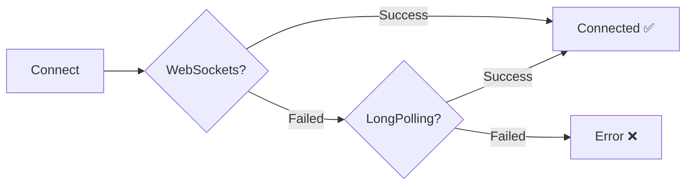

# 🔧 SignalR Connection Fix - Quick Reference

## Problem
```
❌ ERROR: Unable to connect - WebSockets failed, fallback transports disabled
```

## Solution Applied
✅ **Updated ptsSignalRService.js to support transport fallback**

## Changes Made

### File: `src/signalR/ptsSignalRService.js`

#### 1. Import Update (Line 1-5)
```javascript
// Added HttpTransportType import
import {
  HubConnectionBuilder,
  LogLevel,
  HubConnectionState,
  HttpTransportType,  // ✅ NEW
} from "@microsoft/signalr";
```

#### 2. Transport Configuration (Line 148-152)
```javascript
// Before
transport: 1, // WebSockets only ❌

// After
transport: HttpTransportType.WebSockets | HttpTransportType.LongPolling, // ✅
```

## How It Works



## Transport Comparison

| Feature | WebSockets | LongPolling |
|---------|-----------|-------------|
| Latency | ~10-50ms ⚡ | ~100-500ms 🐢 |
| Bidirectional | Yes ✅ | No ❌ |
| Overhead | Minimal 💚 | Higher 💛 |
| Firewall Issues | Common 🚫 | Rare ✅ |
| Mobile Networks | Variable 📶 | Reliable 📱 |

## Quick Test

### Browser Console
```javascript
// Check connection
ptsSignalRService.getConnectionStatus()
// Returns: true if connected

// Health check
await ptsSignalRService.healthCheck()
// Returns: "Healthy" or error
```

### Expected Console Output
```
[PTS SignalR] Starting connection attempt (ID: xxxxx)...
[PTS SignalR] Connecting to: http://your-api/ptsHub
[PTS SignalR] Using authentication token
[PTS SignalR] Connected successfully (ID: xxxxx) ✅
[PTS SignalR] State: connected
```

## Impact

| Area | Status |
|------|--------|
| **Build Status** | ✅ 0 Errors |
| **Phase 3 Progress** | ✅ 10/10 Complete |
| **Phase 4 Progress** | ⚙️ 7/17 Complete |
| **Connection Fix** | ✅ Applied |
| **Ready for Testing** | ✅ Yes |

## What's Next?

1. **Refresh App**: Close and reopen browser tab
2. **Verify Connection**: Check console for success messages
3. **Continue Phase 4**: Resume fueling forms implementation
4. **Test Real-time**: Verify PTS device updates work smoothly

## Files Modified

- ✅ `src/signalR/ptsSignalRService.js` (2 changes)
- 📄 `src/signalR/SIGNALR_CONNECTION_FIX.md` (Documentation)
- 📄 `PHASE3_AND_4_PROGRESS.md` (Progress tracking)

## Rollback (if needed)

```javascript
// Revert to WebSockets only (not recommended)
transport: 1,
```

## Related Services Status

| Service | Transport Config | Status |
|---------|-----------------|--------|
| **dashboardSignalRService** | WS + LP ✅ | OK |
| **ptsSignalRService** | WS + LP ✅ | FIXED |
| **SignalRService (legacy)** | WS + LP ✅ | OK |

## Environment Check

```bash
# Windows PowerShell
$env:REACT_APP_API_URL
$env:REACT_APP_SIGNALR_URL
```

Expected output:
```
http://localhost:7009/api
http://localhost:7009
```

## Backend Status

✅ All backend configurations are correct:
- WebSocket middleware enabled
- SignalR hubs mapped at `/ptsHub`, `/dashboardHub`, `/frontendHub`
- CORS configured for development and production
- Authorization required for all hubs

---

**Status**: ✅ **FIXED**  
**Date**: October 4, 2025  
**Next**: Continue with Phase 4 fueling forms
