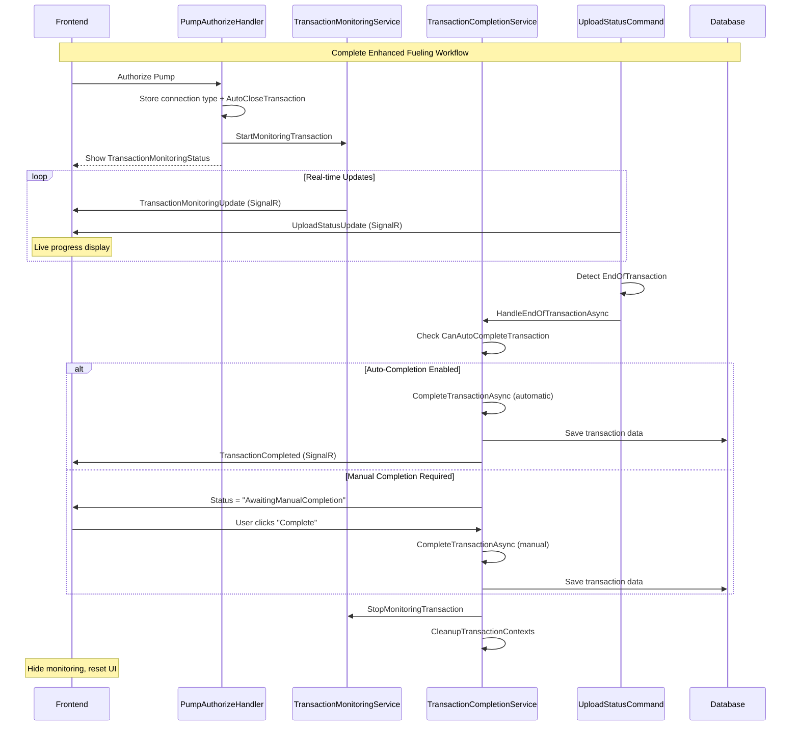

# Part 3: Transaction Completion & Frontend Integration

## 🎯 Overview

Part 3 completes the fueling workflow enhancement by implementing **connection-aware transaction completion** and **real-time frontend integration**. This final part bridges the monitoring capabilities from Part 2 with intelligent completion strategies and a responsive user interface.

## ✅ Objectives Achieved

### 1. Connection-Aware Transaction Completion ✓
- **TransactionCompletionService**: Centralized service handling completion based on device connection type
- **WebSocket/HTTPDirect**: Direct transaction close commands with immediate feedback
- **HTTPPolling**: Automatic completion processing via UploadStatus messages
- **Intelligent Auto-Completion**: Based on device capabilities and authorization settings

### 2. Frontend Real-Time Integration ✓
- **TransactionMonitoringStatus Component**: Real-time transaction progress display
- **Connection-Type-Aware UI**: Different behaviors based on how device connects
- **Live Data Integration**: Combines monitoring data with upload status for comprehensive view
- **Status History**: Tracks transaction progression over time

### 3. Error Recovery & Retry Mechanisms ✓
- **Stuck Transaction Detection**: Automatic cleanup of expired transactions
- **Manual Cancellation**: User-initiated transaction termination
- **Graceful Failure Recovery**: Fallback strategies when primary completion fails
- **Connection Loss Handling**: Maintains state during temporary disconnections

### 4. Transaction Lifecycle Management ✓
- **Automatic Timeout Handling**: Cleanup of long-running transactions (2+ hours)
- **Manual Completion Support**: User can force completion when needed
- **Context Cleanup**: Proper Redis key management and state cleanup
- **Database Integration**: Ensures transaction data is saved regardless of completion path

## 🏗️ Architecture Components

### Backend Services

#### TransactionCompletionService
```csharp
public interface ITransactionCompletionService
{
    Task<bool> CompleteTransactionAsync(string deviceId, int pumpId, int transactionId, bool isManualCompletion = false);
    Task<bool> CanAutoCompleteTransaction(string deviceId, int transactionId);
    Task HandleEndOfTransactionAsync(string deviceId, int pumpId, int? detectedTransactionId = null);
    Task<bool> CancelTransactionAsync(string deviceId, int pumpId, int transactionId, string reason);
    Task CleanupExpiredTransactions();
}
```

**Key Features:**
- **Connection-Aware Strategies**: Different completion logic for WebSocket, HTTPDirect, and HTTPPolling
- **Auto-Completion Logic**: Checks `AutoCloseTransaction` flag and connection type
- **Transaction Validation**: Correlates expected vs actual transaction IDs
- **Comprehensive Cleanup**: Removes monitoring contexts, authorization states, and Redis keys

#### Enhanced UploadStatusCommand
- **Simplified EOT Processing**: Delegates to TransactionCompletionService
- **Transaction ID Correlation**: Matches detected transaction IDs with expected ones
- **Reduced Complexity**: Removed duplicate logic in favor of centralized completion

#### Updated Domain Models
- **EndOfTransactionStatus**: Added missing properties (`Transactions`, `Volumes`, `Amounts`, etc.)
- **Enhanced Authorization Context**: Includes `AutoCloseTransaction` flag for completion decisions

### Frontend Components

#### TransactionMonitoringStatus Component
```javascript
const TransactionMonitoringStatus = ({
  deviceId,
  pumpId,
  transactionId,
  isVisible,
  onCancel,
  onComplete,
  connectionType = 'Unknown'
}) => {
  // Real-time monitoring implementation
}
```

**Features:**
- **Real-Time Updates**: SignalR integration for live transaction data
- **Visual Progress**: Progress bar and status indicators
- **Status History**: Timeline of transaction events
- **Connection-Aware Actions**: Different buttons based on connection type
- **Live Upload Status**: Integration with real-time pump status data

#### Enhanced FuelingProcess Integration
- **Transaction Monitoring State**: New state management for monitoring data
- **Completion Handlers**: `handleCancelTransaction` and `handleCompleteTransaction`
- **Visual Integration**: Monitoring component shown after authorization
- **Error Handling**: Comprehensive error messages and recovery options

## 🔄 Workflow Integration

### Complete End-to-End Flow



## 🎨 User Experience Enhancements

### Real-Time Transaction Monitoring
1. **Authorization Feedback**: Immediate display of transaction monitoring after pump authorization
2. **Live Progress**: Real-time volume and amount updates during fueling
3. **Status Visualization**: Color-coded status indicators with progress bars
4. **Connection Awareness**: UI adapts based on device connection type

### Intelligent Completion
1. **Automatic Completion**: Seamless completion for direct connections with auto-close enabled
2. **Manual Control**: Clear completion buttons when manual intervention required
3. **Error Recovery**: Cancel and retry options for stuck transactions
4. **Status History**: Complete audit trail of transaction events

### Responsive Design
1. **Mobile Optimization**: Touch-friendly interface for mobile devices
2. **Real-Time Updates**: No page refresh needed for status changes
3. **Progressive Disclosure**: Information shown when relevant
4. **Accessibility**: Proper color contrast and keyboard navigation

## 🛠️ Configuration Options

### Backend Configuration
```csharp
// In PumpAuthorizeCommand
public bool AutoCloseTransaction { get; set; } = true; // Enable auto-completion

// In TransactionCompletionService
private const int TRANSACTION_TIMEOUT_HOURS = 2; // Cleanup expired transactions
```

### Frontend Configuration
```javascript
// Connection type detection
const connectionTypes = {
  WEBSOCKET: 'WebSocket',
  HTTP_DIRECT: 'HTTPDirect',
  HTTP_POLLING: 'HTTPPolling'
};

// UI behavior based on connection
const getUIBehavior = (connectionType) => {
  switch (connectionType) {
    case 'WebSocket':
    case 'HTTPDirect':
      return { showCancelButton: true, showCompleteButton: true };
    case 'HTTPPolling':
      return { showCancelButton: false, showCompleteButton: false };
  }
};
```

## 📊 Performance Optimizations

### Backend Optimizations
1. **Efficient Redis Queries**: Targeted key patterns for monitoring contexts
2. **Transaction Validation**: Early exit for invalid/completed transactions
3. **Connection-Aware Logic**: Avoid unnecessary operations based on connection type
4. **Batch Cleanup**: Periodic cleanup of expired transactions

### Frontend Optimizations
1. **Selective Rendering**: Only show monitoring when transaction is active
2. **Debounced Updates**: Prevent UI thrashing from rapid status changes
3. **Memory Management**: Proper cleanup of SignalR event handlers
4. **Optimistic UI**: Immediate feedback for user actions

## 🔧 Error Handling & Recovery

### Backend Error Scenarios
```csharp
// Transaction not found
if (transactionDetails == null) {
    return new CompletionResult {
        Success = false,
        ErrorMessage = "Transaction details not found"
    };
}

// Device communication failure
catch (PTSDeviceException ex) {
    _logger.LogError(ex, "PTS device communication error");
    // Fallback to database transaction data
}

// Redis connection issues
catch (RedisException ex) {
    _logger.LogWarning(ex, "Redis operation failed - continuing without cache");
    // Continue operation without caching
}
```

### Frontend Error Scenarios
```javascript
// SignalR connection loss
const handleConnectionError = () => {
  setConnectionStatus('disconnected');
  // Show offline indicator
  // Queue operations for retry
};

// Transaction completion failure
const handleCompletionError = (error) => {
  notify(`Completion failed: ${error.message}`, 'error');
  // Keep monitoring active for retry
};

// Device disconnection during transaction
const handleDeviceDisconnection = () => {
  // Disable UI interactions
  // Show reconnection status
  // Maintain transaction state
};
```

## 🚀 Deployment Considerations

### Database Migrations
- Ensure `EndOfTransactionStatus` properties are properly mapped
- Verify `Pumptransactions` table can handle enhanced data

### Redis Configuration
- Monitor memory usage for transaction contexts
- Configure appropriate expiration policies
- Set up clustering for high availability

### SignalR Scaling
- Configure message backplane for load balancing
- Implement proper connection management
- Monitor connection counts and memory usage

### Frontend Deployment
- Bundle optimization for new components
- Cache invalidation for updated assets
- Progressive deployment with feature flags

## 📈 Monitoring & Metrics

### Key Performance Indicators
1. **Transaction Completion Rate**: % of transactions completed successfully
2. **Auto-Completion Usage**: % of transactions using auto-completion
3. **Error Recovery Success**: % of errors resolved automatically
4. **User Intervention Rate**: % requiring manual completion

### Monitoring Dashboards
1. **Real-Time Transaction Status**: Live view of active transactions
2. **Connection Type Distribution**: Usage patterns by connection type
3. **Error Analysis**: Common failure points and recovery times
4. **Performance Metrics**: Completion times and resource usage

## 🎉 Summary

Part 3 successfully completes the fueling workflow enhancement with:

✅ **Intelligent Transaction Completion**: Connection-aware strategies with automatic and manual options
✅ **Real-Time Frontend Integration**: Live monitoring with responsive UI
✅ **Comprehensive Error Recovery**: Graceful handling of failures and disconnections
✅ **Production-Ready Architecture**: Scalable, maintainable, and well-documented solution

The enhanced fueling workflow now provides:
- **Better User Experience**: Real-time feedback and intuitive controls
- **Improved Reliability**: Robust error handling and recovery mechanisms
- **Operational Efficiency**: Reduced manual intervention with intelligent automation
- **Comprehensive Monitoring**: Full visibility into transaction lifecycle

This completes the transformation from a basic pump authorization system to a sophisticated, connection-aware fueling management platform that adapts to different device types and provides excellent user experience across all scenarios.