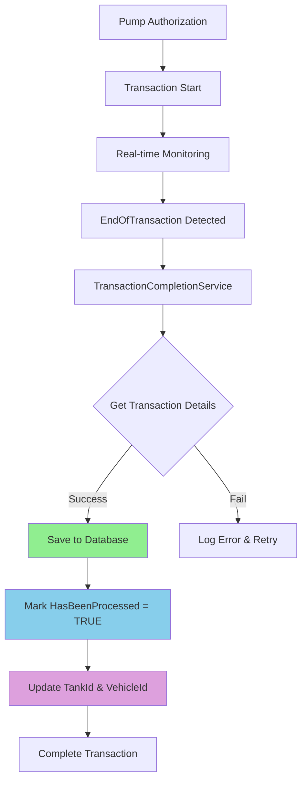

# Transaction Saving System Documentation

## 📊 **Current Transaction Saving Process**

### **✅ Yes, Our System Does Save Transactions**

Our fueling management system **automatically saves transactions** to the database through multiple pathways:

#### **1. TransactionCompletionService.SaveTransactionToDatabase()**
```csharp
private async Task SaveTransactionToDatabase (Pumptransaction transactionData) {
    try {
        // Check if transaction already exists
        var existingTransaction = _context.Pumptransactions
            .FirstOrDefault (t => t.PtsId == transactionData.PtsId &&
                t.Transaction == transactionData.Transaction);

        if (existingTransaction == null) {
            _context.Pumptransactions.Add (transactionData);
            await _context.SaveChangesAsync ();
            // Success logging
        } else {
            // Already exists logging
        }
    } catch (Exception ex) {
        // Error handling and logging
    }
}
```

#### **2. CreatePumpTransactionCommand Handler**
- Manual transaction creation via API endpoint
- Validates transaction data before saving
- Prevents duplicate transactions

#### **3. Upload Status Processing**
- Processes EndOfTransaction status from PTS devices
- Automatically triggers transaction completion and saving

---

## 🚨 **Database Schema Issues Identified**

### **Current Database Schema (OUTDATED):**
```sql
CREATE TABLE `pumptransaction` (
  `Id` int(11) NOT NULL AUTO_INCREMENT,
  `PtsId` varchar(100) NOT NULL,
  `PacketId` int(11) NOT NULL,
  `DateTime` datetime NOT NULL,
  `DateTimeStart` datetime DEFAULT NULL,
  `Pump` int(11) DEFAULT NULL,
  `Nozzle` int(11) DEFAULT NULL,
  `FuelGradeId` int(11) DEFAULT NULL,
  `FuelGradeName` varchar(45) DEFAULT NULL,
  `Transaction` int(11) DEFAULT NULL,
  `Volume` decimal(10,0) DEFAULT NULL,        -- ❌ NO DECIMAL PLACES!
  `TCVolume` decimal(10,0) DEFAULT NULL,      -- ❌ NO DECIMAL PLACES!
  `Price` decimal(10,0) DEFAULT NULL,         -- ❌ NO DECIMAL PLACES!
  `Amount` decimal(10,0) DEFAULT NULL,        -- ❌ NO DECIMAL PLACES!
  `TotalVolume` decimal(10,0) DEFAULT NULL,   -- ❌ NO DECIMAL PLACES!
  `TotalAmount` decimal(10,0) DEFAULT NULL,   -- ❌ NO DECIMAL PLACES!
  `Tag` varchar(45) DEFAULT NULL,
  `UserId` int(11) DEFAULT NULL,
  `ConfigurationId` varchar(45) DEFAULT NULL,
  -- ❌ MISSING: TankId, VehicleId, HasBeenProcessed
  PRIMARY KEY (`Id`),
  KEY `FK_pumptransaction_idx` (`PtsId`),
  CONSTRAINT `FK_pumptransaction` FOREIGN KEY (`PtsId`) REFERENCES `ptsdevice` (`PTSId`)
);
```

### **Issues Found:**

| **Issue** | **Impact** | **Solution** |
|-----------|------------|--------------|
| **Missing TankId column** | Can't track which tank supplied fuel | Add `TankId int(11)` with FK |
| **Missing VehicleId column** | Can't track which vehicle received fuel | Add `VehicleId int(11)` with FK |
| **Missing HasBeenProcessed column** | Can't track processing status | Add `HasBeenProcessed tinyint(1)` |
| **decimal(10,0) precision** | **CRITICAL**: No decimal places for fuel amounts | Change to `decimal(10,3)` for volume, `decimal(10,2)` for currency |
| **Missing performance indexes** | Slow queries on large datasets | Add strategic indexes |

---

## 🛠️ **Required Database Schema Updates**

### **Step 1: Run the Schema Update Script**

Execute the provided `database_schema_update.sql` script that includes:

```sql
-- Add missing columns
ALTER TABLE `pumptransaction`
ADD COLUMN `TankId` int(11) DEFAULT NULL,
ADD COLUMN `VehicleId` int(11) DEFAULT NULL,
ADD COLUMN `HasBeenProcessed` tinyint(1) DEFAULT 0;

-- Fix decimal precision (CRITICAL!)
ALTER TABLE `pumptransaction`
MODIFY COLUMN `Volume` decimal(10,3) DEFAULT NULL,
MODIFY COLUMN `TCVolume` decimal(10,3) DEFAULT NULL,
MODIFY COLUMN `Price` decimal(10,3) DEFAULT NULL,
MODIFY COLUMN `Amount` decimal(10,2) DEFAULT NULL,
MODIFY COLUMN `TotalVolume` decimal(10,3) DEFAULT NULL,
MODIFY COLUMN `TotalAmount` decimal(10,2) DEFAULT NULL;

-- Add performance indexes
ALTER TABLE `pumptransaction`
ADD INDEX `idx_pumptransaction_tankid` (`TankId`),
ADD INDEX `idx_pumptransaction_vehicleid` (`VehicleId`),
ADD INDEX `idx_pumptransaction_processed` (`HasBeenProcessed`),
ADD INDEX `idx_pumptransaction_datetime` (`DateTime`),
ADD INDEX `idx_pumptransaction_pump_transaction` (`Pump`, `Transaction`);
```

### **Step 2: Entity Framework Configuration Updated**

The `PumptransactionConfiguration.cs` has been enhanced with:

- ✅ Proper decimal precision configuration
- ✅ HasBeenProcessed column configuration with default value
- ✅ Performance indexes
- ✅ Improved foreign key relationships
- ✅ Better error handling

---

## 📈 **Enhanced Transaction Processing Flow**

### **Current Flow with Updated Schema:**



### **Data Population Strategy:**

#### **TankId Assignment:**
```csharp
// During transaction saving, determine tank from pump/nozzle configuration
var tankId = await GetTankIdFromPumpNozzle(deviceId, pumpId, nozzleId);
transactionData.TankId = tankId;
```

#### **VehicleId Assignment:**
```csharp
// From tag validation or user selection
var vehicleId = await GetVehicleIdFromTag(tag);
transactionData.VehicleId = vehicleId;
```

#### **HasBeenProcessed Flag:**
```csharp
// Mark as processed after successful business logic completion
transactionData.HasBeenProcessed = true;
await _context.SaveChangesAsync();
```

---

## 🎯 **Benefits of Schema Updates**

### **1. Data Integrity**
- **Tank Tracking**: Know exactly which tank supplied fuel
- **Vehicle Tracking**: Know exactly which vehicle received fuel
- **Processing Status**: Track which transactions have been fully processed

### **2. Reporting Accuracy**
- **Fuel Consumption**: Accurate per-vehicle consumption reports
- **Tank Management**: Tank-specific dispensing reports
- **Inventory Control**: Precise fuel movement tracking

### **3. Performance Improvements**
- **Faster Queries**: Strategic indexes improve query performance
- **Better Joins**: Efficient joins with Tank and Vehicle tables
- **Processing Tracking**: Quick identification of unprocessed transactions

### **4. Business Logic**
- **Reconciliation**: Match pump transactions with tank inventory
- **Billing**: Accurate vehicle-specific fuel billing
- **Compliance**: Audit trail for fuel dispensing activities

---

## ⚠️ **Migration Considerations**

### **Before Running Updates:**

1. **Backup Database**: Always backup before schema changes
2. **Test Environment**: Run updates in test environment first
3. **Application Downtime**: Plan for brief downtime during updates
4. **Data Validation**: Verify existing data integrity after updates

### **After Running Updates:**

1. **Verify Schema**: Check all columns and indexes are created
2. **Test Transactions**: Create test transactions to verify saving works
3. **Performance Check**: Monitor query performance with new indexes
4. **Application Testing**: Test end-to-end fueling workflow

### **Rollback Plan:**

If issues occur, you can rollback by:
```sql
-- Remove added columns (if needed)
ALTER TABLE `pumptransaction`
DROP COLUMN `TankId`,
DROP COLUMN `VehicleId`,
DROP COLUMN `HasBeenProcessed`;

-- Revert decimal precision (not recommended)
-- ALTER TABLE `pumptransaction`
-- MODIFY COLUMN `Volume` decimal(10,0) DEFAULT NULL;
```

---

## 🔍 **Verification Queries**

After running the updates, verify with these queries:

```sql
-- Check table structure
DESCRIBE pumptransaction;

-- Check indexes
SHOW INDEX FROM pumptransaction;

-- Check data distribution
SELECT
    COUNT(*) as TotalTransactions,
    SUM(CASE WHEN TankId IS NOT NULL THEN 1 ELSE 0 END) as WithTankId,
    SUM(CASE WHEN VehicleId IS NOT NULL THEN 1 ELSE 0 END) as WithVehicleId,
    SUM(CASE WHEN HasBeenProcessed = 1 THEN 1 ELSE 0 END) as ProcessedTransactions
FROM pumptransaction;

-- Test decimal precision
SELECT Volume, Amount, Price FROM pumptransaction LIMIT 5;
```

---

## 📚 **Related Documentation**

- [Enhanced Fueling Workflow Documentation](part3_transaction_completion_documentation.md)
- [Transaction Monitoring System](part2_transaction_monitoring_documentation.md)
- [Database Schema Update SQL](database_schema_update.sql)
- [Entity Framework Configuration](FMS.Persistence/EntityConfigurations/PumptransactionConfiguration.cs)

**Next Steps**: Execute the database schema updates and test the enhanced transaction saving system!